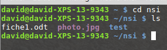
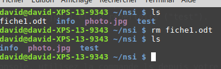

## TP: Les commandes de base en ligne de commande

Ce TP est une adaptation du
[TP](https://pixees.fr/informatiquelycee/n_site/nsi_prem_cmd_base_linux.html) proposé sur pixees.fr
sous licence CC-BY-SA créé par David Roche.

> À la `préhistoire` des systèmes d'exploitation, ces derniers étaient dépourvus d'interface
> graphique (système de fenêtres `pilotables` à la souris), toutes les interactions `système
> d'exploitation - utilisateur` se faisaient par l'intermédiaire de `lignes de commandes` (suites de
> caractères, souvent ésotériques, saisies par l'utilisateur). Aujourd'hui, même si les interfaces
> graphiques modernes permettent d'effectuer la plupart des opérations, il est important de connaitre
> quelques-unes de ces lignes de commandes.

Pour saisir des lignes de commandes, nous allons utiliser une émulation du système d'exploitation
linux dans le navigateur proposée par Fabrice Bellard disponible à l'adresse suivante:

<https://bellard.org/jslinux/vm.html?url=https://bellard.org/jslinux/buildroot-x86.cfg>


### Notion d'utilisateur et de machine

Ouvrez une console, vous devriez avoir quelque chose qui ressemble à cela :

[](https://bellard.org/jslinux/vm.html?url=https://bellard.org/jslinux/buildroot-x86.cfg){.center}

Nous avons ci-dessus la console de l'utilisateur `root` qui utilise
un ordinateur qui se nomme `localhost` (`root@localhost`). 

Vous pouvez rentrer vos commandes après le signe `#`.

::: appli
Essayez les commandes suivantes:

- `whoami`
- `hostname`
:::

### Système de fichiers linux

Principalement nous allons, grâce à la ligne de commande, travailler sur les fichiers et les
répertoires. Dans les systèmes de type `UNIX` (par exemple GNU/Linux ou macOS), nous avons un
système de fichier en arborescence :


[CC -BY-SA David Roche via pixees.fr](https://pixees.fr/informatiquelycee/n_site/nsi_prem_cmd_base_linux.html){.cite-source}


Dans le schéma ci-dessus on trouve des répertoires (noms entourés d'un rectangle, exemple : `home`)
et des fichiers (uniquement des noms `grub.cfg`). À noter : les extensions des noms de fichiers,
par exemple le `cfg` de `grub.cfg`, ne sont pas obligatoires dans les systèmes de type `UNIX`, par
exemple, `bash` est bien un nom de fichier et il n'a pas d'extension.

On parle d'*arborescence*, car ce système de fichier ressemble à un arbre à l'envers.

Comme vous pouvez le constater, la base de l'arbre s'appelle la *racine de l'arborescence* et se
représente par un ``/``

#### Chemin absolu ou chemin relatif ?

Pour indiquer la position d'un fichier (ou d'un répertoire) dans l'arborescence, il existe 2
méthodes : indiquer un chemin absolu ou indiquer un chemin relatif. Le chemin absolu doit indiquer
`le chemin` depuis la racine. Par exemple le chemin absolu du fichier fiche.ods sera :
/home/elsa/documents/fiche.ods

Remarquez que nous démarrons bien de la racine `/` (attention les symboles de séparation sont aussi
des `/`)

Il est possible d'indiquer le chemin non pas depuis la racine, mais depuis un répertoire
quelconque, nous parlerons alors de chemin relatif :

Le chemin relatif permettant d'accéder au fichier `photo_1.jpg` depuis le répertoire `max` est :
`images/photo_vac/photo_1.jpg`

Remarquez l'absence du / au début du chemin (c'est cela qui nous permettra de distinguer un chemin
relatif et un chemin absolu).

Imaginons maintenant que nous désirions indiquer le chemin relatif pour accéder au fichier
`gdbd_3.jpg` depuis le répertoire `photos_vac`.

**Comment faire ?**

Il faut `remonter` d'un `niveau` dans l'arborescence pour se retrouver dans le répertoire `images`
et ainsi pouvoir repartir vers la bonne `branche`. Pour ce faire il faut utiliser 2 points : `..`

```sh
../ski/gdbd_3.jpg
```

Il est tout à fait possible de remonter de plusieurs `crans` : `../../` depuis le répertoire
`photos_vac` permet de `remonter` dans le répertoire `max`

::: appli

En vous basant sur l'arborescence ci-dessus, déterminez le chemin absolu permettant d'accéder au
fichier :

- `cat`
- `rapport.odt`

Toujours en vous basant sur l'arborescence ci-dessus, déterminez le chemin relatif permettant
d'accéder au fichier :

- `rapport.odt` depuis le répertoire `elsa` 
- `fiche.ods` depuis le répertoire `boulot`
:::

::: {.plus titre="Attention à la casse"}
Les systèmes de type `UNIX` sont `sensibles à la casse` (il faut différencier les caractères
majuscules et les caractères minuscules) : le répertoire `Documents` et le répertoire
`documents` sont 2 répertoires différents.
:::

### La commande cd

La commande `cd` permet de changer le répertoire courant. Il suffit
d'indiquer le chemin (relatif ou absolu) qui permet d'atteindre le
nouveau répertoire :

Par exemple (en utilisant l'arborescence ci-dessus) :

-   si le répertoire courant est le répertoire `elsa` et que vous
    `voulez vous rendre` dans le répertoire `documents`, il faudra saisir la commande : `cd
    documents` (relatif) ou `cd /home/elsa/documents` (absolu)
-   si le répertoire courant est le répertoire `photos_vac` et que
    vous `voulez vous rendre` dans le répertoire `ski`, il faudra saisir la commande : `cd ../ski`
    (relatif) ou `cd /home/max/images/ski` (absolu)
-   si le répertoire courant est le répertoire `boulot` et que vous
    `voulez vous rendre` dans le répertoire `documents`, il faudra saisir la commande : `cd ..`
    (relatif) ou `cd /home/elsa/documents` (absolu)

::: appli

Toujours en utilisant l'arborescence ci-dessus, quelle est la commande à saisir si le répertoire
courant est le répertoire `home` et que vous `voulez vous rendre` dans le répertoire `boulot` (vous
utiliserez d'abord un chemin absolu puis un chemin relatif)
:::

### La commande ls

La commande `ls` permet de lister le contenu du répertoire courant.


[CC -BY-SA David Roche via pixees.fr](https://pixees.fr/informatiquelycee/n_site/nsi_prem_cmd_base_linux.html){.cite-source}

Dans l'exemple ci-dessus, depuis le répertoire personnel de l'utilisateur `david`, nous passons
dans le répertoire `nsi` à l'aide d'un `cd nsi`, puis nous affichons le contenu de ce répertoire
`nsi` à l'aide de la commande `ls`. Nous trouvons dans le répertoire `nsi` : 2 fichiers
(`fiche1.odt` et `photo.jpg`) et un répertoire (`test`).

::: appli

Après avoir ouvert une console, utilisez la commande ls depuis votre
répertoire personnel.
:::

### La commande `mkdir`

La commande `mkdir` permet de créer un répertoire dans le répertoire courant. La commande est de la
forme `mkdir nom_du_répertoire`


[CC -BY-SA David Roche via pixees.fr](https://pixees.fr/informatiquelycee/n_site/nsi_prem_cmd_base_linux.html){.cite-source}

Remarque : il est préférable de ne pas utiliser de caractères accentués dans les noms de répertoire
(ou de fichier). Il en est de même pour les espaces (à remplacer par des caractères tirets bas `_`)

::: appli

Après avoir ouvert une console, utilisez la commande `mkdir` afin de
créer un répertoire `test_nsi` dans votre répertoire personnel.
:::

### La commande `rm`

La commande `rm` permet de supprimer un fichier ou un répertoire. La commande est de la forme `rm
nom_du_répertoire_ou_nom_du_fichier`, pour supprimer un répertoire non vide, utiliser `rm -rf ...`


[CC -BY-SA David Roche via pixees.fr](https://pixees.fr/informatiquelycee/n_site/nsi_prem_cmd_base_linux.html){.cite-source}

La plupart des commandes UNIX peuvent être utilisées avec une ou des options. Par exemple, pour
supprimer un répertoire non vide, il est nécessaire d'utiliser la commande `rm` avec l'option `-r`
: `rm -r nom_du_répertoire`


[CC -BY-SA David Roche via pixees.fr](https://pixees.fr/informatiquelycee/n_site/nsi_prem_cmd_base_linux.html){.cite-source}

### La commande `touch`

La commande `touch` permet de créer un fichier vide. La commande est de la forme `touch
nom_du_fichier_à_créer`


[CC -BY-SA David Roche via pixees.fr](https://pixees.fr/informatiquelycee/n_site/nsi_prem_cmd_base_linux.html){.cite-source}

### La commande `cp`

La commande `cp` permet de copier un fichier. La commande est de la forme `cp
/répertoire_source/nom_fichier_à_copier /répertoire_destination/nom_fichier`


[CC -BY-SA David Roche via pixees.fr](https://pixees.fr/informatiquelycee/n_site/nsi_prem_cmd_base_linux.html){.cite-source}

::: {.plus titre="Copie avec renommage"}
Le nom du fichier `destination` n'est pas obligatoirement |le même que le nom du fichier `source`
(on peut avoir `cp fic.txt info/fiche.txt`)
:::

::: {.appli titre="Créer et supprimer du contenu"}

Placez-vous dans le répertoire `test_nsi` créé précédemment. Créez un fichier `test.txt`. Créez
un répertoire `doc`. Copiez le fichier `test.txt` dans le répertoire `doc`. Effacez le répertoire
doc (et son contenu).
:::

### Gestion des utilisateurs et des groupes

Les systèmes de type `UNIX` sont des systèmes multi-utilisateurs, plusieurs utilisateurs peuvent
donc partager un même ordinateur, chaque utilisateur possédant un environnement de travail qui lui
est propre.

Chaque utilisateur possède certains droits lui permettant d'effectuer certaines opérations et pas
d'autres. Le système d'exploitation permet de gérer ces droits très finement. Un utilisateur un peu
particulier possède tous les droits : ce `super utilisateur` est appelé `administrateur` ou `root`.

C'est cet `administrateur` qui pourra attribuer ou retirer certains droits aux autres utilisateurs.
Au lieu de gérer les utilisateurs un par un, il est possible de créer des groupes d'utilisateurs.
L'administrateur attribue des droits à un groupe au lieu d'attribuer des droits particuliers à
chaque utilisateur.

::: {.appli titre="Création d'un nouvel utilisateur avec son répertoire `home`"}
Comme vous êtes actuellement l'utilisateur `root` vous avez tous les droits. Vous pouvez ainsi 
ajouter un nouvel utilisateur.
```sh
adduser toto
```
Vous pouvez vérifier que cette commande crée en même temps un répertoire personnel dans le dossier
`/home` pour cet utilisateur: `ls /home`.

Vous pouvez lancer le shell avec cet utilisateur grâce à la commande: `su -p toto`, puis tenter 
de créer des fichiers, supprimer des répertoires comme vous allez le voir c'est pas toujours 
possible!
:::

### Droits des utilisateurs et groupes

Comme nous venons de le voir, chaque utilisateur possède des droits qui lui ont été octroyés par le
`super utilisateur`. Nous nous intéresserons ici uniquement aux droits liés aux fichiers, mais vous
devez savoir qu'il existe d'autres droits liés aux autres éléments du système d'exploitation
((imprimante, installation de logiciels...).

Les fichiers et les répertoires possèdent 3 types de droits :

-   les droits en lecture (symbolisés par la lettre r) : est-il possible
    de lire le contenu de ce fichier
-   les droits en écriture (symbolisés par la lettre w) : est-il
    possible de modifier le contenu de ce fichier
-   les droits en exécution (symbolisés par la lettre x) : est-il
    possible d'exécuter le contenu de ce fichier (quand le fichier du
    code exécutable)

Il existe 3 types d'utilisateurs pour un fichier ou un répertoire :

-   le propriétaire du fichier (par défaut c'est la personne qui a créé
    le fichier), il est symbolisé par la lettre u
-   un fichier est associé à un groupe, tous les utilisateurs
    appartenant à ce groupe possèdent des droits particuliers sur ce
    fichier. Le groupe est symbolisé par la lettre g
-   tous les autres utilisateurs (ceux qui ne sont pas le propriétaire
    du fichier et qui n'appartiennent pas au groupe associé au
    fichier). Ces utilisateurs sont symbolisés la lettre `o`

Il est possible d'utiliser la commande `ls` avec l'option `-l` afin d'avoir des informations
supplémentaires.

{.center}


Prenons la première ligne :

    -rw-r--r-- 1 david david 0 avril 13 19:58 fic.txt
     

Lisons cette ligne de gauche à droite :

-   le premier symbole `-` signifie que l'on a affaire à un fichier,
    dans le cas d'un répertoire, nous aurions un `d` (voir la 2e
    ligne)
-   les 3 symboles suivants `rw-`donnent les droits du propriétaire du
    fichier : lecture autorisée (r), écriture autorisée (w), exécution
    interdite (- à la place de x)
-   les 3 symboles suivants `r--`donnent les droits du groupe lié au
    fichier : lecture autorisée (r), écriture interdite (- à la place de
    w), exécution interdite (- à la place de x)
-   les 3 symboles suivants `r--`donnent les droits des autres
    utilisateurs : lecture autorisée (r), écriture interdite (- à la
    place de w), exécution interdite (- à la place de x)
-   le caractère suivant `1` donne le nombre de liens (nous
    n'étudierons pas cette notion ici)
-   le premier `david` représente le nom du propriétaire du fichier
-   le second `david` représente le nom du groupe lié au fichier
-   le `0` représente la taille du fichier en octet (ici notre fichier
    est vide)
-   `avril 13 19:58` donne la date et l'heure de la dernière
    modification du fichier
-   `fic.txt` est le nom du fichier

Prenons la deuxième ligne :

    drwxr-xr-x 2 david david 4096 avril 13 20:05 info
          

Lisons cette ligne de gauche à droite :

-   le premier symbole `d` signifie que l'on a un répertoire
-   les 3 symboles suivants `rwx`donnent les droits du propriétaire du
    répertoire : lecture du contenu du répertoire autorisée (r),
    modification du contenu du répertoire autorisée (w), il est possible
    de parcourir le répertoire (voir le contenu du répertoire) (x)
-   les 3 symboles suivants `r-x`donnent les droits du groupe lié au
    répertoire : modification du contenu du répertoire interdite (- à la
    place de w)
-   les 3 symboles suivants `r-x`donnent les droits des autres
    utilisateurs : modification du contenu du répertoire interdite (- à
    la place de w)
-   le caractère suivant `2` donne le nombre de liens (nous
    n'étudierons pas cette notion ici)
-   le premier `david` représente le nom du propriétaire du répertoire
-   le second `david` représente le nom du groupe lié au répertoire
-   le `4096` représente la taille du répertoire en octets
-   `avril 13 20:05` donne la date et l'heure de la dernière
    modification du contenu du répertoire
-   `info` est le nom du répertoire

::: appli
Analysez la 3e ligne du résultat de la commande `ls -l` ci-dessus
:::

Il est important de ne pas perdre de vu que l'utilisateur `root` possède tous les droits sur tous
les fichiers et tous les répertoires, nous aurons donc pour `root` systématiquement `rwx`.

Le propriétaire d'un fichier peut modifier les permissions d'un fichier ou d'un répertoire à l'aide
de la commande `chmod`. Pour utiliser cette commande, il est nécessaire de connaitre certains
symboles :

-   Les symboles liés aux utilisateurs : `u` correspond au
    propriétaire, `g` correspond au groupe lié au fichier (ou au
    répertoire), `o` correspond aux autres utilisateurs et `a`
    correspond à `tout le monde` (permet de modifier `u`, `g` et
    `o` en même temps)
-   les symboles liés à l'ajout ou la suppression des permissions :
    `+` on ajoute une permission, `-` on supprime une permission,
    `=` les permissions sont réinitialisées (permissions par défaut)
-   les symboles liés aux permissions : `r` : lecture, `w` :
    écriture, `x` : exécution.

La commande `chmod` à cette forme :

    chmod [u g o a] [+ - =] [r w x] nom_du_fichier
             

par exemple

    chmod o+w toto.txt
            

attribuera la permission `écriture` pour le fichier `toto.txt` `aux
autres utilisateurs`

Il est possible de combiner les symboles :

    chmod g-wx toto.txt
         

La commande `chmod` ci-dessus permet de supprimer la permission
`écriture` et la permission `exécution` pour le fichier `toto.txt`
`au groupe lié au fichier`

Une fois de plus, `root` a tous les droits sur l'ensemble des
fichiers et des répertoires, il peut donc utiliser la commande `chmod`
sur tous les répertoires et tous les fichiers.

::: appli

Analysez attentivement l'enchainement de commandes suivantes :


[CC -BY-SA David Roche via pixees.fr](https://pixees.fr/informatiquelycee/n_site/nsi_prem_cmd_base_linux.html){.cite-source}

:::


::: appli

Créez un répertoire `test_nsi2` dans votre répertoire personnel. Placez-vous dans le répertoire
`test_nsi2`. Créez un fichier `titi.txt`, vérifiez les permissions associées à ce fichier. Modifiez
les permissions associées au fichier `titi.txt` afin que les `autres utilisateurs` aient la
permission `écriture`

:::

