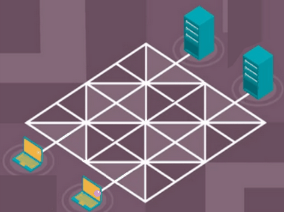
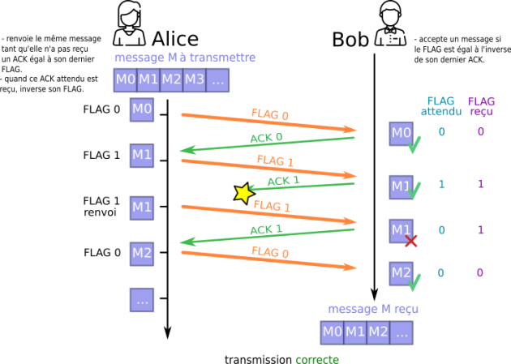

::: programme
+--------------------------+---------------------------------+-------------------------------------+
|         Contenus         |       Capacités attendues       |            Commentaires             |
+==========================+=================================+=====================================+
| Transmission de          | Mettre en évidence l'intérêt du | Le protocole peut être expliqué et  |
| données dans un réseau   | découpage des données en        | simulé en mode débranché.           |
|                          | paquets et de leur              |                                     |
|                          | encapsulation.                  |                                     |
|                          |                                 |                                     |
| Protocoles de            | Dérouler le fonctionnement d'un | Le lien est fait avec ce qui a été  |
| communication            | protocole simple de             | vu en classe de seconde sur le      |
|                          | récupération de perte de        | protocole TCP/IP.                   |
|                          | paquets(bit alterné).           |                                     |
|                          |                                 |                                     |
| Architecture d'un réseau | Simuler ou mettre en œuvre un   | Le rôle des différents constituants |
|                          | réseau.                         | du réseau local de l'établissement  |
|                          |                                 | est présenté.                       |
+--------------------------+---------------------------------+-------------------------------------+
:::

::: intro

**{.half .right}

[Image issue du site du lycée La Martinière Diderot académie de Lyon](http://portail.lyc-la-martiniere-diderot.ac-lyon.fr/srv1/co/decoupage_paquets.html){.cite-source}

> Dans ce chapitre, nous allons voir comment les ordinateurs peuvent communiquer entre eux sur internet grâce aux *protocoles de communication*.

:::

`youtube: dCknqcjcItU`

<!--

Nous utiliserons des ressources du cours
[ICN](https://www.youtube.com/playlist?list=PLWvGMqXvyJAOaI2Zf9dqa0b5SQWQ6Z9kr) proposées par le
site <https://pixees.fr/>.

 Bonne vidéo Monsiur techno: CC-BY-SA _0thnFumSdA -->

## Rappels de SNT: Les protocoles TCP/IP

On a vu en [seconde](/2gt/snt/1-internet/2-les-protocoles-dinternet) les deux protocoles fondamentaux d'internet:

- le protocole IP: qui permet d'attribuer à chaque machine une adresse IP unique pour l'identifier sur le réseau.
- le protocole TCP: qui permet d'assurer la communication de l'information en la découpant en paquets, et en s'assurant que tous les paquets sont reçus et conformes à l'information envoyée.

## Structures des réseaux

`youtube:NMY-N6kl6CI`

::: appli

1. Représenter des structures de réseaux en anneau et en bus et expliquer l'intérêt de ce type de
   structures.
2. Pourquoi les transmissions sont-elles effectuées par paquets sur un réseau?
3. Quel est l'élément central d'un réseau local?
4. Quel est le protocole qui permet d'identifier toutes les machines sur internet? Pourquoi en
   existe-t-il deux versions?
5. Qu'est-ce qu'un routeur? Comment fonctionne-t-il?
6. Mettre dans l'ordre les opérations suivantes lors d'une requête à serveur web depuis un
   navigateur sur un ordinateur à la maison. Certaines étapes manquent (par exemple d'autres
   recherches dans les tables de routage), on les ignore pour simplifier. L'ordinateur obtient l'IP
   du serveur par le protocole DNS.

    - Le serveur envoie la réponse à la requête.
    - La box transmet les paquets vers le serveur.
    - Le serveur traite la requête.
    - La box cherche l'IP du serveur dans sa table de routage.
    - L'ordinateur envoie un paquet de requête sur le réseau.
    - La box transmet la réponse vers l'ordinateur.
:::

## Le modèle en couche OSI

Le modèle OSI (_Open System Interconnection_) est un modèle en couche dans lequel chaque couche a
un rôle particulier dans la communication.

Il contient 7 couches alors que le modèle TCP/IP vu en seconde n'en contient que 4.

### Encapsulation des données

Lorsque la couche application envoie les données aux couches inférieures, elle y ajoute des
métadonnées appelées «en-tête» ou «en-queue» destinées à la couche application de l'autre machine distante.

Chaque couche ajoute ses propres en-têtes à l'émission lorsque les données de l'application descendent les couches. Et ainsi **la trame** d'informations circulant sur la couche liaison est "surchargée des métadonnées" de chacune des couches supérieures.

À la réception, chaque couche récupère et détache les métadonnées qui lui sont destinées et transmet le message sans ces métadonnées à la couche supérieure.

### La couche application

Les applications:

- web(HTTP) échangent des pages web, des données de formulaire, de session...
- mail(SMTP) échangent des emails, les stockent, permettent leur lecture...
- SSH, FTP, ...

### La couche transport

On découpe le message en segments et on y ajoute un numéro de port qui correspond à l'application qui l'utilise:

- HTTP: 80
- HTTPS: 443
- SMTP: 25

L'état de la connexion est vérifié, si tous les segments sont bien reçus et conformes grâce au calcul d'une [somme de contrôle](https://fr.wikipedia.org/wiki/Somme_de_contr%C3%B4le).

### La couche réseau/internet

On ajoute les adresses IP de la source et du destinataire, la longueur du paquet, sa durée de vie
pour former ce que l'on appelle un _paquet IP_.

### La couche liaison

Le paquet et encapsulé dans une trame qui contient l'adresse unique de la machine dans le réseau local.

Puis la trame va transiter à travers le réseau physique: Ondes radio, fibre optique, câbles RJ45... jusqu'à atteindre le réseau local de la machine destinataire ou chaque couche va utiliser les en-têtes fournis par la même couche que la machine source.

<!-- ## La couche transport

La couche transport propose deux principaux protocoles pour le transfert de données vers une machine distante:

- le protocole **TCP**(Transmission Control Protocol) pour un transfert connecté et fiable,
- le protocole **UDP**(User Datagram Protocol) pour un transfert déconnecté et non fiable.

Chaque protocole est utilisé dans des applications différentes: temps réel pour l'UDP, non-temps
réel, mais sensible à la perte au réordonnancement pour le TCP. 

### Notion de paquet

> Afin de transmettre un message d'une machine à une autre sur un réseau, celui-ci est découpé en plusieurs paquets transmis séparément. [Article paquet sur Wikipedia](https://fr.wikipedia.org/wiki/Paquet_(r%C3%A9seau)){.cite-source}

Voici par exemple la structure d'un paquet ipV6 avec ses en-têtes.

-->

## Le protocole du bit alterné

Le protocole du bit alterné est un protocole de réseau simple fonctionnant au niveau de la couche liaison de données (couche OSI 2) qui retransmet les messages perdus ou corrompus.

Il était utilisé dans le réseau [ARPANET](https://fr.wikipedia.org/wiki/ARPANET), l'ancêtre d'internet.

### Fonctionnement

Alice veut envoyer à Bob un message M, qu'elle a prédécoupé en sous-messages M0, M1, M2,...

Nous sommes à la couche 2, on souhaite une solution légère qui assure que tous les paquets sont
reçus dans l'ordre(pas comme en TCP couche 4).

On va simplement utiliser un en-tête à un bit.

Lorsque Alice envoie un message, elle le renvoie en continu, avec le même _bit d'en-tête_,
jusqu'à ce qu'il reçoive un accusé de réception de B contenant le même _bit d'en-tête_. Lorsque
cela se produit, A inverse le _bit d'en-tête_ et commence à transmettre le message
suivant.

Lorsque Bob reçoit un message qui n'est pas corrompu et a le _bit d'en-tête_ 0, il commence à envoyer `ACK0` (Accusé de réception de 0 _aknowledgement_ en anglais) et continue à le faire jusqu'à ce qu'il reçoive un message valide avec le numéro 1. Puis il commence à envoyer `ACK1`, etc.

Cela signifie qu'Alice peut toujours recevoir `ACK0` alors qu'elle transmet déjà des messages avec le _bit d'en-tête_ un. (Et vice versa.) Elle traite ces messages comme des codes d'acquittement négatif (NAK). Le comportement le plus simple est de les ignorer tous et de continuer à transmettre.

[Article Alternating bit protocol sur Wikipédia anglais](https://en.wikipedia.org/wiki/Alternating_bit_protocol){.cite-source}

### Illustrations

**Cas où le sous-message est perdu**

**Cas où le ACK est perdu**

Le protocole a bien détecté le doublon du sous-message M1.

**Cas où un sous-message est en retard**

Le protocole a bien détecté le doublon du sous-message M1... _mais que se passerait-il si notre premier sous-message M1 était encore plus en retard ?_

[site du lycée La Martinière Diderot académie de Lyon](http://portail.lyc-la-martiniere-diderot.ac-lyon.fr/srv1/co/bit_alterne.html){.cite-source}
