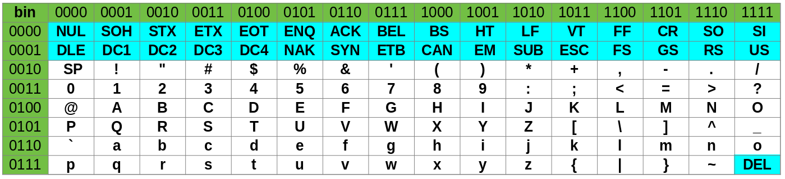

## Codage binaire d'un message

Comme nous l'avons vu dans le cours, dans un ordinateur toute information est
codée sous forme *binaire*.

Pour mieux comprendre comment cela fonctionne, nous allons étudier
l'envoi *simplifié* d'un message textuel à travers internet.

Le message est coupé en mots.

Chaque mot est constitué de *deux parties*:

-   **Le premier octet** donne l'ordre du mot dans le message, car les mots
    peuvent être reçus dans un ordre différent de celui de l'émission. Il s'agit
    d'une *métadonnée*.

    -   le premier mot aura le numéro: `00000000`
    -   le deuxième `00000001`
    -   le troisième `00000010`
    -   le quatrième `00000011`
    -   le cinquième `00000100`
    -   \...

-   **Les octets suivants** représentent les lettres du mot codé selon la norme
    ASCII, dont la table est donnée ci-dessous.

    

    On lit dans cette table que la représentation binaire du caractère **a** est
    `0110 0001` (7e ligne, 2e colonne).

    Par exemple le mot `OK` est codé: `01001111 01001011`


::: example

Supposons que nous souhaitions envoyer un message de deux mots: `OK Computer`,
il y aura deux envois numérotés `00000000` et `00000001` avec le contenu des
mots:

       n°0      O        K
    00000000 01001111 01001011 

       n°1      C        o         m       p        u        t         e       r
    00000001 01000011 01101111 01101101 01110000 01110101 01110100 01100101 01110010 

Ainsi ces deux messages peuvent être reçus dans n'importe quel ordre,
ils seront correctement réordonnés grâce à la métadonnée.
:::


1. Décoder le message suivant _(en anglais)_:
   
   <!-- CODAGE DE: Be yourself; everyone else is already taken. --Oscar Wilde -->
   ```
   00000100 01101001 01110011 

   00000110 01110100 01100001 01101011 01100101 01101110 00101110 

   00000011 01100101 01101100 01110011 01100101 

   00000000 01000010 01100101 

   00001000 01010111 01101001 01101100 01100100 01100101 

   00000111 00101101 00101101 01001111 01110011 01100011 01100001 01110010 

   00000101 01100001 01101100 01110010 01100101 01100001 01100100 01111001 

   00000010 01100101 01110110 01100101 01110010 01111001 01101111 01101110 01100101 

   00000001 01111001 01101111 01110101 01110010 01110011 01100101 01101100 01100110 00111011 

   ```

2. Le problème de la table ASCII est qu'elle ne permet de coder que les
   caractères américains, il n'y a pas d'accents. Décoder le message suivant _(en
   français)_:


   <!-- CODAGE DE: Les portes de l'avenir sont ouvertes à ceux qui savent les pousser. --Coluche -->
   ```
   00000001 01110000 01101111 01110010 01110100 01100101 01110011 

   00000101 01101111 01110101 01110110 01100101 01110010 01110100 01100101 01110011 

   00000010 01100100 01100101 

   00000011 01101100 00100111 01100001 01110110 01100101 01101110 01101001 01110010 

   00000000 01001100 01100101 01110011 

   00000111 01100011 01100101 01110101 01111000 

   00001000 01110001 01110101 01101001 

   00001100 00101101 00101101 01000011 01101111 01101100 01110101 01100011 01101000 01100101 

   00000110 00111111 

   00001001 01110011 01100001 01110110 01100101 01101110 01110100 

   00000100 01110011 01101111 01101110 01110100 

   00001010 01101100 01100101 01110011 

   00001011 01110000 01101111 01110101 01110011 01110011 01100101 01110010 00101110 

   ```
