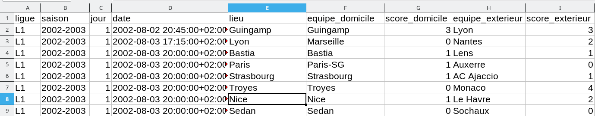

::: programme

+-----------------------------------+-----------------------------------------------------------------+
|           **Contenus**            |                     **Capacités attendues**                     |
+===================================+=================================================================+
| Données structurées               | Identifier les différents descripteurs d’un objet.              |
|                                   | Distinguer la valeur d’une donnée de son descripteur.           |
|                                   | Utiliser un site de données ouvertes, pour sélectionner et      |
|                                   | récupérer des données.                                          |
+-----------------------------------+-----------------------------------------------------------------+
| Traitement de données structurées | Réaliser des opérations de recherche, filtre, tri ou calcul sur |
|                                   | une ou plusieurs tables.                                        |
+-----------------------------------+-----------------------------------------------------------------+

:::

## Descripteurs et valeurs

Dans un jeu de données, on distingue:

- le **descripteur** par exemple `lieu` qui est un champ commun à tout le jeu de données.
- de sa **valeur** `Nice`, `Marseille`... qui est propre à chaque ligne des données.



## Les formats de données structurées

Les données peuvent être stockées sous divers _formats_ adaptés à leurs usages.

[ opendata.nicecotedazur.org](http://opendata.nicecotedazur.org/data/dataset){.cite-source}

- Les formats de tableur spécifiques aux logiciels, par exemple: 

  - `XLS`: tableur Microsoft Excel.
  - `ODS`: tableur LibreOffice sous licence libre.

- Les formats textuels adaptés aux machines et _indépendants_ du logiciel de traitement.
  
    - `CSV`: données séparées par des virgules _Coma Separated Values_
  
    Par exemple, voici un extrait de la [liste des musées de Nice au format `csv`](http://opendata.nicecotedazur.org/data/dataset/musees-et-galeries-de-la-ville-de-nice/resource/6275d491-cbda-44a9-bfed-34d02deeb944).
  
    ```
"Type d'établissement","Identité","Adresse Postale"
"MUSEE","MUSÉE MATISSE","06364 Nice CEDEX 04"
"GALERIE ","GALERIE DES PONCHETTES","06364 Nice CEDEX 04"
... 
    ```
    

  - `XML`: format de données avec balises _eXtensible Markup Langage_

  Par exemple, voici le début de la [liste des restaurants de Nice au format `xml`](http://opendata.nicecotedazur.org/data/dataset/liste-des-restaurants-de-nice-geolocalises/resource/d2acb1ee-9b27-4d54-a281-c0bab4653f62).

  ```xml
  <entry>
    <ID>519</ID>
    <name_fr>AUBERGE DE L'AIRE SAINT-MICHEL</name_fr>
    <address>
      <address_line>Chemin de Châteaurenard</address_line>
      <zip>06100</zip>
      <city>NICE</city>
    </address>
    <phone>+33(0)4 93 84 42 07</phone>
  </entry>
  <entry>
    <ID>520</ID>
       ...
  ```
  - `JSON`: notation objet issue de javascript.

    Par exemple, voici le début des données de [cartographie des vélos bleus en `json`](http://opendata.nicecotedazur.org/data/dataset/cartographie-des-stations-velobleu/resource/ffa94ca0-b27a-424a-bb97-76ee0c833878?inner_span=True).
  
    ```json
    {
    "docs": [
      {
        "NBR_PT_ACC": 15,
        "IDENT": "131",
        "NBR_VELO": 0,
        "COMPL_LOC": "Le long du parking-relais Pont Michel, à proximité de la station de tramway",
        "NOM_VOIE": "ROUTE DE TURIN",
        "EMPLACEMEN": "Trottoir"
      },
      {
        "NBR_PT_ACC": 15,
        "IDENT": "132",
        "NBR_VELO": 0,
        "COMPL_LOC": "n43",
        "NOM_VOIE": "AVENUE DENIS SEMERIA",
        "EMPLACEMEN": "Chaussée"
      },
    ```

<!-- 
## Les dictionnaires en Python

En python, une entrée peut-être représentée par un dictionnaire ou les couples `"descripteur":
valeur` sont séparés par des virgules et entourées d'accolades.

```python
match = {'ligue': 'L1',
         'saison': '2002-2003',
         'jour': '1',
         'date': '2002-08-03 20:00:00+02:00',
         'lieu': 'Nice',
         'equipe_domicile': 'Nice',
         'score_domicile': '1',
         'equipe_exterieur': 'Le Havre',
         'score_exterieur': '2'}
```

Chaque valeur peut-être accédée grâce à son descripteur (ou clé):

```python
print(match["lieu"]) # affiche "Nice"
```

::: appli

Expliquer simplement quelle donnée représente le dictionnaire match?

:::

## Exploitation d'un fichier `csv` en Python

Lorsqu'on lit un fichier `csv` en Python, chaque ligne du fichier est automatiquement converti en
`dict`ionnaire.

Voici par exemple comment afficher toutes les lignes d'un fichier appelé `data.csv`.

```python
# import du module csv de Python
import csv

# Lecture de chaque ligne sous forme de dictionnaire
with open('data.csv') as csv_file:
    reader = csv.DictReader(csv_file)
    for ligne in reader:
        # affiche le dictionnaire complet
        print(ligne)
        # ou on affiche qu'une valeur par ligne
        # print(ligne["descripteur"])
```

Voici par exemple la sortie obtenue avec le fichier des musées de Nice:

```
{"Type d'établissement": 'MUSEE', 'Identité': "MUSÉE D'ART MODERNE ET D'ART CONTEMPORAIN MAMAC", 'Adresse': 'Place Yves Klein 06300 Nice'}
{"Type d'établissement": 'MUSEE', 'Identité': 'MUSÉE MATISSE', 'Adresse': '164 Avenue des Arènes de Cimiez, 06000 Nice'}
{"Type d'établissement": 'MUSEE', 'Identité': 'PALAIS LASCARIS', 'Adresse': '15 rue Droite            06300 Nice'}
{"Type d'établissement": 'MUSEE', 'Identité': "MUSEUM D'HISTOIRE NATURELLE", 'Adresse': '60 bd Risso           06300 Nice'}
{"Type d'établissement": 'MUSEE', 'Identité': "MUSEE D'ARCHEOLOGIE DE NICE CIMIEZ", 'Adresse': '160, avenue des Arènes de Cimiez 06000 Nice'}
{"Type d'établissement": 'MUSEE', 'Identité': "MUSEE D'ARCHEOLOGIE DE NICE TERRA AMATA", 'Adresse': '25 bd Carnot\n06300 Nice'}
{"Type d'établissement": 'MUSEE', 'Identité': 'MUSÉE DES BEAUX-ARTS JULES CHERET', 'Adresse': '33 av des Baumettes    06000 Nice'}
{"Type d'établissement": 'MUSEE', 'Identité': "MUSÉE INTERNATIONAL D'ART NAÏF ANATOLE JAKOVSKY", 'Adresse': 'Château Sainte-Hélène 23, avenue de Fabron 06200 NICE'}
{"Type d'établissement": 'MUSEE', 'Identité': 'MUSÉE DE LA PHOTOGRAPHIE CHARLES NEGRE', 'Adresse': '1 Place Pierre Gautier 06300 Nice'}
{"Type d'établissement": 'MUSEE', 'Identité': 'VILLA MASSÉNA', 'Adresse': '65 rue de France   06000 Nice'}
{"Type d'établissement": 'MUSEE', 'Identité': 'PRIEURE DU VIEUX LOGIS', 'Adresse': '59 Avenue de Saint-Barthélémy, 06100 Nice'}
{"Type d'établissement": 'GALERIE ', 'Identité': 'GALERIE DE LA MARINE', 'Adresse': '59 quai des Etats-Unis  06300 Nice'}
{"Type d'établissement": 'GALERIE ', 'Identité': 'GALERIE DES PONCHETTES', 'Adresse': '77 Quai des États-Unis, 06300 Nice'}
{"Type d'établissement": '', 'Identité': 'MONASTERE DES FRANCISCAINS', 'Adresse': 'Place du Monastère - 06000 Nice'}
``` -->