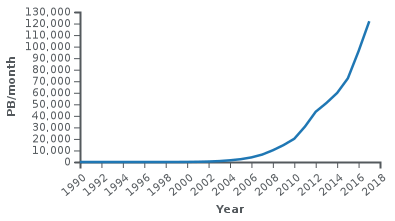
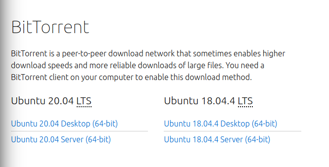

::: programme

+--------------------------------+----------------------------------------------------------------+
|          **Contenus**          |                    **Capacités attendues**                     |
+================================+================================================================+
| Indépendance d’internet        | Caractériser quelques types de réseaux physiques : obsolètes   |
| par rapport au réseau physique | ou actuels, rapides ou lents, filaires ou non.                 |
|                                |                                                                |
|                                | Caractériser l’ordre de grandeur du trafic de données sur      |
|                                | internet et son évolution.                                     |
+--------------------------------+----------------------------------------------------------------+
| Réseaux pair-à-pair            | Décrire l’intérêt des réseaux pair-à-pair ainsi que les usages |
|                                | illicites qu’on peut en faire.                                 |
+--------------------------------+----------------------------------------------------------------+

<!-- prog
#### Présentation

**Introduction**

Grâce à sa souplesse et à son universalité, internet est devenu le moyen de communication principal
entre les hommes et avec les machines.

**Repères historiques**

Dès les années cinquante, les ordinateurs ont été mis en réseau pour échanger des informations,
mais de façon très liée aux constructeurs d’ordinateurs ou aux opérateurs téléphoniques. Les
réseaux généraux indépendants des constructeurs sont nés aux États-Unis avec ArpaNet (1970) et en
France avec Cyclades (1971). Cet effort a culminé avec internet, né en 1983.

**Le protocole TCP/IP**

Internet est défini par le **protocole IP** (Internet Protocol), ensemble de normes qui permettent
d’identifier et de nommer de façon uniforme tous les ordinateurs ou objets qui lui sont connectés.
IP est accompagné de protocoles de transmission pour transférer l’information par **paquets**, le
principal étant **TCP/IP** (Transmission Control Protocol). De nature logicielle, internet s’appuie
sur une grande variété de réseaux physiques où IP est implémenté. Il uniformise l’accès à tous les
ordinateurs, les téléphones et les objets connectés.

**Les données et l’information**

Internet manipule deux types d’information : les contenus envoyés et les adresses du destinataire
et de l’émetteur. Ces deux types d’information sont regroupés dans des paquets de taille fixe, de
façon uniforme et indépendante du type de données transportées : texte, images, sons, vidéos, etc.
Les adresses sont numériques et hiérarchiques mais l’utilisateur connaît surtout des **adresses
symbolique**s normalisées, comme wikipedia.fr. Le système **DNS** (Domain Name System) transforme
une adresse symbolique en adresse numérique. Il est réalisé par un grand nombre d’ordinateurs
répartis sur le réseau et constamment mis à jour.

**Les algorithmes et les programmes**

Le principal algorithme d’internet est le **routage** des paquets de leurs émetteurs vers leurs
destinataires. Il est effectué par des machines appelées routeurs, qui échangent en permanence avec
leurs voisins pour établir une carte locale de ce qu’ils voient du réseau. Chaque paquet transite
par une série de routeurs, chacun l’envoyant à un autre routeur selon sa carte locale et la
destination prévue. Les routeurs s’ajustent en permanence et de proche en proche quand on les
ajoute au réseau ou quand un routeur voisin disparaît. Il n’y a plus besoin de carte globale, ce
qui permet le routage à grande échelle.

Lors du routage, un paquet peut ne pas arriver pour deux raisons : une panne matérielle d’une ligne
ou d’un routeur, ou sa destruction. Chaque paquet contient l’information d’un nombre maximal de
routeurs à traverser : pour ne pas encombrer le réseau, il est détruit si ce nombre est atteint.
C’est le protocole TCP qui fiabilise la communication en redemandant les paquets manquants. Il
garantit que tout paquet finira par arriver, sauf panne matérielle incontournable. TCP réordonne
aussi les paquets arrivés dans le désordre et diminue la congestion du réseau en gérant au mieux
les redemandes. Mais ni internet ni TCP ne possèdent de garantie temporelle d’arrivée des paquets,
ce qui nuit à la qualité du streaming du son ou des vidéos et de la téléconférence. En effet, dans
une vidéo, on peut perdre une image isolée, mais pas le fil du temps.

D’autres protocoles s’appuient sur ceux d’internet, par exemple les protocoles du _Web_ (HTTP et
HTTPS) et le protocole NTP (Network Time Protocol) qui permet de synchroniser finement les heures
des ordinateurs et objets connectés.

**Les machines**

Réseau mondial, internet fonctionne à l’aide de routeurs, de lignes de transmissions à très hauts
débits (fibres optiques) entre routeurs, de réseaux de téléphonie mobile, et de réseaux locaux. Ses
protocoles étant logiciels, il peut s’appuyer **sur n’importe quel réseau physique** qui les
implémente : 4G, Ethernet, ADSL, Wi-Fi, Bluetooth, etc. TCP/IP n’est pas implémenté dans
l’infrastructure, mais dans chacun des ordinateurs connectés, et un serveur DNS est aussi un
ordinateur connecté. Des mécanismes complexes assurent la continuité de la connexion, par exemple
pour passer sans interruption de téléphonie 4G au Wi-Fi, ou son ubiquité, par exemple pour passer
de façon invisible d’antenne à antenne avec un téléphone portable quand on voyage.

Dans les réseaux **pair-à-pair** s’appuyant sur internet et souvent utilisé pour le transport de
vidéos, chaque ordinateur sert à la fois d’émetteur et de récepteur.

**Impacts sur les pratiques humaines**

Internet a fait progressivement disparaître beaucoup des moyens de communication précédents :
télégramme, télex, le courrier postal pour une bonne partie, et bientôt le téléphone fixe grâce à
VoIP (voix sur IP). Son trafic prévu pour 2021 est de 3 300 milliards de milliards d’octets ($3,3 ×
10^{21}$$ octets).

Internet a aussi ses problèmes : absence de garantie temporelle sur l’arrivée des paquets et
possibilité d’attaques par saturation en envoyant un très grand nombre de messages à un site donné,
pour y provoquer un déni de service.

La neutralité du Net, présente dès l’origine du réseau, exprime l’idée que les routeurs doivent
transmettre les paquets indépendamment du type de leur contenu : texte, vidéo, etc. Mais elle est
constamment remise en cause par certains lobbies industriels.

 -->

:::

::: intro

<wc-wikimage class="half right" title="Internet_map_1024.jpg" caption="Visualisation des multiples chemins à travers une portion d'Internet.(CC-BY-SA The Opte Project)"></wc-wikimage>

> Dans cette partie, nous allons nous intéresser à internet: **le réseau des réseaux**. Né en 1983,
> il est aujourd'hui incontournable, mais comment est-il né et comment fonctionne-t-il?

> Souvent confondu avec le web (le réseau d'informations reliées par l'hypertexte), le réseau
> internet est le réseau de machines permettant le transport de ces informations, mais pas que!

:::

::: {.appli titre="QCU diagnostique"}

On commence par tester ses connaissances en utilisant le QCU P34-35 du [manuel de
Delagrave](https://www.editions-delagrave.fr/livre/9782206103389-sciences-numeriques-et-technologie-snt-2de-2019-manuel-eleve)

Lien vers la version en ligne: https://lienmini.fr/3389-202

:::

## L'histoire d'Internet

`youtube: 5ee6W1ODvFU`

L'ancêtre d'internet s'appelait <!-- arpanet --> ____________.
Sur internet, les données sont acheminées sous forme de <!-- paquets --> ______________.

Les règles permmettant la transmission des données sont les protocoles:

- TCP qui <!-- assure le transport et l'intégrité des paquets dans le réseau --> ______________________________________________. 
- IP qui <!-- conduit les paquets à bon port --> ______________________________________________.

## L'essor d'internet

Internet a fait progressivement disparaître beaucoup des moyens de communication précédents:

- Télégramme,
- télex,
- le courrier postal pour une bonne partie remplacé par le courrier électronique(Protocoles IMAP, SMTP),
- et bientôt le téléphone fixe grâce à VoIP (voix sur IP)
- ou encore la télévision grâce à IPTV(en direct et à la demande).

Son trafic prévu pour 2021 est de 3 300 milliards de milliards d’octets ($3,3 ×
10^{21}$ octets).

::: appli

1. Évaluez ou recherchez votre consommation mensuelle de données(vous pouvez utiliser cette
   [page](https://reseaux.orange.fr/questions/internet-mobile/definition-data) pour vous aider).
2. Calculez quel serait le trafic mondial si toutes les personnes du monde utilisaient la même
   quantité de données que vous.
3. Comparez cette valeur à la valeur réelle et commentez votre résultat.

:::

::: {.plus titre="Le bit et l'octet: unités d'information"}

Les machines que nous utilisons actuellement fonctionnent sur des circuits électroniques à deux
états notés 0 ou 1.

Toutes les données sont codées en binaire, mais cette unité est tellement petite on utilise plus
communément d'autres unités comme:

- l'octet: $1~o = 8~bits$,
- le kibioctet: $1kio=2^{10} octets = 1~024~o \approx 1~ko$,
- le mébioctet: $1Mio=2^{20} octets = 1~048~576~o \approx 1~Mo$,
- le gibioctet: $1Gio=2^{30} octets = 1~073~741~824 \approx 1~Go$

:::

## Organisation du réseau internet

 By <a href="//commons.wikimedia.org/wiki/User:Ludovic.ferre" title="User:Ludovic.ferre">User:Ludovic.ferre</a> - Internet Connectivity Distribution&amp;Core.svg, <a href="https://creativecommons.org/licenses/by-sa/3.0" title="Creative Commons Attribution-Share Alike 3.0">CC BY-SA 3.0</a>, <a href="https://commons.wikimedia.org/w/index.php?curid=10030716">Link</a>

<!-- <wc-wikimage title="Internet_Connectivity_Distribution_&_Core.svg" caption="Interconnexion des réseaux au sein d'internet."></wc-wikimage> -->

Le réseau internet n'est pas centralisé, il n'y a pas une machine _centrale_ à laquelle sont
connectées toutes les autres. Les **routeurs** permettent de connecter les réseaux entre eux.

Pour se connecter à internet, il suffit de se connecter à une autre machine qui y est déjà
connectée.

::: examples

- connexion à une box par câble RJ45, par Wifi
- partage de connexion avec un téléphone par WIFI, câble USB
- WIFI public

:::

## Communication sur Internet

::: appli

Répondre aux questions de l'activité PP 44-45 du [manuel de
Delagrave](https://www.editions-delagrave.fr/livre/9782206103389-sciences-numeriques-et-technologie-snt-2de-2019-manuel-eleve).

:::

On distingue deux principaux modes de communication.

**Communication client-serveur**

**Communication pair à pair(_peer to peer_ en anglais.)**

Une machine (_le client_) émet une requête vers une autre machine (_le serveur_) qui est la seule à pouvoir répondre à ces requêtes.

Dans un réseau pair à pair au contraire, chaque machine est à la fois client et serveur.

Les deux machines communiquent directement sans intermédiaire.

 By <a href="//commons.wikimedia.org/wiki/User:Mauro_Bieg" title="User:Mauro Bieg">User:Mauro Bieg</a> - derived from the <a href="//commons.wikimedia.org/wiki/File:Computer_n_screen.svg" title="File:Computer n screen.svg">Image:Computer n screen.svg</a> which is under the GNU LGPL, <a href="http://www.gnu.org/licenses/lgpl.html" title="GNU Lesser General Public License">LGPL</a>, <a href="https://commons.wikimedia.org/w/index.php?curid=2551745">Link</a> 

 By <a href="//commons.wikimedia.org/wiki/User:Mauro_Bieg" title="User:Mauro Bieg">User:Mauro Bieg</a>

La communication **client-serveur** est généralement utilisée:

- web,
- courriel,
- Vod ...

La communication **pair à pair** est beaucoup moins utilisée:

- [Torrent](https://ubuntu.com/download/alternative-downloads#bittorrent): partage de fichiers.
  Vous téléchargez un fichier en utilisant les ordinateurs connectés voisins et en même temps vous
  envoyez des paquets du fichier à d'autres utilisateurs voisins. 
- [Skype](https://en.wikipedia.org/wiki/Skype_protocol): Communications audio et vidéos.
- [peertube](https://joinpeertube.org/): partage de vidéos.

::: appli

Citer au moins un avantage et un avantage et un inconvénient pour chaque type de communication.

:::

<!-- 

Avantages:

Inconvénient:

- lorsque vous visitez la plateforme vous utilisez des ressources pour envoyer des données à
  d'autres utilisateurs.
  

Pour accéder à internet, il faut:

- Avoir une machine avec un terminal(ou carte) réseau(ordinateur, téléphone, tablette...),
- se raccorder à un fournisseur d'accès à internet(FAI) par une connexion:
       - **filaire**: ADSL, VDSL2, fibre optique,
       - **sans fil**:
           - Wi-Fi, WiMAX,
           - via un réseau de téléphonie mobile (GSM/EDGE, 3G/UMTS, 3G+ ou LTE, 4G, 4G+, 5G, etc.)
           - ou par satellite. 

Internet par satellite: article le monde

::: plus

Cette organisation permet de rendre le réseau internet résilient face aux pannes, car
lorsque des pannes ont lieu, elles n'affectent pas la totalité du réseau et les échanges peuvent
transiter quand même par d'autres machines.

::: 

-->
