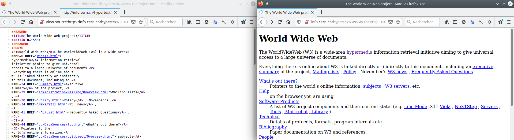

::: programme

+-----------------------+-------------------------------------------------------------------------------+
|     **Contenus**      |                            **Capacités attendues**                            |
+=======================+===============================================================================+
| Repères historiques   | Connaître les étapes du développement du _Web_.                               |
+-----------------------+-------------------------------------------------------------------------------+
| Hypertexte            | Maîtriser les renvois d’un texte à différents contenus.                       |
+-----------------------+-------------------------------------------------------------------------------+
| Requête HTTP          | Décomposer le contenu d’une requête HTTP et identifier les paramètres passés. |
+-----------------------+-------------------------------------------------------------------------------+
| URL                   | Décomposer l’URL d’une page.                                                  |
|                       | Reconnaître les pages sécurisées.                                             |
+-----------------------+-------------------------------------------------------------------------------+
| Modèle client/serveur | Inspecter le code d’une page hébergée par un serveur et distinguer ce qui est |
|                       | exécuté par le client et par le serveur.                                      |
+-----------------------+-------------------------------------------------------------------------------+
| Langages HTML et CSS  | Distinguer ce qui relève du contenu d’une page et de son style                |
|                       | de présentation.                                                              |
|                       | Étudier et modifier une page HTML simple.                                     |
+-----------------------+-------------------------------------------------------------------------------+

:::

> Ne confondons pas internet et le web. Le web, l'ensemble des documents
> électroniques accessibles sur le réseau internet compte aujourd'hui près de _2
> milliards de pages_ et est devenu omniprésent dans notre vie grâce à
> l'utilisation d'_applications web dynamiques_. L'ensemble des documents
> électroniques du web doivent pouvoir être consulté à partir de machines
> variées, ordinateurs, tablettes, objets connectés. C'est pour cela que des
> _normes_ ont été mis au point pour garantir un accès universel à tous.

<!-- 
Commençons par une vidéo présentant l'histoire du web.
lienmini.fr/3389-303 

[](http://lienmini.fr/3389-303)
-->

On commence par une vidéo de l'INRIA: Le web, "site internet" ou "site web" ?

`youtube: GqD6AiaRo3U`

## L'hypertexte

::: appli

En utilisant les documents PP 58-59 du [manuel de
Delagrave](https://www.editions-delagrave.fr/livre/9782206103389-sciences-numeriques-et-technologie-snt-2de-2019-manuel-eleve),
répondre aux questions suivantes :

1. Expliquer ce qu'est un lien hypertexte, et quand il est apparu.
2. Quelles relations existent entre l'hypertexte, les pages Web et les navigateurs.
3. Quelle est la différence entre une page web statique et dynamique ? 

:::

Hypertexte

: Texte électronique dans lequel le lecteur peut naviguer via des liens
permettant de passer directement d’une partie d’un document à une autre, ou d’un
document à d’autres documents.


## L'URL _(Uniforme Resource Locator)_

Sur Internet, nous avons vu que chaque machine possède une adresse IP qui peut
être reliée à un nom grâce au protocole DNS.

::: example

Name:   framasoft.org <-> Address: 144.76.131.212

:::

Sur le web, chaque page web possède une adresse unique qui permet de l'identifier.

URL

: Une URL ou _adresse universelle_ est utilisée pour identifier les sites web et
leurs pages.

::: examples

- boîte aux lettres électronique : `mailto:gaston.lagaffe@mail.com` ;
- numéro de téléphone: `tel:+33 1 234 567 890`.
- page web: https://fr.wikipedia.org/wiki/Grace_Hopper#Anecdote

:::


[Article URL sur MDN](https://developer.mozilla.org/en-US/docs/Learn/Common_questions/What_is_a_URL){.cite-source}


Une URL se décompose en quatre principales parties :

- Le protocole: `http`, `https`, `mailto`, `tel`...
- le domaine précédé éventuellement du sous-domaine: `fr.wikipedia.org`
- le chemin vers la ressource sur le serveur: `/blog/index.html`
- l'ancre sur une partie de la page: `#exo2`


::: {.plus titre="Paramètres d'URL"}

Dans le cas de pages dynamiques, il est possible d'ajouter des paramètres aux URL en les plaçant
après le chemin de la ressource.

Par exemple, pour utiliser le moteur de recherche du site mdn.mozilla :

https://developer.mozilla.org/fr/search?q=CSS&locale=ja

Ici, deux paramètres ont été ajoutés:

- `q`: le terme recherché ayant pour valeur `CSS`.
- `locale`: la langue de recherche avec la valeur `fr`.

_**Attention** aux caractères spéciaux, vous rencontrerez parfois le `%20`, c'est tout simplement
un espace qui n'est pas admis dans les URL._

:::

## Le protocole `HTTP`

Dans le web, le client échange de nombreuses informations avec le serveur, les pages web bien sûr,
mais également:

- des informations sur le navigateur,
- des données d'identification(cookie p.ex),
- la langue du contenu...

Ces données sont codifiées par le protocole `HTTP` ou `HTTPS` dans le cas d'échanges sécurisés(mots
de passe, paiements...)

::: prop

HTTPS est la version sécurisée du protocole HTTP dans laquelle les données
échangées entre le client et le serveur sont cryptées.

:::

- Le **client** effectue des demandes au serveur comme:
       - `GET`: Demande d'une page.
       - `POST`: Transmission de données d'un formulaire par exemple.
       - `DELETE`: Suppression d'une ressource du serveur.
       - ...

Les informations nécessaires à la requête sont placées dans des en-têtes un peu comme si les
messages étaient placés dans une enveloppe.

::: example

Voici la requête `HTTP`_(un extrait)_ envoyée pour demander la page la page
https://fr.wikipedia.org/wiki/Hypertext_Transfer_Protocol en cliquant sur le lien du moteur de
recherche www.qwant.com.

La première ligne indique le type de requête(GET, POST...), l'adresse de la ressource et la
version du protocole.

```
GET /wiki/Hypertext_Transfer_Protocol HTTP/2
Host: fr.wikipedia.org
User-Agent: Mozilla/5.0 (X11; Linux x86_64; rv:80.0) Gecko/20100101 Firefox/80.0
Accept-Language: fr,fr-FR;q=0.8,en-US;q=0.5,en;q=0.3
Referer: https://www.qwant.com/
Cookie: WMF-Last-Access=14-Sep-2020; WMF-Last-Access-Global=14-Sep-2020; GeoIP=FR:PAC:Nice:43.71:7.26:v4;
...
```

:::

- Le **serveur** répond au client en commençant par lui envoyer un
  [code d'état](https://fr.wikipedia.org/wiki/Liste_des_codes_HTTP):
       - `200`: succès de la requête
       - ...
       - `301` ou `302`: redirection vers une autre page;
       - `404`: page non trouvée
       - ...
       - `500`: erreur du serveur
       - ...

::: example

Et voici l'en-tête _(un extrait)_ de la réponse du serveur:

```
HTTP/2 200 OK
date: Sun, 13 Sep 2020 09:14:27 GMT
content-language: fr
last-modified: Sun, 06 Sep 2020 18:23:06 GMT
content-type: text/html; charset=UTF-8
content-length: 33988
...
```

La réponse renvoyée (après l'en-tête) étant la page `html` demandée dont nous parlerons juste
après :

```html
<!DOCTYPE html>
<html lang="fr">
<head>
<meta charset="UTF-8"/>
<title>Hypertext Transfer Protocol — Wikipédia</title>
...
</html>
```

:::

::: appli

En analysant les en-têtes de la requête et de la réponse, expliquez quelles sont les informations:

- envoyées par le client.
- et celles renvoyées par le serveur.

:::

## Le langage `html` et le navigateur web

Lorsque le navigateur web (le client) envoie une requête `HTTP` vers un serveur web, celui-ci lui
renvoie du code `html` qui est rendu à l'écran grâce au navigateur.

Le langage `html` est un langage qui utilise des balises ouvrantes `<balise>` et fermantes
`</balise>`.

Voici par exemple le code-source à gauche et le rendu de la [première page
web](http://info.cern.ch/hypertext/WWW/TheProject.html) du cern rendue dans un navigateur moderne.




::: appli

Faire l'[exercice 1](./exo). 

:::

::: examples

- Un titre de niveau 1: `<h1>Mon titre</h1>`html
- un lien hypertexte: ` 
:::

::: {.plus titre="Les normes du html"}

Bien entendu, les premiers navigateurs n'étaient pas aussi évolués qu'aujourd'hui, vous pouvez
d'ailleurs avoir une idée du rendu de cette page à l'époque de sa création à cette adresse:
http://line-mode.cern.ch/www/hypertext/WWW/TheProject.html

Le langage `html` ne cesse d'évoluer pour répondre à tous les nouveaux usages d'internet,
utilisation d'écrans tactiles, lectures de vidéos, paiements...

On peut trouver sa spécification [ici](https://html.spec.whatwg.org/)

:::
