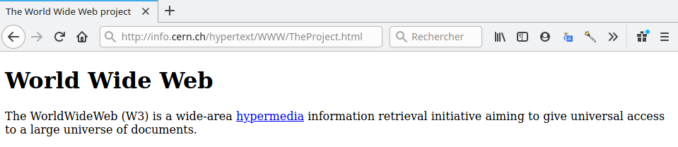

## Comprendre une `url`

Compléter le tableau suivant donnant les diverses informations contenues dans les URL suivantes.

1. mailto:gaston.lagaffe@mail.com
2. ftp://ftp.mozilla.org/pub/mozilla.org/firefox/releases/
3. https://fr.wikipedia.org/wiki/Grace_Hopper#Anecdote
4. https://developer.mozilla.org/fr/search?q=HTTP&locale=en-US
5. https://www.google.com/search?q=snt&as_sitesearch=lemonde.fr

+-------+-------------+------------------+----------------------------+--------------+---------+
|   URL | Protocole   | Nom de domaine   | Chemin vers la ressource   | Paramètres   | Ancre   |
+=======+=============+==================+============================+==============+=========+
|     1 |             |                  |                            |              |         |
+-------+-------------+------------------+----------------------------+--------------+---------+
|     2 |             |                  |                            |              |         |
+-------+-------------+------------------+----------------------------+--------------+---------+
|     3 |             |                  |                            |              |         |
+-------+-------------+------------------+----------------------------+--------------+---------+
|     4 |             |                  |                            |              |         |
+-------+-------------+------------------+----------------------------+--------------+---------+
|     5 |             |                  |                            |              |         |
+-------+-------------+------------------+----------------------------+--------------+---------+

## Les bases du `html`

Voici un extrait du code de la première page web crée par Tim Berners Lee au CERN.

```html
<header>
    <title>The World Wide Web project</title>
</header>

<body>
    <h1>World Wide Web</h1>

    The WorldWideWeb (W3) is a wide-area<a href="WhatIs.html">hypermedia</a>
    information retrieval initiative aiming to give universal access to a large
    universe of documents.
    
</body>
```

Voici le rendu:



Le langage `html` est un langage qui utilise des balises ouvrantes `<balise>` et fermantes
`</balise>`.

1. Quelle différence y a-t-il entre la balise ouvrante et la balise fermante ?
2. Repérer toutes les balises utilisées dans ce document.
3. Quelle balise permet de créer des liens **hypertextes** ?
4. Essayer de deviner le rôle des autres balises en observant attentivement le rendu.