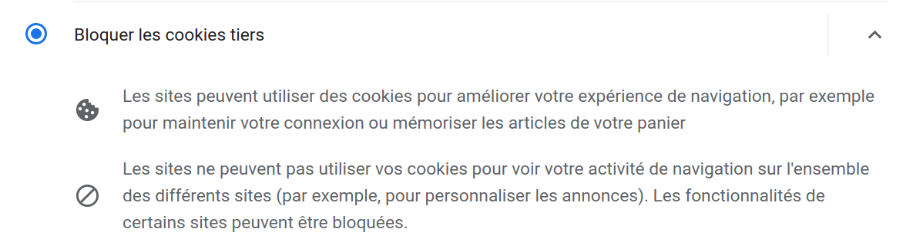

::: programme

<!-- +-----------------------------+------------------------------------------------------------------+
|        **Contenus**         |                     **Capacités attendues**                      |
+=============================+==================================================================+
| Moteurs de recherche :      | Mener une analyse critique des résultats fournis par un moteur   |
| principes et usages         | de recherche.                                                    |
|                             | Comprendre les enjeux de la publication d’informations.          |
+-----------------------------+------------------------------------------------------------------+
| Paramètres de sécurité d’un | Maîtriser les réglages les plus importants concernant la         |
| navigateur                  | gestion des cookies, la sécurité et la confidentialité d'un      |
|                             | navigateur.                                                      |
|                             | Sécuriser sa navigation en ligne et analyser les pages et        |
|                             | fichiers.                                                        |
+-----------------------------+------------------------------------------------------------------+
| Notions juridiques          | Connaître certaines notions juridiques (licence, droit d'auteur, |
|                             | droit d’usage, valeur d'un bien).                                |
+-----------------------------+------------------------------------------------------------------+ -->

:::

::: intro

Le web est un lieu «magique» où une grande quantité d'informations et de services sont à votre
portée, mais l'accès libre à une information ou à un service signifie-t-il qu'il est gratuit?
Dans ce chapitre, nous verrons comment rechercher des informations sur le web, sécuriser sa
navigation et respecter le droit d'auteur sur le Web.

:::

## Comment fonctionne un moteur de recherche?

<!-- lienmini.fr/1046-307 -->

`youtube: iKMm6SXO0wA`

::: appli

Répondre aux questions de l'activité PP 64-65 du [manuel de
Delagrave](https://www.editions-delagrave.fr/livre/9782206103389-sciences-numeriques-et-technologie-snt-2de-2019-manuel-eleve),
puis **conclure en expliquant quels sont les principaux critères de classement des résultats sur un
moteur de recherche**.

:::

1. Des robots logiciels explorent toutes les pages web: l'**exploration**.
2. Les pages sont ensuite classées: l'**indexation**.
3. Lorsque l'utilisateur fait une recherche le moteur de recherche lui affiche une liste de pages en
   les classant dans un ordre qui lui est propre: le **classement**.

::: {.plus titre="Impact écologique"}

Selon l'étude de l'ADEME, aller directement à l’adresse d’un site, soit en tapant son adresse dans
son navigateur, soit en l’ayant enregistré comme « favori » (plutôt que de rechercher ce site via
un moteur de recherche) divise par 4 les émissions de gaz à effet de serre. 

:::

## Les cookies

::: appli

Répondre aux questions suivantes en utilisant les documents de l'activité PP 66-67 du [manuel de
Delagrave](https://www.editions-delagrave.fr/livre/9782206103389-sciences-numeriques-et-technologie-snt-2de-2019-manuel-eleve).

1. Comment paramétrer son navigateur pour améliorer sa confidentialité?
2. Que sont les cookies? et les cookies tiers?
3. Ai-je le droit de copier-coller n'importe quelles informations sur les sites web?

:::

cookie

:   Les **cookies** sont de petits fichiers stockés sur votre navigateur par le serveur pour maintenir
    votre connexion ou stocker votre panier par exemple.

Les cookies _tiers_ sont des cookies déposés par des serveurs autres que ceux du site que vous
visitez. Ces cookies sont souvent utilisés pour vous suivre lors de votre navigation afin d'établir
un profil publicitaire ou autre.

## Les droits sur internet

Le droit d'auteur s'applique sur internet comme ailleurs. Tous les textes, photos, vidéos sont la
propriété de leur auteur ou ayant-droits(maison de disques, descendants...) et ce jusqu'à leur
entrée dans le **domaine public** 70 ans après la mort de leur auteur.

Certains sites comme Wikipédia tentent de promouvoir un nouveau type de licence [Creative
Commons](https://creativecommons.org/licenses/) afin que les œuvres puissent être copiées,
distribuées, modifiées et adaptées.

<wc-wikimage title="Creative_commons_license_spectrum_fr.svg" caption="La licence libre Creative Commons existe sous diverses variations plus ou moins ouvertes."></wc-wikimage>

<!-- 
 By <a href="//commons.wikimedia.org/wiki/User:Simon_Villeneuve" title="User:Simon Villeneuve">Simon Villeneuve</a> (traduction en français) - Own work, <a href="https://creativecommons.org/licenses/by-sa/4.0" title="Creative Commons Attribution-Share Alike 4.0">CC BY-SA 4.0</a>, <a href="https://commons.wikimedia.org/w/index.php?curid=57712722">Link</a>
 -->
