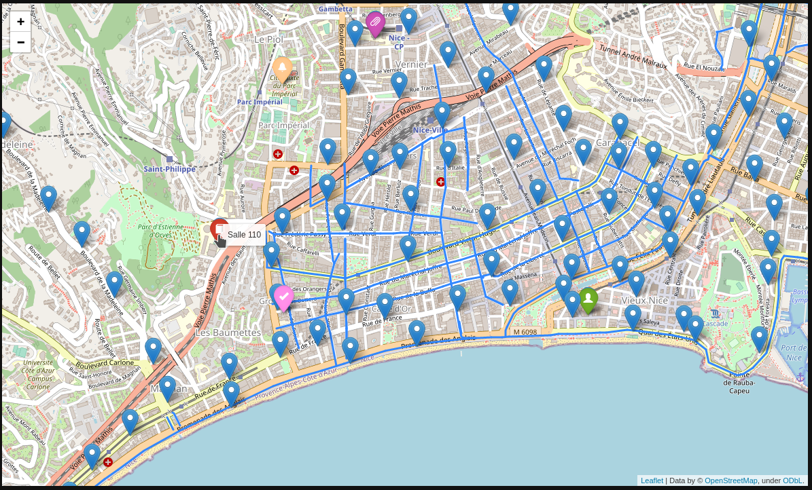

::: programme

+-----------------------+--------------------------------------------------------------------+
|     **Contenus**      |                      **Capacités attendues**                       |
+=======================+====================================================================+
| GPS, Galileo          | Décrire le principe de fonctionnement de la                        |
|                       | géolocalisation.                                                   |
+-----------------------+--------------------------------------------------------------------+
| Cartes numériques     | Identifier les différentes couches d’information de GeoPortail     |
|                       | pour extraire différents types de données.                         |
|                       | Contribuer à OpenStreetMap de façon collaborative.                 |
+-----------------------+--------------------------------------------------------------------+
| Protocole NMEA 0183   | Décoder une trame NMEA pour trouver des coordonnées géographiques. |
+-----------------------+--------------------------------------------------------------------+
| Calculs d’itinéraires | Utiliser un logiciel pour calculer un itinéraire.                  |
|                       | Représenter un calcul d’itinéraire                                 |
|                       | comme un problème sur un graphe.                                   |
+-----------------------+--------------------------------------------------------------------+
| Confidentialité       | Régler les paramètres de confidentialité d’un                      |
|                       | téléphone pour partager ou non sa position.                        |
+-----------------------+--------------------------------------------------------------------+

:::

::: intro


La cartographie est essentielle pour beaucoup d’activités : agriculture, urbanisme, transports,
loisirs, etc. Elle a été révolutionnée par l’arrivée des cartes numériques accessibles depuis les
ordinateurs, tablettes et téléphones, bien plus souples à l’usage que les cartes papier.



:::

## Le fonctionnement de la géolocalisation

`youtube: e79tSIpLiDk`

::: appli

Faire l'activité 2 P82-83 du [manuel de
Delagrave](https://www.editions-delagrave.fr/livre/9782206103389-sciences-numeriques-et-technologie-snt-2de-2019-manuel-eleve)
sur le fonctionnement de la géolocalisation.

:::

<wc-wikimage class="half center" title="Geolocation.png" caption="la géolocalisation nécessite l'utilisation de plusieurs satellites pour déterminer la position d'un objet."></wc-wikimage>

La géolocalisation par satellite nécessite qu’il y en ait toujours au moins quatre satellites «
visibles » par le terminal équipé d'une puce de géolocalisation(GPS/Galiléo).


<wc-wikimage class="half center" title="3D_Trilateration.jpg" caption="Les coordonnées sont déterminées en mesurant avec une grande précision les distances entre le
terminal et chacun des satellites (Principe de trilatération)."></wc-wikimage>

## Le protocole NMEA

Les informations de géolocalisation peuvent être regroupées au sein d'une trame afin d'être
échangées avec d'autres appareils(Maritimes dans le cas de la NMEA).

::: prop

Une trame NMEA commence par `$` et les informations de géolocalisation sont séparées par des
virgules dans l'ordre suivant:


1. Type de trame
2. Heure d'envoi de la trame
3. Latitude au format ddmm.mmmmm
4. Hémisphère N/S
5. Longitude au format ddmm.mmmmm
6. Hémisphère E/W
7. ...
8. Nombre de satellites utilisés
9. Précision horizontale.
10. Altitude
11. ...


Le format degré minute utilisé peut être converti comme ceci `2503.6319 = 25° 03.6319'`

qui se lit «25 degrés et 03,6319 minute » avec une minute = 1/60 ° soit:

$$
25 + 3,6319/60 ° = 25,06053°
$$

:::

::: appli

1. Donner la coordonnée géographique(longitude, latitude, altitude) ainsi que le nombre de
   satellites et la précision correspondant à ces trames.
   
   ```
   $GPGGA,064036.289,4851.4934,N,0217.6563,E,1,04,3.2,61.5,M,,,,0000*0E

   $GPGGA,092751.000,4041.3544,N,7402.6724,W,1,8,1.03,4.5,M,55.3,M,,*75
   ```


2. Visualiser ces coordonnées sur openstreemap en ajustant l'ancre de l'url suivante:

   <https://www.openstreetmap.org/export#map=17/43.69864/7.24820>

   - `17` correspond au facteur de zoom de la carte.
   - `43.69864` la latitude (négatif si Sud).
   - `7.24820` la longitude (négatif sur ouest)


<!-- 

1e: Tour Eiffel altitude 61.5m: https://www.openstreetmap.org/export#map=19/48.85822/2.29427
2e: statue de la liberté altitude 4.5m: https://www.openstreetmap.org/export#map=19/40.68924/-74.04454

-->

:::

## Calculs d'itinéraires et graphes

Pour calculer un itinéraire entre deux villes, on modélise le problème sous forme de _graphe_.

graphe

: Un graphe est une représentation abstraite de liens appelés _arêtes_ entre des objets appelés
_sommets_.


::: example 

Prenons l'exemple du réseau routier du sud-est.

<table>
<tr>
<th>
<iframe  height="600px" frameborder="0" scrolling="no" marginheight="0" marginwidth="0" sandbox="allow-forms allow-scripts allow-same-origin" src="https://www.geoportail.gouv.fr/embed/visu.html?c=5.372373895720115,44.64181268159601&z=7&l0=ORTHOIMAGERY.ORTHOPHOTOS::GEOPORTAIL:OGC:WMTS(1)&l1=GEOGRAPHICALGRIDSYSTEMS.PLANIGNV2::GEOPORTAIL:OGC:WMTS(1)&l2=Voiture$OGC:OPENLS;Itineraire-1648030903323(0.9)&permalink=yes" allowfullscreen></iframe>
</th>
<th>
On peut le représenter sous forme de graphe de distance comme ceci:

<!-- graph {
    label="Données issues de geoportail avec  l'itinéraire le plus court";
    Lyon -- Grenoble[label="106 km"];
    Lyon -- Aix[label="292 km"];
    Grenoble -- Nice[label="293 km"]
    Grenoble -- Aix[label="239 km"];
    Aix -- Marseille[label="30 km"];
    Aix -- Nice[label="174 km"];
    
} -->


</th>
</tr>
</table>
:::

::: appli

En utilisant le graphe ci-dessus, répondre aux questions suivantes.

1. Donner tous les chemins possibles permettant d'aller de Nice à Lyon. 
2. Calculer leurs distances et en déduire quelle est la route la plus courte.

:::


