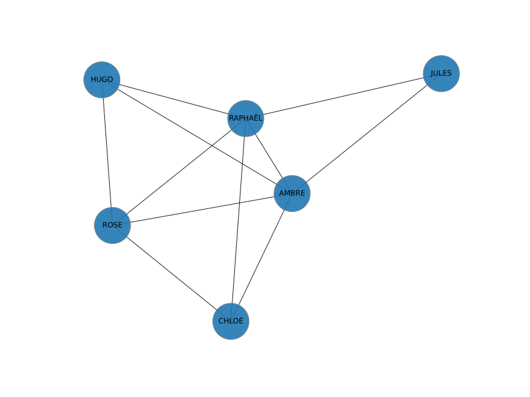

::: programme

+---------------------------------------+--------------------------------------------------------------+
|               Contenus                |                     Capacités attendues                      |
+=======================================+==============================================================+
| Identité numérique,                   | Connaître les principaux concepts liés à l’usage des réseaux |
| e-réputation, identification,         | sociaux.                                                     |
| authentification                      |                                                              |
+---------------------------------------+--------------------------------------------------------------+
| Réseaux sociaux existants             | Distinguer plusieurs réseaux sociaux selon leurs             |
|                                       | caractéristiques, y compris un ordre de grandeur de leurs    |
|                                       | nombres d’abonnés.                                           |
|                                       |                                                              |
|                                       | Paramétrer des abonnements pour assurer la confidentialité   |
|                                       | de données personnelles.                                     |
+---------------------------------------+--------------------------------------------------------------+
| Modèle économique des réseaux sociaux | Identifier les sources de revenus des entreprises de         |
|                                       | réseautage social.                                           |
+---------------------------------------+--------------------------------------------------------------+
| Rayon, diamètre et centre             | Déterminer ces caractéristiques sur des graphes simples.     |
| d’un graphe                           |                                                              |
|                                       |                                                              |
| Notion de « petit monde »             | Décrire comment l’information présentée par les réseaux      |
|                                       | sociaux est conditionnée par le choix préalable de ses amis. |
| Expérience de Milgram                 |                                                              |
+---------------------------------------+--------------------------------------------------------------+
|                                       | Connaître les dispositions de l’article 222-33-2-2 du code   |
| Cyberviolence                         | pénal.                                                       |
|                                       |                                                              |
|                                       | Connaître les différentes formes de cyberviolence            |
|                                       | (harcèlement, discrimination, sexting...) et les ressources  |
|                                       | disponibles pour lutter contre la cyberviolence.             |
|                                       |                                                              |
+---------------------------------------+--------------------------------------------------------------+

:::

> Les réseaux sociaux sont des applications basées sur les technologies du _Web_ qui offrent un
> service de mise en relation d’internautes pour ainsi développer des communautés d’intérêts.

`youtube: aA_NZdasOg4`

::: appli

[Évaluation diagnostique PP126-127](https://lienmini.fr/3389-602).

:::

## Identité numérique

Lorsqu'on utilise un réseau social, celui-ci nous demande de créer un compte pour nous
**identifier**.

À chaque interaction avec le réseau, nous devons nous **authentifier** grâce à un mot de passe par
exemple.

Vous obtenez alors une identité numérique qui permet d'associer une personne physique ou morale avec un compte de réseau social.

:::: examples

-  [@POTUS](https://twitter.com/potus): le président des états-unis.
-  [@taylorswift13](https://twitter.com/taylorswift13): ...
-  [@Cristiano](https://twitter.com/cristiano): ...

Voir cet [article](https://en.wikipedia.org/wiki/List_of_most-followed_Twitter_accounts) pour une
liste à jour des personnes les plus suivies sur twitter.

:::

Lorsque nous sommes identifiés, nous laissons des traces sur le web qui vont façonner notre
_cyber-réputation_.

Cyber-réputation

: Réputation d'une entité (personne physique ou morale, marque, produit) en fonction des traces la
concernant, trouvables sur le Web.

## Graphe social

<wc-wikimage class="center" title="Social_graph.gif" caption="Pour représenter les liens entre les personnes présentes sur un réseau social, on utilise couramment des graphes."></wc-wikimage>

### Vocabulaire

Dans un graphe social, on représente:

- les personnes par des ronds: les _sommets_, 
- leurs relations par des traits: les _arêtes_.

### Représentations des liens entre personnes

Un graphe peut-être décrit par un tableau dans lequel on va porter les relations d'amitié entre les
personnes.

+---------+-------+------+-------+---------+------+-------+
|         | Jules | Hugo | Ambre | Raphaël | Rose | Chloé |
+---------+-------+------+-------+---------+------+-------+
| Jules   |       |      |       |         |      |       |
+---------+-------+------+-------+---------+------+-------+
| Hugo    |       |      |       |         |      |       |
+---------+-------+------+-------+---------+------+-------+
| Ambre   |       |      |       |         |      |       |
+---------+-------+------+-------+---------+------+-------+
| Raphaël |       |      |       |         |      |       |
+---------+-------+------+-------+---------+------+-------+
| Rose    |       |      |       |         |      |       |
+---------+-------+------+-------+---------+------+-------+
| Chloé   |       |      |       |         |      |       |
+---------+-------+------+-------+---------+------+-------+

### Rayon, diamètre et centre d'un graphe

Pour mesurer les caractéristiques d'un graphe, on mesure les distances entre les nœuds.

La **distance** entre deux sommets dans un graphe est définie par la longueur d'un plus court chemin
entre ces deux sommets.

Il peut être commode de remplir un tableau de distances pour caractériser le graphe.

+----------+-------+------+-------+---------+------+-------+
| distance | Jules | Hugo | Ambre | Raphaël | Rose | Chloé |
+----------+-------+------+-------+---------+------+-------+
| Jules    | 0     |      |       |         |      |       |
+----------+-------+------+-------+---------+------+-------+
| Hugo     |       | 0    |       |         |      |       |
+----------+-------+------+-------+---------+------+-------+
| Ambre    |       |      | 0     |         |      |       |
+----------+-------+------+-------+---------+------+-------+
| Raphaël  |       |      |       | 0       |      |       |
+----------+-------+------+-------+---------+------+-------+
| Rose     |       |      |       |         | 0    |       |
+----------+-------+------+-------+---------+------+-------+
| Chloé    |       |      |       |         |      | 0     |
+----------+-------+------+-------+---------+------+-------+

diamètre

:   La **plus grande distance** possible qui puisse exister _entre deux de ses sommets_.

rayon

:   La **plus petite distance** à laquelle puisse se trouver un sommet de _tous les autres_.

centre

:   Le ou les **nœuds** distants d'au maximum un **rayon** des autres.

Pour déterminer ces caractéristiques on mesure la distance maximale de chaque nœud aux autres (on
parle d'excentricité).

+----------------+-------+------+-------+---------+------+-------+
| distance       | Jules | Hugo | Ambre | Raphaël | Rose | Chloé |
+----------------+-------+------+-------+---------+------+-------+
| distance       |       |      |       |         |      |       |
| maximale       |       |      |       |         |      |       |
| (excentricité) |       |      |       |         |      |       |
+----------------+-------+------+-------+---------+------+-------+

::: appli

Déterminer le rayon, le diamètre et le centre du graphe précédent.

:::

## Les petits mondes

Sur les réseaux sociaux actuels, _3,5 personnes en moyenne_ séparent deux personnes choisies au
hasard. On est donc effectivement _connecté au monde entier_.

<wc-wikimage title="Sna_large.png" caption="Des petits mondes qui communiquent peu entre eux!"></wc-wikimage>

Cependant, de par la conception des _algorithmes de recommandations_, ces réseaux nous présentent
souvent des contenus de personnes qui nous ressemblent et qui pensent comme nous ce qui «
étonnamment » nous empêche d'être au contact des autres et de leurs différences. **On reste dans
notre petit monde**.
