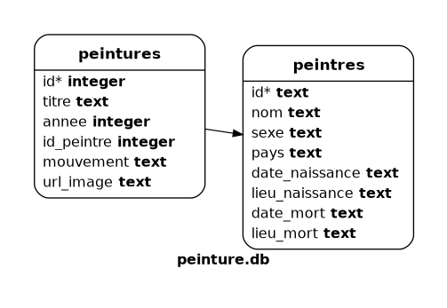

::: programme

+--------------------------+-------------------------------------+------------------------------------+
|         Contenus         |         Capacités attendues         |            Commentaires            |
+==========================+=====================================+====================================+
| Langage SQL :            | Identifier les composants d’une     | On peut utiliser `DISTINCT`,       |
| requêtes d’interrogation | requête.                            | `ORDER BY` ou les fonctions        |
| et de mise à jour d’une  |                                     | d’agrégation sans utiliser les     |
| base de données.         | Construire des requêtes             | clauses `GROUP BY` et `HAVING`.    |
|                          | d’interrogation à l’aide des        |                                    |
|                          | clauses du langage SQL :            |                                    |
|                          | `SELECT`, `FROM`, `WHERE`, `JOIN`.  |                                    |
|                          |                                     |                                    |
|                          | Construire des requêtes             |                                    |
|                          | d’insertion et de mise à jour à     |                                    |
|                          | l’aide de : `UPDATE`, `INSERT`,     |                                    |
|                          | `DELETE`.                           |                                    |
+--------------------------+-------------------------------------+------------------------------------+

:::

<!-- A VOIR https://fr.wikipedia.org/wiki/Alg%C3%A8bre_relationnelle pour les fondements algébriques du sql 

-->
::: intro

<wc-wikimage class="half right" title="SQL_Joins.svg"></wc-wikimage>

> Maintenant que nous avons vu comment étaient organisées les bases de données, et comment elles
> étaient maintenues conformes, nous allons interagir avec elles en utilisant le langage
> `SQL`(_Structured Query Language_) pour interroger ou écrire dans une base de données.

:::


Dans ce cours, nous allons utiliser le SGBD `sqlite3` qui permet de stocker des petites bases de
données dans des fichiers.

Il existe de nombreuses façons d'écrire des requêtes SQL avec une base de données `sqlite`:

- En interface graphique avec [sqlitebrowser](https://sqlitebrowser.org/),
- En console, en lançant: `sqlite3 nom_de_ma_bdd.db`.
- Dans le navigateur grâce à [`sql.js`](https://github.com/sql-js/sql.js) voir
  https://apps.lyceum.fr/sqlite par exemple.
- Via un langage de programmation comme Python grâce au module
  [`sqlite3`](https://docs.python.org/3/library/sqlite3.html)

Pour illustrer ce cours, nous allons étudier des données situées dans la base de données peinture
de la page https://apps.lyceum.fr/sqlite.

## Le langage SQL

Les instructions SQL s'écrivent d'une manière qui ressemble à celle de phrases ordinaires en
anglais. C'est un langage **déclaratif**, c'est-à-dire qu'il permet de décrire le résultat escompté,
sans décrire la manière de l'obtenir.

Le langage `SQL` n'est pas sensible à la casse, mais a l'_habitude d'écrire les instructions en
majuscules_, on peut écrire les instructions sur plusieurs lignes avec ou sans indentation et
chaque instruction doit être terminée par un _point-virgule_.

Nous verrons cette année les instructions de manipulation du contenu de la base de données qui
commencent par les mots clés:

- `SELECT`: recherche de contenu;
- `UPDATE`: modification,
- `INSERT`: ajout,
- `DELETE` suppression.


::: example

Étudions dans la console les tables contenues dans la base de données `peintures`.

Dont le schéma est le suivant:



Ouvrir la page https://apps.lyceum.fr/sqlite puis sélectionner la base de données `peinture`.


Maintenant dans l'éditeur `sql`, on peut interagir avec la bdd, par exemple en affichant tous les
peintres de la table `peintres`.

```sql
SELECT peintre FROM peintres;
```

Pour exécuter une commande `sql`, vous pouvez utiliser `CTRL+Entrée`.

:::

## Construire des requêtes d'interrogation

Pour afficher tous les enregistrements d'une table on utilise:

```sql
SELECT * FROM tablename;
```


::: examples

On va commencer par afficher toutes les entrées de:

- La table `peintres`: `SELECT * FROM peintres;`,
- puis `peintures`: `SELECT * FROM peintures;`.

On peut limiter le nombre de lignes affichées avec `LIMIT`, par exemple pour n'afficher que trois
enregistrements de la sélection: `SELECT * FROM peintres LIMIT 3;`,

:::

### Choisir les colonnes à afficher avec `SELECT`

```sql
SELECT col1, col2 FROM tablename;
```

::: example

On va récupérer le nom et le sexe du peintre:

```sql
SELECT nom, sexe FROM peintres;
```
:::

### Restreindre les lignes avec `WHERE`

On sélectionne les tableaux peints en 1503.

```sql
SELECT * FROM peintures WHERE annee="1503";
```

### Jointure de deux tables avec `JOIN`

Dans cette base de données, les informations sur les peintres et sur les peintures ont été
séparées, ce qui est bien pour éviter la redondance et les risques d'anomalies.

::: prop

La jointure permet d'utiliser les clés secondaires pour aller rechercher les données d'une autre
table grâce à la clé étrangère.

:::

```sql
SELECT colonne1, colonne2 FROM table1
JOIN table2 ON table1.attribut = table2.attribut
```

::: example

Par exemple, la requête: `SELECT * FROM peintures WHERE titre="La Joconde";`

renvoie:

```
12418|La Joconde|1503|762|Haute Renaissance|http://commons.wikimedia.org/wiki/Special:FilePath/Mona%20Lisa%2C%20by%20Leonardo%20da%20Vinci%2C%20from%20C2RMF%20retouched.jpg
```

Ainsi le peintre est identifié par son id `762`, c'est bien pour la base de données, mais pas pour
l'utilisateur qui veut connaitre le nom du peintre.

Il va falloir aller chercher cette information dans la deuxième table: `peintres` et faire une
jointure pour afficher toutes les informations souhaitées.

```sql
SELECT titre, annee, peintre, pays, date_naissance, date_mort FROM peintures 
JOIN peintres ON peintures.id_peintre=peintres.id WHERE titre="La Joconde";
```

Qui renvoie:

```
La Joconde	|	1503	|	Léonard de Vinci	|	République florentine	|	1452-04-24T00:00:00Z	|	1519-05-12T00:00:00Z
```

Comme vous le voyez il est possible ou nécessaire de préciser d'où vient la colonne sélectionnée
avec une notation pointée comme: `peintures.id` de la forme `nom_de_la_table.nom_de_la_colonne`

:::

### Les clauses `DISTINCT` `ORDER BY` et `GROUP BY`

Voici deux instructions supplémentaires qui peuvent être utiles:

- `DISTINCT`: Ne pas renvoyer les doublons.

  ```sql
  SELECT DISTINCT ma_colonne
  FROM nom_du_tableau;
  ```

  ::: example
  
  De nombreux peintres proviennent du même pays. Ainsi la requête suivante va renvoyer des doublons.
  
  ```sql
  SELECT pays FROM peintres;
  ```

  On ajoute `DISTINCT` pour n'afficher que des valeurs distinctes.

  ```sql
  SELECT DISTINCT pays FROM peintres;
  ```
  
  :::


Cette requête sélectionne le champ `ma_colonne` de la table `nom_du_tableau` en évitant de
retourner des doublons.

- `ORDER BY`: Permet d'ordonner les résultats selon la colonne de votre choix.

  ```sql
  SELECT colonne1, colonne2
  FROM table
  ORDER BY colonne1 [ASC|DESC];
  ```

  Cette requête sélectionne les champs `colonne1` et `colonne2` de la table `table` et classe la
  sélection par ordre croissant sur la `colonne1`.

  ::: example
  
  On classe les tableaux par date croissante.
  
  ```sql
  SELECT titre, annee
  FROM peintures
  ORDER BY annee;
  ```

  On ajoute `DISTINCT` pour n'afficher que des valeurs distinctes.

  ```sql
  SELECT DISTINCT pays FROM peintres;
  ```
  
  :::

- `GROUP BY`: grouper plusieurs résultats et utiliser une fonction d'agrégation (`SUM`, `AVG`,
  `COUNT`, `MAX`, `MIN`) sur un groupe de résultat.

  ```sql
  SELECT colonne1, colonne2
  FROM table
  GROUP BY colonne1;
  ```

  ::: example
  
  On regroupe les peintres par pays en comptant le nombre de peintres par pays.
  
  ```sql
  SELECT pays, COUNT(pays) FROM peintres
  GROUP BY pays
  ORDER BY COUNT(pays) DESC;
  ```
  :::


## Construire des requêtes d'insertion et de mise à jour

### Ajouter des entrées avec `INSERT`

Grâce au SQL, nous pouvons aussi ajouter des informations dans une table avec la commande `INSERT
INTO`. Pour ce faire, il faut indiquer la table dans laquelle on souhaite intégrer une ligne ainsi
que la liste des champs pour lesquels on spécifie une valeur, et enfin la liste des valeurs
correspondantes.

```sql
INSERT INTO table1 VALUES
(val1, val2 ..., valN)
```

:::example

Ajout d'un tableau La Joconde 2.

```sql
INSERT INTO peintures VALUES
(124181, "La Joconde 2 Le retour", 1504, 762, "Haute Renaissance", NULL);
```
:::

### Mettre à jour des informations avec `UPDATE`

On peut modifier certains champs d'enregistrements existants grâce au mot-clé `UPDATE` : cette
instruction permet de mettre à jour plusieurs champs de plusieurs enregistrements d'une table, à
partir des expressions qui lui sont fournies.

```sql
UPDATE table1 SET col1=val1
WHERE coli="valeur";
```

::: example

Mise à jour de la Joconde 2.

```sql
UPDATE peintures SET annee=1505  WHERE id=124181;
```
On peut vérifier la mise à jour avec: `SELECT * FROM peintures WHERE id=124181;`
:::

### Supprimer des entrées avec `DELETE`

Il se peut que l'on soit amené à supprimer un ou plusieurs enregistrements d'une table, il existe
pour cela l'instruction `DELETE FROM`.

```sql
DELETE FROM table1
WHERE coli="valeur";
```
::: example

On va supprimer la Joconde 2.

```sql
DELETE FROM peintures WHERE id=124181;
```

On peut vérifier la suppression avec: `SELECT * FROM peintures WHERE id=124181;`

:::

::: ref

- [Cours OpenClassRoom de Thomas Martinet sous licence
  CC-BY-NC-SA](https://openclassrooms.com/fr/courses/993975-apprenez-a-programmer-en-vb-net/992711-introduction-au-langage-sql)

:::