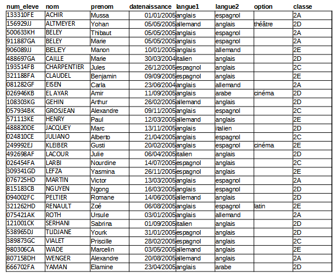

## TP du Cnam sur les requêtes `sql`

Un TP en ligne avec correction est proposé par le CNAM et vous permet de vous entraîner sur 4 jeux
de données: <http://deptfod.cnam.fr/bd/tp>.

La base de données `films` a été importée sur https://apps.lyceum.fr/sqlite.

## Enquête en ligne (et en anglais)

Résolvez l'enquête du meurtre de SQL City. Pour accéder à cette enquête, il existe diverses
possibilités:

- Version interactive en `html`: <http://mystery.knightlab.com>
- Fichiers dont la base de données sqlite sur github: <https://github.com/NUKnightLab/sql-mysteries>
- Version interactive sur repl.it: <https://repl.it/@ToniScullion1/Silver-TASK-2-SQL-Murder-Mystery#actvity.md>

## Mini-projet: application web avec base de données `sqlite`

Le dépôt git suivant contient une mini-application web utilisant python pour accéder aux données
d'une base de données `sqlite`.

<https://framagit.org/lyceum/flask-sqlite>

Par **groupe de 2 ou 3**, développez l'ébauche d'application proposée pour qu'elle utilise des
_données intéressantes_ de votre choix mais non personnelles.

Outre le changement de données, vous pourrez:

- utiliser plusieurs relations dans votre base de données, et les joindre dans vos requêtes.
- proposer plusieurs pages `html` pour la visualisation de données différentes, leur édition...

## Exercice type BAC

> Cet exercice est issu du sujet zéro.


L’énoncé de cet exercice utilise les mots du langage `SQL` suivant :

`SELECT`, `FROM`, `WHERE`, `JOIN`, `INSERT INTO`, `VALUES`, `COUNT`, `ORDER BY`.

Dans un lycée imaginaire, les données relatives aux élèves de secondes sont
regroupées dans un fichier nommé `seconde_lyc.csv`. Un extrait de son contenu
est représenté figure 1.


 

Pour les besoins de l’organisation du lycée, le chef d’établissement exploite la
base de données par des requêtes en langage `SQL`. Il a pour cela créé une table
(ou relation) `SQL` dénommée `seconde` dans son système de gestion de bases de
données dont la structure est la suivante :

```
+--------------------------+
| seconde                  |
+==========================+
| num_eleve(clef primaire) |
+--------------------------+
| langue1                  |
+--------------------------+
| langue2                  |
+--------------------------+
| option                   |
+--------------------------+
| classe                   |
+--------------------------+
```

L’attribut `num_eleve` est un entier, les autres sont des chaines de caractère (le type `CHAR`).

1. &nbsp;

   1. Dans le modèle relationnel, quel est l’intérêt de l’attribut `num_eleve`.
   
   2. Écrire une requête SQL d’insertion permettant d’enregistrer l’élève
      `ACHIR Mussa` dans la table seconde. Les informations relatives à cet élève
      sont données dans la ligne 1 du fichier `seconde_lyc.csv`.
   
   3. Lors de l’insertion de l’élève `ALTMEYER Yohan` (ligne 2 du fichier
      `seconde_lyc.csv`), une erreur de saisie a été commise sur la première
      langue, qui devrait être allemand. Écrire une requête SQL de mise à jour
      corrigeant les données de cet élève.

2. On suppose maintenant que la table seconde contient les informations issues
   de la figure 1 (ni plus, ni moins, même si la figure 1 n’est qu’un extrait du
   fichier `seconde_lyc.csv`).

   1. Quel est le résultat de la requête suivante?
      
      ```sql
      SELECT num_eleve FROM seconde;
      ```
   
   2. On rappelle qu’en `SQL`, la fonction d’agrégation `COUNT()` permet de compter
      le nombre d’enregistrements dans une table. Quel est le résultat de la
      requête suivante?
      
      ```sql
      SELECT COUNT(num_eleve) FROM seconde;
      ```
   
   3. Écrire la requête permettant de connaître le nombre d’élèves qui font
      allemand en `langue1` ou `langue2`.
   
3. Le chef d’établissement souhaite faire évoluer la structure de sa base de
   données. Pour ce faire, il créé une nouvelle table eleve dont la structure
   est la suivante:
   
   ```
   +-------------------------------------+
   | eleve                               |
   +=====================================+
   | num_eleve (clef primaire,           |
   +-------------------------------------+
   | clef étrangère de la table seconde) |
   +-------------------------------------+
   | nom                                 |
   +-------------------------------------+
   | prenom                              |
   +-------------------------------------+
   | datenaissance                       |
   +-------------------------------------+
   ```

 Là encore, l’attribut `num_eleve` est un entier, les autres sont des chaines de
 caractère (le type `CHAR`).

1. Expliquer ce qu’apporte l’information `clef étrangère` pour l’attribut
   `num_eleve` de cette table en termes d’intégrité et de cohérence.

2. On suppose la table `eleve` correctement créée et complétée. Le chef
   d’établissement aimerait lister les élèves (nom, prénom, date de naissance)
   de la classe `2A`.
   
   Écrire la commande qui permet d’établir cette liste à l’aide d’une jointure
   entre `eleve` et `seconde`.

4. Proposer la structure d’une table `coordonnees` dans laquelle on pourra
   indiquer, pour chaque élève, son adresse, son code postal, sa ville, son
   adresse mail. Préciser la clef primaire et/ou la clé étrangère en vue de la
   mise en relation avec les autres tables.
