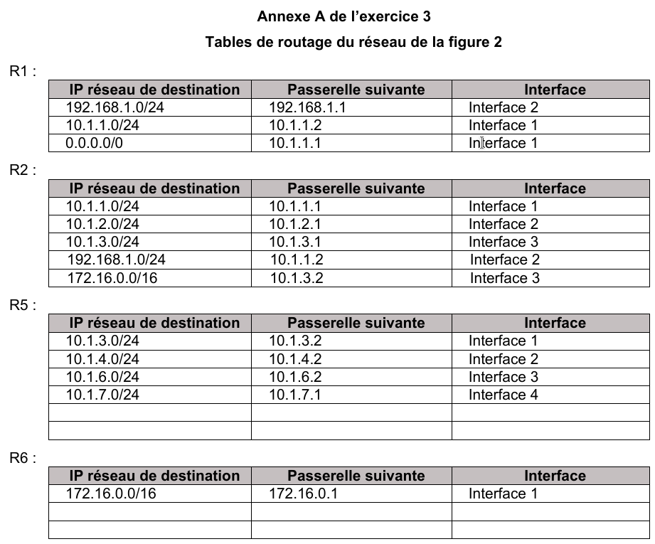

## Exercice type BAC

> Cet exercice est l'exercice 3 du sujet 2 métropole 2021.

La figure 1 ci-dessus représente le schéma d’un réseau d’entreprise. Il y figure deux réseaux
locaux L1 et L2. Ces deux réseaux locaux sont interconnectés par les routeurs R2, R3, R4 et R5. Le
réseau local L1 est constitué des PC portables P1 et P2 connectés à la passerelle R1 par le switch
Sw1. Les serveurs S1 et S2 sont connectés à la passerelle R6 par le switch Sw2.

Le tableau 1 suivant indique les adresses IPv4 des machines constituant le réseau de l’entreprise.

+-----+----------------------+------------------------------+
| Nom |         Type         |         Adresse IPv4         |
+=====+======================+==============================+
| R1  | routeur(passerelle)  | Interface 1 : 192.168.1.1/24 |
|     |                      | Interface 2 : 10.1.1.2/24    |
+-----+----------------------+------------------------------+
| R2  | routeur              | Interface 1 : 10.1.1.1/24    |
|     |                      | Interface 2 : 10.1.2.1/24    |
|     |                      | Interface 3 : 10.1.3.1/24    |
+-----+----------------------+------------------------------+
| R3  | routeur              | Interface 1 : 10.1.2.2/24    |
|     |                      | Interface 2 : 10.1.4.2/24    |
|     |                      | Interface 3 : 10.1.5.2/24    |
+-----+----------------------+------------------------------+
| R4  | routeur              | Interface 1 : 10.1.2.2/24    |
|     |                      | Interface 2 : 10.1.4.2/24    |
+-----+----------------------+------------------------------+
| R5  | routeur              | Interface 1 : 10.1.3.2/24    |
|     |                      | Interface 2 : 10.1.4.1/24    |
|     |                      | Interface 3 : 10.1.6.2/24    |
|     |                      | Interface 4 : 10.1.7.1/24    |
+-----+----------------------+------------------------------+
| R6  | routeur (passerelle) | Interface 1 : 172.16.0.1/16  |
|     |                      | Interface 2 : 10.1.7.2/24    |
+-----+----------------------+------------------------------+
| P1  | ordinateur portable  | 192.168.1.40/24              |
+-----+----------------------+------------------------------+
| P2  | ordinateur portable  | 192.168.1.46/24              |
+-----+----------------------+------------------------------+
| S1  | serveur              | 172.16.8.10/16               |
+-----+----------------------+------------------------------+
| S2  | serveur              | 172.16.9.12/16               |
+-----+----------------------+------------------------------+

: adresses IPv4 des machines

**Rappels et notations**

Rappelons qu’une adresse IP est composée de 4 octets, soit 32 bits. Elle est notée X1.X2.X3.X4, où X1, X2, X3 et X4 sont les valeurs des 4 octets. Dans le tableau 1, les valeurs des 4 octets ont été converties en notation décimale.

La notation X1.X2.X3.X4/n signifie que les n premiers bits de poids forts de l’adresse IP représentent la partie « réseau », les bits suivants de poids faibles représentent la partie « machine ».

Toutes les adresses des machines connectées à un réseau local ont la même partie réseau. L’adresse IP dont tous les bits de la partie « machine » sont à 0 est appelée « adresse du réseau ». L’adresse IP dont tous les bits de la partie « machine » sont à 1 est appelée « adresse de diffusion ».

1. &nbsp;
   
   1. Quelles sont les adresses des réseaux locaux L1 et L2?
   
   2. Donner la plus petite et la plus grande adresse IP valides pouvant être attribuées à un
   ordinateur portable ou un serveur sur chacun des réseaux L1 et L2 sachant que l’adresse du
   réseau et l’adresse de diffusion ne peuvent pas être attribuées à une machine.  
   
   3. Combien de machines peut-on connecter au maximum à chacun des réseaux locaux L1 et L2? On
   donne ci-dessous les valeurs de quelques puissances de 2?

      +-------+-------+-------+-------+----------+----------+----------+----------+----------+----------+----------+----------+
      | $2^6$ | $2^7$ | $2^8$ | $2^9$ | $2^{10}$ | $2^{11}$ | $2^{12}$ | $2^{13}$ | $2^{14}$ | $2^{15}$ | $2^{16}$ | $2^{17}$ |
      +=======+=======+=======+=======+==========+==========+==========+==========+==========+==========+==========+==========+
      | 64    | 128   | 256   | 512   | 1024     | 2048     | 4096     | 8192     | 16384    | 32768    | 65536    | 131072   |
      +-------+-------+-------+-------+----------+----------+----------+----------+----------+----------+----------+----------+

2. &nbsp;
   
   1. Expliquer l’utilité d’avoir plusieurs chemins possibles reliant les réseaux L1 et L2.
   
   2. Quel est le chemin le plus court en nombre de sauts pour relier R1 et R6? Donner le nombre de
   sauts de ce chemin et préciser les routeurs utilisés.
   
   3. La bande passante d’une liaison _Ether_ (quantité d’information qui peut être transmise en
   bits/s) est de $10^7$ bits/s et celle d’une liaison _FastEther_ est de $10^8$ bits/s. Le coût
   d’une liaison est défini par $10^8$/d, où $d$ est sa bande passante en bits/s.
   
      +-----------+---------+---------+---------+-----------+-----------+-----------+---------+
      | Liaison   | R1-R2   | R2-R5   | R5-R6   | R2-R3     | R3-R4     | R4-R5     | R3-R5   |
      +===========+=========+=========+=========+===========+===========+===========+=========+
      | Type      | Ether   | Ether   | Ether   | FastEther | FastEther | FastEther | Ether   |
      +-----------+---------+---------+---------+-----------+-----------+-----------+---------+
         
      : Type des liaisons entre les routeurs

      Quel est le chemin reliant R1 et R6 qui a le plus petit coût? Donner le coût de ce chemin et
      préciser les routeurs utilisés.

3. Dans l’annexe **A** figurent les tables de routages des routeurs R1, R2, R5 et R6 au démarrage
   du réseau. Indiquer sur votre copie ce qui doit figurer dans les lignes laissées vides des
   tables de routage des routeurs R5 et R6 pour que les échanges entre les ordinateurs des réseaux
   L1 et L2 se fassent en empruntant le chemin le plus court en nombre de sauts.

   
