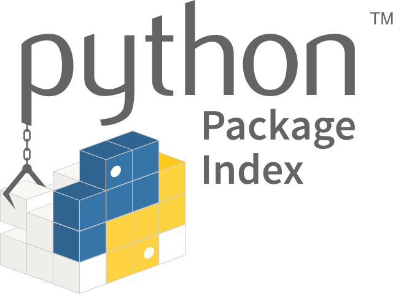

::: programme

+---------------------+----------------------------------+--------------------------------------+
|      Contenus       |       Capacités attendues        |             Commentaires             |
+=====================+==================================+======================================+
| Modularité.         | Utiliser des API (Application    |                                      |
|                     | Programming Interface) ou des    |                                      |
|                     | bibliothèques.                   |                                      |
|                     |                                  |                                      |
|                     | Exploiter leur documentation.    |                                      |
|                     | Créer des modules simples et     |                                      |
|                     | les documenter.                  |                                      |
+---------------------+----------------------------------+--------------------------------------+

:::


::: intro

<!-- TODO utiliser wc-wikimage -->
<figure class="half right">

<figcaption>Pypi le python packaging index permet de publier des modules python open-source pour qu'ils puissent être réutilisés.</figcaption>
</figure>

Jusqu'à maintenant, nous avons toujours programmé au sein d'un seul fichier (ou script). Cependant,
lorsqu'on souhaite rédiger des programmes plus longs, il est souhaitable de séparer le code dans
plusieurs fichiers. Chaque fichier est appelé un module et les définitions d'un module peuvent être
importées dans un autre module grâce au mot-clé `import`.

:::

## Utilisation des modules

Lorsqu'on utilise Python, certaines fonctionnalités sont présentes par défaut, comme les fonctions
`print()` et `round()`.

Par contre, pour certaines fonctionnalités jugées moins «indispensables», il est nécessaire
d'importer des modules de code qui vont permettre de rajouter les fonctionnalités souhaitées.

On a par exemple déjà utilisé les modules `math` ou `random`, nous allons dans cet exemple utiliser
le module [`statistics`](https://docs.python.org/fr:3/library/statistics.html) moins connu ajouté à
partir de la version 3.4 de Python.

```python
# import du module
import statistics
# affiche l'aide
help(statistics)
```

Supposons que l'on souhaite utiliser les fonctions `mean()` moyenne et `stdev()` :écart-type.
Plusieurs solutions s'offrent à nous:

1. Import du module et utilisation de son espace de noms avec une notation pointée(avec un point
   entre le nom du module et le nom de la fonction).

```python
import statistics
notes = [11, 14, 18, 5, 12, 13, 15]
print("Moyenne:", statistics.mean(notes))
print("Écart-type:", statistics.stdev(notes))
```
SORTIE
```
Moyenne: 12.571428571428571
Écart-type: 4.035556254807296
```

On peut aussi renommer l'import avec le mot-clé `as` pour rendre le code plus lisible.

```python
import statistics as stat
notes = [11, 14, 18, 5, 12, 13, 15]
print("Moyenne:", stat.mean(notes))
print("Écart-type:", stat.stdev(notes))
```

2. Vous pouvez également n'importer que les fonctions dont vous avez besoin.

```python
from statistics import mean, stdev
notes = [11, 14, 18, 5, 12, 13, 15]
print("Moyenne:", mean(notes))
print("Écart-type:", stdev(notes))
```

3. Une autre méthode cependant **déconseillée** en raison de la pollution de l'espace des noms(de
   variables) est l'utilisation du `*` (_wildcard_, joker en anglais).

```python
from statistics import *
# Toutes les objets du module sont disponibles sans notation pointée
notes = [11, 14, 18, 5, 12, 13, 15]
print("Moyenne:", mean(notes))
print("Écart-type:", stdev(notes))
```

::: plus

Python possède de très nombreux modules implémentés directement par l'équipe de développement de
Python, c'est ce qu'on appelle la
[bibliothèque standard](https://docs.python.org/fr/3/library/index.html):

- `datetime`: Types de base pour la date et l'heure
- `random`: Génère des nombres pseudo-aléatoires
- `zipfile`: Travailler avec des archives ZIP
- ...

La liste est longue et ne cesse de s'allonger à chaque version de Python en fonction des demandes
des utilisateurs.

Si cependant vous ne trouvez pas votre bonheur dans la bibliothèque standard, python possède une
communauté open-source importante qui propose des modules (et packages: ensembles de modules) sur
[Pypi](https://pypi.org/), on trouvera parmi les milliers de projets certains noatbles:

- `pandas` pour la manipulation de données.
- `django` pour créer des applications web.
- `numpy` pour la manipulation de matrices ou tableaux multidimensionnels.
- `scipy` pour les applications scientifiques.
- ...

Si vous ne trouvez pas votre bonheur parmi ces packages vous devrez l'écrire!

:::


## Notre premier module

Nous allons créer un premier module dans un fichier `fibo.py` qui permet générer les nombres de la
suite de Fibonacci.

La suite de Fibonacci est une suite de nombres entiers définie par récurrence.

Les deux premiers termes sont 0 et 1, puis un terme est la somme des deux termes précédents.

On obtient ainsi les nombres dits de Fibonacci: 0, 1, 1, 2, 3, 5, 8, 13, 21...

La définition mathématique est:

$$
f_0 = 0; f_1 = 1; f_n = f_{n-1} + f_{n-2} \text{ pour n > 1}
$$


```python
# Module sur les nombres de Fibonacci

def fib(n):    # affiche les nombres de Fibonacci jusqu'à n
    a, b = 0, 1
    while a < n:
        print(a, end=' ')
        a, b = b, a+b
    print()

def fib2(n):   # renvoie la liste des nombres de Fibonacci jusqu'à n
    result = []
    a, b = 0, 1
    while a < n:
        result.append(a)
        a, b = b, a+b
    return result
```

Si le module est correctement installé ou tout simplement présent dans le même dossier que celui ou
vous exécutez python (_cwd_: Current Working Directory_).

On importe le module sous le nom `fibo` en python, l'extension ne doit pas être précisée.

Les imports fonctionnent comme d'habitude.

- Soit en important le module directement et en utilisant des notations pointées;

   ```python
   import fibo
   fibo.fib(1000)
   # affiche 0 1 1 2 3 5 8 13 21 34 55 89 144 233 377 610 987
   fibo.fib2(100)
   # renvoie [0, 1, 1, 2, 3, 5, 8, 13, 21, 34, 55, 89]
   ```

- soit en important spécifiquement des fonctions pour pouvoir les utiliser sans rappeler le module
  d'origine.

   ```python
   from fibo import fib, fib2
   fib(1000)
   # affiche 0 1 1 2 3 5 8 13 21 34 55 89 144 233 377 610 987
   fib2(100)
   # renvoie [0, 1, 1, 2, 3, 5, 8, 13, 21, 34, 55, 89]
   ```

## Documentation et commentaires

Nous avons déjà vu en
[première](/1g/nsi/7-langages-et-programmation/6-fonctions/#prototyper-une-fonction)
comment _prototyper_ des fonctions pour décrire le rôle de la fonction, le type des paramètres et
le type de la valeur de retour. C'est ce que l'on appelle une `docstring`.

Les `docstring`s sont utilisées pour afficher les documentations en ligne ou directement dans
Python avec la fonction `help()`

Pour documenter un module, il suffit de créer la `docstring` au début du fichier en utilisant les
chaines de caractères multilignes délimitées par `"""`, pour une lecture aisée on limite souvent le
nombre de caractères par ligne à 80(ou 100 suivant les projets).

Si on prend l'exemple précédent on pourrait le documenter avec une description générale au début du
module ainsi qu'une liste des fonctions, et en pensant à documenter également les fonctions bien
sûr.

Les fonctions ont également été renommées pour être plus explicites:

- `fib`: `fib_print`
- `fib2`: `fib_to_array`

```python
""" Module fibo relatif à la création de nombres de Fibionacci

Pour rappel, la suite de Fibonacci est une suite d'entiers dans laquelle chaque terme est la somme 
des deux termes qui le précèdent.(voir: https://fr.wikipedia.org/wiki/Suite_de_Fibonacci)

Ce module présente deux fonctions:

- fib_print: affiche les nombres de Fibionacci
- fib_to_array: renvoie la liste des nombres de Fibionacci

"""

def fib_print(n):
    """Affiche les nombres de Fibionacci

    Arguments
    ---------
    n: int
        dernier rang de la suite de Fibonacci affiché
    """
    a, b = 0, 1
    while a < n:
        print(a, end=' ')
        a, b = b, a+b
    print()

def fib_to_array(n):
    """Renvoie la liste des nombres de Fibionacci

    Arguments
    ---------
    n: int
        dernier rang de la suite de Fibonacci renvoyé dans la liste
    
    Returns
    -------
    list
        La liste des nombres de Fibionnaci jusqu'au rang n
    """
    result = []
    a, b = 0, 1
    while a < n:
        result.append(a)
        a, b = b, a+b
    return result
```

::: {.plus titre="Documentation et commentaires"}

Attention à bien distinguer:

- La documentation qui est destinée aux utilisateurs du programme.
- Les commentaires qui sont destinés aux programmeurs lisant le code.

:::

<!-- ## Documentation

Il est important de bien distinguer commenter et documenter.

- les _commentaires_ sont destinés au programmeur, pour expliquer ce que l'on a fait, pourquoi on
  l'a fait.

::: example

Dans un tri, on pourrait trouver le code suivant.

```python
# on part du deuxième élément car il est déjà trié
for i in range(1, len(tab)):
    ...
```

Le commentaire explique ce que l'on a fait, et évite de revenir en arrière si quelqu'un ne comprend
pas pourquoi on est parti de l'indice 1.

:::

- la _documentation_ est destinée aux utilisateurs, elle leur permet d'expliquer comment on utilise
  le programme du point de vue de l'utilisateur et non du programmeur.

En Python, la documentation se fait par l'écriture de
[Docstring](https://www.python.org/dev/peps/pep-0257/)s.

Docstring

:   Une docstring est une chaîne de caractère écrite en tant que première instruction dans une
    définition de module, fonction, classe ou méthode. Une telle docstring devient l'attribut spécial
    `__doc__` de cet objet, et pourra être affichée grâce à la fonction `help()`.

::: example

On peut accéder à la Docstring de la fonction `est_pair` écrite précédemment comme ceci.

```python
help(est_pair)
```
 
Affiche :

```
Help on function est_pair in module __main__:

est_pair(n)
    Indique si un nombre est pair ou non
    
    Paramètres
    ----------
    n: int
    
    Returns
    -------
    bool
        True si n est pair, False sinon
```
::: -->


## Annotations de types

Depuis la version 3.5, Python propose des
[annotations de types](https://docs.python.org/fr/3/library/typing.html) dans les fonctions.

::: example

```python
def dit_bonjour(nom: str) -> str:
    return 'Bonjour ' + nom
```

Cette fonction prend en paramètre un nom de type chaîne de caractères `str` et renvoie également
une chaine de caractères `str`.

:::

On peut ainsi rendre plus compacte la documentation de nos fonctions.

::: appli 

Proposer des annotations de type pour nos deux fonctions du module `fibo`.

:::

## API (_Application Programming Interface_)

Lorsqu'un projet grandit, il y a de plus en plus de personnes qui doivent travailler dessus et
l'utiliser et il devient de plus en plus complexe à comprendre. C'est pour cela qu'une bonne
documentation est indispensable, mais aussi une bonne organisation du code afin de le rendre plus
facile à utiliser.

Il conviendra de bien organiser les divers modules et fonctions accessibles, ce qu'on appelle
l'API.

La liste des fonctions disponibles dans l'API est disponible avec la fonction `dir()`.

::: example

```python
import math
dir(math)
```

SORTIE
```
['__doc__', '__file__', '__loader__', '__name__', '__package__', '__spec__', 'acos', 'acosh', 'asin', 'asinh', 'atan', 'atan2', 'atanh', 'ceil', 'comb', 'copysign', 'cos', 'cosh', 'degrees', 'dist', 'e', 'erf', 'erfc', 'exp', 'expm1', 'fabs', 'factorial', 'floor', 'fmod', 'frexp', 'fsum', 'gamma', 'gcd', 'hypot', 'inf', 'isclose', 'isfinite', 'isinf', 'isnan', 'isqrt', 'lcm', 'ldexp', 'lgamma', 'log', 'log10', 'log1p', 'log2', 'modf', 'nan', 'nextafter', 'perm', 'pi', 'pow', 'prod', 'radians', 'remainder', 'sin', 'sinh', 'sqrt', 'tan', 'tanh', 'tau', 'trunc', 'ulp']
```

:::

::: {.plus titre="Fonctions privées"}

On définit parfois certaines fonctions juste pour pouvoir développer notre module, ces fonctions ne
sont pas destinées à être utilisées par les utilisateurs de notre module, elles sont dites
_privées_.

Python permet de «cacher» ces fonctions de l'API, pour cela il faut que leur nom commence par un
tiret bas `_`.

```python
def _privée():
    print("Je suis cachée et n'apparait pas dans la documentation")
```

**Attention**, la fonction reste accessible malgré tout, elle n'est juste pas documentée ni
importée lors des imports avec le jocker: `from module import *`

:::

::: appli

On peut prendre l'exemple de la bibliothèque open-source
[`sklearn`](https://github.com/scikit-learn/scikit-learn) connue pour la qualité de son code, de
son API et de sa documentation.

https://scikit-learn.org/stable/modules/classes.html

Utiliser la documentation de sklearn pour implémenter la recherche des k-plus proches voisins vue
en classe première en utilisant le jeu de données sur les joueurs du top-14
[ici](https://framagit.org/eduinfo/binder-notebooks/-/blob/main/kplusproches/joueurs-top14-edit.csv).

:::

  
::: ref

- [Documentation python sur les modules](https://docs.python.org/fr/3/tutorial/modules.html)
- [A Guide to NumPy/SciPy Documentation](https://numpy.org/devdocs/docs/howto_document.html)

:::

