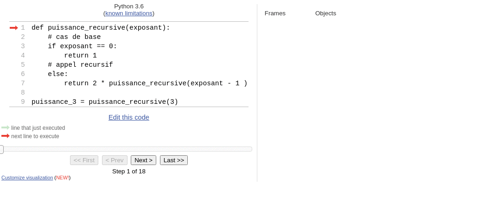

::: programme

+---------------------+----------------------------------+--------------------------------------+
|      Contenus       |       Capacités attendues        |             Commentaires             |
+=====================+==================================+======================================+
| Récursivité.        | Écrire un programme récursif.    | Des exemples relevant de             |
|                     |                                  | domaines variés sont à privilégier.  |
|                     | Analyser le fonctionnement d’un  |                                      |
|                     | programme récursif.              |                                      |
+---------------------+----------------------------------+--------------------------------------+

:::

::: intro
<wc-wikimage class="half right" title="34*21-FibonacciBlocks.png" caption="Les nombres de la suite de Fibonnacci sont un exemple souvent utilisé pour illustrer l'utilisation des fonctions récursives."></wc-wikimage>

Dans ce chapitre, nous allons voir comment utiliser des fonctions _récursives_, des fonctions qui
s'appellent elles-mêmes. Ce type de fonction peut avantageusement remplacer la boucle pour écrire
des programmes courts et élégants. Ce type de construction est notamment utilisée en
**[programmation fonctionnelle](../5-paradigmes-de-programmation)**, un paradigme de programmation
centrée sur les fonctions.

:::

## Définition et exemple

Fonction récursive

:   Une fonction récursive est une fonction qui s'appelle elle-même dans sa définition.


Commençons par un exemple pour clarifier un peu les choses.

Vous voulez demander à un utilisateur une entrée par exemple son âge, et vous voulez vous
assurer que l'utilisateur vous donne bien une valeur entière positive.

On peut implémenter cela avec une boucle `while`.

```python
age = None
while not(age):
    age = int(input("Quel âge avez-vous?"))
    if age > 0:
        print("Merci pour votre réponse)
    # on affecte None à age pour relancer un tour de boucle
    print("L'age doit être un entier positif")
    age = None
        
```

Mais il est aussi tout à fait possible d'utiliser une fonction récursive comme ceci:

```python
def quel_age():
    age = int(input("Quel âge avez-vous?"))
    if age > 0:
        return age
    # L'age n'est pas positif, il faut recommencer
    print("L'age doit être un entier positif")
    # on fait l'appel récursif pour reposer la question
    quel_age()

age = quel_age() # appel de la fonction et assignation de la valeur retournée à la variable age
```

Comme vous le voyez cette fonction continuera de s'appeler _tant que_ nécessaire. On a donc bien
remplacé la boucle avec cette fonction.

::: {.appli titre="Gestion des exceptions"}

Ce code ne traite que le problème du signe, si on voulait être complet il faudrait gérer les
problèmes de type(`str`, `float`...) avec les structures `try except`.

Vous pouvez l'implémenter en guise d'exercice.

:::

## Comment définir une fonction récursive?

Pour écrire une fonction récursive il faut:

- Traiter attentivement le _cas récursif_ du passage des valeurs renvoyées par
  l'appel précédent à l'appel suivant.

- Prévoir le _cas de base_ qui ne nécessite pas de rappel de la fonction afin d'arrêter la boucle.

::: example

Nous allons utiliser l'exemple _classique_ de la fonction puissance qui retourne $2^n$.

Un traitement par une boucle `for` serait _(programmation impérative)_.

```python
def puissance2(n: int) -> int:
    puissance = 1
    for i in range(n):
        puissance = puissance * 2
    return puissance
```

```
>>> puissance2(8)
256
```

Cette fonction peut-être définie par une fonction récursive car:

- Le cas récursif est: $2^n = 2 * 2^{n-1}$
- Le cas de base est: $2^0 = 1$

Voici donc la fonction récursive:

```python
def puissance_recursive(exposant):
    # cas de base
    if exposant == 0:
        return 1
    # appel recursif
    return 2 * puissance_recursive(exposant - 1 )

puissance_3 = puissance_recursive(3)
```
:::

::: {.plus titre="Correction de l'algorithme récursif"}

Nous pouvons démontrer la **correction** _(validité)_ de cet algorithme, pour cela nous allons
prouver par récurrence que $puissance_recursive(n) = 2^n$.


- **Initialisation:** pour $exposant = 0$, `puissance_recursive(0)` vaut 1 qui est bien égal à
    $2^0$.
- **Conservation:** si $puissance_recursive(n-1) = 2^{n-1}$ alors $puissance_recursive(n) = 2
  \times puissance_recursive(n-1) = 2\times2^{n-1}=2^n$.
- **Terminaison:** L'algorithme se termine, car à chaque tour de boucle $n$ diminue de 1 et on finit
  par arriver au `return` du cas terminal lorsque $n=0$ **à condition d'avoir donné au paramètre $n$ une valeur positive à l'appel de la fonction.**

:::

## Pile d'exécution

Bien que la gestion de la mémoire soit «cachée» au programmeur en Python, qu'il
existe deux façons d'allouer de la mémoire à un programme lors de son
exécution (on parle d'allocation dynamique).

- Le [tas](https://fr.wikipedia.org/wiki/Tas_(allocation_dynamique)) _(heap en
  anglais)_ est un segment de mémoire que l'on peut faire grandir ou rétrécir à
  la demande.
- L'autre segment de mémoire utilisé est la
  [pile d'exécution](https://fr.wikipedia.org/wiki/Pile_d%27ex%C3%A9cution)
  _(call stack)_. La pile sert à enregistrer des informations au sujet des
  fonctions actives dans un programme informatique, c'est celle qui nous
  intéresse ici.

> Étant donné que la pile d'exécution est une pile, l'appelant pousse l'adresse
> de retour sur la pile, et la fonction appelée, quand elle se termine, récupère
> l'adresse de retour au sommet de la pile d'exécution (et y transfère le
> contrôle). Si une fonction appelée appelle une autre fonction, elle poussera
> son adresse de retour sur la pile d'exécution. Les adresses de retour
> s'accumulent donc sur la pile d’exécution et sont récupérées une à une lors de
> la fin de l’exécution des fonctions. Si l’accumulation des adresses de retour
> consomme tout l'espace alloué à la pile d'exécution, un message d'erreur
> appelé un dépassement de pile se produit.
> 

[Article Wikipédia sur la pile d'exécution](https://fr.wikipedia.org/wiki/Pile_d%27ex%C3%A9cution){.cite-source}


Pour bien comprendre comment fonctionne la pile d'exécution, on peut exécuter la
fonction `puissance_recursive` pas à pas sur
[pythontutor](http://pythontutor.com/visualize.html#code=def%20puissance_recursive%28exposant%29%3A%0A%20%20%20%20%23%20cas%20de%20base%0A%20%20%20%20if%20exposant%20%3D%3D%200%3A%0A%20%20%20%20%20%20%20%20return%201%0A%20%20%20%20%23%20appel%20recursif%0A%20%20%20%20else%3A%0A%20%20%20%20%20%20%20%20return%202%20*%20puissance_recursive%28exposant%20-%201%20%29%0A%0Apuissance_3%20%3D%20puissance_recursive%283%29&cumulative=false&curInstr=0&heapPrimitives=nevernest&mode=display&origin=opt-frontend.js&py=3&rawInputLstJSON=%5B%5D&textReferences=false).



Sur cette animation la pile est «à l'envers»!

## Efficacité des algorithmes récursifs

L'écriture d'algorithmes récursifs peut-être très élégante et concise, cependant
elle peut avoir des conséquences très néfastes sur leur efficacité. La taille de
la pile peut croitre au-dessus des limites de la mémoire, ou encore certains
calculs identiques peuvent être réalisés plusieurs fois.

Nous allons voir comment l'utilisation d'un _accumulateur_ peut permettre de
passer des valeurs d'un appel à un autre lors de la récursion.

::: example 

Voici donc la fonction récursive puissance modifiée avec un deuxième paramètre
`acc` ayant pour valeur par défaut 1, et qui _accumulera_ le résultat des
multiplications lors des appels récursifs.

```python
def puissance_rec_acc(exposant, acc=1):
    # cas de base
    if exposant == 0:
        return acc
    # appel recursif
    return puissance_rec_acc(exposant - 1, 2*acc )
puissance_rec_acc(4)
```

Nous n'avons pas modifié la hauteur de la pile, mais on a modifié l'ordre des
opérations effectuées. Les multiplications sont effectuées lors de l'empilement
au lieu du dépilement précédemment.

Nous pouvons visualiser l'exécution de cet algorithme sur
[pythontutor](https://pythontutor.com/visualize.html#code=def%20puissance_rec_acc%28exposant,%20acc%3D1%29%3A%0A%20%20%20%20%23%20cas%20de%20base%0A%20%20%20%20if%20exposant%20%3D%3D%200%3A%0A%20%20%20%20%20%20%20%20return%20acc%0A%20%20%20%20%23%20appel%20recursif%0A%20%20%20%20return%20puissance_rec_acc%28exposant%20-%201,%202*acc%20%29%0A%0Apuissance_rec_acc%283%29&cumulative=false&curInstr=0&heapPrimitives=nevernest&mode=display&origin=opt-frontend.js&py=3&rawInputLstJSON=%5B%5D&textReferences=false).


:::

L'utilisation d'un accumulateur est parfois indispensable comme dans les
exercices 5 et 6, voire indispensable comme dans le calcul des termes de
Fibonacci de grand ordre(exercice 7).


::: ref

- [Informatique et sciences du numérique Spécialité ISN en terminale S - Avec des exercices
  corrigés et des idées de projets par Gilles
  Dowek](http://www.editions-eyrolles.com/Livre/9782212135435/)
- [Informatique pour tous en classes préparatoires aux grandes écoles de Benjamin
  Wack](http://www.editions-eyrolles.com/Livre/9782212137002/informatique-pour-tous-en-classes-preparatoires-aux-grandes-ecoles)

:::

