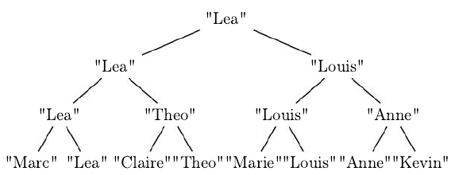

## Implémentations des algorithmes du cours

En utilisant le module [`binarytree`](https://github.com/joowani/binarytree), implémenter les
algorithmes du programme officiel:

- Calculer la hauteur de l'arbre
- Calculer la taille de l'arbre

- Parcours de l'arbre
  - Parcours préfixe
  - Parcours postfixe
  - Parcours infixe
  - Parcours en largeur

- Arbre binaire de recherche

  - Insertion d'une clé
  - Recherche d'une clé

Pour le parcours en largeur, on pourra utiliser la classe `File` suivante.

```python
from collections import deque

class File:
    # pas d'initialisation si on crée tjs des files vides
    _data = deque()
    
    def enfiler(self, élément):
        self._data.appendleft(élément)
    
    def défiler(self):
        return self._data.pop()
    
    def est_vide(self):
        return not self._data

    def tête(self):
        return self._data[-1]
```

## Version itérative des parcours en profondeur

Il est possible d'écrire des versions iteratives (et non récursive) des algorithmes de parcours en
profondeur.

Pour cela on utilisera une pile(_stack_ en anglais).


Voici les pseudo-codes proposés sur l'article
[Wikipédia en anglais](https://en.wikipedia.org/wiki/Tree_traversal#Implementations).

### Parcours préfixe itératif

```
iterativePreorder(node)
  if (node == null)
    return
  s ← empty stack
  s.push(node)
  while (not s.isEmpty())
    node ← s.pop()
    visit(node)
    //right child is pushed first so that left is processed first
    if node.right ≠ null
      s.push(node.right)
    if node.left ≠ null
      s.push(node.left)
```

### Parcours infixe itératif

```
iterativeInorder(node)
  s ← empty stack
  while (not s.isEmpty() or node ≠ null)
    if (node ≠ null)
      s.push(node)
      node ← node.left
    else
      node ← s.pop()
      visit(node)
      node ← node.right
```

### Parcours postfixe itératif

```
iterativePostorder(node)
  s ← empty stack
  lastNodeVisited ← null
  while (not s.isEmpty() or node ≠ null)
    if (node ≠ null)
      s.push(node)
      node ← node.left
    else
      peekNode ← s.peek()
      // if right child exists and traversing node
      // from left child, then move right
      if (peekNode.right ≠ null and lastNodeVisited ≠ peekNode.right)
        node ← peekNode.right
      else
        visit(peekNode)
        lastNodeVisited ← s.pop()
```

Pour faire cet exercice, on pourra utiliser la classe `Pile` suivante.

```python
class Pile:
    def __init__(self):
        # Initialisation par une liste vide
        self._data = []
    
    def empiler(self, élément):
        self._data.append(élément)
    
    def dépiler(self):
        return self._data.pop()
    
    def est_vide(self):
        return not self._data

    def sommet(self):
        return self._data[-1]
```

## Un arbre de compétition _(d'après BAC 2021)_

<!-- Amérique du Nord 2021 Ex4 -->

La fédération de badminton souhaite gérer ses compétitions à l’aide d’un
logiciel. Pour ce faire, une structure `arbre de compétition` a été définie
récursivement de la façon suivante: un arbre de compétition est soit l’arbre
vide, noté ∅, soit un triplet composé d’une chaîne de caractères appelée valeur,
d’un arbre de compétition appelé sous-arbre gauche et d’un arbre de compétition
appelé sous-arbre droit.

1. On considère l’arbre de compétition `B` suivant:
   
  

  Créer l'arbre de compétition `B` à l'aide de la classe `ArbreBinaire` vue dans le [chapitre P1C4](/tg/nsi/1-structures-de-donnees/4-arbres).

2. Écrire les fonctions suivantes:
   
   - La fonction `racine` qui prend en paramètre un arbre de compétition `arb` et
  renvoie la valeur de la racine.
  
  Exemple: en reprenant l’exemple d’arbre de compétition présenté ci-dessus,
  `racine(B)` vaut `"Lea"`.
  
  - La fonction `gauche` qui prend en paramètre un arbre de compétition `arb` et
    renvoie son sous-arbre gauche.
    
    
  - La fonction `droit` qui prend en argument un arbre de compétition `arb` et renvoie son sous-arbre droit.
   
    
  - La fonction `est_vide` qui prend en argument un arbre de compétition et renvoie `True` si l’arbre est vide et `False` sinon.
   
    Exemple:en reprenant l’exemple d’arbre de compétition présenté ci-dessus, `est_vide(B)` vaut `False`.

** Dans toute la suite de l'exercice, vous ne devrez utiliser que les fonctions définies dans les questions précédent la question posée.**

3. &nbsp;

   1. Proposer une fonction Python `occurrences` ayant pour paramètre un arbre de
   compétition `arb` et le nom d’un joueur `nom` et qui renvoie le nombre
   d’occurrences (d’apparitions) du joueur `nom` dans l’arbre de compétition
   `arb`.
   
      Exemple: `occurences(B,"Anne")` vaut `2`.
   
   2. Proposer une fonction Python `a_gagne` prenant pour paramètres un arbre de
   compétition `arb` et le nom d’un joueur `nom` et qui renvoie le booléen `True`
   si le joueur `nom` a gagné au moins un match dans la compétition représenté
   par l’arbre de compétition `arb`.
   
      Exemple: `a_gagne(B,"Louis")` vaut True

4. On souhaite programmer une fonction Python `nombre_matchs` qui prend pour
arguments un arbre de compétition `arb` et le nom d’un joueur `nom` et qui
renvoie le nombre de matchs joués par le joueur `nom` dans la compétition
représentée par l’arbre de compétition `arb`

   Exemple: `nombre_matchs(B,"Lea")` doit valoir `3` et
   `nombre_matchs(B,"Marc")` doit valoir `1`.

   1. Expliquer pourquoi les instructions suivantes renvoient une valeur
   erronée. On pourra pour cela identifier le nœud de l’arbre qui provoque une
   erreur.
   
      ```python
      def nombre_matchs(arb ,nom):
          """arbre_competition , str -> int"""
          return occurrences(arb, nom)
      ```
   
   2. Proposer une correction pour la fonction `nombre_matchs`.

5. Recopier et compléter la fonction `liste_joueurs` qui prend pour
argument un arbre de compétition `arb` et qui renvoie un tableau contenant les
participants au tournoi, chaque nom ne devant figurer qu’une seule fois dans le
tableau.

   L’opération `+` à la ligne 8 permet de concaténer deux tableaux.
   
   Exemple: Si `L1 = [4, 6, 2]` et `L2 = [3 ,5 ,1 ]`, l’instruction `L1 + L2` va
renvoyer le tableau `[4, 6, 2, 3, 5, 1]`

   ```python
   def liste_joueurs(arb):
       """arbre_competition -> tableau"""
       if est_vide(arb):
            return ...
        elif ... and ... :
            return [racine(arb)]
        else:
            return ... + liste_joueurs(droit(arb))
   ```
