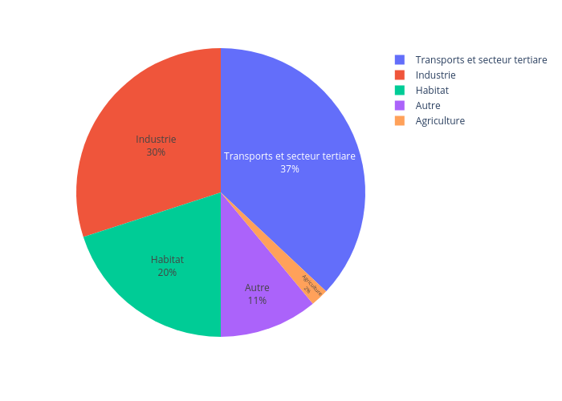
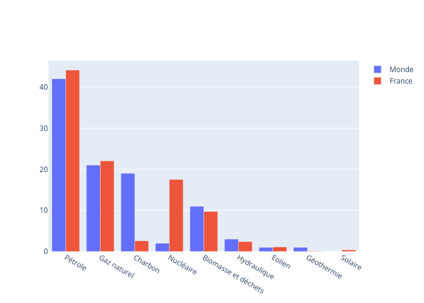
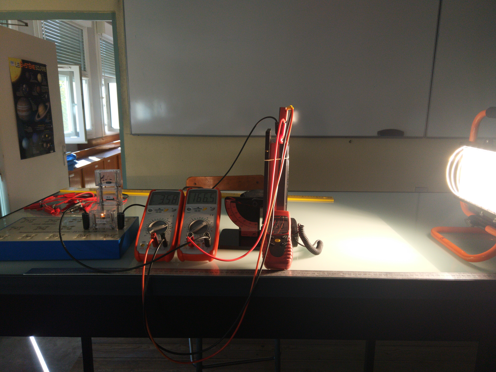

::: programme

+----------------------------------------------------+------------------------------------------+
|                    **Savoirs**                     |             **Savoir-faire**             |
+====================================================+==========================================+
| L’énergie utilisée dans le monde provient d’une    | Utiliser les différentes                 |
| diversité de ressources parmi lesquelles les       | unités d’énergie employées               |
| combustibles fossiles dominent.                    | (Tonne Équivalent Pétrole                |
|                                                    | (TEP), kWh...) et les                    |
| La consommation en est très inégalement répartie   | convertir en joules – les                |
| selon la richesse des pays et des individus.       | facteurs de conversion étant             |
|                                                    | fournis.                                 |
+----------------------------------------------------+------------------------------------------+
| La croissance de la consommation globale           | Exploiter des données de                 |
| (doublement dans les 40 dernières années) est      | production et d’utilisation              |
| directement liée au modèle industriel de           | d’énergie à différentes                  |
| production et de consommation des sociétés.        | échelles (mondiale, nationale,           |
|                                                    | individuelle...).                        |
+----------------------------------------------------+------------------------------------------+
| En moyenne mondiale, cette énergie est utilisée à  | Comparer quelques ordres de              |
| parts comparables par le secteur industriel, les   | grandeur d’énergie et de                 |
| transports, le secteur de l’habitat et dans une    | puissance : corps humain,                |
| moindre mesure par le secteur agricole.            | objets du quotidien, centrale            |
|                                                    | électrique, flux radiatif                |
| Les énergies primaires sont disponibles sous forme | solaire...                               |
| de stocks (combustibles fossiles, uranium) et de   |                                          |
| flux (flux radiatif solaire, flux géothermique,    |                                          |
| puissance gravitationnelle à l’origine des         |                                          |
| marées).                                           |                                          |
+----------------------------------------------------+------------------------------------------+
| La combustion de carburants fossiles et de         | Calculer la masse de dioxyde de carbone  |
| biomasse libère du dioxyde de carbone et également | produite par unité d’énergie dégagée     |
| des aérosols et d’autres substances (N2O, O3,      | pour différents combustibles (l’équation |
| suies, produits soufrés), qui affectent la qualité | de réaction et l’énergie massique        |
| de l’air respiré et la santé.                      | dégagée étant fournies).                 |
|                                                    |                                          |
|                                                    | À partir de documents épidémiologiques,  |
|                                                    | identifier et expliquer les conséquences |
|                                                    | sur la santé de certains polluants       |
|                                                    | atmosphériques, telles les particules    |
|                                                    | fines résultant de combustions.          |
+----------------------------------------------------+------------------------------------------+
| L’empreinte carbone d’une activité ou d’une        | Comparer sur l’ensemble de leur cycle de |
| personne est la masse de CO2 produite directement  | vie les impacts d’objets industriels     |
| ou indirectement par sa consommation d’énergie     | (par exemple, voiture à moteur           |
| et/ou de matière première.                         | électrique ou à essence).                |
|                                                    |                                          |
|                                                    | À partir de documents, analyser          |
|                                                    | l’empreinte carbone de différentes       |
|                                                    | activités humaines et proposer des       |
|                                                    | comportements pour la minimiser ou la    |
|                                                    | compenser.                               |
+----------------------------------------------------+------------------------------------------+
| Les scénarios de transition écologique font        | Analyser l’impact de l’augmentation du   |
| différentes hypothèses sur la quantité de GES      | CO2 sur le développement de la           |
| émise dans le futur. Ils évaluent les changements  | végétation. écosystèmes et les           |
| prévisibles, affectant les principalement les plus | conditions de vie des êtres humains,     |
| fragiles.                                          |                                          |
+----------------------------------------------------+------------------------------------------+
| Les projections fournies par les modèles           | Analyser des extraits de documents du    |
| permettent de définir les aléas et peuvent         | GIEC ou d’accords internationaux         |
| orienter les prises de décision. Les mesures       | proposant différents scénarios.          |
| d’adaptation découlent d’une analyse des risques   |                                          |
| et des options pour y faire face.                  |                                          |
+----------------------------------------------------+------------------------------------------+

:::

<!-- `youtube: HQoIAs3JGkQ` -->

## Énergie et puissance

Énergie
:  L'énergie est une grandeur qui peut être transféré à un corps pour le déplacer ou le chauffer. On la mesure en joule(J) dans le système international(SI).

Puissance
:  C'est l'énergie transférée par unité de temps. On la mesure en watt(W) dans le système international(SI).

::: prop

$$
1W=1J/s
$$

ou $1J.s^{-1}$ pour les spécialistes!
:::

::: example

Dans une voiture l'énergie est stockée dans le réservoir(ou la batterie).

Le moteur est plus ou moins puissant pour accélérer plus ou moins vite en
consommant plus ou moins d'énergie à la seconde.

:::

::: {.exp titre="Utilisation d'une bouilloire"}

On lit sur une bouilloire une puissance de __________.

1. Combien de temps faut-il pour élever de 10 °C la température d'un litre
   d'eau.
2. En déduire la durée nécessaire pour faire bouillir 1L d'eau initialement à
   20°C.

_Données:_

- _il faut une calorie pour élever de 1°C la température d'1g d'eau._
- _1 calorie = 4,18J._

:::

## Production et consommation d'énergie dans le monde

::: appli

Activité 1 PP70-71 du [manuel Hachette Ed.2020](https://www.enseignants.hachette-education.com/livres/enseignement-scientifique-terminales-livre-eleve-ed-2020-9782017866138)

:::

En moyenne mondiale, l'énergie est utilisée à parts comparables par le secteur industriel, les
transports, le secteur de l'habitat et dans une moindre mesure par le secteur agricole.

L'énergie utilisée dans le monde provient d'une diversité de ressources parmi lesquelles les
combustibles fossiles dominent.

Les énergies primaires sont disponibles sous forme de stocks (combustibles fossiles, uranium) et de
flux (flux radiatif solaire, flux géothermique, puissance gravitationnelle à l'origine des marées).

:::{.exp titre="Rendement d'un panneau solaire"}

On éclaire perpendiculairement un panneau solaire rectangulaire (15cmx8cm) avec une lampe halogène.

Le panneau solaire permet d'alimenter une lampe en lui fournissant une tension U=3,58V et une
intensité I=166,5mA. On rappelle que la puissance électrique s'écrit $P=UI$.

On mesure l'éclairement avec un luxmètre au niveau du panneau solaire $E_v=250 lux$. On considérera que dans les conditions de l'expérience $1lux = 4 W.m^{-2}$.

_Calculer le rendement de la conversion énergie lumineuse → énergie électrique._

:::

::: plus

En utilisant cette page web:

https://www.planete-energies.com/fr/medias/infographies/la-carte-du-monde-de-l-energie-3

Montrer sur des exemples que la consommation d'énergie est très inégalement répartie selon la
richesse des pays(et des individus).

:::

## L'empreinte carbone

Empreinte carbone

: L'empreinte carbone d'une activité ou d'une personne est la masse de CO~2~ produite directement
ou indirectement par sa consommation d'énergie et/ou de matière première.

::: appli

Questions 1 et 3 de l'activité 2 PP72-73 du [manuel Hachette Ed.2020](https://www.enseignants.hachette-education.com/livres/enseignement-scientifique-terminales-livre-eleve-ed-2020-9782017866138)

:::

La combustion de carburants fossiles et de biomasse libère du dioxyde de carbone et également des
aérosols et d'autres substances (N~2~O, O~3~, suies, produits soufrés), qui affectent la qualité de
l'air respiré et la santé.

::: appli

Activité 2 PP72-73 du [manuel Hachette Ed.2020](https://www.enseignants.hachette-education.com/livres/enseignement-scientifique-terminales-livre-eleve-ed-2020-9782017866138)

1. Doc 1. Comparer l'impact carbone d'un véhicule électrique et d'un véhicule thermique au cours de
   son cycle de vie.
2. Doc 2 et 3. Expliquer à l'oral quel peut-être l'impact de notre mode de vie sur nos émissions de
   carbone.

:::

::: ref

- [Manuel Hachette Ed.2020](https://www.enseignants.hachette-education.com/livres/enseignement-scientifique-terminales-livre-eleve-ed-2020-9782017866138)

:::
