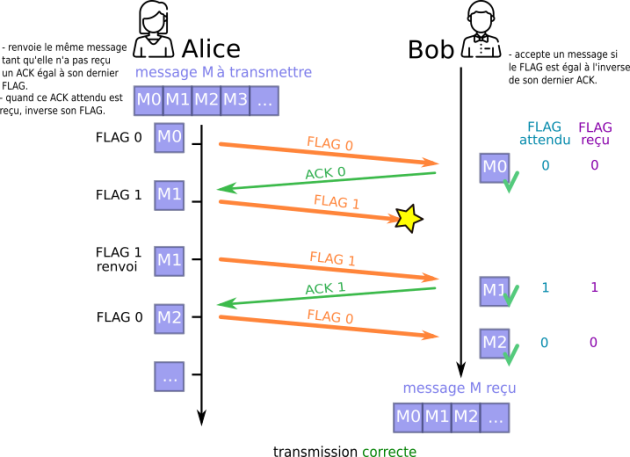
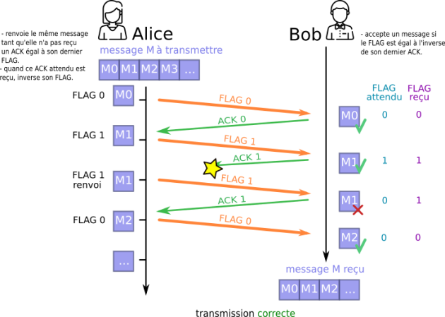
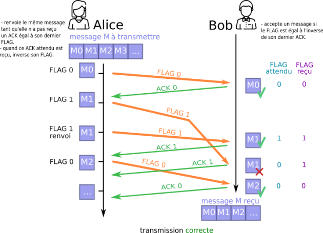

Programme Officiel

<table class="table table-bordered table-hover">
<thead class="table-warning">
<tr class="header">
<th>Contenus</th>
<th>Capacités attendues</th>
<th>Commentaires</th>
</tr>
</thead>
<tbody>
<tr class="odd">
<td>
Transmission de données dans un réseau

Protocoles de communication

Architecture d’un réseau
</td>
<td>
Mettre en évidence l’intérêt du découpage des données en paquets et de leur encapsulation.

Dérouler le fonctionnement d’un protocole simple de récupération de perte de paquets(bit alterné).

Simuler ou mettre en œuvre un réseau.
</td>
<td>
Le protocole peut être expliqué et simulé en mode débranché.

Le lien est fait avec ce qui a été vu en classe de seconde sur le protocole TCP/IP.

Le rôle des différents constituants du réseau local de l’établissement est présenté.
</td>
</tr>
</tbody>
</table>
<a class="lien-programme" href="../programme/">Lien vers le programme complet</a>

Dans ce chapitre, nous allons voir comment les ordinateurs peuvent communiquer entre eux sur internet grâce aux <em>protocoles de communication</em>.

<a href="http://portail.lyc-la-martiniere-diderot.ac-lyon.fr/srv1/co/decoupage_paquets.html" class="cite-source">Image issue du site du lycée La Martinière Diderot académie de Lyon</a>

<iframe width="560" height="315" src="https://invidious.projectsegfau.lt/embed/dCknqcjcItU" title="YouTube video player" frameborder="0" allow="accelerometer; autoplay; clipboard-write; encrypted-media; gyroscope; picture-in-picture" allowfullscreen=""></iframe>
<a href="https://www.youtube.com/watch?v=dCknqcjcItU">Vidéo</a> servie sans cookie via <a href="https://projectsegfau.lt/">Project Segfault</a>

<!--

Nous utiliserons des ressources du cours
[ICN](https://www.youtube.com/playlist?list=PLWvGMqXvyJAOaI2Zf9dqa0b5SQWQ6Z9kr) proposées par le
site <https://pixees.fr/>.

 Bonne vidéo Monsiur techno: CC-BY-SA _0thnFumSdA -->
<h2 id="rappels-de-snt-les-protocoles-tcpip" class="anchored">Rappels de SNT: Les protocoles TCP/IP</h2>
<blockquote class="blockquote">

Afin de transmettre un message d’une machine à une autre sur un réseau, celui-ci est découpé en plusieurs paquets transmis séparément. <a href="https://fr.wikipedia.org/wiki/Paquet_(r%C3%A9seau)" class="cite-source">Article paquet sur Wikipédia</a>

</blockquote>

On a vu en <a href="/2gt/snt/1-internet/2-les-protocoles-dinternet">seconde</a> les deux protocoles fondamentaux d’internet:

<ul>
<li>Le protocole <strong>IP</strong>: qui permet d’attribuer à chaque machine une adresse IP unique pour l’identifier sur le réseau.</li>
<li>Le protocole <strong>TCP</strong>: qui permet d’assurer la communication de l’information en la découpant en paquets, et en s’assurant que tous les paquets sont reçus et conformes à l’information envoyée.</li>
</ul>

Chaque protocole ajoute des <em>en-têtes</em> aux paquets, sortes d’enveloppes cachant le contenu des paquets et permettant de leur ajouter des métadonnées.

Voici par exemple la structure d’un paquet ipV6 avec ses en-têtes.

<wc-wikimage title="IPv6_header_rv1.svg" caption="En-tête IPv6"></wc-wikimage>

<h2 id="structures-des-réseaux" class="anchored">Structures des réseaux</h2>

<iframe width="560" height="315" src="https://invidious.projectsegfau.lt/embed/NMY-N6kl6CI" title="YouTube video player" frameborder="0" allow="accelerometer; autoplay; clipboard-write; encrypted-media; gyroscope; picture-in-picture" allowfullscreen=""></iframe>
<a href="https://www.youtube.com/watch?v=NMY-N6kl6CI">Vidéo</a> servie sans cookie via <a href="https://projectsegfau.lt/">Project Segfault</a>

&nbsp;

<ol type="1">
<li>
Représenter des structures de réseaux en anneau et en bus et expliquer l’intérêt de ce type de structures.
</li>
<li>
Pourquoi les transmissions sont-elles effectuées par paquets sur un réseau?
</li>
<li>
Quel est l’élément central d’un réseau local?
</li>
<li>
Quel est le protocole qui permet d’identifier toutes les machines sur internet? Pourquoi en existe-t-il deux versions?
</li>
<li>
Qu’est-ce qu’un routeur? Comment fonctionne-t-il?
</li>
<li>
Mettre dans l’ordre les opérations suivantes lors d’une requête à serveur web depuis un navigateur sur un ordinateur à la maison. Certaines étapes manquent (par exemple d’autres recherches dans les tables de routage), on les ignore pour simplifier. L’ordinateur obtient l’IP du serveur par le protocole DNS.

<ul>
<li>Le serveur envoie la réponse à la requête.</li>
<li>La box transmet les paquets vers le serveur.</li>
<li>Le serveur traite la requête.</li>
<li>La box cherche l’IP du serveur dans sa table de routage.</li>
<li>L’ordinateur envoie un paquet de requête sur le réseau.</li>
<li>La box transmet la réponse vers l’ordinateur.</li>
</ul></li>
</ol>

<h2 id="le-modèle-en-couche-osi" class="anchored">Le modèle en couche OSI</h2>

Le modèle OSI (<em>Open System Interconnection</em>) est un modèle en couche dans lequel chaque couche a un rôle particulier dans la communication.

Il contient 7 couches alors que le modèle TCP/IP vu en seconde n’en contient que 4.

<wc-wikimage title="Comparaison_des_mod%C3%A8les_OSI_et_TCP_IP.png" caption="Comparaison des modèles OSI et TCP IP"></wc-wikimage>

<h3 id="encapsulation-des-données" class="anchored">Encapsulation des données</h3>

Lorsque la couche application envoie les données aux couches inférieures, elle y ajoute des métadonnées appelées «en-tête» ou «en-queue» destinées à la couche application de l’autre machine distante.

Chaque couche ajoute ses propres en-têtes à l’émission lorsque les données de l’application descendent les couches. Et ainsi <strong>la trame</strong> d’informations circulant sur la couche liaison est “surchargée des métadonnées” de chacune des couches supérieures.

À la réception, chaque couche récupère et détache les métadonnées qui lui sont destinées et transmet le message sans ces métadonnées à la couche supérieure.

<h3 id="la-couche-application" class="anchored">La couche application</h3>

Les applications:

<ul>
<li>web(HTTP) échangent des pages web, des données de formulaire, de session…</li>
<li>mail(SMTP) échangent des emails, les stockent, permettent leur lecture…</li>
<li>SSH, FTP, …</li>
</ul>
<h3 id="la-couche-transport" class="anchored">La couche transport</h3>

On découpe le message en segments et on y ajoute un numéro de port qui correspond à l’application qui l’utilise:

<ul>
<li>HTTP: 80</li>
<li>HTTPS: 443</li>
<li>SMTP: 25</li>
</ul>

L’état de la connexion est vérifié, si tous les segments sont bien reçus et conformes grâce au calcul d’une <a href="https://fr.wikipedia.org/wiki/Somme_de_contr%C3%B4le">somme de contrôle</a>.

La couche transport propose deux principaux protocoles pour le transfert de données vers une machine distante:

<ul>
<li>le protocole <strong>TCP</strong>(Transmission Control Protocol) pour un transfert connecté et fiable,</li>
<li>le protocole <strong>UDP</strong>(User Datagram Protocol) pour un transfert déconnecté et non fiable.</li>
</ul>

Chaque protocole est utilisé dans des applications différentes: temps réel pour l’UDP, non-temps réel, mais sensible à la perte au réordonnancement pour le TCP.

<h3 id="la-couche-réseauinternet" class="anchored">La couche réseau/internet</h3>

On ajoute les adresses IP de la source et du destinataire, la longueur du paquet, sa durée de vie pour former ce que l’on appelle un <em>paquet IP</em>.

<h3 id="la-couche-liaison" class="anchored">La couche liaison</h3>

Le paquet et encapsulé dans une trame qui contient l’adresse unique de la machine dans le réseau local.

Puis la trame va transiter à travers le réseau physique: Ondes radio, fibre optique, câbles RJ45… jusqu’à atteindre le réseau local de la machine destinataire ou chaque couche va utiliser les en-têtes fournis par la même couche que la machine source.

<h2 id="le-protocole-du-bit-alterné" class="anchored">Le protocole du bit alterné</h2>

Le protocole du bit alterné est un protocole de réseau simple fonctionnant au niveau de la couche liaison de données (couche OSI 2) qui retransmet les messages perdus ou corrompus.

Il était utilisé dans le réseau <a href="https://fr.wikipedia.org/wiki/ARPANET">ARPANET</a>, l’ancêtre d’internet.

<h3 id="fonctionnement" class="anchored">Fonctionnement</h3>

Alice veut envoyer à Bob un message M, qu’elle a prédécoupé en sous-messages M0, M1, M2,…

Nous sommes à la couche 2, on souhaite une solution légère qui assure que tous les paquets sont reçus dans l’ordre(pas comme en TCP couche 4).

On va simplement utiliser un en-tête à un bit.

Lorsque Alice envoie un message, elle le renvoie en continu, avec le même <em>bit d’en-tête</em>, jusqu’à ce qu’il reçoive un accusé de réception de B contenant le même <em>bit d’en-tête</em>. Lorsque cela se produit, A inverse le <em>bit d’en-tête</em> et commence à transmettre le message suivant.

Lorsque Bob reçoit un message qui n’est pas corrompu et a le <em>bit d’en-tête</em> 0, il commence à envoyer <code>ACK0</code> (Accusé de réception de 0 <em>aknowledgement</em> en anglais) et continue à le faire jusqu’à ce qu’il reçoive un message valide avec le numéro 1. Puis il commence à envoyer <code>ACK1</code>, etc.

Cela signifie qu’Alice peut toujours recevoir <code>ACK0</code> alors qu’elle transmet déjà des messages avec le <em>bit d’en-tête</em> un. (Et vice versa.) Elle traite ces messages comme des codes d’acquittement négatif (NAK). Le comportement le plus simple est de les ignorer tous et de continuer à transmettre.

<a href="https://en.wikipedia.org/wiki/Alternating_bit_protocol" class="cite-source">Article Alternating bit protocol sur Wikipédia anglais</a>

<h3 id="illustrations" class="anchored">Illustrations</h3>

<strong>Cas où le sous-message est perdu</strong>

<strong>Cas où le ACK est perdu</strong>

Le protocole a bien détecté le doublon du sous-message M1.

<strong>Cas où un sous-message est en retard</strong>

Le protocole a bien détecté le doublon du sous-message M1… <em>mais que se passerait-il si notre premier sous-message M1 était encore plus en retard ?</em>

<a href="http://portail.lyc-la-martiniere-diderot.ac-lyon.fr/srv1/co/bit_alterne.html" class="cite-source">Site du lycée La Martinière Diderot académie de Lyon</a>

