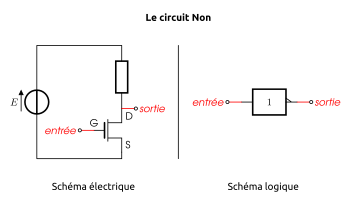
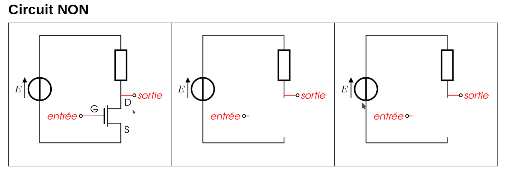
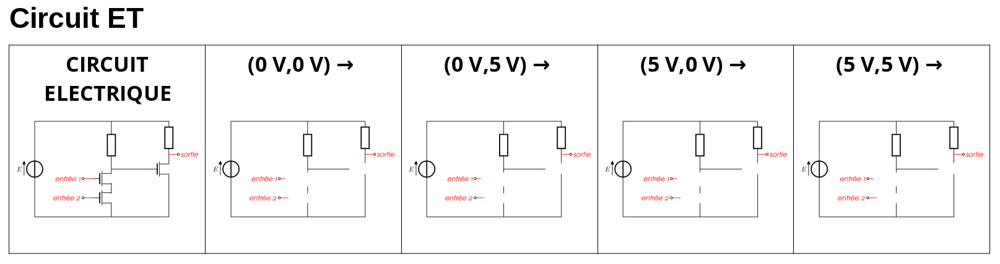
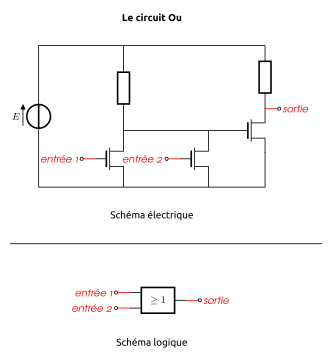

Programme Officiel

<table class="table table-bordered table-hover">
<thead class="table-warning">
<tr class="header">
<th>Contenus</th>
<th>Capacités attendues</th>
<th>Commentaires</th>
</tr>
</thead>
<tbody>
<tr class="odd">
<td>Modèle d’architecture séquentielle (von Neumann)</td>
<td></td>
<td>Les circuits combinatoires réalisent des fonctions booléennes.</td>
</tr>
</tbody>
</table>
<a class="lien-programme" href="../programme/">Lien vers le programme complet</a>

L’invention du transistor en 1947 a ouvert l’ère de l’électronique pour l’humanité et a permis à l’informatique de se miniaturiser et de se démocratiser au grand public.

Nous allons voir maintenant, comment il est possible de réaliser des opérations logiques à l’aide de <strong>transistors</strong>. En effet, chaque processeur possède dans son <a href="https://fr.wikipedia.org/wiki/Assembleur#Instructions_machine">jeu d’instructions</a> des opérations booléennes (ou opérations bit à bit).

Il existe des transistors de diverses technologies, pour plus de simplicité, nous étudierons dans ce chapitre qu’un seul type de transistor: les transistors <strong>N-Mos</strong>. Dont voici le symbole électrique

<figure class="figure">

<figcaption class="figure-caption">Symbole électrique du transistor CMOS-N</figcaption>

</figure>

Un transistor CMOS-N possèdent trois bornes nommées:

<ul>
<li>La grille <strong>G</strong> qui commande le fonctionnement du transistor,</li>
<li>Le drain <strong>D</strong>,</li>
<li>et la source <strong>S</strong>.</li>
</ul>

Une simulation de ce type de transistor est disponible en suivant ce lien: http://www.falstad.com/circuit/e-nmosfet.html

<h2 id="commutation-du-transistor" class="anchored">Commutation du transistor</h2>

Pour réaliser des circuits logiques, nous utilisons le transistor en <strong>interrupteur commandé</strong>.

<em>En fonction de la tension appliquée</em> entre la grille et la source <math xmlns="http://www.w3.org/1998/Math/MathML"><semantics><mrow><msub><mi>U</mi><mrow><mi>G</mi><mi>S</mi></mrow></msub></mrow><annotation encoding="application/x-tex">U_{GS}</annotation></semantics></math>UGS​
, le dipôle entre le drain et la source se comporte <em>soit comme un interrupteur ouvert soit comme un interrupteur fermé</em>.

En plus

La résistance entre le Drain et la Source dépend fortement de la tension appliquée entre la grille et la source: <math xmlns="http://www.w3.org/1998/Math/MathML"><semantics><mrow><msub><mi>U</mi><mrow><mi>G</mi><mi>S</mi></mrow></msub></mrow><annotation encoding="application/x-tex">U_{GS}</annotation></semantics></math>UGS​
, c’est une particularité des matériaux semi-conducteurs utilisés dans les transistors.

 By Saumitra R Mehrotra &amp; Gerhard Klimeck, modified by <a href="//commons.wikimedia.org/wiki/User:Zephyris" title="User:Zephyris">Zephyris</a> - Own work, Public Domain, <a href="https://commons.wikimedia.org/w/index.php?curid=11299479">Link</a>

Dans cette simulation, la tension de seuil se situe aux alentours de 0,45V, si bien que si:

<ul>
<li><math xmlns="http://www.w3.org/1998/Math/MathML"><semantics><mrow><msub><mi>U</mi><mrow><mi>G</mi><mi>S</mi></mrow></msub><mo>&lt;</mo><mn>0</mn><mo separator="true">,</mo><mn>45</mn><mi>V</mi></mrow><annotation encoding="application/x-tex">U_{GS} &lt; 0,45 V</annotation></semantics></math>UGS​&lt;0,45V
: $R_{DS} +$, l’interrupteur commandé est <strong>ouvert</strong>.</li>
<li><math xmlns="http://www.w3.org/1998/Math/MathML"><semantics><mrow><msub><mi>U</mi><mrow><mi>G</mi><mi>S</mi></mrow></msub><mo>&gt;</mo><mn>0</mn><mo separator="true">,</mo><mn>45</mn><mi>V</mi></mrow><annotation encoding="application/x-tex">U_{GS} &gt; 0,45 V</annotation></semantics></math>UGS​&gt;0,45V
: $R_{DS} $, l’interrupteur commandé est <strong>fermé</strong>.</li>
</ul>

En utilisant des tensions de commandes <math xmlns="http://www.w3.org/1998/Math/MathML"><semantics><mrow><msub><mi>U</mi><mrow><mi>G</mi><mi>S</mi></mrow></msub></mrow><annotation encoding="application/x-tex">U_{GS}</annotation></semantics></math>UGS​
n’ayant que deux valeurs: 0, ou 5V, il est possible d’utiliser le transistor comme un <strong>interrupteur</strong> placé entre les bornes <math xmlns="http://www.w3.org/1998/Math/MathML"><semantics><mrow><mi>D</mi></mrow><annotation encoding="application/x-tex">D</annotation></semantics></math>D
et <math xmlns="http://www.w3.org/1998/Math/MathML"><semantics><mrow><mi>S</mi></mrow><annotation encoding="application/x-tex">S</annotation></semantics></math>S
et <strong>commandé</strong> par la tension <math xmlns="http://www.w3.org/1998/Math/MathML"><semantics><mrow><msub><mi>U</mi><mrow><mi>G</mi><mi>S</mi></mrow></msub></mrow><annotation encoding="application/x-tex">U_{GS}</annotation></semantics></math>UGS​
.

<figure class="figure">

<figcaption class="figure-caption">Commutation du transistor CmosN</figcaption>

</figure>

<h2 id="réalisation-dune-porte-nonnot" class="anchored">Réalisation d’une porte <code>NON</code>(<em>NOT</em>)</h2>

La fonction booléenne non(x) associe à une valeur booléenne <math xmlns="http://www.w3.org/1998/Math/MathML"><semantics><mrow><mi>x</mi></mrow><annotation encoding="application/x-tex">x</annotation></semantics></math>x
son “contraire”.

Sa table de vérité est:

<table class="table table-bordered table-hover">
<thead class="table-warning">
<tr class="header">
<th>x</th>
<th>non(x)</th>
</tr>
</thead>
<tbody>
<tr class="odd">
<td>0</td>
<td>1</td>
</tr>
<tr class="even">
<td>1</td>
<td>0</td>
</tr>
</tbody>
</table>

<figure class="figure">

<figcaption class="figure-caption">Porte Non</figcaption>

</figure>

Schémas équivalents

 1. Réaliser les deux schémas équivalents au circuit pour <math xmlns="http://www.w3.org/1998/Math/MathML"><semantics><mrow><msub><mi>U</mi><mrow><mi>G</mi><mi>S</mi></mrow></msub><mo>=</mo><mn>0</mn><mi>V</mi></mrow><annotation encoding="application/x-tex">U_{GS} = 0V</annotation></semantics></math>UGS​=0V
et <math xmlns="http://www.w3.org/1998/Math/MathML"><semantics><mrow><msub><mi>U</mi><mrow><mi>G</mi><mi>S</mi></mrow></msub><mo>=</mo><mn>5</mn><mi>V</mi></mrow><annotation encoding="application/x-tex">U_{GS} = 5V</annotation></semantics></math>UGS​=5V
en remplaçant le transistor par un interrupteur. 2. Vérifier que le circuit réalise bien la fonction booléenne <math xmlns="http://www.w3.org/1998/Math/MathML"><semantics><mrow><mi>s</mi><mi>o</mi><mi>r</mi><mi>t</mi><mi>i</mi><mi>e</mi><mo>=</mo><mi>N</mi><mi>O</mi><mi>N</mi><mo stretchy="false">(</mo><mi>e</mi><mi>n</mi><mi>t</mi><mi>r</mi><mover accent="true"><mi>e</mi><mo>ˊ</mo></mover><mi>e</mi><mo stretchy="false">)</mo></mrow><annotation encoding="application/x-tex">sortie=NON(entrée)</annotation></semantics></math>sortie=NON(entreˊe)
. On rappelle que la tension aux bornes d’un fil(ou d’un interrupteur fermé) est nulle, et la tension aux bornes d’une résistance suit la loi d’Ohm: <math xmlns="http://www.w3.org/1998/Math/MathML"><semantics><mrow><mi>U</mi><mo>=</mo><mi>R</mi><mi>I</mi></mrow><annotation encoding="application/x-tex">U=RI</annotation></semantics></math>U=RI
.

<h2 id="réalisation-dune-porte-etand" class="anchored">Réalisation d’une porte <code>ET</code>(<em>AND</em>)</h2>

La fonction booléenne et(x, y) a la table de vérité suivante:

<table class="table table-bordered table-hover">
<thead class="table-warning">
<tr class="header">
<th>x</th>
<th>y</th>
<th>et(x,y)</th>
</tr>
</thead>
<tbody>
<tr class="odd">
<td>0</td>
<td>0</td>
<td>0</td>
</tr>
<tr class="even">
<td>0</td>
<td>1</td>
<td>0</td>
</tr>
<tr class="odd">
<td>1</td>
<td>0</td>
<td>0</td>
</tr>
<tr class="even">
<td>1</td>
<td>1</td>
<td>1</td>
</tr>
</tbody>
</table>

<figure class="figure">

<figcaption class="figure-caption">Porte Et</figcaption>

</figure>

Schémas équivalents

 1. Réaliser les quatre schémas équivalents pour les couples de tensions d’entrée <math xmlns="http://www.w3.org/1998/Math/MathML"><semantics><mrow><mo stretchy="false">(</mo><msub><mi>e</mi><mn>1</mn></msub><mo separator="true">,</mo><msub><mi>e</mi><mn>2</mn></msub><mo stretchy="false">)</mo><mo>∈</mo><mrow><mo fence="true">{</mo><mo stretchy="false">(</mo><mn>0</mn><mi>V</mi><mo separator="true">,</mo><mn>0</mn><mi>V</mi><mo stretchy="false">)</mo><mo separator="true">,</mo><mo stretchy="false">(</mo><mn>0</mn><mi>V</mi><mo separator="true">,</mo><mn>5</mn><mi>V</mi><mo stretchy="false">)</mo><mo separator="true">,</mo><mo stretchy="false">(</mo><mn>5</mn><mi>V</mi><mo separator="true">,</mo><mn>0</mn><mi>V</mi><mo stretchy="false">)</mo><mo separator="true">,</mo><mo stretchy="false">(</mo><mn>5</mn><mi>V</mi><mo separator="true">,</mo><mn>5</mn><mi>V</mi><mo stretchy="false">)</mo><mo fence="true">}</mo></mrow></mrow><annotation encoding="application/x-tex">(e_1, e_2) \in \left\lbrace (0V, 0V), (0V, 5V), (5V, 0V), (5V, 5V)\right\rbrace</annotation></semantics></math>(e1​,e2​)∈{(0V,0V),(0V,5V),(5V,0V),(5V,5V)}
au circuit en remplaçant les transistors par des interrupteurs. 2.Vérifier que le circuit réalise bien la fonction booléenne <math xmlns="http://www.w3.org/1998/Math/MathML"><semantics><mrow><mi>s</mi><mi>o</mi><mi>r</mi><mi>t</mi><mi>i</mi><mi>e</mi><mo>=</mo><mi>E</mi><mi>T</mi><mo stretchy="false">(</mo><mi>e</mi><mi>n</mi><mi>t</mi><mi>r</mi><mover accent="true"><mi>e</mi><mo>ˊ</mo></mover><mi>e</mi><mn>1</mn><mo separator="true">,</mo><mi>e</mi><mi>n</mi><mi>t</mi><mi>r</mi><mover accent="true"><mi>e</mi><mo>ˊ</mo></mover><mi>e</mi><mn>2</mn><mo stretchy="false">)</mo></mrow><annotation encoding="application/x-tex">sortie=ET(entrée 1, entrée 2)</annotation></semantics></math>sortie=ET(entreˊe1,entreˊe2)
.

<h2 id="réalisation-dune-porte-ouor" class="anchored">Réalisation d’une porte <code>OU</code>(<em>OR</em>)</h2>

La fonction booléenne <math xmlns="http://www.w3.org/1998/Math/MathML"><semantics><mrow><mi>o</mi><mi>u</mi><mo stretchy="false">(</mo><mi>x</mi><mo separator="true">,</mo><mi>y</mi><mo stretchy="false">)</mo></mrow><annotation encoding="application/x-tex">ou(x, y)</annotation></semantics></math>ou(x,y)
a la table de vérité suivante:

<table class="table table-bordered table-hover">
<thead class="table-warning">
<tr class="header">
<th>x</th>
<th>y</th>
<th>ou(x,y)</th>
</tr>
</thead>
<tbody>
<tr class="odd">
<td>0</td>
<td>0</td>
<td>0</td>
</tr>
<tr class="even">
<td>0</td>
<td>1</td>
<td>1</td>
</tr>
<tr class="odd">
<td>1</td>
<td>0</td>
<td>1</td>
</tr>
<tr class="even">
<td>1</td>
<td>1</td>
<td>1</td>
</tr>
</tbody>
</table>

<figure class="figure">

<figcaption class="figure-caption">Porte Ou</figcaption>

</figure>

Schémas équivalents

 1. Réaliser les quatre schémas équivalents pour les couples de tensions d’entrée <math xmlns="http://www.w3.org/1998/Math/MathML"><semantics><mrow><mo stretchy="false">(</mo><msub><mi>e</mi><mn>1</mn></msub><mo separator="true">,</mo><msub><mi>e</mi><mn>2</mn></msub><mo stretchy="false">)</mo><mo>∈</mo><mrow><mo fence="true">{</mo><mo stretchy="false">(</mo><mn>0</mn><mi>V</mi><mo separator="true">,</mo><mn>0</mn><mi>V</mi><mo stretchy="false">)</mo><mo separator="true">,</mo><mo stretchy="false">(</mo><mn>0</mn><mi>V</mi><mo separator="true">,</mo><mn>5</mn><mi>V</mi><mo stretchy="false">)</mo><mo separator="true">,</mo><mo stretchy="false">(</mo><mn>5</mn><mi>V</mi><mo separator="true">,</mo><mn>0</mn><mi>V</mi><mo stretchy="false">)</mo><mo separator="true">,</mo><mo stretchy="false">(</mo><mn>5</mn><mi>V</mi><mo separator="true">,</mo><mn>5</mn><mi>V</mi><mo stretchy="false">)</mo><mo fence="true">}</mo></mrow></mrow><annotation encoding="application/x-tex">(e_1, e_2) \in \left\lbrace (0V, 0V), (0V, 5V), (5V, 0V), (5V, 5V)\right\rbrace</annotation></semantics></math>(e1​,e2​)∈{(0V,0V),(0V,5V),(5V,0V),(5V,5V)}
au circuit en remplaçant les transistors par des interrupteurs. 2.Vérifier que le circuit réalise bien la fonction booléenne <math xmlns="http://www.w3.org/1998/Math/MathML"><semantics><mrow><mi>s</mi><mi>o</mi><mi>r</mi><mi>t</mi><mi>i</mi><mi>e</mi><mo>=</mo><mi>O</mi><mi>U</mi><mo stretchy="false">(</mo><mi>e</mi><mi>n</mi><mi>t</mi><mi>r</mi><mover accent="true"><mi>e</mi><mo>ˊ</mo></mover><mi>e</mi><mn>1</mn><mo separator="true">,</mo><mi>e</mi><mi>n</mi><mi>t</mi><mi>r</mi><mover accent="true"><mi>e</mi><mo>ˊ</mo></mover><mi>e</mi><mn>2</mn><mo stretchy="false">)</mo></mrow><annotation encoding="application/x-tex">sortie=OU(entrée 1, entrée 2)</annotation></semantics></math>sortie=OU(entreˊe1,entreˊe2)
.

<h2 id="autres-portes-booléennes" class="anchored">Autres portes booléennes</h2>
<h3 id="la-porte-non-etnand" class="anchored">La porte <code>NON-ET</code>(<em>NAND</em>)</h3>

<strong>Table de vérité</strong>

<table class="table table-bordered table-hover">
<thead class="table-warning">
<tr class="header">
<th>x</th>
<th>y</th>
<th>nand(x,y)</th>
</tr>
</thead>
<tbody>
<tr class="odd">
<td>0</td>
<td>0</td>
<td>1</td>
</tr>
<tr class="even">
<td>0</td>
<td>1</td>
<td>1</td>
</tr>
<tr class="odd">
<td>1</td>
<td>0</td>
<td>1</td>
</tr>
<tr class="even">
<td>1</td>
<td>1</td>
<td>0</td>
</tr>
</tbody>
</table>

<strong>Schématisation</strong>

<figure class="figure">

<figcaption class="figure-caption">Porte NAND</figcaption>

</figure>

<h3 id="la-porte-non-ou-nor" class="anchored">La porte <code>NON-OU</code> (<em>nor</em>)</h3>

<strong>Table de vérité</strong>

<table class="table table-bordered table-hover">
<thead class="table-warning">
<tr class="header">
<th>x</th>
<th>y</th>
<th>nor(x,y)</th>
</tr>
</thead>
<tbody>
<tr class="odd">
<td>0</td>
<td>0</td>
<td>1</td>
</tr>
<tr class="even">
<td>0</td>
<td>1</td>
<td>0</td>
</tr>
<tr class="odd">
<td>1</td>
<td>0</td>
<td>0</td>
</tr>
<tr class="even">
<td>1</td>
<td>1</td>
<td>0</td>
</tr>
</tbody>
</table>

<strong>Schématisation</strong>

<figure class="figure">

<figcaption class="figure-caption">Porte NOR</figcaption>

</figure>

<h3 id="la-porte-ou-exclusif-xor" class="anchored">La porte <code>OU eXclusif</code> (<em>xor</em>)</h3>

<strong>Table de vérité</strong>

<table class="table table-bordered table-hover">
<thead class="table-warning">
<tr class="header">
<th>x</th>
<th>y</th>
<th>xor(x,y)</th>
</tr>
</thead>
<tbody>
<tr class="odd">
<td>0</td>
<td>0</td>
<td>0</td>
</tr>
<tr class="even">
<td>0</td>
<td>1</td>
<td>1</td>
</tr>
<tr class="odd">
<td>1</td>
<td>0</td>
<td>1</td>
</tr>
<tr class="even">
<td>1</td>
<td>1</td>
<td>0</td>
</tr>
</tbody>
</table>

<strong>Schématisation</strong>

<figure class="figure">

<figcaption class="figure-caption">Porte XOR</figcaption>

</figure>

<h3 id="la-porte-et-inclusif-xnor" class="anchored">La porte <code>ET inclusif</code> (<em>xnor</em>)</h3>

<strong>Table de vérité</strong>

<table class="table table-bordered table-hover">
<thead class="table-warning">
<tr class="header">
<th>x</th>
<th>y</th>
<th>xnor(x,y)</th>
</tr>
</thead>
<tbody>
<tr class="odd">
<td>0</td>
<td>0</td>
<td>1</td>
</tr>
<tr class="even">
<td>0</td>
<td>1</td>
<td>0</td>
</tr>
<tr class="odd">
<td>1</td>
<td>0</td>
<td>0</td>
</tr>
<tr class="even">
<td>1</td>
<td>1</td>
<td>1</td>
</tr>
</tbody>
</table>

<strong>Schématisation</strong> 

<ul>
<li>Chapitre 13. Les Portes booléennes <a href="http://www.editions-eyrolles.com/Livre/9782212135435/">Informatique et sciences du numérique Spécialité ISN en terminale S - Avec des exercices corrigés et des idées de projets par Gilles Dowek</a></li>
</ul>

