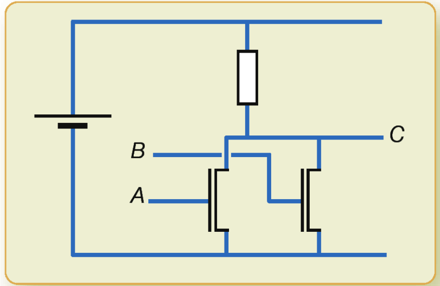

<h2 id="circuit-avec-transistors" class="anchored">Circuit avec transistors</h2>

Quelle est la table du circuit suivant?

<a href="http://www.editions-eyrolles.com/Livre/9782212135435/" class="cite-source">Exercice 13.1 du livre ISN aux éditions Eyrolles</a>

<h2 id="association-de-portes-logiques" class="anchored">Association de portes logiques</h2>

Quelle est la table du circuit suivant? Est-ce la table d’une fonction booléenne connue?

<figure class="figure">

<figcaption class="figure-caption">ex ISN 13.2</figcaption>

</figure>

