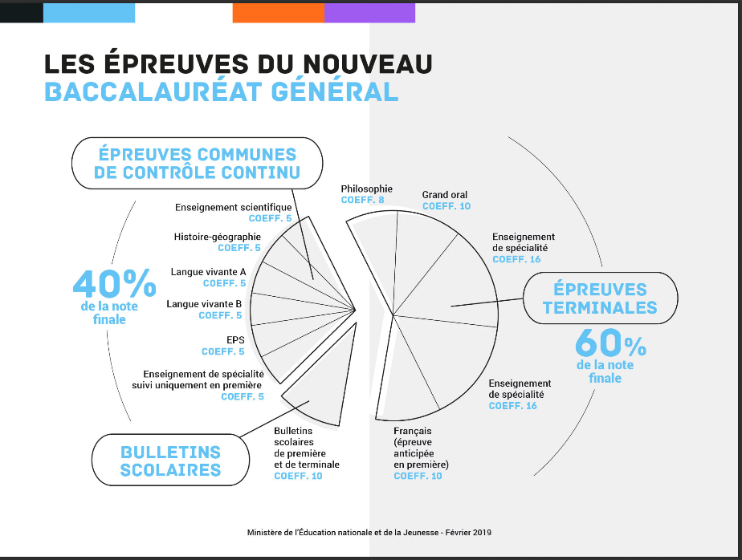

<h2 id="donner-la-valeur-renvoyée-par-les-instructions-suivantes" class="anchored">Donner la valeur renvoyée par les instructions suivantes</h2>

<pre>3 &gt; 4

4.0 &gt; 3.999

4 &gt; 4

4 &gt; + 4

2 + 2 == 4
</pre>

<h2 id="donner-le-type-et-la-valeur-renvoyée-par-les-instructions-suivantes" class="anchored">Donner le type et la valeur renvoyée par les instructions suivantes</h2>

<pre>a = 3
a == 5.0
print(a, type(a))
</pre>

<pre>b = 10
c = b &gt; 9
print(c, type(c))
</pre>

<h2 id="parapluie-ou-non" class="anchored">Parapluie ou non?</h2>

Ecrire un programme qui demande à un utilisateur quel temps il fait, et qui lui indique alors s’il doit prendre un parapluie ou pas.

<h2 id="mention-au-bac" class="anchored">Mention au BAC</h2>

Ecrire un programme qui demande à l’utilisateur sa moyenne au BAC et qui lui indique sa mention:

<ul>
<li>MOYENNE &lt; 8: RECALÉ</li>
<li>8 ≤ MOYENNE &lt; 10: ORAL DE RATTRAPPAGE</li>
<li>10 ≤ MOYENNE &lt;12: ADMIS</li>
<li>12 ≤ MOYENNE &lt; 14: ASSEZ BIEN</li>
<li>14 ≤ MOYENNE &lt; 16: BIEN</li>
<li>16 ≤ MOYENNE: TRES BIEN</li>
</ul>
<h2 id="mini-projets" class="anchored">Mini-Projets</h2>

Choisir un projet parmi les suivants.

<h3 id="calcul-du-tarif-dune-lettre" class="anchored">Calcul du tarif d’une lettre</h3>

En utilisant le lien suivant, écrire un programme qui affiche le prix de l’affranchissement d’une lettre an fonction de son type et de son poids -<em>le physicien aurait préféré masse</em>.

<a href="https://www.prixdutimbre.fr/tarifs-postaux-affranchissement-la-poste/" class="uri">https://www.prixdutimbre.fr/tarifs-postaux-affranchissement-la-poste/</a>

<h3 id="calculateur-daire" class="anchored">Calculateur d’aire</h3>

Créez un programme qui permette de calculer la surface de différents polygones (carré, rectangle…) à partir de questions posées à l’utilisateur.

<a href="https://fr.wikipedia.org/wiki/Formulaire_de_g%C3%A9om%C3%A9trie_classique#P.C3.A9rim.C3.A8tre_et_aire">Article Wikipedia sur les aires de polygones</a>

<h3 id="bac-2021" class="anchored">BAC 2021</h3>

En utilisant le document suivant, écrire un programme qui demande à l’utilisateur de rentrer toutes ses notes au baccalauréat et qui lui donne alors sa moyenne et sa mention.

<figure class="figure">

<figcaption class="figure-caption">Coefficients nouveau BAC</figcaption>

</figure>

Source: https://eduscol.education.fr/cid126665/vers-le-bac-2021.html

<!-- #### Une solution possible

Voici une solution proposée par Morgane C. au cours de l'année 2017-2018.

# On importe le module math pour calculer certaines aires (triangle
équilatéral). import math

# Création des fonctions permettant de calculer les différentes aires. def
aire_rectangle(longueur,largeur):
    return longueur*largeur
def aire_carre(cote):
    return cote**2
def aire_triangle_quel(cote, hauteur):
    return (cote*hauteur)/2
def aire_triangle_equi(cote):
    return (cote**2*math.sqrt(3))/4

#On demande à l'utilisateur la nature du polygone. nature = (input("Le polygone
est-il un Rectangle, un Carré, un Triangle quelconque, un Triangle équilatéral,
"
                "un Triangle rectangle isocèle?" " Ou est-ce un Losange, ou un
                Parallélogramme?"))
print ("Ce polygone est un(e) : ",nature)

#On pose les conditions pour calculer l'air de ce polygone. if nature ==
("rectangle" or "Rectangle"):
    longueur = float(input("Quelle est la longueur du rectangle ?")) print ("La
    longueur est : ",longueur) largeur = float(input("Quelle est la largeur du
    rectangle ?")) print ("La longueur est : ", largeur) print ("L'aire de ce
    rectangle est : ",aire_rectangle (longueur, largeur))

elif nature == ("Carré" or "carré"):
    cote = float(input("Quelle est la longueur du côté du Carré ?")) print("La
    longueur du côté du Carré est : ", cote) print("L'aire de ce Carré est : ",
    aire_carre(cote))

elif nature == ("triangle quelconque" or "Triangle quelconque"):
    cote = float(input("Renseigner la longueur du côté le plus grand du Triangle
    quelconque.")) print("La longueur du côté le plus grand est :", cote)
    hauteur = float(input("Renseigner la hauteur de ce triangle quelconque."))
    print("La hauteur correspond à : ", hauteur) print("L'aire de ce Triangle
    quelconque est : ", aire_triangle_quel(cote, hauteur))

elif nature == ("triangle équilatéral" or "Triangle équilatéral"):
    cote = float(input("Renseigner la longueur d'un côté du Triangle
    équilatéral.")) print("La longueur du côté du Triangle équilatéral est : ",
    cote) print("L'aire du Triangle équilatéral est : ",
    aire_triangle_equi(cote))

else :
    print ("Nous n'avons pas encore travaillé sur ce polygone ! :-(")

## Calculer les racines du trinôme

Vous devez implémenter un programme qui demande à l'utilisateur les trois
coefficients du
[trinôme](https://fr.wikipedia.org/wiki/Fonction_du_second_degr%C3%A9) $ax^2 +
bx + c$, et qui lui indique en retour [le nombre de racines et leurs
valeurs](https://fr.wikipedia.org/wiki/Fonction_du_second_degr%C3%A9#.C3.89quation).

#### Une solution possible

Voici une solution proposée par les auteurs du livre [Informatique et sciences
du numérique - Spécialité ISN en terminale S](http://www.lsv.fr/~dowek/Isn/)

import math

print("""

Programme de calcul des racines d'un trinôme
============================================

ax^2 + bx +c """) a = float(input("Entrer la valeur de a: ")) b =
float(input("Entrer la valeur de b: ")) c = float(input("Entrer la valeur de c:
"))

# Calcul du discriminant delta = b * b - 4 * a * c; # Affichage des solutions if
delta < 0:
    print("Pas de solution")
elif delta == 0:
    print("Une solution : ",end="") print(- b / (2 * a))
else:
    print("Deux solutions : ",end="") print((- b - math.sqrt(delta)) / (2 *
    a),end="") print(" et ",end="") print((- b + math.sqrt(delta)) / (2 * a))
 -->

