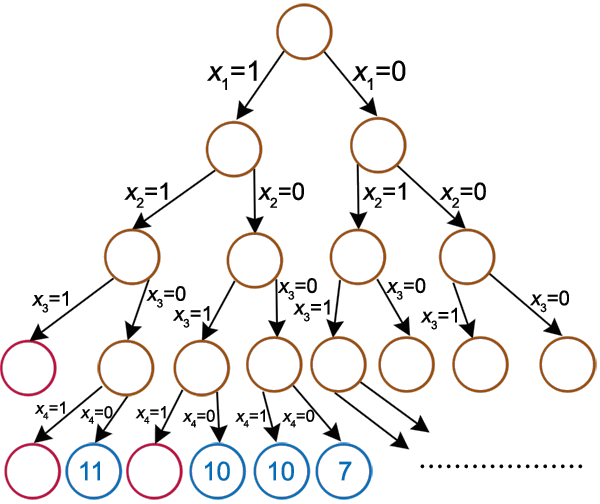

Programme Officiel

<table class="table table-bordered table-hover">
<thead class="table-warning">
<tr class="header">
<th>Contenus</th>
<th>Capacités attendues</th>
<th>Commentaires</th>
</tr>
</thead>
<tbody>
<tr class="odd">
<td>Algorithmes gloutons</td>
<td>Résoudre un problème grâce à un algorithme glouton.</td>
<td>
Exemples : problèmes du sac à dos ou du rendu de monnaie.

Les algorithmes gloutons constituent une méthode algorithmique parmi d’autres qui seront vues en terminale.
</td>
</tr>
</tbody>
</table>
<a class="lien-programme" href="../programme/">Lien vers le programme complet</a>

Nous allons voir dans ce chapitre comment résoudre des problèmes d’optimisation à l’aide d’algorithmes.

Un problème d’optimisation consiste à minimiser ou maximiser une fonction sur un ensemble.

La particularité des algorithmes gloutons est qu’ils donnent généralement une solution assez satisfaisante relativement rapidement, mais ce n’est pas forcément la meilleure.

<wc-wikimage title="Greedy_algorithm_36_cents.svg" caption="Comment rendre 36 centimes avec le minimum de pièces? Etudier tous les rendus possibles et trop long, on applique un rendu de monnaie qui est optimal si le jeu de pièces est bien fait(C'est le cas heureusement)."></wc-wikimage>

<h2 id="le-problème-du-sac-à-dos" class="anchored">Le problème du sac à dos</h2>

Il s’agit d’un problème classique d’introduction aux algorithmes gloutons.

<blockquote class="blockquote">

En algorithmique, le problème du sac à dos, noté également KP (en anglais, Knapsack problem) est un problème d’optimisation combinatoire. Il modélise une situation analogue au remplissage d’un sac à dos, ne pouvant supporter plus d’un certain poids, avec tout ou partie d’un ensemble donné d’objets ayant chacun un poids et une valeur. Les objets mis dans le sac à dos doivent maximiser la valeur totale, sans dépasser le poids maximum.

</blockquote>

<a href="" class="cite-source">Article Wikipedia</a>

<wc-wikimage title="Knapsack.svg" caption="Illustration du problème du sac à dos"></wc-wikimage>

<h2 id="exploration-systématiqueforce-brute" class="anchored">Exploration systématique(force brute)</h2>

L’exploration de toutes les possibilités consiste à construire un arbre d’exploration binaire.

 <a href="https://interstices.info/le-probleme-du-sac-a-dos/" class="cite-source">interstices CC-BY-SA-NC</a>

À chaque fois qu’un objet est ajouté à la liste des objets possibles, la taille de l’arbre est multipliée par 2.

Il s’agit d’une <em>complexité exponentielle</em> ce qui rend cette méthode de résolution inutilisable dans la pratique(Pensez au nombre de routes entre votre maison et le lycée!).

<h2 id="méthode-approximative-lalgorithme-glouton" class="anchored">Méthode approximative: l’algorithme glouton</h2>

L’algorithme le plus simple est un algorithme glouton. L’idée est d’ajouter en priorité les objets les plus efficaces, jusqu’à saturation du sac :

<pre>trier les objets par ordre décroissant d'efficacité
w_conso := 0

placer les objets dans le sac par ordre décroissant d'efficacité
pour i de 1 à n
  si w[i] + w_conso ≤ W alors
    x[i] := 1
    w_conso := w_conso + w[i]
  sinon
    x[i] := 0
  fin si
fin pour
</pre>

<wc-wikimage title="Knapsack_greedy.svg" caption="Les deux étapes de cet algorithme: A trier les objets par ordre décroissant d'efficacité puis B placer les objets dans le sac dans cet ordre si possible"></wc-wikimage>

On obtient ici une solution de 11$ pour 11 kg alors que la solution optimale est de 12$ et 14 kg.

<h2 id="le-problème-du-rendu-de-monnaie" class="anchored">Le problème du rendu de monnaie</h2>

Examinons un autre problème d’optimisation : le problème du rendu de monnaie

Nous sommes des commerçants, nous avons à notre disposition un nombre illimité de pièces de:

<ul>
<li>1 centime</li>
<li>2 centimes</li>
<li>5 centimes</li>
<li>10 centimes</li>
<li>20 centimes</li>
<li>50 centimes</li>
<li>1 €</li>
<li>2 €</li>
</ul>

Nous devons rendre la monnaie à un client à l’aide de ces pièces. La contrainte est d’utiliser le moins de pièces possible.

&nbsp;

<ol type="1">
<li>Trouvez une méthode gloutonne permettant d’effectuer un rendu de monnaie (en utilisant le moins possible de pièces).</li>
<li>Vous devez rendre la somme de 2,63 €, appliquez la méthode que vous venez de mettre au point.</li>
<li>Combien de pièces avez-vous utilisées ?</li>
</ol>

<ul>
<li><a href="https://fr.wikipedia.org/wiki/Problème_du_sac_à_dos">Article Wikipedia</a></li>
<li><a href="https://interstices.info/le-probleme-du-sac-a-dos/">Site interstices</a></li>
<li><a href="https://pixees.fr/informatiquelycee/n_site/nsi_prem_glouton_algo.html">cours de NSI</a> sur pixees.fr</li>
</ul>

