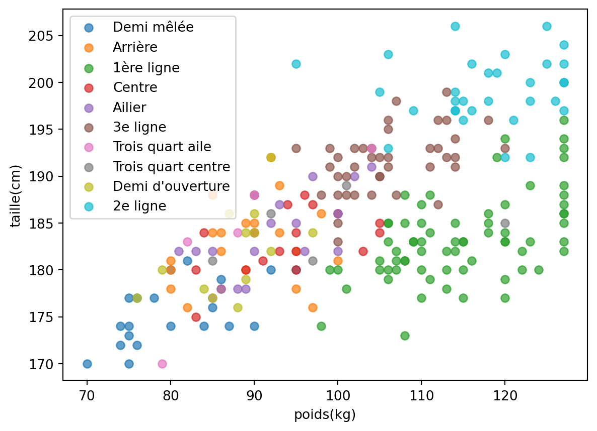
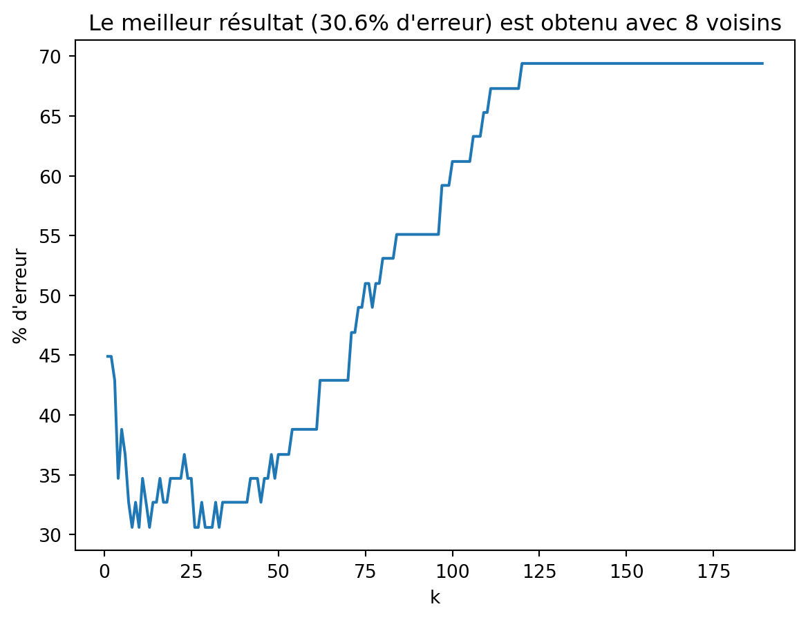

<h2 id="classification-des-joueurs-du-top-14" class="anchored">Classification des joueurs du top 14</h2>

Vous allez travailler sur un tableau de données des joueurs de rugby du top-14 de la saison 2019-2020 issues de la page de la ligue nationale de rugby:

https://www.lnr.fr/rugby-top-14/joueurs-rugby-top-14

Votre travail consiste à attribuer un poste sur le terrain à un joueur à partir de son poids et de sa taille en utilisant l’<em>algorithme des k plus proches voisins</em>:

<ul>
<li>Demi mêlée,</li>
<li>Arrière,</li>
<li>1ère ligne,</li>
<li>…</li>
</ul>
<h3 id="lecture-des-données" class="anchored">Lecture des données</h3>

On commence par lire les données du fichier <a href="./joueurs-top14.csv"><code>joueurs-top14.csv</code></a> sous la forme d’un tableau de tableau.

<pre>import csv

## Lecture du fichier csv
## et stockage dans une liste de liste
## taille, le poids et le poste si non vide
joueurs = []
with open('./joueurs-top14.csv', encoding="utf-8") as csvfile:
    reader = csv.DictReader(csvfile)
    # Itération sur les lignes
    for ligne in reader:
        taille = ligne["taille(cm)"]
        poids = ligne["poids(kg)"]
        poste = ligne["poste"]
        if taille and poids and poste:
            joueurs.append([int(taille), int(poids), poste])

print("Nbre de joueurs:", len(joueurs))
print("Premier joueur:", joueurs[0])
print("Quatrième joueur:", joueurs[3])
</pre>

<pre>Nbre de joueurs: 239
Premier joueur: [176, 85, 'Demi mêlée']
Quatrième joueur: [180, 95, 'Centre']
</pre>

<h3 id="lister-les-postes" class="anchored">Lister les postes</h3>

Compléter le code suivant pour créer une liste des postes existants.

<pre>postes = []
for joueur in joueurs:
    poste = ...
    if poste not in postes:
        ...
        
## tests
assert len(postes) == 10
print("Si on choisissait au hasard on aurait une chance sur 10")
print("Soit 90% d'erreurs")
assert postes == ['Demi mêlée',
 'Arrière',
 '1ère ligne',
 'Centre',
 'Ailier',
 '3e ligne',
 'Trois quart aile',
 'Trois quart centre',
 "Demi d'ouverture",
 '2e ligne']
</pre>

<pre>postes = []
for joueur in joueurs:
    # le poste est à l'indice 2
    poste = joueur[2]
    if poste not in postes:
        postes.append(poste)

## tests
assert len(postes) == 10
print("Si on choisissait au hasard on aurait une chance sur 10")
print("Soit 90% d'erreur")
assert postes == ['Demi mêlée',
 'Arrière',
 '1ère ligne',
 'Centre',
 'Ailier',
 '3e ligne',
 'Trois quart aile',
 'Trois quart centre',
 "Demi d'ouverture",
 '2e ligne']
</pre>

<pre>Si on choisissait au hasard on aurait une chance sur 10
Soit 90% d'erreur
</pre>

<h3 id="observation-des-postes-sur-un-graphique" class="anchored">Observation des postes sur un graphique</h3>

<pre>import matplotlib.pyplot as plt
def tracé_graph(joueurs):
    for poste in postes:
        # poids des joueurs à ce poste
        poids = [joueur[1] for joueur in joueurs if joueur[2]== poste]
        # taille des joueurs à ce poste
        tailles = [joueur[0] for joueur in joueurs if joueur[2]==poste]
        plt.scatter(poids, tailles, label=poste, alpha=0.7)
    # Annotations du graphique
    plt.xlabel("poids(kg)")
    plt.ylabel("taille(cm)")
    plt.legend()
       
tracé_graph(joueurs)
</pre>

<h3 id="séparation-des-données-pour-le-test" class="anchored">Séparation des données pour le test</h3>

On divise les données en deux parties:

<ul>
<li>entrainement: les 190 premiers joueurs</li>
<li>test: les 49 derniers</li>
</ul>

<pre>train = [joueurs[i] for i in range(190)]
test = [joueurs[i] for i in range(190, len(joueurs))]
len(train), len(test)
</pre>

<pre>(190, 49)
</pre>

<h3 id="implémentation-de-la-fonction-distance" class="anchored">Implémentation de la fonction distance</h3>

On mesure la distance Euclidienne entre deux joueurs sur le graphique grâce au théorème de Pythagore dans la fonction <code>def distance(j1, j2)</code>.

<pre>def distance(j1, j2):
    "calcule la distance euclidienne entre deux joueurs"
    x1, y1, p1 = j1
    x2, y2, p2 = j2
    return ((x2-x1)**2+(y2-y1)**2)**0.5

## appel entre les deux premiers joueurs des jeux de données
distance(train[0], test[0])
</pre>

<pre>30.01666203960727
</pre>

<h3 id="algorithme-du-plus-proche-voisin" class="anchored">Algorithme du plus proche voisin</h3>

On commnce par écrire une fonction qui recherche dans les données d’entrainement(<code>train</code>) le joueur le plus proche du joueur de test d’indice <code>i</code>.

<pre>def plus_proche(i: int):
    "Renvoie le poste du plus proche voisin dans train du joueur de test d'indice i"
    joueur_test = test[i]
    # on initialise l'indice et la distance minimum sur 
    # la première donnée d'entraînement
    j_mini = 0
    d_mini = distance(joueur_test, train[0])
    # on recherche le joueur avec la distance minimum
    # dans les données d'entrainement
    for j in range(len(train)):
        d = distance(joueur_test, train[j])
        ...
        
    return ...

print("Prévision juste pour le 1e joueur", test[0], plus_proche(0))
assert plus_proche(0) == test[0][2]
print("Prévision juste pour le 2e joueur", test[1], plus_proche(1))
assert plus_proche(1) == test[1][2]
print("Prévision juste pour le 3e joueur", test[2], plus_proche(2))
assert plus_proche(2) == test[2][2]
print("Prévision fausse pour le 4e joueur", test[3], plus_proche(3))
assert plus_proche(3) != test[3][2]
assert plus_proche(3) == 'Ailier' 
</pre>

<pre>def plus_proche(i: int):
    "Renvoie le poste du plus proche voisin dans train du joueur de test d'indice i"
    joueur_test = test[i]
    # on initialise la distance minimum sur 
    # des données d'entraînement
    j_mini = 0
    d_mini = distance(joueur_test, train[0])
    for j in range(len(train)):
        # on calcule la distance du joueur_test
        # avec le joueur d'indice j
        d = distance(joueur_test, train[j])
        if d &lt; d_mini:
            # c'est le nouveau minimum
            j_mini = j
            d_mini = d
    # je renvoie le poste(indice 2) du 
    # joueur étant à l'indice i_mini
    return train[j_mini][2]

print("Prévision juste pour le 1e joueur", test[0], plus_proche(0))
assert plus_proche(0) == test[0][2]
print("Prévision juste pour le 2e joueur", test[1], plus_proche(1))
assert plus_proche(1) == test[1][2]
print("Prévision juste pour le 3e joueur", test[2], plus_proche(2))
assert plus_proche(2) == test[2][2]
print("Prévision fausse pour le 4e joueur", test[3], plus_proche(3))
assert plus_proche(3) != test[3][2]
assert plus_proche(3) == 'Ailier' 
</pre>

<pre>Prévision juste pour le 1e joueur [177, 115, '1ère ligne'] 1ère ligne
Prévision juste pour le 2e joueur [182, 110, '1ère ligne'] 1ère ligne
Prévision juste pour le 3e joueur [203, 120, '2e ligne'] 2e ligne
Prévision fausse pour le 4e joueur [181, 100, 'Arrière'] Ailier
</pre>

<h3 id="calcul-du-taux-derreur" class="anchored">Calcul du taux d’erreur</h3>

Puisque l’algorithme commet des erreurs regardons combien il en fait et quel pourcentage cela représente.

<pre>erreur = 0
## compte le nb de fausses prédictions
for i in range(len(test)):
    poste_predit = plus_proche(i)
    poste_reel = test[i][2]
    if ...:
        ...

assert erreur == 22
print(round(100*erreur/len(test), 1), "% d'erreur")  
</pre>

<pre>erreur = 0
for i in range(len(test)):
    poste_predit = plus_proche(i)
    poste_reel = test[i][2]
    if poste_predit != poste_reel:
        erreur = erreur + 1

assert erreur == 22
print(round(100*erreur/len(test), 1), "% d'erreur")     
</pre>

<pre>44.9 % d'erreur
</pre>

<h3 id="algorithme-des-k-plus-proches-voisins" class="anchored">Algorithme des k plus proches voisins</h3>

Plutôt que de regarder le plus proche voisin, nous allons regarder les k plus proches voisins du joueur de test dans les données d’entrainement.

Pour cela nous allons créer une liste des postes des plus proches voisins, puis grâce à la fonction suivante, nous en déduirons le poste le plus probable d’après ces voisins.

<pre>def occurence_max(tab):
    "Renvoie la valeur qui a le plus d'occurences dans un tableau"
    dico = {k: 0 for k in tab}
    for k in tab:
        dico[k] += 1
    
    maxi, k_max = 0 , 0
    for k, v in dico.items():
        if v &gt; maxi:
            maxi, k_max = v , k
    return k_max

assert occurence_max(["Ailier", "Ailier", "Pilier"]) == "Ailier"
assert occurence_max(["Ailier", "Pilier", "Ailier"]) == "Ailier"
assert occurence_max(["Pilier", "Ailier",  "Pilier",]) == "Pilier"
</pre>

Il ne reste plus qu’à créer cette liste de poste des plus proches voisins dans la fonction suivante.

<pre>def k_plus_proche(i: int, k:int):
    "Renvoie le poste d'après les k plus proches voisins du joueur de test d'indice i dans train"
    # joueur dont on cherche le poste
    joueur_test = test[i]
    # liste destinée à accueillir les postes des k plus proches voisins
    postes_voisins = []
    for j in range(len(train)):
        ...
    
    return occurence_max(poste_voisins)

## En fonction de k la prévision n'est pas la même
assert k_plus_proche(3, 1) == 'Ailier'
assert k_plus_proche(3, 5) == '1ère ligne'
</pre>

<pre>def k_plus_proche(i: int, k:int):
    "Renvoie le poste d'après les k plus proches voisins du joueur de test d'indice i dans train"
    joueur_test = test[i]
    # on crée un tabelau avec toutes les distances et les indices
    distances = []
    for j in range(len(train)):
        joueur = train[j]
        distances.append((distance(joueur, joueur_test), j))
    # on tri la liste par distance
    distances.sort()
    # on ne garde que les k premiers
    poste_voisins = [train[distances[j][1]][2] for j in range(k)]
    
    return occurence_max(poste_voisins)

## En fonction de k la prévision n'est pas la même
assert k_plus_proche(3, 1) == 'Ailier'
assert k_plus_proche(3, 5) == '1ère ligne'
</pre>

<h3 id="recherche-de-la-meilleure-valeur-de-k" class="anchored">Recherche de la meilleure valeur de k</h3>

Nous allons tracer le taux d’erreur en fonction du nombre k de voisins choisis pour trouver la meilleure valeur de k possible.

<pre>xs = []
ys = []
for k in range(1, len(train)):
    erreur = 0
    for i in range(len(test)):
        joueur_test = test[i]
        if joueur_test[2] != k_plus_proche(i,k):
            erreur +=1
    xs.append(k)
    ys.append(round(100*erreur/len(test), 1))
    
plt.plot(xs, ys)
plt.xlabel('k')
plt.ylabel("% d'erreur")
plt.title(f"Le meilleur résultat ({min(ys)}% d'erreur) est obtenu avec {xs[ys.index(min(ys))]} voisins")
plt.show()
</pre>

<h3 id="améliorations-possibles" class="anchored">Améliorations possibles</h3>

Comme les tailles des joueurs sont à peu près deux fois plus grandes que les poids, on accorde une plus grande importance à leur taille. On pourrait:

<ul>
<li>Normaliser les tailles et poids.</li>
<li>Utiliser l’IMC.</li>
<li>Rechercher d’autres informations qui nous informeraient sur leurs qualités physiques telles que leur temps au 100 m …</li>
</ul>

