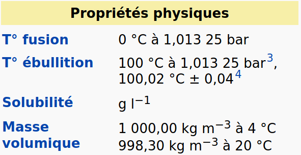

::: programme

**Notions étudiées au collège (cycle 4)**

Échelle macroscopique : espèce chimique, corps purs, mélanges, composition de l’air,
masse volumique, propriétés des changements d’état, solutions : solubilité, miscibilité.

Échelle microscopique : molécules, atomes et ions, constituants de l’atome (noyau et
électrons) et du noyau (neutrons et protons), formule chimique d’une molécule, formules $O_2$,
$H_2$, $N_2$ , $H_2O$, $CO_2$.

+------------------------------------+---------------------------------------------------------------+
|      **Notions et contenus**       |                    **Capacités exigibles**                    |
|                                    |    **_Activités expérimentales support de la formation_**     |
+====================================+===============================================================+
| **Corps purs et mélanges au**      |                                                               |
| **quotidien.**                     |                                                               |
+------------------------------------+---------------------------------------------------------------+
| Espèce chimique, corps pur,        | Citer des exemples courants de corps purs et de               |
| mélanges d’espèces                 | mélanges homogènes et hétérogènes.                            |
| chimiques, mélanges homogènes      |                                                               |
| et hétérogènes.                    |                                                               |
+------------------------------------+---------------------------------------------------------------+
| Identification d’espèces chimiques | Identifier, à partir de valeurs de référence, une espèce      |
| dans un échantillon de matière     | chimique par ses températures de changement d’état, sa        |
| par des mesures physiques ou       | masse volumique ou par des tests chimiques.                   |
| des tests chimiques.               |                                                               |
|                                    | Citer des tests chimiques courants de présence d’eau, de      |
|                                    | dihydrogène, de dioxygène, de dioxyde de carbone.             |
|                                    |                                                               |
|                                    | Citer la valeur de la masse volumique de l’eau liquide et     |
|                                    | la comparer à celles d’autres corps purs et mélanges.         |
|                                    | Distinguer un mélange d’un corps pur à partir de données      |
|                                    | expérimentales.                                               |
|                                    |                                                               |
|                                    | _Mesurer une température de changement d’état,                |
|                                    | déterminer la masse volumique d’un échantillon, réaliser      |
|                                    | une chromatographie sur couche mince, mettre en œuvre_        |
|                                    | des tests chimiques, pour identifier une espèce chimique      |
|                                    | _et, le cas échéant, qualifier l’échantillon de mélange._     |
+------------------------------------+---------------------------------------------------------------+
| Composition massique d’un          | Citer la composition approchée de l’air et l’ordre de         |
| mélange.                           | grandeur de la valeur de sa masse volumique.                  |
|                                    |                                                               |
| Composition volumique de l’air.    | Établir la composition d’un échantillon à partir de données   |
|                                    | expérimentales.                                               |
|                                    |                                                               |
|                                    | Mesurer des volumes et des masses pour estimer la             |
|                                    | composition de mélanges.                                      |
|                                    |                                                               |
|                                    | **Capacité mathématique** : utiliser les pourcentages et les  |
|                                    | fractions.                                                    |
+------------------------------------+---------------------------------------------------------------+

:::

## Corps purs et mélanges

Éspèce chimique

:   Une espèce chimique est un ensemble d’entités chimiques(atomes, ions, molécules) identiques.

Corps pur

:   Un corps pur est constitué d'une seule espèce chimique.

::: examples
- L'eau $\ce{H2O}$
- Le fer $\ce{Fe}$
- Le chlorure de sodium $\ce{NaCl}$
:::

Mélange

:   Un mélange est constitué de plusieurs espèces chimiques.

::: examples
- l'eau de mer
- l'air
- roches
:::

::: prop
Un mélange est:

- **hétérogène** si ses constituants peuvent être distingués à l'oeil nu(p.ex: une vinaigrette)
- **hétérogène** dans le cas contraire(p.ex: de l'eau salée).
:::

`h5p: 1248351624`

## Identification d’espèces chimiques

### Propriétés physiques

Une espèce chimique présente des caractéristiques qui la rendent unique:

- température de fusion
- température d'ébullition
- masse volumique
- ...

::: example

Extrait des propriétés physiques de l'eau sur wikipedia.fr

:::

Masse volumique

:   La masse volumique d'une espèce chimique ou d'un mélange est la
    rapport de sa masse $m$ et de son volume $V$.
    $$
    \rho=\frac{m}{V}
    $$
    

::: examples
La masse volumique de l'eau est de 1.0kg/L, l'huile: 920g/L, sang:1.06kg/L
:::

### Tests chimiques

On peut identifier une espèce chimique grâce une *réaction chimique*.

::: examples

- l'eau fait bleuir le sulfate de cuivre anhydre.
- le dihydrogène produit une détonation si on approche une allumette
- le dioxygène rallume une allumette incandescente
- le dioxyde de carbone trouble l'eau de chaux

:::

## Composition d'un mélange

On peut exprimer la composition d'un mélange soit:

- en fonction de la masse: $\frac{m(constituant)}{m(tot)}$
- en fonction du volume: $\frac{V(constituant)}{V(tot)}$

::: example

Composition volumique de l'air:

- 78% de diazote
- 21% de dioxygène
- 1% d'autres gazs.

:::

::: {.appli titre="Composition massique de l'eau de mer"}
1L d'eau de mer contient 1kg d'eau et 30 g de chlorure de sodium. 

Donner la composition massique de l'eau et du sel dans l'eau de mer et les exprimer sous forme de
pourcentages.

:::

