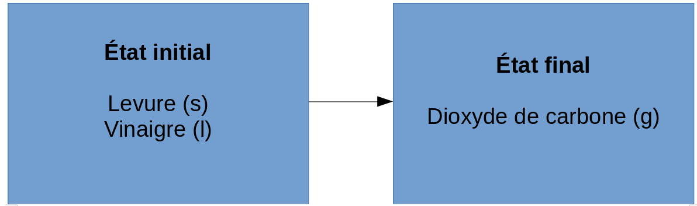
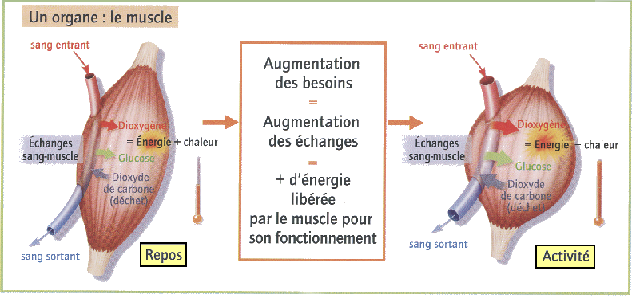

::: programme

**Notions abordées au collège (cycle 4)**

Transformations chimiques : conservation de la masse, redistribution d’atomes, notion
d’équation chimique, réactions entre espèces acides et basiques en solution, réactions d'une
espèce acide sur un métal, mesure de pH.

+------------------------------------+------------------------------------------------------------------+
|      **Notions et contenus**       |                     **Capacités exigibles**                      |
|                                    |      **_Activités expérimentales support de la formation_**      |
+====================================+==================================================================+
| Modélisation macroscopique d’une   | Modéliser, à partir de données expérimentales, une               |
| transformation par une réaction    | transformation par une réaction, établir l’équation de           |
| chimique.                          | réaction associée et l’ajuster.                                  |
|                                    |                                                                  |
| Écriture symbolique d’une réaction | Identifier le réactif limitant à partir des quantités de matière |
| chimique.                          | des réactifs et de l'équation de réaction.                       |
|                                    |                                                                  |
| Notion d’espèce spectatrice.       | _Déterminer le réactif limitant lors d’une transformation_       |
|                                    | _chimique totale, à partir de l’identification des espèces_      |
| Stœchiométrie, réactif limitant.   | _chimiques présentes dans l’état final._                         |
|                                    |                                                                  |
| Transformations chimiques          | Modéliser, par l’écriture d’une équation de réaction, la         |
| endothermiques et exothermiques.   | combustion du carbone et du méthane, la corrosion d’un           |
|                                    | métal par un acide, l’action d’un acide sur le calcaire,         |
|                                    | l’action de l’acide chlorhydrique sur l’hydroxyde de sodium      |
|                                    | en solution.                                                     |
|                                    |                                                                  |
|                                    | _Suivre l’évolution d’une température pour déterminer le_        |
|                                    | _caractère endothermique ou exothermique d’une_                  |
|                                    | _transformation chimique et étudier l’influence de la masse_     |
|                                    | _du réactif limitant._                                           |
|                                    |                                                                  |
|                                    | **Capacité mathématique** : utiliser la proportionnalité.        |
+------------------------------------+------------------------------------------------------------------+
| Synthèse d’une espèce chimique     | Établir, à partir de données expérimentales, qu’une espèce       |
| présente dans la nature.           | chimique synthétisée au laboratoire peut être identique à        |
|                                    | une espèce chimique synthétisée dans la nature.                  |
|                                    |                                                                  |
|                                    | Réaliser le schéma légendé d’un montage à reflux et d’une        |
|                                    | chromatographie sur couche mince.                                |
|                                    |                                                                  |
|                                    | _Mettre en œuvre un montage à reflux pour synthétiser une_       |
|                                    | _espèce chimique présente dans la nature._                       |
|                                    |                                                                  |
|                                    | _Mettre en œuvre une chromatographie sur couche mince_           |
|                                    | _pour comparer une espèce synthétisée et une espèce_             |
|                                    | _extraite de la nature._                                         |
+------------------------------------+------------------------------------------------------------------+
:::

<!-- 
## Transformation chimique

Lors d'une transformation chimique, certaines espèces chimiques apparaissent : les **réactifs**, et
de nouvelles espèces chimiques se forment, les **produits**.

::: example
|- Réaction entre le vinaigre et la levure
|

::: prop
En fonction ds quantités initiales de réactifs, il peut y avoir des restes d'un des
réactifs dans l'état final. Ce réactif est appelé le **réactif en excès**. 
:::

-->

## Équation chimique

Pour décrire l'évolution d'un système chimique, on utilise le modèle de la réaction chimique:

$$
R\acute{e}actif(s) \longrightarrow Produit(s)
$$

::: example
- réaction du glucose dans les muscles.

[Cours de 5ème de Benoit Ramière]()-Licence CC{.cite-source}

$$
Glucose + dioxyg\grave{e}ne \longrightarrow dioxyde\ de\ carbone + eau
$$
:::

::: prop
Des échanges d'énergie peuvent se produire lors d'une transformation chimique.
:::

## Equilibrage d'une équation chimique

::: prop
Tous les éléments et charges électriques présents dans les réactifs doivent se retrouver
dans les produits : **c'est la loi de conservation des éléments et de la charge électrique.**
:::

Pour respecter cette loi, il faut équilibrer l'équation de la réaction
en utilisant des **nombres stœchiométriques** que l'on place devant les
formules brutes des molécules.

L'équation équilibrée de la réaction du glucose C~6~H~12~O~6~ avec le dioxgène O~2~ s'écrit :

