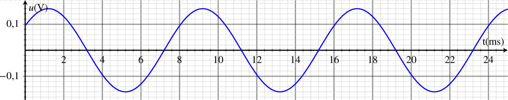

::: programme

**Notions abordées au collège (cycle 4)**

Vitesse de propagation. Notion de fréquence : sons audibles, infrasons et ultrasons.

+---------------------------------------+-------------------------------------------------------------------+
|        **Notions et contenus**        |                      **Capacités exigibles**                      |
|                                       |      **_Activités expérimentales support de la formation_**       |
+=======================================+===================================================================+
| Émission et propagation d'un signal   | Décrire le principe de l’émission d’un signal sonore par la       |
| sonore.                               | mise en vibration d’un objet et l’intérêt de la présence d’une    |
|                                       | caisse de résonance.                                              |
|                                       |                                                                   |
|                                       | Expliquer le rôle joué par le milieu matériel dans le             |
|                                       | phénomène de propagation d’un signal sonore.                      |
+---------------------------------------+-------------------------------------------------------------------+
| Vitesse de propagation d’un signal    | Citer une valeur approchée de la vitesse de propagation           |
| sonore.                               | d’un signal sonore dans l’air et la comparer à d’autres           |
|                                       | valeurs de vitesses couramment rencontrées.                       |
|                                       |                                                                   |
|                                       | _Mesurer la vitesse d’un signal sonore._                          |
+---------------------------------------+-------------------------------------------------------------------+
| Signal sonore périodique,             | Définir et déterminer la période et la fréquence d’un signal      |
| fréquence et période. Relation        | sonore notamment à partir de sa représentation temporelle.        |
| entre période et fréquence.           |                                                                   |
|                                       | _Utiliser une chaîne de mesure pour obtenir des informations_     |
|                                       | _sur les vibrations d’un objet émettant un signal sonore._        |
|                                       |                                                                   |
|                                       | _Mesurer la période d’un signal sonore périodique._               |
|                                       |                                                                   |
|                                       | _Utiliser un dispositif comportant un microcontrôleur pour_       |
|                                       | _produire un signal sonore._                                      |
|                                       |                                                                   |
|                                       | **Capacités mathématiques** : identifier une fonction             |
|                                       | périodique et déterminer sa période.                              |
+---------------------------------------+-------------------------------------------------------------------+
| Perception du son : lien entre        | Citer les domaines de fréquences des sons audibles, des           |
| fréquence et hauteur ; lien entre     | infrasons et des ultrasons.                                       |
| forme du signal et timbre ; lien      |                                                                   |
| qualitatif entre amplitude, intensité | Relier qualitativement la fréquence à la hauteur d’un son         |
| sonore et niveau d’intensité sonore.  | audible.                                                          |
|                                       |                                                                   |
| Échelle de niveaux d’intensité        | Relier qualitativement intensité sonore et niveau d’intensité     |
| sonore.                               | sonore.                                                           |
|                                       |                                                                   |
|                                       | Exploiter une échelle de niveau d’intensité sonore et citer       |
|                                       | les dangers inhérents à l’exposition sonore.                      |
|                                       |                                                                   |
|                                       | _Enregistrer et caractériser un son (hauteur, timbre, niveau_     |
|                                       | _d’intensité sonore, etc.) à l’aide d’un dispositif expérimental_ |
|                                       | _dédié, d’un smartphone, etc._                                    |
+---------------------------------------+-------------------------------------------------------------------+

:::

## Émission et propagation d'un son

Un son est produit par la mise en vibration d'un objet.

::: example
Vibration d'un haut-parleur.
`youtube: T1ICxWAOtgk`
:::

Une caisse de résonance permet d'amplifier le son émis.

`youtube: YRv4POv5jh4`

## Vitesse de propagation d’un signal sonore

Le son a besoin d'un milieu matériel pour se propager.

`youtube: Q58ns2rLXx8`

Les molécules ou atomes du milieu vibrent pour transmettre le son.

La vitesse du son dépend du _milieu_(et de la température).

::: examples

- dans l'air: 340m/s **(A CONNAITRE)**
- dans l'eau: 1400m/s
- dans le verre: 5 300 m/s

:::

## Période et fréquence d'un signal sonore périodique

Signal périodique

:   **Un signal périodique** est un signal qui se reproduit identique à lui-même à intervalles de temps
    égaux.

Période

:   **La période T** d'un signal périodique est la plus petite durée au bout de laquelle le signal se
    reproduit identique à lui-même.

::: {.appli titre="Mesurer T sur un graphique"}

Mesurer la période T de ce signal.

:::

Fréquence

:   La **fréquence f** est le nombre de périodes par seconde, elle se mesure en Hertz(Hz).

::: {.appli titre="Calcul"}

Calculer la fréquence du signal précédent.

:::

::: {.plus titre="En plus"}

Pour calculer une fréquence on peut utiliser un *tableau de proportionnalité* entre le nombre de
périodes et la durée, ou utiliser *la formule de la fréquence*.

$$
f=\frac{1}{T}
$$

- T : période en seconde (s)
- f : fréquence en Hertz(Hz)
:::

## Perception du son

::: prop

L'oreille humaine moyenne perçoit des ondes sonores dont les fréquences sont comprises entre 20 Hz
et 20 kHz.

:::

### Hauteur et fréquence d'un son

Plus le son a une fréquence élevée plus il est perçu **aiguë**, plus la fréquence est faible plus il
est perçu **grave**.

### Niveau d'intensité sonore

L'intensité sonore I se mesure en $W.m^{-2}$ mais on utilise plutôt le niveau d'intensité sonore
$L$ en décibel (dB).

 Image par <a href="//commons.wikimedia.org/wiki/User:PolBr" title="User:PolBr">PolBr</a> — Travail personnel, <a href="https://creativecommons.org/licenses/by-sa/3.0" title="Creative Commons Attribution-Share Alike 3.0">CC BY-SA 3.0</a>, <a href="https://commons.wikimedia.org/w/index.php?curid=19442878">Lien</a>

L'exposition sonore dépend non seulement du niveau d'intensité sonore mais aussi du temps d'exposition.

::: examples

- à 120 dB, quelques secondes suffisent à provoquer des dégâts irréversibles,
- à 100 dB(niveau maximum d'écouteurs) la durée limite d'exposition est de 15'.
- à 85 dB: 8h /jour maximum.

:::
