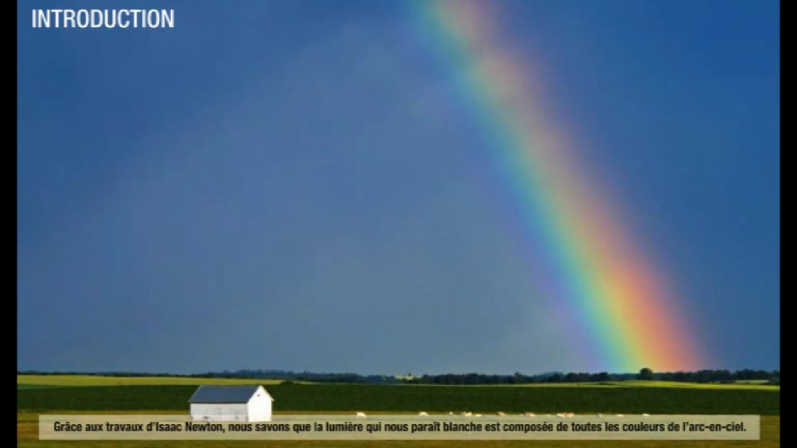

::: programme

**Notions abordées au collège (cycle 4)**

Lumière : sources, propagation, vitesse de propagation. Modèle du rayon lumineux.

+-------------------------------------+----------------------------------------------------------------+
|       **Notions et contenus**       |                    **Capacités exigibles**                     |
|                                     |     **_Activités expérimentales support de la formation_**     |
+=====================================+================================================================+
| Propagation rectiligne de la        | Citer la valeur de la vitesse de la lumière dans le vide ou    |
| lumière.                            | dans l’air et la comparer à d’autres valeurs de vitesses       |
|                                     | couramment rencontrées.                                        |
| Vitesse de propagation de la        |                                                                |
| lumière dans le vide ou dans l’air. |                                                                |
+-------------------------------------+----------------------------------------------------------------+
| Lumière blanche, lumière colorée.   | Caractériser le spectre du rayonnement émis par un corps       |
| Spectres d’émission : spectres      | chaud.                                                         |
| continus d’origine thermique,       |                                                                |
| spectres de raies.                  | Caractériser un rayonnement monochromatique par sa             |
|                                     | longueur d’onde dans le vide ou dans l’air.                    |
| Longueur d’onde dans le vide ou     |                                                                |
| dans l’air.                         | Exploiter un spectre de raies.                                 |
+-------------------------------------+----------------------------------------------------------------+

:::

## Propriétés de la lumière

La lumière est une onde électromagnétique dont la longueur d'onde est comprise entre environ 400 et
800 nm.

 By <a href="//commons.wikimedia.org/w/index.php?title=User:Benjaminabel&amp;action=edit&amp;redlink=1" class="new" title="User:Benjaminabel (page does not exist)">Benjaminabel</a> - Own work, <a href="http://creativecommons.org/publicdomain/zero/1.0/deed.en" title="Creative Commons Zero, Public Domain Dedication">CC0</a>, <a href="https://commons.wikimedia.org/w/index.php?curid=75022580">Link</a>

Dans un milieu homogène, la lumière se propage en ligne droite.

 Image par <a href="https://en.wikipedia.org/wiki/fr:Jack_Delano" class="extiw" title="w:fr:Jack Delano">Jack Delano</a> — <a href="https://en.wikipedia.org/wiki/Library_of_Congress" class="extiw" title="w:Library of Congress">Library of Congress</a>, <a rel="nofollow" class="external text" href="https://www.loc.gov/rr/print/">Prints and Photographs Division</a>, reproduction number <a rel="nofollow" class="external text" href="http://hdl.loc.gov/loc.pnp/cph.3c30260">LC-USZ62-130260</a>
<a rel="nofollow" class="external text" href="http://memory.loc.gov/master/pnp/cph/3c30000/3c30000/3c30200/3c30260u.tif">scan of a b&amp;w film copy neg. from print, 12MB TIFF file</a>, cropped to remove print edges, denoising, rescaled and converted to JPEG
<a href="https://en.wikipedia.org/wiki/Farm_Security_Administration" class="extiw" title="w:Farm Security Administration">Farm Security Administration</a> / Office of War Information / Office of Emergency Management / Resettlement Administration, Domaine public, <a href="https://commons.wikimedia.org/w/index.php?curid=53096">Lien</a>

On la modélise par un rayon lumineux.

 <a href="http://creativecommons.org/licenses/by-sa/3.0/" title="Creative Commons Attribution-Share Alike 3.0">CC BY-SA 3.0</a>, <a href="https://commons.wikimedia.org/w/index.php?curid=355832">Lien</a>

La vitesse de la lumière dans le vide ou dans l'air est d'nviron 300 mille kilomètres par seconde.

On la note $c$ pour célérité:

$$
c = 300\times10^3 km.s^{-1} = 3,00\times10^5 km.s^{-1} = 3,00\times10^8 m.s^{-1}
$$

## Les spectres lumineux

Le spectre d'une source lumineuse peut-être obtenu avec un **prisme** ou un **réseau**.

::: prop

Le spectre révèle l'ensemble des **radiations lumineuses**(couleurs) présentes dans la source.
Chaque *radiation lumineuse* est repérée par sa **longueur d'onde** $\lambda$ qui s'exprime
habituellement en nanomètre(nm).

:::

### Spectre continu d'un corps chaud

Un corps chaud émet un spectre continu de lumière dont la composition dépend de la température.

`phet: blackbody-spectrum`

### Spectre de raies d'un élément chimique

::: prop

Chaque élément chimique possède un **spectre de raies** caractéristique.

:::

Voici par exemple le spectre d'une lampe à vapeur de mercure.

 By <a href="https://en.wikipedia.org/wiki/User:Timichio" class="extiw" title="wikipedia:User:Timichio">Timichio</a> at <a href="https://en.wikipedia.org/wiki/" class="extiw" title="wikipedia:">English Wikipedia</a> - This file was derived from:&nbsp; <a href="//commons.wikimedia.org/wiki/File:HG-Spektrum.jpg" title="File:HG-Spektrum.jpg">HG-Spektrum.jpg</a>, <a href="https://creativecommons.org/licenses/by-sa/3.0" title="Creative Commons Attribution-Share Alike 3.0">CC BY-SA 3.0</a>, <a href="https://commons.wikimedia.org/w/index.php?curid=23246535">Link</a>

::: example

- hydrogène: 657-556-486-434-410 nm
- sodium : 589 nm

:::

<!-- 
## Le spectre des étoiles

L'analyse du spectre de la lumière des étoiles nous permet de connaître:

- leur température,
- leur composition chimique.

Observer cette vidéo de la [médiathèque du cea](http://www.cea.fr/multimedia) qui explique comment
est déterminée la **composition du Soleil**.

### Température et couleur

Le surface de l'étoile dense et chaude émet une lumière ayant un **spectre continu**.

::: prop
Plus le corps est chaud et plus son spectre s'enrichit de basses longueurs d'onde(bleu, violet).
:::

::: {.appli title="Observation des profils spectraux de corps chauds"}
<https://phet.colorado.edu/fr/simulation/legacy/blackbody-spectrum>
:::

Ainsi, les étoiles froides ont une couleur rougeâtre, et plus une étoile est
chaude et plus sa couleur devient bleutée.

 <a href="http://creativecommons.org/licenses/by-sa/3.0/" title="Creative Commons Attribution-Share Alike 3.0">CC BY-SA 3.0</a>, <a href="https://commons.wikimedia.org/w/index.php?curid=1141520">Link</a>

::: prop
Le soleil a une température d'environ 6&nbsp;000 °C en surface(étoile de type G)
:::

::: example
Les étoiles de la constellation d'Orion.
<https://en.wikipedia.org/wiki/Wien%27s_displacement_law#/media/File:Orion_3008_huge.jpg>
:::

### Raies d'absorption et éléments chimiques

Les **raies d'absorption** présentes dans le spectre de l'étoile nous renseignent sur la composition
de son atmosphère*(appelée photosphère)*.

::: {.appli title="Animation sur le spectre du Soleil"}
[Lien vers l'animation sur ostralo.net](http://www.ostralo.net/3_animations/swf/spectres_soleil.swf)
:::
 -->
