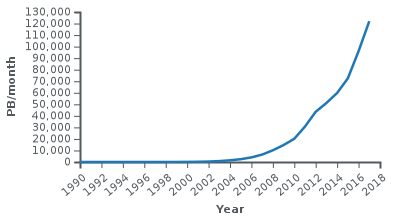

Programme Officiel

<table class="table table-bordered table-hover">
<thead class="table-warning">
<tr class="header">
<th>
<pre>       Contenus
</pre>

</th>
<th>
<pre>                  Capacités attendues
</pre>

</th>
</tr>
</thead>
<tbody>
<tr class="odd">
<td>Indépendance d’internet par rapport au réseau physique</td>
<td>
Caractériser quelques types de réseaux physiques : obsolètes ou actuels, rapides ou lents, filaires ou non.

Caractériser l’ordre de grandeur du trafic de données sur internet et son évolution.
</td>
</tr>
<tr class="even">
<td>Réseaux pair-à-pair</td>
<td>Décrire l’intérêt des réseaux pair-à-pair ainsi que les usages illicites qu’on peut en faire.</td>
</tr>
<tr class="odd">
<td>Protocole TCP/IP : paquets, routage des paquets</td>
<td>
Distinguer le rôle des protocoles IP et TCP.

Caractériser les principes du routage et ses limites.

Distinguer la fiabilité de transmission et l’absence de garantie temporelle.
</td>
</tr>
<tr class="even">
<td>Adresses symboliques et serveurs DNS</td>
<td>Sur des exemples réels, retrouver une adresse IP à partir d’une adresse symbolique et inversement.</td>
</tr>
</tbody>
</table>
<table class="table table-bordered table-hover">
<thead class="table-warning">
<tr class="header">
<th>
<pre>                               **Exemples d’activités**
</pre>

</th>
</tr>
</thead>
<tbody>
<tr class="odd">
<td><ul>
<li>Illustrer le fonctionnement du routage et de TCP par des activités débranchées ou à l’aide de logiciels dédiés, en tenant compte de la destruction de paquets.</li>
<li>Déterminer l’adresse IP d’un équipement et l’adresse du DNS sur un réseau.</li>
<li>Suivre le chemin d’un courriel en utilisant une commande du protocole IP.</li>
</ul></td>
</tr>
</tbody>
</table>
<a class="lien-programme" href="../programme/">Lien vers le programme complet</a>

Dans cette partie, nous allons nous intéresser à internet: <strong>le réseau des réseaux</strong>. Né en 1983, il est aujourd’hui incontournable, mais comment est-il né et comment fonctionne-t-il? Souvent confondu avec le web (le réseau d’informations reliées par l’hypertexte), le réseau internet est le réseau de machines permettant le transport de ces informations, mais pas que!

<wc-wikimage title="Internet-transit.svg" caption="Internet est constitué de la multitude de réseaux répartis dans le monde entier et interconnectés."></wc-wikimage>

QCU diagnostique

On commence par tester ses connaissances en utilisant le QCU P34-35 du <a href="https://www.editions-delagrave.fr/livre/9782206103389-sciences-numeriques-et-technologie-snt-2de-2019-manuel-eleve">manuel de Delagrave</a>

Lien vers la version en ligne: <a href="https://lienmini.fr/3389-202" class="uri">https://lienmini.fr/3389-202</a>

<h2 id="lhistoire-dinternet" class="anchored">L’histoire d’Internet</h2>

<iframe width="560" height="315" src="https://invidious.projectsegfau.lt/embed/5ee6W1ODvFU" title="YouTube video player" frameborder="0" allow="accelerometer; autoplay; clipboard-write; encrypted-media; gyroscope; picture-in-picture" allowfullscreen=""></iframe>
<a href="https://www.youtube.com/watch?v=5ee6W1ODvFU">Vidéo</a> servie sans cookie via <a href="https://projectsegfau.lt/">Project Segfault</a>

L’ancêtre d’internet s’appelait <!-- arpanet --> ____________. Sur internet, les données sont acheminées sous forme de <!-- paquets --> ______________.

Les règles permettant la transmission des données sont les protocoles:

<ul>
<li>TCP qui <!-- assure le transport et l'intégrité des paquets dans le réseau --> ______________________________________________.</li>
<li>IP qui <!-- conduit les paquets à bon port --> ______________________________________________.</li>
</ul>
<h2 id="lessor-dinternet" class="anchored">L’essor d’internet</h2>

Internet a fait progressivement disparaître beaucoup des moyens de communication précédents:

<ul>
<li>_________________,</li>
<li>_________________,</li>
<li>_________________,</li>
<li>…</li>
</ul>

Son trafic augmente de façon <em>exponentielle</em>.

<figure class="figure">

<figcaption class="figure-caption">Évolution du trafic d’internet</figcaption>

</figure>

&nbsp;

Recherchez dans cette <a href="https://reseaux.orange.fr/questions/internet-mobile/definition-data">page</a> les consommations associées à divers usages d’internet et les classer par ordre croissant.

Le bit et l'octet: unités d'information

Les machines que nous utilisons actuellement fonctionnent sur des circuits électroniques à deux états notés 0 ou 1.

Toutes les données sont codées en binaire, mais cette unité est tellement petite on utilise plus communément d’autres unités comme:

<ul>
<li>l’octet: <math xmlns="http://www.w3.org/1998/Math/MathML"><semantics><mrow><mn>1</mn><mtext>&nbsp;</mtext><mi>o</mi><mo>=</mo><mn>8</mn><mtext>&nbsp;</mtext><mi>b</mi><mi>i</mi><mi>t</mi><mi>s</mi></mrow><annotation encoding="application/x-tex">1~o = 8~bits</annotation></semantics></math>1&nbsp;o=8&nbsp;bits
,</li>
<li>le kibioctet: <math xmlns="http://www.w3.org/1998/Math/MathML"><semantics><mrow><mn>1</mn><mi>k</mi><mi>i</mi><mi>o</mi><mo>=</mo><msup><mn>2</mn><mn>10</mn></msup><mi>o</mi><mi>c</mi><mi>t</mi><mi>e</mi><mi>t</mi><mi>s</mi><mo>=</mo><mn>1</mn><mtext>&nbsp;</mtext><mn>024</mn><mtext>&nbsp;</mtext><mi>o</mi><mo>≈</mo><mn>1</mn><mtext>&nbsp;</mtext><mi>k</mi><mi>o</mi></mrow><annotation encoding="application/x-tex">1kio=2^{10} octets = 1~024~o \approx 1~ko</annotation></semantics></math>1kio=210octets=1&nbsp;024&nbsp;o≈1&nbsp;ko
,</li>
<li>le mébioctet: <math xmlns="http://www.w3.org/1998/Math/MathML"><semantics><mrow><mn>1</mn><mi>M</mi><mi>i</mi><mi>o</mi><mo>=</mo><msup><mn>2</mn><mn>20</mn></msup><mi>o</mi><mi>c</mi><mi>t</mi><mi>e</mi><mi>t</mi><mi>s</mi><mo>=</mo><mn>1</mn><mtext>&nbsp;</mtext><mn>048</mn><mtext>&nbsp;</mtext><mn>576</mn><mtext>&nbsp;</mtext><mi>o</mi><mo>≈</mo><mn>1</mn><mtext>&nbsp;</mtext><mi>M</mi><mi>o</mi></mrow><annotation encoding="application/x-tex">1Mio=2^{20} octets = 1~048~576~o \approx 1~Mo</annotation></semantics></math>1Mio=220octets=1&nbsp;048&nbsp;576&nbsp;o≈1&nbsp;Mo
,</li>
<li>le gibioctet: <math xmlns="http://www.w3.org/1998/Math/MathML"><semantics><mrow><mn>1</mn><mi>G</mi><mi>i</mi><mi>o</mi><mo>=</mo><msup><mn>2</mn><mn>30</mn></msup><mi>o</mi><mi>c</mi><mi>t</mi><mi>e</mi><mi>t</mi><mi>s</mi><mo>=</mo><mn>1</mn><mtext>&nbsp;</mtext><mn>073</mn><mtext>&nbsp;</mtext><mn>741</mn><mtext>&nbsp;</mtext><mn>824</mn><mo>≈</mo><mn>1</mn><mtext>&nbsp;</mtext><mi>G</mi><mi>o</mi></mrow><annotation encoding="application/x-tex">1Gio=2^{30} octets = 1~073~741~824 \approx 1~Go</annotation></semantics></math>1Gio=230octets=1&nbsp;073&nbsp;741&nbsp;824≈1&nbsp;Go
</li>
</ul>

<h2 id="les-protocoles-dinternet" class="anchored">Les protocoles d’internet</h2>

<iframe width="560" height="315" src="https://invidious.projectsegfau.lt/embed/5AVY6E-7yCc" title="YouTube video player" frameborder="0" allow="accelerometer; autoplay; clipboard-write; encrypted-media; gyroscope; picture-in-picture" allowfullscreen=""></iframe>
<a href="https://www.youtube.com/watch?v=5AVY6E-7yCc">Vidéo</a> servie sans cookie via <a href="https://projectsegfau.lt/">Project Segfault</a>

Afin que deux machines puissent communiquer, entre-elles à travers internet, des règles sont définies mondialement: les <strong>protocoles</strong>.

<wc-wikimage title="Internet-transit-2.svg" caption="Les réseaux constituant internet sont reliés par des routeurs. Les protocoles de routage indiquent les directions que doivent suivre les paquets en fonction de l'IP de destination notamment. Certains paquets peuvent se «perdre» et ils n'arrivent pas forcément dans l'ordre."></wc-wikimage>

<ul>
<li><strong>Le protocole IP</strong> donne une adresse unique à chaque machine du réseau internet.</li>
<li><strong>Le protocole TCP</strong> découpe l’information en paquets avant envoi et les vérifie à la réception puis les réordonne.</li>
</ul>

Il existe deux versions des adresses IP:

<table class="table">
<thead>
<tr class="header">
<th><strong>IPv4</strong></th>
<th><strong>IPv6</strong></th>
</tr>
</thead>
<tbody>
<tr class="odd">
<td>
Une adresse IP (version 4) est constituée de 4 nombres compris entre 0 et 255 séparés par des points.

<wc-wikimage title="Adresse_Ipv4.svg" caption="Chacun des quatre octets (8 bits) est un nombre compris entre 0 et 255 en notation décimale."></wc-wikimage>
</td>
<td>
Les adresses IPv6 sont représentées par huit nombres de quatre chiffres <em>hexadécimaux</em>(de 0 à F, <a href="https://www.lyceum.fr/1g/nsi/2-representation-des-donnees-types-et-valeurs-de-base/1-representation-des-entiers-naturels#codage-hexad%C3%A9cimal">voir</a>) chacun, séparés par deux-points.

<wc-wikimage title="Ipv6_address.svg" caption="Chacun des 8x4=24 chiffres hexadécimaux est compris entre 0 et F( soit 15 en décimal)."></wc-wikimage>
</td>
</tr>
<tr class="even">
<td>
Le nombre total d’adresse est <math xmlns="http://www.w3.org/1998/Math/MathML"><semantics><mrow><mn>255</mn><mo>×</mo><mn>255</mn><mo>×</mo><mn>255</mn><mo>×</mo><mn>255</mn><mo>=</mo><mn>25</mn><msup><mn>5</mn><mn>4</mn></msup></mrow><annotation encoding="application/x-tex">255 \times 255 \times 255 \times 255 = 255^4</annotation></semantics></math>255×255×255×255=2554
soit environ 4 milliards d’adresse ce qui est largement insuffisant.
</td>
<td>
Le nombre total d’adresse est <math xmlns="http://www.w3.org/1998/Math/MathML"><semantics><mrow><mn>1</mn><msup><mn>6</mn><mrow><mn>4</mn><mo>×</mo><mn>8</mn></mrow></msup><mo>≈</mo><mn>3</mn><mo>×</mo><mn>1</mn><msup><mn>0</mn><mn>38</mn></msup></mrow><annotation encoding="application/x-tex">16^{4\times8} \approx 3\times 10^{38}</annotation></semantics></math>164×8≈3×1038
qui devrait largement suffire pour longtemps.
</td>
</tr>
</tbody>
</table>

Quand on s’abonne auprès d’un FAI, on obtient une adresse <strong>IP</strong>, cette adresse permet d’identifier votre appareil sur le réseau.

Exemple: <code>185.15.58.224</code> est l’adresse des serveurs de Wikipédia: <a href="https://185.15.58.224" class="uri">https://185.15.58.224</a>

Pour obtenir son adresse IP on peut consulter un site comme: <a href="https://www.whatsmyip.org/" class="uri">https://www.whatsmyip.org/</a>.

Pou connaitre l’adresse d’un site, on peut utiliser la commande <code>ping</code>. Par exemple: <code>ping wikipedia.org</code>

<code>ping -4 wikipedia.org</code>

<code>&gt;&gt;&gt; PING  (185.15.58.224) 56(84) octets de données.</code>

Voici l’adresse IPv6 de Wikipédia.org <code>2a02:ec80:0600:ed1a:0000:0001</code>.

Pour l’utiliser dans un navigateur, il faut l’écrire entre crochets: <a href="https://%5B2a02:ec80:600:ed1a::1%5D/" class="uri">https://[2a02:ec80:600:ed1a::1]/</a>

<pre>ping -6 wikipedia.org
&gt;&gt;&gt;64&nbsp;octets de text-lb.drmrs.wikimedia.org (2a02:ec80:600:ed1a::1)&nbsp;: icmp_seq=1 ttl=47 temps=30.3&nbsp;ms
</pre>

<h2 id="noms-de-domaine-le-protocole-dns" class="anchored">Noms de domaine, le protocole DNS</h2>
<dl>
<dt>
Nom de domaine
</dt>
<dd>

Un nom de domaine est un « masque » sur une adresse IP. Le but d’un nom de domaine est de retenir et communiquer facilement l’adresse d’un ensemble de serveurs (site web, courrier électronique, FTP). <a href="https://fr.wikipedia.org/wiki/Nom_de_domaine" class="cite-source">Article Wikipédia</a>

</dd>
</dl>

Par exemple, <code>wikipedia.org</code> est plus simple à mémoriser que <code>208.80.154.224</code> ou <code>91.198.174.192</code>. <a href="https://fr.wikipedia.org/wiki/Domain_Name_System" class="cite-source">Article Wikipédia DNS</a>

Le système de nom de domaine est hiérarchique, permettant la définition de sous-domaines.

<wc-wikimage title="Dns-raum.svg" caption="Le nom de.wikipedia.org appartient aux domaines de premier niveau «.org»."></wc-wikimage>

<dl>
<dt>
DNS
</dt>
<dd>

Le Domain Name System ou DNS est un service informatique distribué sur Internet qui résout les noms de domaine Internet en adresse IP. <a href="https://fr.wikipedia.org/wiki/Domain_Name_System" class="cite-source">Article Wikipedia DNS</a>

</dd>
</dl>

<wc-wikimage title="Example_of_an_iterative_DNS_resolver.svg" caption="Un nom de domaine est résolu de droite à gauche grâce aux serveurs de noms DNS de plus en plus spécialisés jusqu'à obtenir l'adresse IP du nom de domaine tapé."></wc-wikimage>

<!-- ::: {.plus titre="La commande nslookup"}

Cette commande permet de trouver une adresse IP à partir d'un nom de domaine:

    [ben@archben ~]$ nslookup framasoft.org
    Server:         192.168.1.1
    Address:        192.168.1.1#53
    
    Non-authoritative answer:
    Name:   framasoft.org
    Address: 144.76.131.212
    Name:   framasoft.org
    Address: 2a01:4f8:141:3421::212

Ou l'inverse:

    [ben@archben ~]$ nslookup 144.76.131.212
    212.131.76.144.in-addr.arpa     name = edna.framasoft.org.

::: -->
<h2 id="communication-sur-internet" class="anchored">Communication sur Internet</h2>

<iframe width="560" height="315" src="https://invidious.projectsegfau.lt/embed/6ZazbI8faqw" title="YouTube video player" frameborder="0" allow="accelerometer; autoplay; clipboard-write; encrypted-media; gyroscope; picture-in-picture" allowfullscreen=""></iframe>
<a href="https://www.youtube.com/watch?v=6ZazbI8faqw">Vidéo</a> servie sans cookie via <a href="https://projectsegfau.lt/">Project Segfault</a>

&nbsp;

Répondre aux questions de l’activité PP 44-45 du <a href="https://www.editions-delagrave.fr/livre/9782206103389-sciences-numeriques-et-technologie-snt-2de-2019-manuel-eleve">manuel de Delagrave</a>.

On distingue deux principaux modes de communication.

<table class="table">
<thead>
<tr class="header">
<th><strong>Communication client-serveur</strong></th>
<th><strong>Communication pair à pair</strong></th>
</tr>
</thead>
<tbody>
<tr class="odd">
<td>
Une machine (<em>le client</em>) émet une requête vers une autre machine (<em>le serveur</em>) qui est la seule à pouvoir répondre à ces requêtes.
</td>
<td>
Dans un réseau pair à pair au contraire, chaque machine est à la fois client et serveur. Les deux machines communiquent directement sans intermédiaire.
</td>
</tr>
<tr class="even">
<td></td>
<td></td>
</tr>
<tr class="odd">
<td>La communication <strong>client-serveur</strong> est la plus utilisée actuellement web, courriel, Vod …</td>
<td>La communication <strong>pair à pair</strong> est beaucoup moins utilisée actuellement: <a href="https://ubuntu.com/download/alternative-downloads#bittorrent">Torrent</a>pour le partage de fichiers, <a href="https://en.wikipedia.org/wiki/Skype_protocol">Skype</a>: Communications audio et vidéos. <a href="https://joinpeertube.org/">peertube</a>: partage de vidéos alternative à youtube… Mais beaucoup y voit un avenir prometteur pour décentraliser le web et éviter le recours systématique au serveur des géants du web (GAFAM) qui au passage aspirent des données.</td>
</tr>
</tbody>
</table>

&nbsp;

Citer au moins un avantage et un inconvénient pour chaque type de communication.

<!--

Avantages:

Inconvénient:

- lorsque vous visitez la plateforme vous utilisez des ressources pour envoyer des données à
  d'autres utilisateurs.
  

## Organisation du réseau internet

 By <a href="//commons.wikimedia.org/wiki/User:Ludovic.ferre" title="User:Ludovic.ferre">User:Ludovic.ferre</a> - Internet Connectivity Distribution&amp;Core.svg, <a href="https://creativecommons.org/licenses/by-sa/3.0" title="Creative Commons Attribution-Share Alike 3.0">CC BY-SA 3.0</a>, <a href="https://commons.wikimedia.org/w/index.php?curid=10030716">Link</a>

<wc-wikimage title="Internet_Connectivity_Distribution_&_Core.svg" caption="Interconnexion des réseaux au sein d'internet."></wc-wikimage> 

Le réseau internet n'est pas centralisé, il n'y a pas une machine _centrale_ à laquelle sont
connectées toutes les autres. Les **routeurs** permettent de connecter les réseaux entre eux.

Pour se connecter à internet, il suffit de se connecter à une autre machine qui y est déjà
connectée.

::: examples

- connexion à une box par câble RJ45, par Wifi
- partage de connexion avec un téléphone par WIFI, câble USB
- WIFI public

:::

Pour accéder à internet, il faut:

- Avoir une machine avec un terminal(ou carte) réseau(ordinateur, téléphone, tablette...),
- se raccorder à un fournisseur d'accès à internet(FAI) par une connexion:
       - **filaire**: ADSL, VDSL2, fibre optique,
       - **sans fil**:
           - Wi-Fi, WiMAX,
           - via un réseau de téléphonie mobile (GSM/EDGE, 3G/UMTS, 3G+ ou LTE, 4G, 4G+, 5G, etc.)
           - ou par satellite. 

Internet par satellite: article le monde

::: plus

Cette organisation permet de rendre le réseau internet résilient face aux pannes, car
lorsque des pannes ont lieu, elles n'affectent pas la totalité du réseau et les échanges peuvent
transiter quand même par d'autres machines.

::: 

-->

