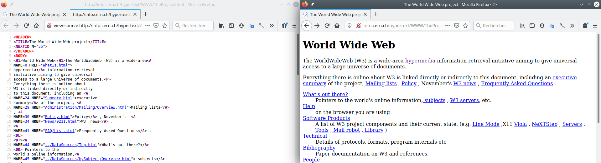
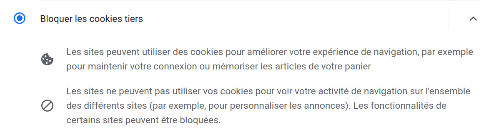

Programme Officiel

<table class="table table-bordered table-hover">
<thead class="table-warning">
<tr class="header">
<th>Contenus</th>
<th>Capacités attendues</th>
</tr>
</thead>
<tbody>
<tr class="odd">
<td>Repères historiques</td>
<td>Connaître les étapes du développement du <em>Web</em>.</td>
</tr>
<tr class="even">
<td>Hypertexte</td>
<td>Maîtriser les renvois d’un texte à différents contenus.</td>
</tr>
<tr class="odd">
<td>Requête HTTP</td>
<td>Décomposer le contenu d’une requête HTTP et identifier les paramètres passés.</td>
</tr>
<tr class="even">
<td>URL</td>
<td>Décomposer l’URL d’une page. Reconnaître les pages sécurisées.</td>
</tr>
<tr class="odd">
<td>Modèle client/serveur</td>
<td>Inspecter le code d’une page hébergée par un serveur et distinguer ce qui est exécuté par le client et par le serveur.</td>
</tr>
<tr class="even">
<td>Langages HTML et CSS</td>
<td>Distinguer ce qui relève du contenu d’une page et de son style de présentation. Étudier et modifier une page HTML simple.</td>
</tr>
<tr class="odd">
<td>Moteurs de recherche : principes et usages</td>
<td>Mener une analyse critique des résultats fournis par un moteur de recherche. Comprendre les enjeux de la publication d’informations.</td>
</tr>
<tr class="even">
<td>Paramètres de sécurité d’un navigateur</td>
<td>Maîtriser les réglages les plus importants concernant la gestion des cookies, la sécurité et la confidentialité d’un navigateur. Sécuriser sa navigation en ligne et analyser les pages et fichiers.</td>
</tr>
<tr class="odd">
<td>Notions juridiques</td>
<td></td>
</tr>
</tbody>
</table>
<a class="lien-programme" href="../programme/">Lien vers le programme complet</a>

Le <em>Web</em> (toile d’araignée) désigne un système donnant accès à un ensemble de données (page, image, son, vidéo) reliées par des liens hypertextes et accessibles sur le réseau internet.

<wc-wikimage title="WWW-LetShare.svg" caption="Logo original du World Wide Web créé en 1989 et ouvert au public en 1991."></wc-wikimage>

<!-- 

Ne confondons pas internet et le web. Le web, l'ensemble des documents électroniques accessibles
sur le réseau internet compte aujourd'hui près de _2 milliards de pages_ et est devenu omniprésent
dans notre vie grâce à l'utilisation d'_applications web dynamiques_. L'ensemble des documents
électroniques du web doivent pouvoir être consulté à partir de machines variées, ordinateurs,
tablettes, objets connectés. C'est pour cela que des _normes_ ont été mis au point pour garantir un
accès universel à tous.

Le web est un lieu «magique» où une grande quantité d'informations et de services sont à votre
portée, mais l'accès libre à une information ou à un service signifie-t-il qu'il est gratuit?
Dans ce chapitre, nous verrons comment rechercher des informations sur le web, sécuriser sa
navigation et respecter le droit d'auteur sur le Web. -->
<!-- 
Commençons par une vidéo présentant l'histoire du web.
lienmini.fr/3389-303 

-->

QCU diagnostique

On commence par tester ses connaissances en utilisant le QCU P56-57 du <a href="https://www.editions-delagrave.fr/livre/9782206103389-sciences-numeriques-et-technologie-snt-2de-2019-manuel-eleve">manuel de Delagrave</a>

Lien vers la version en ligne: <a href="https://lienmini.fr/3389-302" class="uri">https://lienmini.fr/3389-302</a>

<iframe width="560" height="315" src="https://invidious.projectsegfau.lt/embed/bD6oideRbg8" title="YouTube video player" frameborder="0" allow="accelerometer; autoplay; clipboard-write; encrypted-media; gyroscope; picture-in-picture" allowfullscreen=""></iframe>
<a href="https://www.youtube.com/watch?v=bD6oideRbg8">Vidéo</a> servie sans cookie via <a href="https://projectsegfau.lt/">Project Segfault</a>

<h2 id="lhypertexte" class="anchored">L’hypertexte</h2>

&nbsp;

En utilisant les documents PP 58-59 du <a href="https://www.editions-delagrave.fr/livre/9782206103389-sciences-numeriques-et-technologie-snt-2de-2019-manuel-eleve">manuel de Delagrave</a>, répondre aux questions suivantes :

<ol type="1">
<li>Expliquer ce qu’est un lien hypertexte, et quand il est apparu.</li>
<li>Quelles relations existent entre l’hypertexte, les pages Web et les navigateurs.</li>
<li>Quelle est la différence entre une page web statique et dynamique ?</li>
</ol>

Les documents <em>hypertextes</em> ont été imaginés en 1965 par Ted Nelson puis mis en pratique dans le Web inventé en 1989 par Tim Berners-Lee.

<dl>
<dt>
Lien hypertexte
</dt>
<dd>

Un lien hypertexte ou <em>hyperlien</em> permet de passer automatiquement d’un document consulté à un document lié.

</dd>
</dl>
<h2 id="le-langage-html" class="anchored">Le langage <code>html</code></h2>

Les documents du web sont écrits en <code>html</code>(<em>HypertText Markup Langage</em>), le navigateur web traduit le code <code>html</code> et l’affiche à l’utilisateur.

<figure class="figure">

<figcaption class="figure-caption">Code HTML et rendu d’une page par le navigateur web.</figcaption>

</figure>

Le langage <code>html</code> est un langage qui utilise des balises ouvrantes <code>&lt;balise&gt;</code> et fermantes <code>&lt;/balise&gt;</code>.

<ul>
<li>Un titre de niveau 1: <code>&lt;h1&gt;Mon titre&lt;/h1&gt;</code></li>
<li>Un lien hypertexte dans un paragraphe: <code>&lt;p&gt;Le &lt;a href="https://www.w3.org/"&gt;w3c&lt;/a&gt; gère les normes du web.&lt;/p&gt;</code></li>
</ul>

&nbsp;

Faire l’<a href="./exo">exercice 1</a>.

Les normes du html

Bien entendu, les premiers navigateurs n’étaient pas aussi évolués qu’aujourd’hui, vous pouvez d’ailleurs avoir une idée du rendu de cette page à l’époque de sa création à cette adresse: http://line-mode.cern.ch/www/hypertext/WWW/TheProject.html

Le langage <code>html</code> ne cesse d’évoluer pour répondre à tous les nouveaux usages d’internet, utilisation d’écrans tactiles, lectures de vidéos, paiements…

On peut trouver sa spécification <a href="https://html.spec.whatwg.org/">ici</a>

<h2 id="les-adresses-url-uniforme-resource-locator" class="anchored">Les adresses URL <em>(Uniforme Resource Locator)</em></h2>

Sur le web, chaque page web possède une adresse unique qui permet de l’identifier.

<dl>
<dt>
URL
</dt>
<dd>

Une URL ou <em>adresse universelle</em> est l’adresse d’une ressource donnée(document, image, vidéo…), unique sur le Web.

</dd>
</dl>

<ul>
<li>boîte aux lettres électronique : <code>mailto:gaston.lagaffe@mail.com</code> ;</li>
<li>numéro de téléphone: <code>tel:+33 1 234 567 890</code>.</li>
<li>page web: https://fr.wikipedia.org/wiki/Grace_Hopper#Anecdote</li>
</ul>

<figure class="figure">

<figcaption class="figure-caption">Description complète d’une URL issue du site MDN sous licence CC-BY-SA 3.0</figcaption>

</figure>

<a href="https://developer.mozilla.org/en-US/docs/Learn/Common_questions/What_is_a_URL" class="cite-source">Article URL sur MDN</a>

Une URL se décompose en plusieurs parties :

<ul>
<li>Le protocole <strong>(Obligatoire)</strong>: <code>http</code>, <code>https</code>, <code>mailto</code>, <code>tel</code>…</li>
<li>Le domaine précédé éventuellement du sous-domaine <strong>(Obligatoire)</strong>: <code>fr.wikipedia.org</code></li>
<li>Le chemin vers la ressource sur le serveur: <code>/blog/index.html</code></li>
<li>L’ancre sur une partie de la page: <code>#exo2</code></li>
<li>Les paramètres d’URL: <code>?q=CSS&amp;locale=ja</code></li>
</ul>

<ul>
<li><code>http://www.lyceum.fr/2gt/snt/3-le-web/#les-adresses-url</code></li>
<li><code>https://developer.mozilla.org/fr/search?q=CSS&amp;locale=ja</code></li>
</ul>

Caractères spéciaux dans les URL

<strong>Attention</strong> de nombreux caractères sont interdits dans les URL. Vous rencontrerez parfois le <code>%20</code>, c’est tout simplement un espace, ou encore <code>%C3%A9</code> pour <code>é</code>.

Pour connaitre les codes ouvrez votre console navigateur et tapez: <code>encodeURI("é")</code>.

<h2 id="le-protocole-http" class="anchored">Le protocole <code>HTTP</code></h2>

Le protocole <code>HTTP</code> (<em>HyperText Transfer Protocol</em>) gère l’échange de données entre le client et le serveur sur le Web.

HTTPS est la version sécurisée du protocole HTTP dans laquelle les données échangées entre le client et le serveur sont <em>cryptées</em>.

<ul>
<li>Le <strong>client</strong> effectue des demandes au serveur comme: - <code>GET</code>: Demande d’une page. - <code>POST</code>: Envoi de données. Pour un formulaire par exemple. - <code>DELETE</code>: Suppression d’une ressource du serveur. - …</li>
</ul>

Les informations nécessaires à la requête sont placées dans des en-têtes un peu comme si les messages étaient placés dans une enveloppe.

Voici la requête <code>HTTP</code><em>(un extrait)</em> envoyée pour demander la page la page https://fr.wikipedia.org/wiki/Hypertext_Transfer_Protocol en cliquant sur le lien du moteur de recherche www.qwant.com.

La première ligne indique le type de requête(GET, POST…), l’adresse de la ressource et la version du protocole.

<pre>GET /wiki/Hypertext_Transfer_Protocol HTTP/2
Host: fr.wikipedia.org
User-Agent: Mozilla/5.0 (X11; Linux x86_64; rv:80.0) Gecko/20100101 Firefox/80.0
Accept-Language: fr,fr-FR;q=0.8,en-US;q=0.5,en;q=0.3
Referer: https://www.qwant.com/
Cookie: WMF-Last-Access=14-Sep-2020; WMF-Last-Access-Global=14-Sep-2020; GeoIP=FR:PAC:Nice:43.71:7.26:v4;
...
</pre>

<ul>
<li>
Le <strong>serveur</strong> répond au client en commençant par lui envoyer un <a href="https://fr.wikipedia.org/wiki/Liste_des_codes_HTTP">code d’état</a>:

<pre> - `200`: succès de la requête
 - ...
 - `301` ou `302`: redirection vers une autre page;
 - `404`: page non trouvée
 - ...
 - `500`: erreur du serveur
 - ...
</pre>

</li>
</ul>

Et voici l’en-tête <em>(un extrait)</em> de la réponse du serveur:

<pre>HTTP/2 200 OK
date: Sun, 13 Sep 2020 09:14:27 GMT
content-language: fr
last-modified: Sun, 06 Sep 2020 18:23:06 GMT
content-type: text/html; charset=UTF-8
content-length: 33988
...
</pre>

La réponse renvoyée (après l’en-tête) étant la page <code>html</code> demandée dont nous parlerons juste après :

<pre>&lt;!DOCTYPE html&gt;
&lt;html lang="fr"&gt;
&lt;head&gt;
&lt;meta charset="UTF-8"/&gt;
&lt;title&gt;Hypertext Transfer Protocol — Wikipédia&lt;/title&gt;
...
&lt;/html&gt;
</pre>

&nbsp;

En analysant les en-têtes de la requête et de la réponse, expliquez quelles sont les informations:

<ul>
<li>Envoyées par le client,</li>
<li>et celles renvoyées par le serveur.</li>
</ul>

<h2 id="comment-fonctionne-un-moteur-de-recherche" class="anchored">Comment fonctionne un moteur de recherche?</h2>
<!-- lienmini.fr/1046-307 -->

<iframe width="560" height="315" src="https://invidious.projectsegfau.lt/embed/iKMm6SXO0wA" title="YouTube video player" frameborder="0" allow="accelerometer; autoplay; clipboard-write; encrypted-media; gyroscope; picture-in-picture" allowfullscreen=""></iframe>
<a href="https://www.youtube.com/watch?v=iKMm6SXO0wA">Vidéo</a> servie sans cookie via <a href="https://projectsegfau.lt/">Project Segfault</a>

&nbsp;

Répondre aux questions de l’activité PP 64-65 du <a href="https://www.editions-delagrave.fr/livre/9782206103389-sciences-numeriques-et-technologie-snt-2de-2019-manuel-eleve">manuel de Delagrave</a>, puis <strong>conclure en expliquant quels sont les principaux critères de classement des résultats sur un moteur de recherche</strong>.

<ol type="1">
<li>Des robots logiciels explorent toutes les pages web: l’<strong>exploration</strong>.</li>
<li>Les pages sont ensuite classées: l’<strong>indexation</strong>.</li>
<li>Lorsque l’utilisateur fait une recherche l’<em>algorithme</em> du moteur de recherche affiche une liste de pages en les classant dans un ordre qui lui est propre: le <strong>classement</strong>.</li>
</ol>

Impact écologique

Selon l’étude de l’ADEME, aller directement à l’adresse d’un site, soit en tapant son adresse dans son navigateur, soit en l’ayant enregistré comme « favori » (plutôt que de rechercher ce site via un moteur de recherche) divise par 4 les émissions de gaz à effet de serre.

<h2 id="les-cookies" class="anchored">Les cookies</h2>

&nbsp;

Répondre aux questions suivantes en utilisant les documents de l’activité PP 66-67 du <a href="https://www.editions-delagrave.fr/livre/9782206103389-sciences-numeriques-et-technologie-snt-2de-2019-manuel-eleve">manuel de Delagrave</a>.

<ol type="1">
<li>Comment paramétrer son navigateur pour améliorer sa confidentialité?</li>
<li>Que sont les cookies? Et les cookies tiers?</li>
<li>Ai-je le droit de copier-coller n’importe quelles informations sur les sites web?</li>
</ol>

<dl>
<dt>
cookie
</dt>
<dd>

Les <strong>cookies</strong> sont de petits fichiers stockés sur votre navigateur par le serveur pour maintenir votre connexion ou stocker votre panier par exemple.

</dd>
</dl>

Les cookies <em>tiers</em> sont des cookies déposés par des serveurs autres que ceux du site que vous visitez. Ces cookies sont souvent utilisés pour vous suivre lors de votre navigation afin d’établir un profil publicitaire ou autre.

<figure class="figure">

<figcaption class="figure-caption">Paramétrage des cookies sur chromium</figcaption>

</figure>

<h2 id="les-droits-sur-internet" class="anchored">Les droits sur internet</h2>

Le droit d’auteur s’applique sur internet comme ailleurs. Tous les textes, photos, vidéos sont la propriété de leur auteur ou ayant-droits(maison de disques, descendants…) et ce jusqu’à leur entrée dans le <strong>domaine public</strong> 70 ans après la mort de leur auteur.

Certains sites comme Wikipédia tentent de promouvoir un nouveau type de licence <a href="https://creativecommons.org/licenses/">Creative Commons</a> afin que les œuvres puissent être copiées, distribuées, modifiées et adaptées.

<wc-wikimage title="Creative_commons_license_spectrum_fr.svg" caption="La licence libre Creative Commons existe sous diverses variations plus ou moins ouvertes."></wc-wikimage>

