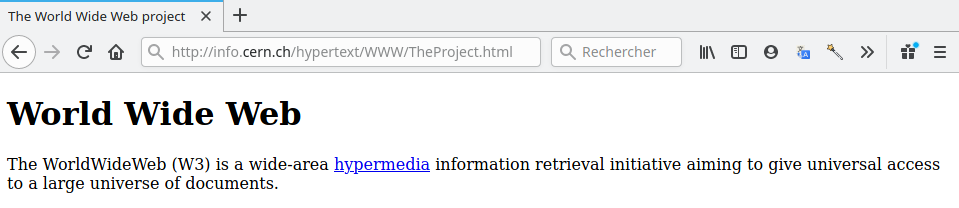

<h2 id="les-bases-du-html" class="anchored">Les bases du <code>html</code></h2>

Voici un extrait du code de la première page web crée par Tim Berners Lee au CERN.

<pre>&lt;header&gt;
    &lt;title&gt;The World Wide Web project&lt;/title&gt;
&lt;/header&gt;

&lt;body&gt;
    &lt;h1&gt;World Wide Web&lt;/h1&gt;

    &lt;p&gt;The WorldWideWeb (W3) is a wide-area&lt;a href="WhatIs.html"&gt;hypermedia&lt;/a&gt;
    information retrieval initiative aiming to give universal access to a large
    universe of documents.&lt;/p&gt;
    
&lt;/body&gt;
</pre>

Voici le rendu:

<figure class="figure">

<figcaption class="figure-caption">Rendu de page html par le navigateur</figcaption>

</figure>

Le langage <code>html</code> est un langage qui utilise des balises ouvrantes <code>&lt;balise&gt;</code> et fermantes <code>&lt;/balise&gt;</code>.

<ol type="1">
<li>
Quelle différence y a-t-il entre la balise ouvrante et la balise fermante ?
</li>
<li>
Repérer toutes les balises utilisées dans ce document.
</li>
<li>
Quelle balise permet de créer des liens <strong>hypertextes</strong> ?
</li>
<li>
Essayer de deviner le rôle des autres balises en observant attentivement le rendu.
</li>
</ol>
<h2 id="comprendre-une-url" class="anchored">Comprendre une <code>URL</code></h2>

Compléter le tableau suivant donnant les diverses informations contenues dans les URL suivantes.

<ol type="1">
<li>mailto:gaston.lagaffe@mail.com</li>
<li>ftp://ftp.mozilla.org/pub/mozilla.org/firefox/releases/</li>
<li>https://fr.wikipedia.org/wiki/Grace_Hopper#Anecdote</li>
<li>https://developer.mozilla.org/fr/search?q=HTTP&amp;locale=en-US</li>
<li>https://www.google.com/search?q=snt&amp;as_sitesearch=lemonde.fr</li>
</ol>
<table class="table table-bordered table-hover">
<thead class="table-warning">
<tr class="header">
<th>URL</th>
<th>Protocole</th>
<th>Nom de domaine</th>
<th>Chemin vers la ressource</th>
<th>Paramètres</th>
<th>Ancre</th>
</tr>
</thead>
<tbody>
<tr class="odd">
<td>1</td>
<td></td>
<td></td>
<td></td>
<td></td>
<td></td>
</tr>
<tr class="even">
<td>2</td>
<td></td>
<td></td>
<td></td>
<td></td>
<td></td>
</tr>
<tr class="odd">
<td>3</td>
<td></td>
<td></td>
<td></td>
<td></td>
<td></td>
</tr>
<tr class="even">
<td>4</td>
<td></td>
<td></td>
<td></td>
<td></td>
<td></td>
</tr>
<tr class="odd">
<td>5</td>
<td></td>
<td></td>
<td></td>
<td></td>
<td></td>
</tr>
</tbody>
</table>

