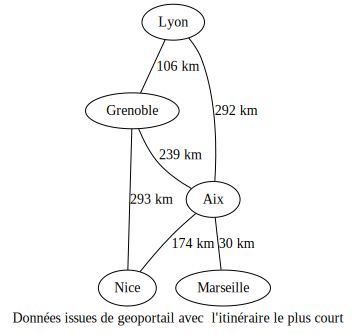

Programme Officiel

<table class="table table-bordered table-hover">
<thead class="table-warning">
<tr class="header">
<th>Contenus</th>
<th>Capacités attendues</th>
</tr>
</thead>
<tbody>
<tr class="odd">
<td>GPS, Galileo</td>
<td>Décrire le principe de fonctionnement de la géolocalisation.</td>
</tr>
<tr class="even">
<td>Cartes numériques</td>
<td>Identifier les différentes couches d’information de GeoPortail pour extraire différents types de données. Contribuer à OpenStreetMap de façon collaborative.</td>
</tr>
<tr class="odd">
<td>Protocole NMEA 0183</td>
<td>Décoder une trame NMEA pour trouver des coordonnées géographiques.</td>
</tr>
<tr class="even">
<td>Calculs d’itinéraires</td>
<td>Utiliser un logiciel pour calculer un itinéraire. Représenter un calcul d’itinéraire comme un problème sur un graphe.</td>
</tr>
<tr class="odd">
<td>Confidentialité</td>
<td>Régler les paramètres de confidentialité d’un téléphone pour partager ou non sa position.</td>
</tr>
</tbody>
</table>
<a class="lien-programme" href="../programme/">Lien vers le programme complet</a>

La cartographie est essentielle pour beaucoup d’activités : agriculture, urbanisme, transports, loisirs, etc. Elle a été révolutionnée par l’arrivée des cartes numériques accessibles depuis les ordinateurs, tablettes et téléphones, bien plus souples à l’usage que les cartes papier.

<figure class="figure">

<figcaption class="figure-caption">Image d’une carte interactive des stations de vélo bleu à Nice</figcaption>

</figure>

&nbsp;

<a href="https://lienmini.fr/3389-402">Évaluation diagnostique PP78-79</a>.

<h2 id="le-fonctionnement-de-la-géolocalisation" class="anchored">Le fonctionnement de la géolocalisation</h2>

<iframe width="560" height="315" src="https://invidious.projectsegfau.lt/embed/e79tSIpLiDk" title="YouTube video player" frameborder="0" allow="accelerometer; autoplay; clipboard-write; encrypted-media; gyroscope; picture-in-picture" allowfullscreen=""></iframe>
<a href="https://www.youtube.com/watch?v=e79tSIpLiDk">Vidéo</a> servie sans cookie via <a href="https://projectsegfau.lt/">Project Segfault</a>

&nbsp;

Faire l’activité 2 P82-83 du <a href="https://www.editions-delagrave.fr/livre/9782206103389-sciences-numeriques-et-technologie-snt-2de-2019-manuel-eleve">manuel de Delagrave</a> sur le fonctionnement de la géolocalisation.

La géolocalisation par satellite nécessite qu’il y en ait toujours au moins quatre satellites « visibles » par le terminal équipé d’une puce de géolocalisation(GPS/Galiléo).

<wc-wikimage class="half center" title="ConstellationGPS.gif" caption="la géolocalisation nécessite l'utilisation de plusieurs satellites pour déterminer la position d'un objet."></wc-wikimage>

<dl>
<dt>
Principe de trilatération
</dt>
<dd>

Les coordonnées GPS sont déterminées en mesurant avec une grande précision les <strong>distances</strong> entre le terminal et <em>trois satellites</em>.

</dd>
</dl>

<wc-wikimage class="half center" title="3D_Trilateration.jpg" caption="Deux cercles se coupent en deux points, il faut un troisième satellite pour déterminer lequel correspond à la position."></wc-wikimage>

&nbsp;

Un signal de satellite met 1 vingtième de seconde pour se propager du satellite au terminal. En déduire la distance qui sépare le satellite et le terminal sachant que la vitesse de la lumière est de 300 mille km/s.

<h2 id="le-protocole-nmea" class="anchored">Le protocole NMEA</h2>

Les informations de géolocalisation peuvent être regroupées au sein d’une trame afin d’être échangées avec d’autres appareils(Maritimes dans le cas de la NMEA).

Une trame NMEA commence par <code>$</code> et les informations de géolocalisation sont séparées par des virgules dans l’ordre suivant:

<ol type="1">
<li>Type de trame</li>
<li>Heure d’envoi de la trame au format <code>HHMMSS.SSS</code> (064036.289 -&gt; 06h40min36s289)</li>
<li>Latitude au format degré minute <code>ddmm.mmmmm</code></li>
<li>Hémisphère N/S</li>
<li>Longitude au format degré minute <code>ddmm.mmmmm</code></li>
<li>Hémisphère E/W</li>
<li>…</li>
<li>Nombre de satellites utilisés</li>
<li>Précision horizontale.</li>
<li>Altitude</li>
<li>…</li>
</ol>

Le format degré minute utilisé peut être converti comme ceci <code>2503.6319 = 25° 03.6319'</code>

qui se lit «25 degrés et 03,6319 minute » avec une minute = 1/60 ° soit:

<math xmlns="http://www.w3.org/1998/Math/MathML" display="block"><semantics><mrow><mn>25</mn><mo>+</mo><mn>3</mn><mo separator="true">,</mo><mn>6319</mn><mi mathvariant="normal">/</mi><mn>60</mn><mi mathvariant="normal">°</mi><mo>=</mo><mn>25</mn><mo separator="true">,</mo><mn>06053</mn><mi mathvariant="normal">°</mi></mrow><annotation encoding="application/x-tex">
25 + 3,6319/60 ° = 25,06053°
</annotation></semantics></math>25+3,6319/60°=25,06053°

&nbsp;

<ol type="1">
<li>
Donner la coordonnée géographique(longitude, latitude, altitude) ainsi que le nombre de satellites et la précision correspondant à ces trames.

<pre>$GPGGA,064036.289,4851.4934,N,0217.6563,E,1,4,3.2,61.5,M,,,,0000*0E

$GPGGA,092751.000,4041.3544,N,7402.6724,W,1,8,1.0,4.5,M,55.3,M,,*75
</pre>

</li>
<li>
Visualiser ces coordonnées sur OpenStreetMap en ajustant l’ancre de l’URL suivante:

<a href="https://www.openstreetmap.org/export#map=17/43.69864/7.24820" class="uri">https://www.openstreetmap.org/export#map=17/43.69864/7.24820</a>

<ul>
<li><code>17</code> correspond au facteur de zoom de la carte.</li>
<li><code>43.69864</code> la latitude (négatif si Sud).</li>
<li><code>7.24820</code> la longitude (négatif sur ouest)</li>
</ul></li>
</ol>
<!-- 

1e: Tour Eiffel altitude 61.5m: https://www.openstreetmap.org/export#map=18/48.85822/2.29427
2e: statue de la liberté altitude 4.5m: https://www.openstreetmap.org/export#map=17/40.68924/-74.04454

-->

<h2 id="calculs-ditinéraires-et-graphes" class="anchored">Calculs d’itinéraires et graphes</h2>

Pour calculer un itinéraire entre deux villes, on modélise le problème sous forme de <em>graphe</em>.

<dl>
<dt>
graphe
</dt>
<dd>

Un graphe est une représentation abstraite de liens appelés <em>arêtes</em> entre des objets appelés <em>sommets</em>.

</dd>
</dl>

Prenons l’exemple du réseau routier du sud-est.

<table>
<tbody><tr>
<th>
<iframe height="600px" frameborder="0" scrolling="no" marginheight="0" marginwidth="0" sandbox="allow-forms allow-scripts allow-same-origin" src="https://www.geoportail.gouv.fr/embed/visu.html?c=5.372373895720115,44.64181268159601&amp;z=7&amp;l0=ORTHOIMAGERY.ORTHOPHOTOS::GEOPORTAIL:OGC:WMTS(1)&amp;l1=GEOGRAPHICALGRIDSYSTEMS.PLANIGNV2::GEOPORTAIL:OGC:WMTS(1)&amp;l2=Voiture$OGC:OPENLS;Itineraire-1648030903323(0.9)&amp;permalink=yes" allowfullscreen="">
</iframe>
</th>
<th>

On peut le représenter sous forme de graphe de distance comme ceci:

<!-- graph {
    label="Données issues de geoportail avec  l'itinéraire le plus court";
    Lyon -- Grenoble[label="106 km"];
    Lyon -- Aix[label="292 km"];
    Grenoble -- Nice[label="293 km"]
    Grenoble -- Aix[label="239 km"];
    Aix -- Marseille[label="30 km"];
    Aix -- Nice[label="174 km"];
    
} -->

<figure class="figure">

<figcaption class="figure-caption">Graphe du réseau routier du sud-est</figcaption>

</figure>

</th>
</tr>

</tbody></table>

&nbsp;

En utilisant le graphe ci-dessus, répondre aux questions suivantes.

<ol type="1">
<li>Donner tous les chemins possibles permettant d’aller de Nice à Lyon.</li>
<li>Calculer leurs distances et en déduire quelle est la route la plus courte.</li>
</ol>

