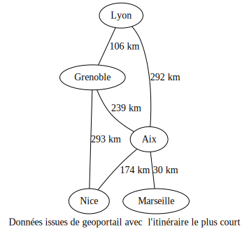

<h2 id="graphe-dun-réseau-électrique" class="anchored">Graphe d’un réseau électrique</h2>

Un de vos amis travaille pour un distributeur d’électricité.

Il doit proposer à son supérieur une représentation du réseau reliant différentes villes. Comme il n’y arrive pas trop, il voudrait que vous la lui fassiez.

Pour simplifier le problème, il a déjà renommé les villes en A, B, C, D, E et F. De plus, il vous donne les informations suivantes :

<ul>
<li>la ville A est reliée par un réseau électrique aux villes B, E et F,</li>
<li>la ville B est reliée par un réseau électrique aux villes A, C et D,</li>
<li>la ville C est reliée par un réseau électrique aux villes B, D, E et F,</li>
<li>la ville D est reliée par un réseau électrique aux villes B, C et F,</li>
<li>la ville E est reliée par un réseau électrique aux villes A, C et F,</li>
<li>la ville F est relié par un réseau électrique aux villes A, C, D et E.</li>
</ul>
<ol type="1">
<li>Proposer un graphe qui modélise la situation.</li>
<li>Ce graphe est-il complet ? Pourquoi ?</li>
</ol>

<a href="mln" class="cite-source">CC-BY-SA-NC Mon lycée numérique</a>

<h2 id="représentation-dun-graphe-non-orienté" class="anchored">Représentation d’un graphe non orienté</h2>

Voici un ensemble des relations :

<ul>
<li>A est ami avec tout le monde sauf G,</li>
<li>B est ami avec A, D et H,</li>
<li>C est ami avec A, F, G et H,</li>
<li>D est ami avec A, B et H,</li>
<li>E est ami avec A et H,</li>
<li>F est ami avec A et C,</li>
<li>G est ami avec C et H,</li>
<li>H est ami avec A, B, C, D, E et G.</li>
</ul>
<ol type="1">
<li>Représenter ce graphe et vérifier qu’il est non orienté.</li>
<li>Implémenter ce graphe sous la forme d’un dictionnaire de liste dans lequel chaque clé représente le nœud étudié et les sommets adjacents sont représentés sous la forme d’une liste.</li>
<li>Écrire la matrice d’adjacence et vérifier qu’elle est symétrique(<em>on utilisera l’ordre alphabétique pour indexer les nœuds</em>).</li>
<li>Implémenter la matrice en python sous la forme d’une liste de liste.</li>
</ol>

<a href="mln" class="cite-source">CC-BY-SA-NC Mon lycée numérique</a>

<h2 id="représentation-dun-graphe-orienté" class="anchored">Représentation d’un graphe orienté</h2>

Voici un ensemble de relations de suivi sur un réseau social.

<figure class="figure">

<figcaption class="figure-caption">Réseau social d’amis avec suivi</figcaption>

</figure>

<ol type="1">
<li>Implémenter ce graphe sous la forme d’un dictionnaire de liste dans lequel chaque clé représente le nœud étudié et les sommets successeurs sont représentés sous la forme d’une liste.</li>
<li>Écrire la matrice d’adjacence et vérifier qu’elle n’est pas symétrique(<em>on utilisera l’ordre alphabétique pour indexer les nœuds</em>).</li>
</ol>
<h2 id="représentation-et-parcours-dun-graphe-pondéré-non-orienté" class="anchored">Représentation et parcours d’un graphe pondéré non-orienté</h2>

Voici un graphe représentant les distances dans le réseau sud-est.

<figure class="figure">

<figcaption class="figure-caption">Réseau sud-Est</figcaption>

</figure>

<ol type="1">
<li>Implémenter ce graphe sous la forme d’un dictionnaire de liste dans lequel chaque clé représente le nœud étudié et les sommets adjacents sont représentés sous la forme d’une liste de dictionnaires clé(sommet adjacent): valeur(distance).</li>
<li>Écrire la matrice d’adjacence et vérifier qu’elle est symétrique(<em>on utilisera l’ordre alphabétique pour indexer les nœuds</em>).</li>
<li>Proposer un algorithme qui renvoie tous les chemins possibles pour aller de Nice à Lyon sans jamais passer deux fois par la même ville. On utilisera trois paramètres d’entrée: le graphe implémenté sous la forme d’un dictionnaire d’adjacence comme celui de la question 2 et les deux villes de départ et d’arrivée.</li>
</ol>

