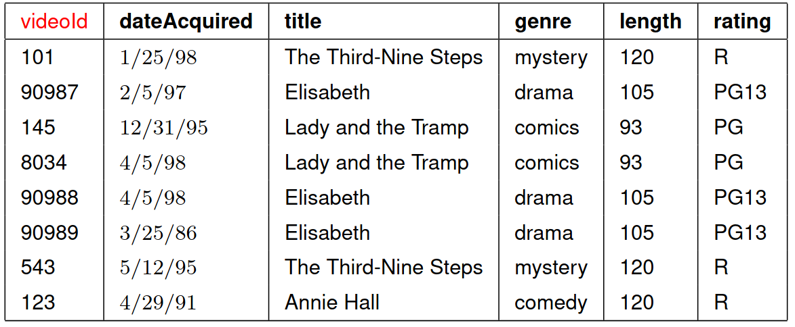
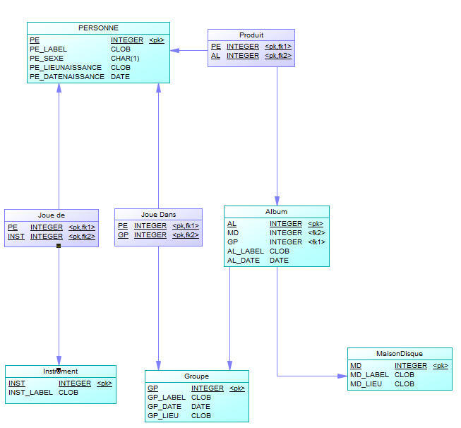

Programme Officiel

<table class="table table-bordered table-hover">
<thead class="table-warning">
<tr class="header">
<th>
<pre>    Contenus
</pre>

</th>
<th>
<pre>    Capacités attendues
</pre>

</th>
<th>
<pre>       Commentaires
</pre>

</th>
</tr>
</thead>
<tbody>
<tr class="odd">
<td>Base de données relationnelle.</td>
<td>
Savoir distinguer la structure d’une base de données de son contenu.

Repérer des anomalies dans le schéma d’une base de données.
</td>
<td>
La structure est un ensemble de schémas relationnels qui respecte les contraintes du modèle relationnel.

Les anomalies peuvent être des redondances de données ou des anomalies d’insertion, de suppression, de mise à jour.

On privilégie la manipulation de données nombreuses et réalistes.
</td>
</tr>
</tbody>
</table>
<a class="lien-programme" href="../programme/">Lien vers le programme complet</a>

<blockquote class="blockquote">

Nous allons voir plus en détail ce que sont les bases de données relationnelles et mettre en évidence quelques anomalies qui peuvent être rencontrées.

</blockquote>
<h2 id="vocabulaire" class="anchored">Vocabulaire</h2>

Nous allons définir le vocabulaire de l’algèbre relationnelle inventée en 1970 par Edgar Frank Codd, et le mettre en relation avec le vocabulaire plus abordable des tableaux.

<wc-wikimage class="half center" title="Table_relationnel.png" caption="Le vocabulaire des bases de données."></wc-wikimage>

<dl>
<dt>
Relation
</dt>
<dd>

Dans le modèle relationnel, les données sont stockées dans des tables, aussi appelées <strong>relations</strong>.

</dd>
</dl>

L’illustration ci-dessus présente une relation appelée <code>voiture</code>.

<dl>
<dt>
Attribut
</dt>
<dd>

Le nom d’une colonne d’une relation est appelé <strong>attribut</strong>.

</dd>
</dl>

La relation <code>voiture</code> possède trois attributs: <code>marque</code>, <code>couleur</code> et <code>plaque</code>.

<dl>
<dt>
n-uplet
</dt>
<dd>

Un enregistrement (ligne) d’une relation est appelé <strong>n-uplet</strong>.

</dd>
</dl>

<ul>
<li><code>ID voiture</code>, <code>marque</code> de la table voiture.</li>
<li><code>ID carburant</code>, <code>type</code> de la table carburant.</li>
</ul>

<dl>
<dt>
Domaine
</dt>
<dd>

Le <strong>domaine</strong> d’un attribut est l’ensemble des valeurs qui peuvent être prises par cet attribut.

</dd>
</dl>

Une base de donnée <a href="https://www.sqlite.org/datatype3.html#storage_classes_and_datatypes">sqlite</a> il n’y a que cinq domaines de valeurs possibles:

<ul>
<li><code>NULL</code>. La valeur est une valeur NULL.</li>
<li><code>INTEGER</code>. La valeur est un entier signé, stocké dans 1, 2, 3, 4, 6 ou 8 octets en fonction de l’amplitude de la valeur.</li>
<li><code>REAL</code>. La valeur est une valeur à virgule flottante, stockée sous forme de nombre à virgule flottante IEEE de 8 octets.</li>
<li><code>TEXT</code>. La valeur est une chaîne de texte, stockée à l’aide du codage de la base de données (UTF-8, UTF-16BE ou UTF-16LE).</li>
<li><code>BLOB</code>. La valeur est une donnée binaire brute, stocké exactement comme elle a été entrée.</li>
</ul>

Dans le SGBD MariaDB il y a beaucoup plus de types avec notamment des formats pour les dates <a href="https://mariadb.com/kb/en/data-types/">(voir doc)</a>.

Pour résumer, le tableau suivant montre celui, rigoureux, issu de l’algèbre relationnelle et celui, plus vague, correspondant à la représentation par table. Les termes de chaque ligne seront considérés comme équivalents, mais on privilégiera les premiers qui sont plus précis.

<table class="table table-bordered table-hover">
<thead class="table-warning">
<tr class="header">
<th>Terme de l’algèbre relationnelle</th>
<th>Terme de la représentation par table</th>
</tr>
</thead>
<tbody>
<tr class="odd">
<td>Relation</td>
<td>Table</td>
</tr>
<tr class="even">
<td>n-uplet</td>
<td>ligne</td>
</tr>
<tr class="odd">
<td>Nom d’attribut</td>
<td>Nom de colonne</td>
</tr>
<tr class="even">
<td>Valeur d’attribut</td>
<td>Cellule</td>
</tr>
<tr class="odd">
<td>Domaine</td>
<td>Type</td>
</tr>
</tbody>
</table>

<a href="http://sql.bdpedia.fr/relationnel.html#le-schema" class="cite-source">Philippe Rigaux sur sql.dbpedia.fr CC-BY-NC-SA</a>

<h2 id="clés-primaire-et-secondaire" class="anchored">Clés primaire et secondaire</h2>
<dl>
<dt>
Clé primaire
</dt>
<dd>

Chaque ligne de la table doit comporter un attribut qui l’identifie de façon <strong>unique</strong>, on l’appelle la <strong>clé primaire</strong>.

</dd>
</dl>

<ul>
<li>Dans la table <code>voiture</code> l’attribut <code>plaque</code> pourrait constituer la clé primaire.</li>
<li>En s’inscrivant sur un site, on vous impose d’utiliser un <code>identifiant</code> unique pour créer votre ligne dans la base de données.</li>
<li>L’email d’un utilisateur peut servir de clé primaire, mais ce n’est pas conseillé.</li>
</ul>

&nbsp;

On préférera utiliser une clé primaire complètement indépendante des données métier, afin de s’assurer que le champ est toujours rempli et n’évolue pas dans le temps.

Toutes les bases de données proposent des mécanismes prenant en charge une numérotation utilisable pour les clés primaires.

<dl>
<dt>
Clé secondaire
</dt>
<dd>

Une clé secondaire ou <em>clé étrangère</em> est une clé utilisée dans une table pour faire référence à un enregistrement d’une autre table.

</dd>
</dl>

<wc-wikimage class="half center" title="Relation.png" caption="La clé primaire ID carburant de la relation carburant sert de clé secondaire dans la relation voiture."></wc-wikimage>

L’ensemble constitué d’une <em>clé primaire</em> et d’une <em>clé étrangère</em> sert à établir des <em>relations</em> entre tables.

<h2 id="contraintes-dintégrité" class="anchored">Contraintes d’intégrité</h2>

Les SGBD modernes permettent de garder les données conformes au modèle relationnel. <strong>Trois types de contraintes d’intégrité</strong> font partie intégrante du modèle de données relationnel:

<ul>
<li><strong>L’intégrité de clé primaire</strong>: cette règle stipule que chaque table doit avoir une clé primaire et que la ou les colonnes choisies pour être la clé primaire doivent être uniques et non nulles.</li>
</ul>

Dans la table <code>voiture</code> essayez d’ajouter la troisième voiture avec l’ID 2, l’ajout sera refusé, car <code>ID voiture</code> a été déclaré comme clé primaire

<ul>
<li><strong>L’intégrité référentielle</strong> est une situation dans laquelle pour chaque information d’une table A qui fait référence à une information d’une table B, l’information référencée existe dans la table B.</li>
</ul>

Si vous tentez de supprimer la ligne 2 de la table <code>carburant</code>, le SGBD vous le refusera en raison de sa présence dans la table des voitures à la ligne de la BMW.

Il est aussi impossible d’ajouter dans la table <code>voitures</code> un <code>id carburant</code> qui n’existe pas dans la relation <code>carburant</code>.

<ul>
<li><strong>L’intégrité du domaine</strong> spécifie que toutes les colonnes d’une base de données relationnelle doivent être déclarées sur un domaine défini.</li>
</ul>

S’assurer qu’une valeur est bien un email, un numéro de téléphone ou un code postal.

Le support des types dans sqlite étant relativement limité, vous pouvez par exemple vérifier qu’on ne peut ajouter un <code>id voiture</code> qui ne soit pas un entier comme <code>A</code> par exemple.

Une fois la contrainte déclarée, le SGBD refusera toute modification du contenu de la base de données qui violerait une de ces règles et casserait l’intégrité.

&nbsp;

Télécharger la base de données sqlite <code>voitures.db</code> à l’adresse suivante: https://apps.lyceum.fr/sqlite/dbs/voitures.db.

L’ouvrir dans sqliteBrowser et vérifier que les trois contraintes d’intégrité sont bien gérées par le SGBD sqlite.

<h2 id="exemples-danomalies" class="anchored">Exemples d’anomalies</h2>

Nous allons montrer sur un l’exemple d’une base de donnée de DVD <em>mal construite</em> quels types d’anomalies peuvent apparaître.

<figure class="figure">

<figcaption class="figure-caption">exemple de table de DVDs</figcaption>

</figure>

<a href="https://www.univ-orleans.fr/lifo/Members/Mirian.Halfeld/Cours/BD/iutA2-intro.pdf" class="cite-source">Mirian Halfeld-Ferrari Université d’Orléans</a>

Comme vous le voyez cette table est mal construite:

<ul>
<li>Les données sont <em>redondantes</em>: À chaque fois qu’un film apparaît, les valeurs pour le genre, length et rating apparaissent aussi.</li>
<li>Les attributs concernent à la fois le DVD et le film, il <strong>faudrait créer des tables séparées</strong>.</li>
</ul>

Maintenant, intéressons-nous aux anomalies qui pourraient se présenter:

<ul>
<li><strong>Anomalie de mise à jour</strong>: Que se passe-t-il si le film <code>Elisabeth</code> est renommé <code>Élisabeth</code> pour satisfaire les clients francophones?</li>
<li><strong>Anomalie d’insertion</strong>: Que se passe-t-il avec l’insertion du n-uplet : <code>〈102,1/1/99,   Elisabeth, drama,110, PG13〉</code></li>
<li><strong>Anomalie de suppression</strong>: Que se passe-t-il lors de la suppression du DVD numéro <code>123</code>?</li>
</ul>
<h2 id="comment-concevoir-une-base-de-données-bien-structurée" class="anchored">Comment concevoir une base de données bien structurée?</h2>

Une base de données bien structurée:

<ul>
<li>Économise de l’espace disque en éliminant les données redondantes.</li>
<li>Maintient l’exactitude et l’intégrité des données.</li>
<li>Fournit un accès facile aux données utiles.</li>
</ul>

Le processus de conception peut-être scindé comme suit:

<ol type="1">
<li>Analyse des besoins ou identification de l’objectif de votre base de données.</li>
<li>Organisation des données en tableaux.</li>
<li>Spécification des clés primaires et analyse des relations.</li>
</ol>

L’utilisation d’un diagramme relationnel aide à visualiser les relations entre les données.

Voici l’exemple de la base de données «<a href="https://apps.lyceum.fr/sqlite">Rock60</a>» qui rassemble des données sur les albums de rock des années 60 ainsi que les musiciens et producteurs qui y ont participé.

<figure class="figure">

<figcaption class="figure-caption">Schéma relationnel de la base de données rock60</figcaption>

</figure>

Outre l’utilisation de clés primaires et secondaires, on a ajouté des tables particulières qui permettent de relier deux tables lorsque qu’on a une relation dite N:N.

Une personne peut jouer dans plusieurs groupes et un groupe est constitué de plusieurs personnes.

La table <code>Joue Dans</code> permet d’exprimer cette relation en utilisant deux clés étrangères.

&nbsp;

En étudiant le schéma ci-dessus:

<ul>
<li>Donner le nom de toutes les clés primaires.</li>
<li>Donner le nom de toutes les clés secondaires.</li>
<li>Donner le nom de toutes les tables exprimant les relations N:N comme la table <code>Joue Dans</code>.</li>
</ul>

