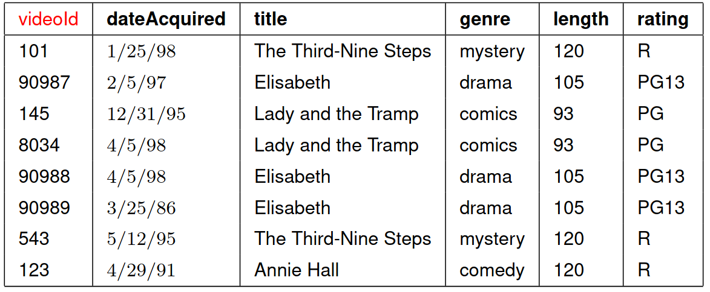

<h2 id="création-de-relations-avec-sqlite-browser" class="anchored">Création de relations avec sqlite browser</h2>
<ol type="1">
<li>
Reprendre l’exemple du cours et créer une base de données mieux conçue en créant deux relations:

<ul>
<li><code>dvd</code> pour les données concernant les disques.</li>
<li><code>film</code> pour les données concernant les films.</li>
</ul>

<figure class="figure">

<figcaption class="figure-caption">exemple de table de DVDs</figcaption>

</figure>

</li>
<li>
Après avoir créé les entrées de DVD et de films, vérifier que sqlite respecte bien les trois contraintes d’intégrité.
</li>
</ol>
<h2 id="création-dun-schéma-relationnel" class="anchored">Création d’un schéma relationnel</h2>

Proposer sur le papier un schéma relationnel pour les données sur les oscars du <a href="/tg/nsi/2-bases-de-donnees/1-les-bases-de-donnees-relationnelles/#motivations">chapitre 1</a>.

<h2 id="vers-le-sql" class="anchored">Vers le SQL</h2>

SQLite Browser possède un onglet pour exécuter des requêtes SQL (au programme du prochain chapitre!), vous pouvez vous familiariser avec sa syntaxe en faisant le TP proposé par <a href="https://isn-icn-ljm.pagesperso-orange.fr/NSI-TLE/res/media_TD2.eWeb/co/module_cours_exos_creation_base.html">Stéphan Van Zuijlen</a>.

