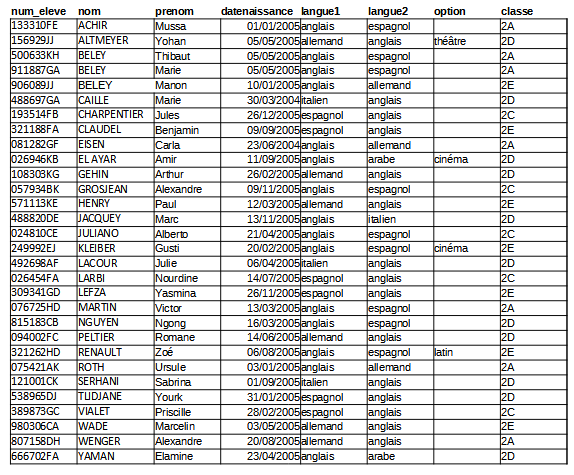

<h2 id="tp-du-cnam-sur-les-requêtes-sql" class="anchored">TP du Cnam sur les requêtes <code>sql</code></h2>

Un TP en ligne avec correction est proposé par le CNAM et vous permet de vous entraîner sur 4 jeux de données: <a href="http://deptfod.cnam.fr/bd/tp" class="uri">http://deptfod.cnam.fr/bd/tp</a>.

La base de données <code>films</code> a été importée sur https://apps.lyceum.fr/sqlite.

<h2 id="enquête-en-ligne-et-en-anglais" class="anchored">Enquête en ligne (et en anglais)</h2>

Résolvez l’enquête du meurtre de SQL City. Pour accéder à cette enquête, il existe diverses possibilités:

<ul>
<li>Version interactive en <code>html</code>: <a href="http://mystery.knightlab.com" class="uri">http://mystery.knightlab.com</a></li>
<li>Fichiers dont la base de données sqlite sur github: <a href="https://github.com/NUKnightLab/sql-mysteries" class="uri">https://github.com/NUKnightLab/sql-mysteries</a></li>
<li>Version interactive sur repl.it: <a href="https://repl.it/@ToniScullion1/Silver-TASK-2-SQL-Murder-Mystery#actvity.md" class="uri">https://repl.it/@ToniScullion1/Silver-TASK-2-SQL-Murder-Mystery#actvity.md</a></li>
</ul>
<h2 id="mini-projet-application-web-avec-base-de-données-sqlite" class="anchored">Mini-projet: application web avec base de données <code>sqlite</code></h2>

Le dépôt git suivant contient une mini-application web utilisant python pour accéder aux données d’une base de données <code>sqlite</code>.

<a href="https://framagit.org/lyceum/flask-sqlite" class="uri">https://framagit.org/lyceum/flask-sqlite</a>

Par <strong>groupe de 2 ou 3</strong>, développez l’ébauche d’application proposée pour qu’elle utilise des <em>données intéressantes</em> de votre choix mais non personnelles.

Outre le changement de données, vous pourrez:

<ul>
<li>utiliser plusieurs relations dans votre base de données, et les joindre dans vos requêtes.</li>
<li>proposer plusieurs pages <code>html</code> pour la visualisation de données différentes, leur édition…</li>
</ul>
<h2 id="exercice-type-bac" class="anchored">Exercice type BAC</h2>
<blockquote class="blockquote">

Cet exercice est issu du sujet zéro.

</blockquote>

L’énoncé de cet exercice utilise les mots du langage <code>SQL</code> suivant :

<code>SELECT</code>, <code>FROM</code>, <code>WHERE</code>, <code>JOIN</code>, <code>INSERT INTO</code>, <code>VALUES</code>, <code>COUNT</code>, <code>ORDER BY</code>.

Dans un lycée imaginaire, les données relatives aux élèves de secondes sont regroupées dans un fichier nommé <code>seconde_lyc.csv</code>. Un extrait de son contenu est représenté figure 1.

<figure class="figure">

<figcaption class="figure-caption">Extrait du fichier seconde_lyc.csv</figcaption>

</figure>

Pour les besoins de l’organisation du lycée, le chef d’établissement exploite la base de données par des requêtes en langage <code>SQL</code>. Il a pour cela créé une table (ou relation) <code>SQL</code> dénommée <code>seconde</code> dans son système de gestion de bases de données dont la structure est la suivante :

<pre>+--------------------------+
| seconde                  |
+==========================+
| num_eleve(clef primaire) |
+--------------------------+
| langue1                  |
+--------------------------+
| langue2                  |
+--------------------------+
| option                   |
+--------------------------+
| classe                   |
+--------------------------+
</pre>

L’attribut <code>num_eleve</code> est un entier, les autres sont des chaines de caractère (le type <code>CHAR</code>).

<ol type="1">
<li>
&nbsp;

<ol type="1">
<li>
Dans le modèle relationnel, quel est l’intérêt de l’attribut <code>num_eleve</code>.
</li>
<li>
Écrire une requête SQL d’insertion permettant d’enregistrer l’élève <code>ACHIR Mussa</code> dans la table seconde. Les informations relatives à cet élève sont données dans la ligne 1 du fichier <code>seconde_lyc.csv</code>.
</li>
<li>
Lors de l’insertion de l’élève <code>ALTMEYER Yohan</code> (ligne 2 du fichier <code>seconde_lyc.csv</code>), une erreur de saisie a été commise sur la première langue, qui devrait être allemand. Écrire une requête SQL de mise à jour corrigeant les données de cet élève.
</li>
</ol></li>
<li>
On suppose maintenant que la table seconde contient les informations issues de la figure 1 (ni plus, ni moins, même si la figure 1 n’est qu’un extrait du fichier <code>seconde_lyc.csv</code>).

<ol type="1">
<li>
Quel est le résultat de la requête suivante?

<pre>SELECT num_eleve FROM seconde;
</pre>

</li>
<li>
On rappelle qu’en <code>SQL</code>, la fonction d’agrégation <code>COUNT()</code> permet de compter le nombre d’enregistrements dans une table. Quel est le résultat de la requête suivante?

<pre>SELECT COUNT(num_eleve) FROM seconde;
</pre>

</li>
<li>
Écrire la requête permettant de connaître le nombre d’élèves qui font allemand en <code>langue1</code> ou <code>langue2</code>.
</li>
</ol></li>
<li>
Le chef d’établissement souhaite faire évoluer la structure de sa base de données. Pour ce faire, il créé une nouvelle table eleve dont la structure est la suivante:

<pre>+-------------------------------------+
| eleve                               |
+=====================================+
| num_eleve (clef primaire,           |
+-------------------------------------+
| clef étrangère de la table seconde) |
+-------------------------------------+
| nom                                 |
+-------------------------------------+
| prenom                              |
+-------------------------------------+
| datenaissance                       |
+-------------------------------------+
</pre>

</li>
</ol>

Là encore, l’attribut <code>num_eleve</code> est un entier, les autres sont des chaines de caractère (le type <code>CHAR</code>).

<ol type="1">
<li>
Expliquer ce qu’apporte l’information <code>clef étrangère</code> pour l’attribut <code>num_eleve</code> de cette table en termes d’intégrité et de cohérence.
</li>
<li>
On suppose la table <code>eleve</code> correctement créée et complétée. Le chef d’établissement aimerait lister les élèves (nom, prénom, date de naissance) de la classe <code>2A</code>.

Écrire la commande qui permet d’établir cette liste à l’aide d’une jointure entre <code>eleve</code> et <code>seconde</code>.
</li>
<li>
Proposer la structure d’une table <code>coordonnees</code> dans laquelle on pourra indiquer, pour chaque élève, son adresse, son code postal, sa ville, son adresse mail. Préciser la clef primaire et/ou la clé étrangère en vue de la mise en relation avec les autres tables.
</li>
</ol>

