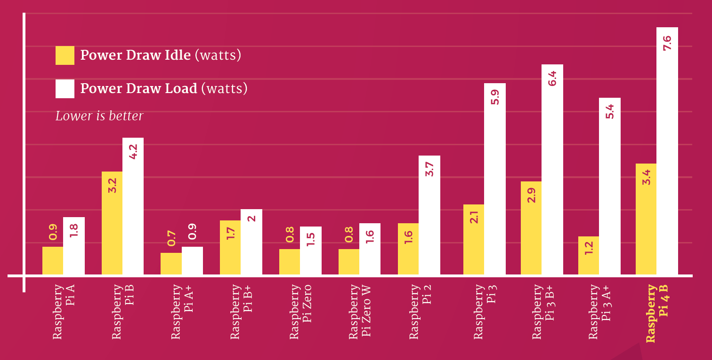
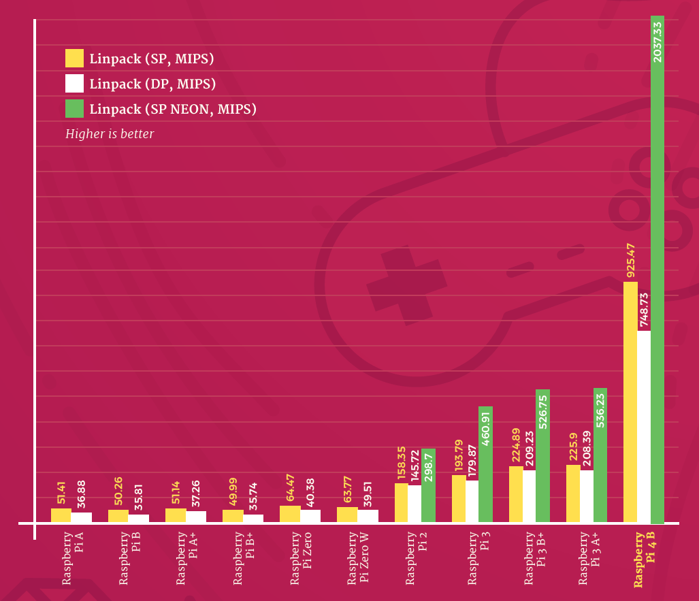
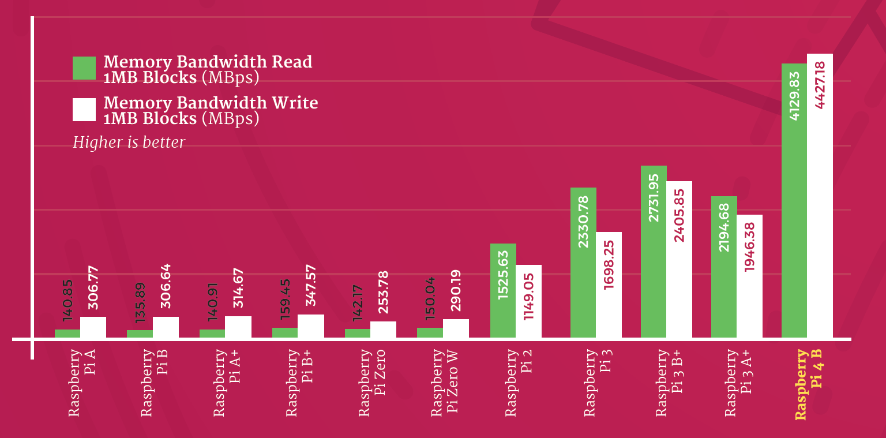
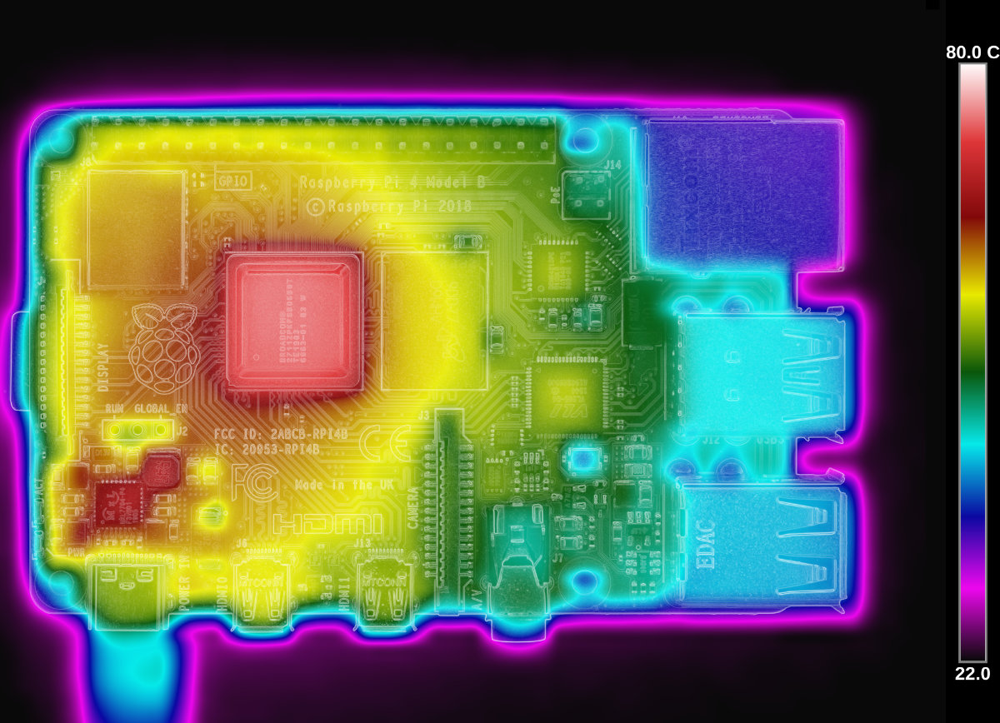

Programme Officiel

<table class="table table-bordered table-hover">
<thead class="table-warning">
<tr class="header">
<th>
<pre>   Contenus
</pre>

</th>
<th>
<pre>    Capacités attendues
</pre>

</th>
<th>
<pre>         Commentaires
</pre>

</th>
</tr>
</thead>
<tbody>
<tr class="odd">
<td>Composants intégrés d’un système sur puce.</td>
<td>Identifier les principaux composants sur un schéma de circuit et les avantages de leur intégration en termes de vitesse et de consommation.</td>
<td>Le circuit d’un téléphone peut être pris comme un exemple : microprocesseurs, mémoires locales, interfaces radio et filaires, gestion d’énergie, contrôleurs vidéo, accélérateur graphique, réseaux sur puce, etc.</td>
</tr>
</tbody>
</table>
<a class="lien-programme" href="../programme/">Lien vers le programme complet</a>

<!-- 

> Nous avons vu en
> [première](/1g/nsi/6-architectures-materielles-et-systemes-dexploitation/1-architecture-dun-ordinateur/)
> quelques éléments de l'architecture d'un ordinateur actuel dans lequel les composants sont reliés
> par l'intermédiaire d'une _carte mère_. Cependant avec les progrès dans la miniaturisation de
> l'électronique et l'essor des objets connectés, on se tourne de plus en vers des systèmes sur
> puce (_soc_ en anglais) qui regroupent dans un seul circuit nombre des fonctions autrefois
> effectuées par des circuits séparés.

<table class="table table-bordered table-hover">
<thead class="table-warning"><tr><th colspan="1" rowspan="1">
AVANT
</th><th colspan="1" rowspan="1">
APRES
</th></tr></thead>
<tbody><tr>
<td>

Cartes mères d'ordinateurs
 By <a href="https://www.wikidata.org/wiki/Q15080600" title="d:Q15080600" target="not_lyceum">Ralf Roletschek</a> - Own work, <a href="http://www.gnu.org/licenses/old-licenses/fdl-1.2.html" title="GNU Free Documentation License 1.2" target="not_lyceum">GFDL 1.2</a>, <a href="https://commons.wikimedia.org/w/index.php?curid=9088826" target="not_lyceum">Link</a>

</td><td>

Système sur puce d'un smartphone
 By <a href="//commons.wikimedia.org/wiki/User:K%C3%B6f3" title="User:Köf3" target="not_lyceum">Köf3</a> - Own work, <a href="https://creativecommons.org/licenses/by-sa/3.0" title="Creative Commons Attribution-Share Alike 3.0" target="not_lyceum">CC BY-SA 3.0</a>, 

</td></tr></tbody></table>

## Composants d'un système sur puce

Bien que les composants soient beaucoup plus petits, on retrouve une architecture comparable à
celle des ordinateurs. Prenons l'exemple du nano-ordinateur Raspberry-pi.

 By Miiicihiaieil&nbsp;&nbsp;Hieinizilieir&nbsp;/&nbsp;<a href="//commons.wikimedia.org/wiki/Main_Page" title="Main Page">Wikimedia Commons</a>, <a href="https://creativecommons.org/licenses/by-sa/4.0" title="Creative Commons Attribution-Share Alike 4.0">CC BY-SA 4.0</a>, <a href="https://commons.wikimedia.org/w/index.php?curid=80140656">Link</a>

 By <a href="//commons.wikimedia.org/w/index.php?title=User:Jstrom99&amp;action=edit&amp;redlink=1" title="User:Jstrom99 (page does not exist)">Jstrom99</a> - Own work, <a href="https://creativecommons.org/licenses/by-sa/4.0" title="Creative Commons Attribution-Share Alike 4.0">CC BY-SA 4.0</a>, <a href="https://commons.wikimedia.org/w/index.php?curid=83463602">Link</a>

::: appli

1. Retrouver les éléments de l'architecture de Von Neumann sur la vue schématique du Raspberry pi.
2. Quels autres éléments ont été rajoutés ? Dans quel but ?

:::

## Avantages des systèmes sur puces

La diminution de la taille des machines, et leur type d'utilisation implique des contraintes de
conception du système qui requièrent de nombreuses optimisations.

### Objectifs d'optimisation

Les SoC doivent optimiser la consommation d'énergie, la taille de la puce, la communication, le
positionnement entre les unités modulaires et d'autres facteurs. 

En général, l'optimisation de l'ensemble de ces contraintes est un problème d'optimisation
combinatoire difficile, et peut en effet être de complexité *NP$.

Souvent, les objectifs d'optimisation de certaines de ces quantités sont directement en désaccord,
ce qui ajoute de la complexité à l'optimisation de la conception des SoC et introduit des compromis
dans la conception du système.

### Consommation d'énergie

La plupart des SoC doivent utiliser une faible puissance. Les systèmes SoC nécessitent souvent une
longue durée de vie de la batterie (comme les smartphones), peuvent potentiellement passer des mois
ou des années sans être alimentés (capteurs autonomes).

De plus, la chaleur perdue provenant d'une consommation d'énergie élevée peut endommager d'autres
composants du circuit. La puissance dissipée par un composant est donnée par la formule de l'effet Joule:

$$
P = UI = \frac{U^{2}}{R} = R I ^ {2}
$$

Les SoC sont souvent intégrés dans des appareils portables tels que les smartphones, les appareils
de navigation GPS, les montres numériques (y compris les smartwatches) et les netbooks. Les clients
souhaitent une longue durée de vie de la batterie pour les appareils informatiques mobiles, une
autre raison pour laquelle la consommation d'énergie doit être minimisée dans les SoC.

[Raspberry Pi benchmarks sur MagPi.raspberrypi.org](https://magpi.raspberrypi.org/articles/raspberry-pi-specs-benchmarks){.cite-source}

### Performance par watt

Les SoC sont optimisés pour maximiser l'efficacité énergétique en termes de performances par watt:
maximisez les performances du SoC compte tenu d'un budget d'utilisation de l'énergie. De nombreuses
applications telles que l'informatique périphérique, le traitement distribué et l'intelligence
ambiante nécessitent un certain niveau de performances de calcul, mais la puissance est limitée
dans la plupart des environnements SoC.

L'architecture ARM a de meilleures performances par watt
que x86 dans les systèmes embarqués, elle est donc préférée à x86 pour la plupart des applications
SoC nécessitant un processeur intégré.

+-----------------------------------------------------------------------------------+-----------------------------------------------------------------------------------+
|                                 Performances CPU                                  |                                 Performances RAM                                  |
+===================================================================================+===================================================================================+
|  |  |
+-----------------------------------------------------------------------------------+-----------------------------------------------------------------------------------+
[Raspberry Pi benchmarks sur MagPi.raspberrypi.org](https://magpi.raspberrypi.org/articles/raspberry-pi-specs-benchmarks){.cite-source}

### Chaleur perdue

Les conceptions SoC sont optimisées pour minimiser la production de chaleur perdue sur la puce.
Comme pour les autres circuits intégrés, la chaleur générée en raison de la forte densité de
puissance est le goulot d'étranglement pour une miniaturisation accrue des composants. Trop de
chaleur perdue peut endommager les circuits et éroder la fiabilité du circuit au fil du temps. Les
températures élevées et les contraintes thermiques ont un impact négatif sur la fiabilité, la
diminution du temps moyen entre les pannes.

En particulier, la plupart des SoC se trouvent dans une petite zone physique ou un petit volume et,
par conséquent, les effets de la chaleur perdue sont aggravés car il y a peu de place pour qu'elle
se diffuse hors du système.

[Raspberry Pi benchmarks sur MagPi.raspberrypi.org](https://magpi.raspberrypi.org/articles/raspberry-pi-specs-benchmarks){.cite-source}

Ces effets thermiques obligent SoC et d'autres concepteurs de puces à appliquer des marges de
conception conservatrices, créant des dispositifs moins performants pour atténuer le risque de
défaillance catastrophique. En raison de l'augmentation de la densité des transistors à mesure que
les échelles de longueur diminuent, chaque génération de processus produit plus de chaleur que la
précédente. Pour aggraver ce problème, les architectures SoC sont généralement hétérogènes, créant
des flux de chaleur spatialement inhomogènes, qui ne peuvent pas être efficacement atténués par un
refroidissement passif uniforme.

### Latence

Les SoC sont optimisés pour minimiser la latence pour tout ou partie de leurs fonctions. Cela peut
être accompli en disposant des éléments avec une proximité et une localisation appropriées les uns
aux autres pour minimiser les retards d'interconnexion et maximiser la vitesse à laquelle les
données sont communiquées entre les modules, les unités fonctionnelles et les mémoires.

Pour les tâches exécutées sur des cœurs de processeur, la latence et le débit peuvent être
améliorés avec la planification des tâches. Cependant, certaines tâches s'exécutent dans des unités
matérielles spécifiques à l'application, et même la planification des tâches peut ne pas être
suffisante pour optimiser toutes les tâches logicielles afin de respecter les contraintes de temps
et de débit.

[Article Wikipedia anglais SoC](https://en.wikipedia.org/wiki/System_on_a_chip#Design_flow{.cite-source} -->

