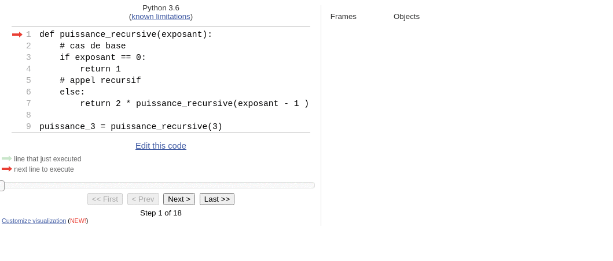
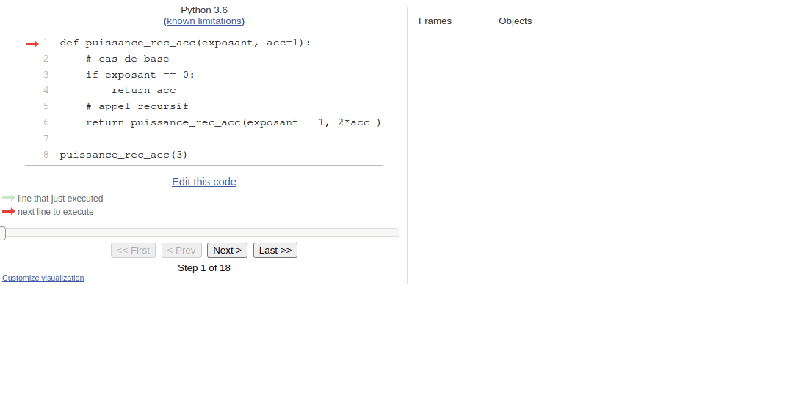

Programme Officiel

<table class="table table-bordered table-hover">
<thead class="table-warning">
<tr class="header">
<th>
<pre> Contenus
</pre>

</th>
<th>
<pre>  Capacités attendues
</pre>

</th>
<th>
<pre>        Commentaires
</pre>

</th>
</tr>
</thead>
<tbody>
<tr class="odd">
<td>Récursivité.</td>
<td>
Écrire un programme récursif.

Analyser le fonctionnement d’un programme récursif.
</td>
<td>Des exemples relevant de domaines variés sont à privilégier.</td>
</tr>
</tbody>
</table>
<a class="lien-programme" href="../programme/">Lien vers le programme complet</a>

<wc-wikimage class="half right" title="34*21-FibonacciBlocks.png" caption="Les nombres de la suite de Fibonnacci sont un exemple souvent utilisé pour illustrer l'utilisation des fonctions récursives."></wc-wikimage>

Dans ce chapitre, nous allons voir comment utiliser des fonctions <em>récursives</em>, des fonctions qui s’appellent elles-mêmes. Ce type de fonction peut avantageusement remplacer la boucle pour écrire des programmes courts et élégants. Ce type de construction est notamment utilisée en <strong><a href="../5-paradigmes-de-programmation">programmation fonctionnelle</a></strong>, un paradigme de programmation centrée sur les fonctions.

<h2 id="définition-et-exemple" class="anchored">Définition et exemple</h2>
<dl>
<dt>
Fonction récursive
</dt>
<dd>

Une fonction récursive est une fonction qui s’appelle elle-même dans sa définition.

</dd>
</dl>

Commençons par un exemple pour clarifier un peu les choses.

Vous voulez demander à un utilisateur une entrée par exemple son âge, et vous voulez vous assurer que l’utilisateur vous donne bien une valeur entière positive.

On peut implémenter cela avec une boucle <code>while</code>.

<pre>age = None
while not(age):
    age = int(input("Quel âge avez-vous?"))
    if age &gt; 0:
        print("Merci pour votre réponse)
    # on affecte None à age pour relancer un tour de boucle
    print("L'age doit être un entier positif")
    age = None
        
</pre>

Mais il est aussi tout à fait possible d’utiliser une fonction récursive comme ceci:

<pre>def quel_age():
    age = int(input("Quel âge avez-vous?"))
    if age &gt; 0:
        return age
    # L'age n'est pas positif, il faut recommencer
    print("L'age doit être un entier positif")
    # on fait l'appel récursif pour reposer la question
    quel_age()

age = quel_age() # appel de la fonction et assignation de la valeur retournée à la variable age
</pre>

Comme vous le voyez cette fonction continuera de s’appeler <em>tant que</em> nécessaire. On a donc bien remplacé la boucle avec cette fonction.

Gestion des exceptions

Ce code ne traite que le problème du signe, si on voulait être complet il faudrait gérer les problèmes de type(<code>str</code>, <code>float</code>…) avec les structures <code>try except</code>.

Vous pouvez l’implémenter en guise d’exercice.

<h2 id="comment-définir-une-fonction-récursive" class="anchored">Comment définir une fonction récursive?</h2>

Pour écrire une fonction récursive il faut:

<ul>
<li>
Traiter attentivement le <em>cas récursif</em> du passage des valeurs renvoyées par l’appel précédent à l’appel suivant.
</li>
<li>
Prévoir le <em>cas de base</em> qui ne nécessite pas de rappel de la fonction afin d’arrêter la boucle.
</li>
</ul>

Nous allons utiliser l’exemple <em>classique</em> de la fonction puissance qui retourne <math xmlns="http://www.w3.org/1998/Math/MathML"><semantics><mrow><msup><mn>2</mn><mi>n</mi></msup></mrow><annotation encoding="application/x-tex">2^n</annotation></semantics></math>2n
.

Un traitement par une boucle <code>for</code> serait <em>(programmation impérative)</em>.

<pre>def puissance2(n: int) -&gt; int:
    puissance = 1
    for i in range(n):
        puissance = puissance * 2
    return puissance
</pre>

<pre>&gt;&gt;&gt; puissance2(8)
256
</pre>

Cette fonction peut-être définie par une fonction récursive car:

<ul>
<li>Le cas récursif est: <math xmlns="http://www.w3.org/1998/Math/MathML"><semantics><mrow><msup><mn>2</mn><mi>n</mi></msup><mo>=</mo><mn>2</mn><mo>∗</mo><msup><mn>2</mn><mrow><mi>n</mi><mo>−</mo><mn>1</mn></mrow></msup></mrow><annotation encoding="application/x-tex">2^n = 2 * 2^{n-1}</annotation></semantics></math>2n=2∗2n−1
</li>
<li>Le cas de base est: <math xmlns="http://www.w3.org/1998/Math/MathML"><semantics><mrow><msup><mn>2</mn><mn>0</mn></msup><mo>=</mo><mn>1</mn></mrow><annotation encoding="application/x-tex">2^0 = 1</annotation></semantics></math>20=1
</li>
</ul>

Voici donc la fonction récursive:

<pre>def puissance_recursive(exposant):
    # cas de base
    if exposant == 0:
        return 1
    # appel recursif
    return 2 * puissance_recursive(exposant - 1 )

puissance_3 = puissance_recursive(3)
</pre>

Correction de l'algorithme récursif

Nous pouvons démontrer la <strong>correction</strong> <em>(validité)</em> de cet algorithme, pour cela nous allons prouver par récurrence que <math xmlns="http://www.w3.org/1998/Math/MathML"><semantics><mrow><mi>p</mi><mi>u</mi><mi>i</mi><mi>s</mi><mi>s</mi><mi>a</mi><mi>n</mi><mi>c</mi><msub><mi>e</mi><mi>r</mi></msub><mi>e</mi><mi>c</mi><mi>u</mi><mi>r</mi><mi>s</mi><mi>i</mi><mi>v</mi><mi>e</mi><mo stretchy="false">(</mo><mi>n</mi><mo stretchy="false">)</mo><mo>=</mo><msup><mn>2</mn><mi>n</mi></msup></mrow><annotation encoding="application/x-tex">puissance_recursive(n) = 2^n</annotation></semantics></math>puissancer​ecursive(n)=2n
.

<ul>
<li><strong>Initialisation:</strong> pour <math xmlns="http://www.w3.org/1998/Math/MathML"><semantics><mrow><mi>e</mi><mi>x</mi><mi>p</mi><mi>o</mi><mi>s</mi><mi>a</mi><mi>n</mi><mi>t</mi><mo>=</mo><mn>0</mn></mrow><annotation encoding="application/x-tex">exposant = 0</annotation></semantics></math>exposant=0
, <code>puissance_recursive(0)</code> vaut 1 qui est bien égal à <math xmlns="http://www.w3.org/1998/Math/MathML"><semantics><mrow><msup><mn>2</mn><mn>0</mn></msup></mrow><annotation encoding="application/x-tex">2^0</annotation></semantics></math>20
.</li>
<li><strong>Conservation:</strong> si <math xmlns="http://www.w3.org/1998/Math/MathML"><semantics><mrow><mi>p</mi><mi>u</mi><mi>i</mi><mi>s</mi><mi>s</mi><mi>a</mi><mi>n</mi><mi>c</mi><msub><mi>e</mi><mi>r</mi></msub><mi>e</mi><mi>c</mi><mi>u</mi><mi>r</mi><mi>s</mi><mi>i</mi><mi>v</mi><mi>e</mi><mo stretchy="false">(</mo><mi>n</mi><mo>−</mo><mn>1</mn><mo stretchy="false">)</mo><mo>=</mo><msup><mn>2</mn><mrow><mi>n</mi><mo>−</mo><mn>1</mn></mrow></msup></mrow><annotation encoding="application/x-tex">puissance_recursive(n-1) = 2^{n-1}</annotation></semantics></math>puissancer​ecursive(n−1)=2n−1
alors <math xmlns="http://www.w3.org/1998/Math/MathML"><semantics><mrow><mi>p</mi><mi>u</mi><mi>i</mi><mi>s</mi><mi>s</mi><mi>a</mi><mi>n</mi><mi>c</mi><msub><mi>e</mi><mi>r</mi></msub><mi>e</mi><mi>c</mi><mi>u</mi><mi>r</mi><mi>s</mi><mi>i</mi><mi>v</mi><mi>e</mi><mo stretchy="false">(</mo><mi>n</mi><mo stretchy="false">)</mo><mo>=</mo><mn>2</mn><mo>×</mo><mi>p</mi><mi>u</mi><mi>i</mi><mi>s</mi><mi>s</mi><mi>a</mi><mi>n</mi><mi>c</mi><msub><mi>e</mi><mi>r</mi></msub><mi>e</mi><mi>c</mi><mi>u</mi><mi>r</mi><mi>s</mi><mi>i</mi><mi>v</mi><mi>e</mi><mo stretchy="false">(</mo><mi>n</mi><mo>−</mo><mn>1</mn><mo stretchy="false">)</mo><mo>=</mo><mn>2</mn><mo>×</mo><msup><mn>2</mn><mrow><mi>n</mi><mo>−</mo><mn>1</mn></mrow></msup><mo>=</mo><msup><mn>2</mn><mi>n</mi></msup></mrow><annotation encoding="application/x-tex">puissance_recursive(n) = 2 \times puissance_recursive(n-1) = 2\times2^{n-1}=2^n</annotation></semantics></math>puissancer​ecursive(n)=2×puissancer​ecursive(n−1)=2×2n−1=2n
.</li>
<li><strong>Terminaison:</strong> L’algorithme se termine, car à chaque tour de boucle <math xmlns="http://www.w3.org/1998/Math/MathML"><semantics><mrow><mi>n</mi></mrow><annotation encoding="application/x-tex">n</annotation></semantics></math>n
diminue de 1 et on finit par arriver au <code>return</code> du cas terminal lorsque <math xmlns="http://www.w3.org/1998/Math/MathML"><semantics><mrow><mi>n</mi><mo>=</mo><mn>0</mn></mrow><annotation encoding="application/x-tex">n=0</annotation></semantics></math>n=0
<strong>à condition d’avoir donné au paramètre <math xmlns="http://www.w3.org/1998/Math/MathML"><semantics><mrow><mi>n</mi></mrow><annotation encoding="application/x-tex">n</annotation></semantics></math>n
une valeur positive à l’appel de la fonction.</strong></li>
</ul>

<h2 id="pile-dexécution" class="anchored">Pile d’exécution</h2>

Bien que la gestion de la mémoire soit «cachée» au programmeur en Python, qu’il existe deux façons d’allouer de la mémoire à un programme lors de son exécution (on parle d’allocation dynamique).

<ul>
<li>Le <a href="https://fr.wikipedia.org/wiki/Tas_(allocation_dynamique)">tas</a> <em>(heap en anglais)</em> est un segment de mémoire que l’on peut faire grandir ou rétrécir à la demande.</li>
<li>L’autre segment de mémoire utilisé est la <a href="https://fr.wikipedia.org/wiki/Pile_d%27ex%C3%A9cution">pile d’exécution</a> <em>(call stack)</em>. La pile sert à enregistrer des informations au sujet des fonctions actives dans un programme informatique, c’est celle qui nous intéresse ici.</li>
</ul>
<blockquote class="blockquote">

Étant donné que la pile d’exécution est une pile, l’appelant pousse l’adresse de retour sur la pile, et la fonction appelée, quand elle se termine, récupère l’adresse de retour au sommet de la pile d’exécution (et y transfère le contrôle). Si une fonction appelée appelle une autre fonction, elle poussera son adresse de retour sur la pile d’exécution. Les adresses de retour s’accumulent donc sur la pile d’exécution et sont récupérées une à une lors de la fin de l’exécution des fonctions. Si l’accumulation des adresses de retour consomme tout l’espace alloué à la pile d’exécution, un message d’erreur appelé un dépassement de pile se produit.

</blockquote>

<a href="https://fr.wikipedia.org/wiki/Pile_d%27ex%C3%A9cution" class="cite-source">Article Wikipédia sur la pile d’exécution</a>

Pour bien comprendre comment fonctionne la pile d’exécution, on peut exécuter la fonction <code>puissance_recursive</code> pas à pas sur <a href="http://pythontutor.com/visualize.html#code=def%20puissance_recursive%28exposant%29%3A%0A%20%20%20%20%23%20cas%20de%20base%0A%20%20%20%20if%20exposant%20%3D%3D%200%3A%0A%20%20%20%20%20%20%20%20return%201%0A%20%20%20%20%23%20appel%20recursif%0A%20%20%20%20else%3A%0A%20%20%20%20%20%20%20%20return%202%20*%20puissance_recursive%28exposant%20-%201%20%29%0A%0Apuissance_3%20%3D%20puissance_recursive%283%29&amp;cumulative=false&amp;curInstr=0&amp;heapPrimitives=nevernest&amp;mode=display&amp;origin=opt-frontend.js&amp;py=3&amp;rawInputLstJSON=%5B%5D&amp;textReferences=false">pythontutor</a>.

<figure class="figure">

<figcaption class="figure-caption">Animation appel récursif sur python tutor</figcaption>

</figure>

Sur cette animation la pile est «à l’envers»!

<h2 id="efficacité-des-algorithmes-récursifs" class="anchored">Efficacité des algorithmes récursifs</h2>

L’écriture d’algorithmes récursifs peut-être très élégante et concise, cependant elle peut avoir des conséquences très néfastes sur leur efficacité. La taille de la pile peut croitre au-dessus des limites de la mémoire, ou encore certains calculs identiques peuvent être réalisés plusieurs fois.

Nous allons voir comment l’utilisation d’un <em>accumulateur</em> peut permettre de passer des valeurs d’un appel à un autre lors de la récursion.

Voici donc la fonction récursive puissance modifiée avec un deuxième paramètre <code>acc</code> ayant pour valeur par défaut 1, et qui <em>accumulera</em> le résultat des multiplications lors des appels récursifs.

<pre>def puissance_rec_acc(exposant, acc=1):
    # cas de base
    if exposant == 0:
        return acc
    # appel recursif
    return puissance_rec_acc(exposant - 1, 2*acc )
puissance_rec_acc(4)
</pre>

Nous n’avons pas modifié la hauteur de la pile, mais on a modifié l’ordre des opérations effectuées. Les multiplications sont effectuées lors de l’empilement au lieu du dépilement précédemment.

Nous pouvons visualiser l’exécution de cet algorithme sur <a href="https://pythontutor.com/visualize.html#code=def%20puissance_rec_acc%28exposant,%20acc%3D1%29%3A%0A%20%20%20%20%23%20cas%20de%20base%0A%20%20%20%20if%20exposant%20%3D%3D%200%3A%0A%20%20%20%20%20%20%20%20return%20acc%0A%20%20%20%20%23%20appel%20recursif%0A%20%20%20%20return%20puissance_rec_acc%28exposant%20-%201,%202*acc%20%29%0A%0Apuissance_rec_acc%283%29&amp;cumulative=false&amp;curInstr=0&amp;heapPrimitives=nevernest&amp;mode=display&amp;origin=opt-frontend.js&amp;py=3&amp;rawInputLstJSON=%5B%5D&amp;textReferences=false">pythontutor</a>.

L’utilisation d’un accumulateur est parfois indispensable comme dans les exercices 5 et 6, voire indispensable comme dans le calcul des termes de Fibonacci de grand ordre(exercice 7).

<ul>
<li><a href="http://www.editions-eyrolles.com/Livre/9782212135435/">Informatique et sciences du numérique Spécialité ISN en terminale S - Avec des exercices corrigés et des idées de projets par Gilles Dowek</a></li>
<li><a href="http://www.editions-eyrolles.com/Livre/9782212137002/informatique-pour-tous-en-classes-preparatoires-aux-grandes-ecoles">Informatique pour tous en classes préparatoires aux grandes écoles de Benjamin Wack</a></li>
</ul>

