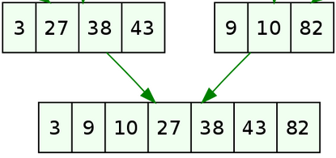

Programme Officiel

<!-- 
+------------------------+-----------------------------------+------------------------------------+
|        Contenus        |        Capacités attendues        |            Commentaires            |
+========================+===================================+====================================+
| Méthode « diviser pour | Écrire un algorithme utilisant la | La rotation d’une image bitmap     |
| régner ».              | méthode « diviser pour régner ».  | d’un quart de tour avec un coût en |
|                        |                                   | mémoire constant est un bon        |
|                        |                                   | exemple.                           |
|                        |                                   |                                    |
|                        |                                   | L’exemple du tri fusion permet     |
|                        |                                   | également d’exploiter la           |
|                        |                                   | récursivité et d’exhiber un        |
|                        |                                   | algorithme de coût en n log 2 n    |
|                        |                                   | dans les pires des cas.            |
+------------------------+-----------------------------------+------------------------------------+ -->
<a class="lien-programme" href="../programme/">Lien vers le programme complet</a>

<wc-wikimage class="half right" title="Merge-sort-example-300px.gif" caption="Le tri fusion est un algorithme de tri utilisant la méthode « Diviser pour Régner » tout comme la recherche dichotomique vue en première."></wc-wikimage>

<blockquote class="blockquote">

Nous avons vu en première deux algorithmes de tris assez naturels, mais peu efficaces: le tri par insertion et le tri par sélection. Cette année, nous allons étudier un algorithme beaucoup plus efficace et très utilisé inventé par John Von Neumann en 1945: le tri par fusion. Cet algorithme nous permettra d’illustrer la méthode diviser pour régner que nous avions déjà vue lors de la recherche dichotomique.

</blockquote>

<h2 id="complexité-des-algorithmes-de-tri" class="anchored">Complexité des algorithmes de tri</h2>

En <a href="../../..//1g/nsi/8-algorithmique/2-algorithmes-de-tri">première</a>, nous avons vu deux algorithmes peu performants:

<ul>
<li>le tri par sélection qui a une complexité <em>quadratique</em> dans le pire des cas, le meilleur des cas et en moyenne.</li>
<li>le tri par insertion qui a une complexité <em>linéaire</em> dans le meilleur des cas, et <em>quadratique</em> dans le pire des cas et en moyenne.</li>
</ul>

Ces algorithmes ne sont pas utilisés en pratique, car peu efficaces. En effet, il a été prouvé que dans le pire des cas et en moyenne, on pouvait au mieux obtenir une complexité <math xmlns="http://www.w3.org/1998/Math/MathML"><semantics><mrow><mi>O</mi><mo stretchy="false">(</mo><mi>n</mi><mi>log</mi><mo>⁡</mo><mo stretchy="false">(</mo><mi>n</mi><mo stretchy="false">)</mo></mrow><annotation encoding="application/x-tex">O(n \log(n)</annotation></semantics></math>O(nlog(n)
.

Cela fait une grande différence car <math xmlns="http://www.w3.org/1998/Math/MathML"><semantics><mrow><mi>log</mi><mo>⁡</mo><mo stretchy="false">(</mo><mi>n</mi><mo stretchy="false">)</mo><mo>⋘</mo><mi>n</mi></mrow><annotation encoding="application/x-tex">\log(n) \lll n</annotation></semantics></math>log(n)⋘n
, en effet:

<ul>
<li><math xmlns="http://www.w3.org/1998/Math/MathML"><semantics><mrow><mi>log</mi><mo>⁡</mo><mo stretchy="false">(</mo><mi>n</mi><mo stretchy="false">)</mo><mo>=</mo><mn>10</mn></mrow><annotation encoding="application/x-tex">\log(n) = 10</annotation></semantics></math>log(n)=10
pour <math xmlns="http://www.w3.org/1998/Math/MathML"><semantics><mrow><mi>n</mi><mo>=</mo><msup><mn>2</mn><mn>10</mn></msup><mo>=</mo><mn>1024</mn></mrow><annotation encoding="application/x-tex">n = 2^{10} = 1024</annotation></semantics></math>n=210=1024
</li>
<li><math xmlns="http://www.w3.org/1998/Math/MathML"><semantics><mrow><mi>log</mi><mo>⁡</mo><mo stretchy="false">(</mo><mi>n</mi><mo stretchy="false">)</mo><mo>=</mo><mn>100</mn></mrow><annotation encoding="application/x-tex">\log(n) = 100</annotation></semantics></math>log(n)=100
pour <math xmlns="http://www.w3.org/1998/Math/MathML"><semantics><mrow><mi>n</mi><mo>=</mo><msup><mn>2</mn><mn>100</mn></msup><mo>=</mo><mn>1267650600228229401496703205376</mn></mrow><annotation encoding="application/x-tex">n = 2^{100} = 1267650600228229401496703205376</annotation></semantics></math>n=2100=1267650600228229401496703205376
</li>
</ul>

On avait déjà rencontré ce type d’améliorations entre la recherche en table et la recherche dichotomique qui utilisait le principe «Diviser pour régner».

<h2 id="le-principe-de-diviser-pour-régner" class="anchored">Le principe de diviser pour régner</h2>

Le principe de diviser pour régner consiste à ramener la résolution d’un problème sur N données à la résolution d’un problème sur la moitié des données et poursuivre ce découpage jusqu’à ce que le problème devienne évident(<em>par exemple trier un tableau d’une donnée</em>). Une fois que les solutions des sous problèmes ont été trouvées, on les combine pour obtenir la solution du problème complet.

<blockquote class="blockquote">
<ul>
<li><em>Diviser</em> : découper un problème initial en sous-problèmes ;</li>
<li><em>Régner</em> : résoudre les sous-problèmes (récursivement ou directement s’ils sont assez petits) ;</li>
<li><em>Combiner</em> : calculer une solution au problème initial à partir des solutions des sous-problèmes.</li>
</ul>
</blockquote>

<a href="https://fr.wikipedia.org/wiki/Diviser_pour_r%C3%A9gner_(informatique)">Article Wikipedia Diviser pour régner</a>{.cite-source}

<wc-wikimage title="Trois_étapes_illustré_avec_l'algorithme_du_tri_fusion.svg" caption="Au lieu de trier la liste entière, nous allons couper la liste en plus petites listes qui seront faciles à trier. On combinera ensuite les petites listes triées obtenues en une seule."></wc-wikimage>

<h2 id="le-tri-fusion" class="anchored">Le tri fusion</h2>

Le tri fusion s’appuie sur le fait que fusionner deux tableaux triés en un tableau trié se fait en un temps linéaire <math xmlns="http://www.w3.org/1998/Math/MathML"><semantics><mrow><mi>O</mi><mo stretchy="false">(</mo><mi>n</mi><mo stretchy="false">)</mo></mrow><annotation encoding="application/x-tex">O(n)</annotation></semantics></math>O(n)
.

Pour fusionner ces deux tableaux triés:

<figure class="figure">

<figcaption class="figure-caption">Fusion de deux tableaux à 3 et 4 éléments</figcaption>

</figure>

Il suffit d’une itération sur les deux listes en même temps donc <math xmlns="http://www.w3.org/1998/Math/MathML"><semantics><mrow><mi>O</mi><mo stretchy="false">(</mo><mi>n</mi><mo stretchy="false">)</mo></mrow><annotation encoding="application/x-tex">O(n)</annotation></semantics></math>O(n)
ici 5 itérations pour une liste de 7 éléments:

<ol type="1">
<li>On considère 3 et 9, on place 3, et on avance sur la 1ère liste.</li>
<li>On considère 27 et 9, on place 9, et on avance sur la 2e liste.</li>
<li>On considère 27 et 10, on place 10, …</li>
<li>On considère 27 et 82, on place 27, …</li>
<li>On considère 38 et 82, on place 38, …</li>
<li>On considère 43 et 82, on place 43, et on voit qu’on est arrivé au bout de la première liste On place maintenant tous les éléments restants de la deuxième liste.</li>
</ol>

D’autre part, le découpage récursif d’un tableau jusqu’à arriver au cas terminal : tableau trié d’un seul élément est en <math xmlns="http://www.w3.org/1998/Math/MathML"><semantics><mrow><mi>log</mi><mo>⁡</mo><mo stretchy="false">(</mo><mi>n</mi><mo stretchy="false">)</mo></mrow><annotation encoding="application/x-tex">\log(n)</annotation></semantics></math>log(n)
. Ce qui fait bien une complexité en <math xmlns="http://www.w3.org/1998/Math/MathML"><semantics><mrow><mi>O</mi><mo stretchy="false">(</mo><mi>n</mi><mi>log</mi><mo>⁡</mo><mo stretchy="false">(</mo><mi>n</mi><mo stretchy="false">)</mo><mo stretchy="false">)</mo></mrow><annotation encoding="application/x-tex">O(n\log(n))</annotation></semantics></math>O(nlog(n))
, on ne peut pas faire mieux.

On va donc séparer notre algorithme en deux fonctions, une qui réalise la fusion et l’autre qui réalise la récursion du tri(le découpage). Ces deux opérations sont symbolisées sur l’illustration ci-dessous:

<ul>
<li>rouge: division</li>
<li>vert: fusion.</li>
</ul>

<wc-wikimage title="Merge_sort_algorithm_diagram.svg" caption="Une fois la liste découpée, le problème du tri est simple car un tableau de un élément est forcément trié! Il ne reste alors plus qu'à fusionner."></wc-wikimage>

<h3 id="algorithme-de-fusion" class="anchored">Algorithme de fusion</h3>

Voici l’algorithme de fusion de deux tableaux triés en un seul.

Tout d’abord en pseudo-code:

<pre>fonction fusion(tbl1: Tableau, tbl2: Tableau)
    // tbl1 et tbl2 sont deux tableaux triés
    
    // Initialisation
    i1 &lt;- 0   // indice du 1er tableau
    i2 &lt;- 0   // indice du 2e tableau
    tbl &lt;- []   // liste vide destinée à accueillir les éléments triés

    // Boucle
    TANT QUE l'on a pas atteint la fin d'un des tableaux
        SI tbl1[i1] &lt;= tbl2[i2] ALORS
            Insérer tbl1[i1] à la fin de tbl
            incrémenter i1
        SINON
            Insérer tbl2[i2] à la fin de tbl
            incrémenter i2
        FIN SI
    FIN TANT QUE
    
    // Finalisation
    // Insérer les éléments restants du tableau non vide à la fin de tbl
    SI i1 &lt; longueur de tbl1 ALORS
        Insérer tous les éléments restants de tbl1 à la fin de tbl
    SINON SI i2 &lt; longueur de tbl2 ALORS
        Insérer tous les éléments restants de tbl2 à la fin de tbl
    
    RENVOYER tbl
</pre>

Et voici une implémentation en python:

<pre>def fusion (tbl1: list, tbl2: list) -&gt; list:
    # Initialisation
    N1, N2 = len(tbl1), len(tbl2)
    i1 = 0
    i2 = 0
    tbl = []

    # Boucle sur les deux tableaux
    while (i1 &lt; N1) and (i2 &lt; N2):
        x1, x2 = tbl1[i1], tbl2[i2]
        # si x1 &lt; x2  on ajoute l'élément x1 à tbl
        if x1 &lt;= x2:
            tbl.append(x1)
            i1 = i1 + 1
        # sinon on ajoute l'élément x2
        else:
            tbl.append(x2)
            i2 = i2 + 1

    # Finalisation: On ajoute les éléments restants du tableau non vide restant
    # Si tbl1 n'a pas été entièrement vidé, on ajoute ses éléments restants
    if i1 &lt; N1:
        for i in range(i1, N1):
            tbl.append(tbl1[i])
    # Sinon on ajoute les éléments de tbl2 restants
    elif i2 &lt; N2:
        for i in range(i2, N2):
            tbl.append(tbl2[i])
        
    return tbl
</pre>

Un petit test dans la console <code>ipython</code> permet de vérifier sur un cas simple la fusion:

<pre>&gt;&gt;&gt; fusion([3,6,8], [2,5,7,12])
[2, 3, 5, 6, 7, 8, 12]
</pre>

<h3 id="algorithme-de-tri-fusion" class="anchored">Algorithme de tri fusion</h3>

Voici l’algorithme récursif de tri fusion qui utilise la fonction <code>fusion</code> définie précédemment.

Tout d’abord en pseudo-code, on retrouve des techniques de découpage du tableau en deux avec des divisions entières <code>//</code> vues dans la recherche dichotomique.

<pre>fonction tri_fusion(tbl: Tableau)
    N &lt;- Longueur de tbl

    // Cas terminal: une liste de un élément est forcément triée
    SI N == 1 ALORS
        RENVOYER tbl
    FIN SI

    // Recursion sur les deux demi-tableaux sinon
    tbl1 &lt;- liste des N//2 premiers éléments de tbl
    tbl2 &lt;- liste des N//2 derniers éléments de tbl

    // Renvoi des la fusion des deux tableaux
    RENVOYER fusion(tri_fusion(tbl1), tri_fusion(tbl2))
</pre>

Et voici une implémentation en python qui utilise les <a href="https://www.lyceum.fr/1g/nsi/3-representation-des-donnees-types-construits/2-usages-avances-des-tableaux#tableau-donn%C3%A9-en-compr%C3%A9hension">listes en compréhension</a>:

<pre>def tri_fusion (tbl: list) -&gt; list:
    N = len(tbl)
    # cas de base: un tableau de zéro ou un élément est forcément trié!
    if N &lt; 2:
        return tbl
    
    # on coupe le tableau en deux
    tbl1 = [tbl[i] for i in range(N//2)]
    tbl2 = [tbl[i] for i in range(N//2, N)]
    
    # appels récursifs
    return fusion(tri_fusion(tbl1), tri_fusion(tbl2))
</pre>

On fait un petit test sur une liste quelconque.

<pre>&gt;&gt;&gt; tri_fusion([0, 25, 36, 41, 1, 465, 2, 3, 987])
[0, 1, 2, 3, 25, 36, 41, 465, 987]
</pre>

<h3 id="conclusion" class="anchored">Conclusion</h3>

Nous avons vu dans ce chapitre un algorithme particulièrement <em>élégant et efficace</em> pour trier des éléments. Bien sûr, dans la pratique des contraintes de mémoire peuvent intervenir, et là au contraire cet algorithme se révélera peu performant, car l’utilisation de la récursivité et du tableau intermédiaire le rend très gourmand en mémoire.

La méthode «diviser pour régner» est une méthode très efficace pour résoudre des problèmes complexes en les <em>découpant en sous problèmes indépendants</em>. Par contre, on verra dans le prochain chapitre qu’elle devient inefficace si les sous-problèmes se chevauchent, et il conviendra alors d’utiliser une nouvelle technique appelée <em>« Programmation dynamique »</em> qui sera étudiée dans le chapitre <a href="/tg/nsi/5-algorithmique/4-programmation-dynamique">P5C4</a>.

<ul>
<li><a href="https://fr.wikipedia.org/wiki/Diviser_pour_r%C3%A9gner_(informatique)">Article Wikipedia Diviser pour régner</a></li>
<li><a href="https://editions.lavoisier.fr/etudes-superieures/informatique-mp-pc-pt-psi/preaux/tec-et-doc/le-tout-en-un/livre/9782743022976">Informatique MP-PC-PT-PSI</a></li>
</ul>

