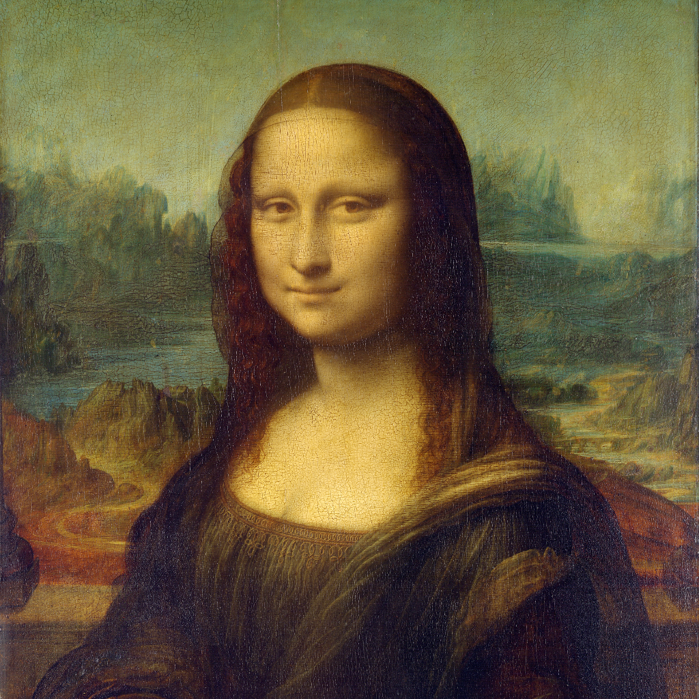
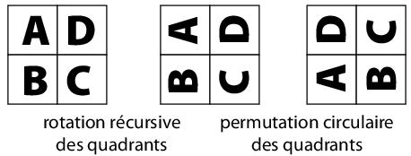

## Algorithmes de tris quadratiques vus en première

Vous avez vu en première deux algorithmes de tris peu efficaces(complexité <math xmlns="http://www.w3.org/1998/Math/MathML"><semantics><mrow><mi>O</mi><mo stretchy="false">(</mo><msup><mi>n</mi><mn>2</mn></msup><mo stretchy="false">)</mo></mrow><annotation encoding="application/x-tex">O(n^2)</annotation></semantics></math>O(n2)
):

<ul>
<li>
Le tri par sélection

Sur un tableau de n éléments (numérotés de <math xmlns="http://www.w3.org/1998/Math/MathML"><semantics><mrow><mn>0</mn></mrow><annotation encoding="application/x-tex">0</annotation></semantics></math>0
à <math xmlns="http://www.w3.org/1998/Math/MathML"><semantics><mrow><mi>n</mi><mo>−</mo><mn>1</mn></mrow><annotation encoding="application/x-tex">n-1</annotation></semantics></math>n−1
), le principe du tri par sélection est le suivant :

<ul>
<li>Rechercher le plus petit élément du tableau, et l’échanger avec l’élément d’indice 0 ;</li>
<li>rechercher le second plus petit élément du tableau, et l’échanger avec l’élément d’indice 1 ;</li>
<li>continuer de cette façon jusqu’à ce que le tableau soit entièrement trié. &nbsp; <a href="http://fr.wikipedia.org/wiki/Tri_par_s%C3%A9lection">Source Wikipedia</a></li>
</ul></li>
<li>
Le tri par insertion

Dans l’algorithme, on parcourt le tableau à trier du début à la fin. Au moment où on considère le i-ème élément, les éléments qui le précèdent sont déjà triés. Pour faire l’analogie avec l’exemple du jeu de cartes, lorsqu’on est à la i-ème étape du parcours, le i-ème élément est la carte saisie, les éléments précédents sont la main triée et les éléments suivants correspondent aux cartes encore mélangées sur la table.

L’objectif d’une étape est d’insérer le i-ème élément à sa place parmi ceux qui précèdent. En pratique, on fait « remonter » l’élément au fur et à mesure jusqu’à rencontrer un élément plus petit.
</li>
</ul>
<ol type="1">
<li>
On considère la liste suivante de neuf valeurs: <code>[36, 45, 36, 9, 15, 23, 11, 38, 40]</code>.

Donner l’état de la liste à la fin des neuf étapes de tri pour le tri par sélection et le tri par insertion.

Pourquoi l’algorithme a une complexité quadratique alors que la liste ne passe que par neuf états au cours de son tri?
</li>
<li>
Implémenter ces deux algorithmes de tri en Python:

<ul>
<li><code>tri_selection(tbl: list) -&gt; list</code></li>
<li><code>tri_insertion(tbl: list) -&gt; list</code></li>
</ul>

Tester les fonctions avec les assertions suivantes:

<pre>tbl = [36, 45, 36, 9, 15, 23, 11, 38, 40]
assert tri_selection(tbl) == [9, 11, 15, 23, 36, 36, 38, 40, 45]
assert tri_insertion(tbl) == [9, 11, 15, 23, 36, 36, 38, 40, 45]

# avec des valeurs aléatoires
import random as rd
tbl =  [rd.randint(-1000, 1000) for i in range(1000)]
# bien évidemment Python sait trier!
trié = sorted(tbl)
assert tri_selection(tbl) == trié
assert tri_insertion(tbl) == trié
</pre>

</li>
</ol>
<h2 id="rotation-dune-image-dun-quart-de-tour" class="anchored">Rotation d’une image d’un quart de tour</h2>
<blockquote class="blockquote">

Exercice inspiré du travail de Laurent Cheno, les images proviennent de son notebook que l’on ne peut plus trouver en ligne.

</blockquote>

On considère l’image suivante de la Joconde découpée en carré de <code>1024x1024</code>.

<figure class="figure">

<figcaption class="figure-caption">La Joconde carrée</figcaption>

</figure>

Pour la réalisation de cet exercice, il est conseillé d’utiliser le package Python <a href="https://pillow.readthedocs.io/en/stable/">pillow</a>.

Voici le code nécessaire à l’ouverture d’une image, et l’affichage de sa taille.

<pre>from PIL import Image
img = Image.open("joconde_1024.png")
img.show()
img.size
</pre>

Principe de l’algorithme: On découpe l’image carrée en quatre quadrants, on fait tourner récursivement chaque quart, puis on opère une permutation circulaire des quadrants.

<figure class="figure">

<figcaption class="figure-caption">Méthode diviser pour régner appliquée à la rotation d’une image</figcaption>

</figure>

Pour tenter de faire cet exercice, vous pourrez utiliser la fonction <code>echange_pixels</code> qui permet d’échanger les valeurs des pixels de coordonnées <code>x0, y0</code> et <code>x1, y1</code>.

<pre>def echange_pixels(image: PIL.image,
                   x0: int, y0: int,
                   x1: int, y1: int) -&gt; PIL.image:
    couleurs0, couleurs1 = image.getpixel(x0, y0), image.getpixel(x1, y1)
    image.putpixel(x0, y0, couleurs1)
    image.putpixel(x1, y1, couleurs0)
    return image
</pre>

À vous, bon courage!

