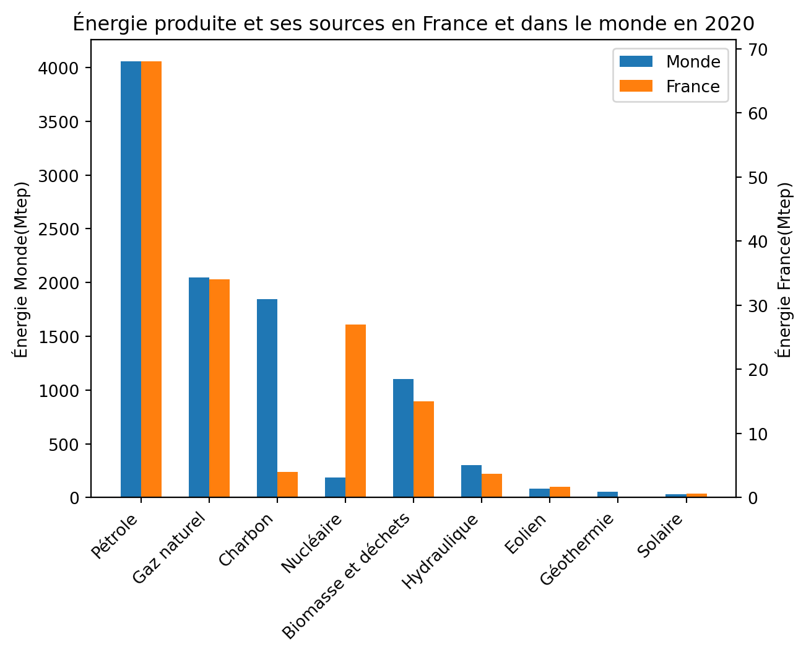
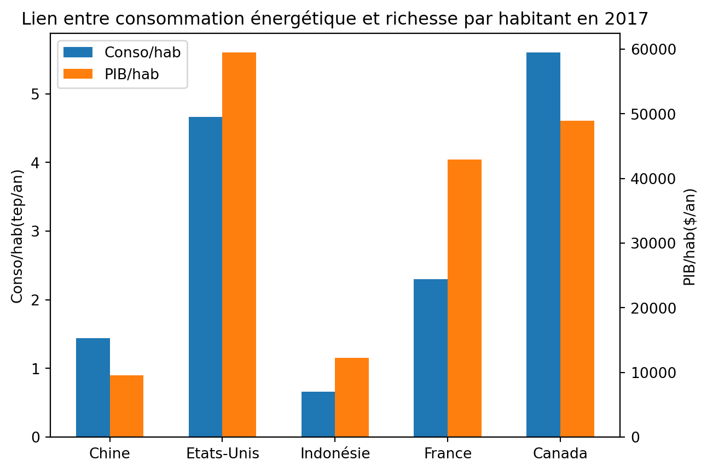
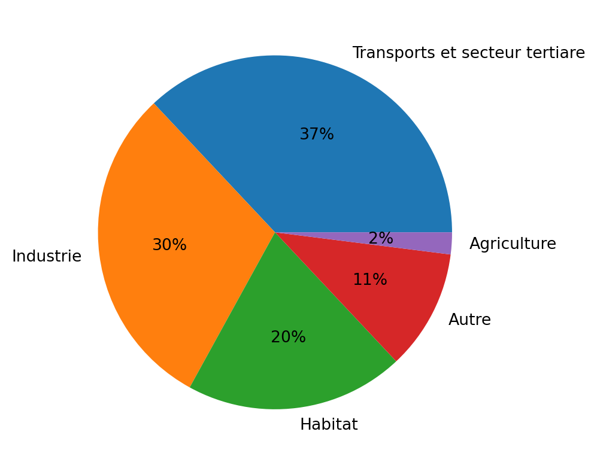
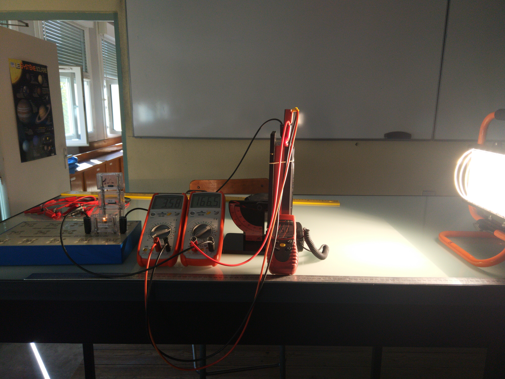

Programme Officiel

<table class="table table-bordered table-hover">
<thead class="table-warning">
<tr class="header">
<th>
<pre>                    Savoirs
</pre>

</th>
<th>
<pre>          Savoir-faire
</pre>

</th>
</tr>
</thead>
<tbody>
<tr class="odd">
<td>
L’énergie utilisée dans le monde provient d’une diversité de ressources parmi lesquelles les combustibles fossiles dominent.

La consommation en est très inégalement répartie selon la richesse des pays et des individus.
</td>
<td>Utiliser les différentes unités d’énergie employées (Tonne Équivalent Pétrole (TEP), kWh…) et les convertir en joules – les facteurs de conversion étant fournis.</td>
</tr>
<tr class="even">
<td>La croissance de la consommation globale (doublement dans les 40 dernières années) est directement liée au modèle industriel de production et de consommation des sociétés.</td>
<td>Exploiter des données de production et d’utilisation d’énergie à différentes échelles (mondiale, nationale, individuelle…).</td>
</tr>
<tr class="odd">
<td>
En moyenne mondiale, cette énergie est utilisée à parts comparables par le secteur industriel, les transports, le secteur de l’habitat et dans une moindre mesure par le secteur agricole.

Les énergies primaires sont disponibles sous forme de stocks (combustibles fossiles, uranium) et de flux (flux radiatif solaire, flux géothermique, puissance gravitationnelle à l’origine des marées).
</td>
<td>Comparer quelques ordres de grandeur d’énergie et de puissance : corps humain, objets du quotidien, centrale électrique, flux radiatif solaire…</td>
</tr>
<tr class="even">
<td>La combustion de carburants fossiles et de biomasse libère du dioxyde de carbone et également des aérosols et d’autres substances (<math xmlns="http://www.w3.org/1998/Math/MathML"><semantics><mrow><msub><mi mathvariant="normal">N</mi><mn>2</mn></msub><mi mathvariant="normal">O</mi></mrow><annotation encoding="application/x-tex">{\mathrm{N}}_{\mathrm{2}}{\mathrm{O}}</annotation></semantics></math>N2​O
, <math xmlns="http://www.w3.org/1998/Math/MathML"><semantics><mrow><msub><mi mathvariant="normal">O</mi><mn>3</mn></msub></mrow><annotation encoding="application/x-tex">{\mathrm{O}_{\mathrm{3}}}</annotation></semantics></math>O3​
, suies, produits soufrés), qui affectent la qualité de l’air respiré et la santé.</td>
<td>
Calculer la masse de dioxyde de carbone produite par unité d’énergie dégagée pour différents combustibles (l’équation de réaction et l’énergie massique dégagée étant fournies).

À partir de documents épidémiologiques, identifier et expliquer les conséquences sur la santé de certains polluants atmosphériques, telles les particules fines résultant de combustions.
</td>
</tr>
<tr class="odd">
<td>L’empreinte carbone d’une activité ou d’une personne est la masse de CO2 produite directement ou indirectement par sa consommation d’énergie et/ou de matière première.</td>
<td>
Comparer sur l’ensemble de leur cycle de vie les impacts d’objets industriels (par exemple, voiture à moteur électrique ou à essence).

À partir de documents, analyser l’empreinte carbone de différentes activités humaines et proposer des comportements pour la minimiser ou la compenser.
</td>
</tr>
<tr class="even">
<td>Les scénarios de transition écologique font différentes hypothèses sur la quantité de GES émise dans le futur. Ils évaluent les changements prévisibles, affectant principalement les plus fragiles.</td>
<td>Analyser l’impact de l’augmentation du CO2 sur le développement de la végétation, écosystèmes et les conditions de vie des êtres humains,</td>
</tr>
<tr class="odd">
<td>Les projections fournies par les modèles permettent de définir les aléas et peuvent orienter les prises de décision. Les mesures d’adaptation découlent d’une analyse des risques et des options pour y faire face.</td>
<td>Analyser des extraits de documents du GIEC ou d’accords internationaux proposant différents scénarios.</td>
</tr>
</tbody>
</table>
<a class="lien-programme" href="../programme/">Lien vers le programme complet</a>

<!-- `youtube: HQoIAs3JGkQ` -->

Les sociétés modernes sont dépendantes de l’énergie, or les choix énergétiques ont un impact sur le réchauffement climatique. Comment faire des choix responsables dans ce domaine?

<wc-wikimage title="20160411_Global_warming_line_chart_(1850-2016)_-_Ed_Hawkins.png" caption="Représentation graphique de l'élévation de températures depuis l'ère pré-industrielle."></wc-wikimage>

&nbsp;

Évaluation diagnostique P69 du <a href="https://fr.calameo.com/read/004822953a13311d337ec">manuel Hachette Ed.2020</a>.

<!-- ## Énergie et puissance

Énergie

: L'énergie est une grandeur qui peut être transféré à un corps pour le déplacer ou le
chauffer. On la mesure en joule(J) dans le système international(SI).

Puissance

: C'est l'énergie transférée par unité de temps. On la mesure en watt(W) dans le système
international(SI).

::: prop

$$
1W=1J/s
$$

ou $1J.s^{-1}$ pour les spécialistes!
:::

::: example

Dans une voiture l'énergie est stockée dans le réservoir(ou la batterie).

Le moteur est plus ou moins puissant pour accélérer plus ou moins vite en
consommant plus ou moins d'énergie à la seconde.

:::

TODO: Ordres de grandeurs 

::: {.exp titre="Utilisation d'une bouilloire"}

On lit sur une bouilloire une puissance de __________.

1. Combien de temps faut-il pour élever de 10 °C la température d'un litre
   d'eau.
2. En déduire la durée nécessaire pour faire bouillir 1L d'eau initialement à
   20°C.

_Données:_

- _il faut une calorie pour élever de 1°C la température d'1g d'eau._
- _1 calorie = 4,18J._

:::

-->
<h2 id="production-et-consommation-dénergie-dans-le-monde" class="anchored">Production et consommation d’énergie dans le monde</h2>

&nbsp;

Faire l’activité PP68-69 du Livre Scolaire: <a href="https://lls.fr/ESTP68" class="uri">https://lls.fr/ESTP68</a>

<i class="callout-icon"></i>

Important

L’énergie utilisée dans le monde provient d’une diversité de ressources parmi lesquelles les combustibles fossiles dominent.

<i class="callout-icon"></i>

Important

La consommation d’énergie est très inégalement répartie selon la richesse des pays(et des individus).

<wc-wikimage title="Energy_consumption_per_capita_2003_(French).png" caption="Consommation énergétique par habitant dans le monde en 2003."></wc-wikimage>

<i class="callout-icon"></i>

Important

La croissance de la consommation globale (doublement dans les 40 dernières années) est directement liée au modèle industriel de production et de consommation des sociétés.

<wc-wikimage title="Energy_consumption_by_source,_OWID.svg" caption="A l'image de la population, la consommation globale d'énergie n'a cessé de croitre ces 40 dernières années."></wc-wikimage>

<i class="callout-icon"></i>

Important

En moyenne mondiale, l’énergie est utilisée à parts comparables par le secteur industriel, les transports, le secteur de l’habitat et dans une moindre mesure par le secteur agricole.

<i class="callout-icon"></i>

Important

Les énergies primaires sont disponibles sous forme de stocks (combustibles fossiles, uranium) et de flux (flux radiatif solaire, flux géothermique, puissance gravitationnelle à l’origine des marées).

<h2 id="la-pollution-de-lair-et-ses-conséquences" class="anchored">La pollution de l’air et ses conséquences</h2>

&nbsp;

Faire l’activité PP72-73 du Livre Scolaire: <a href="https://lls.fr/ESTP73" class="uri">https://lls.fr/ESTP73</a>

<i class="callout-icon"></i>

Important

La combustion de carburants fossiles et de biomasse libère du dioxyde de carbone et également des aérosols et d’autres substances (<math xmlns="http://www.w3.org/1998/Math/MathML"><semantics><mrow><msub><mi mathvariant="normal">N</mi><mn>2</mn></msub><mi mathvariant="normal">O</mi></mrow><annotation encoding="application/x-tex">{\mathrm{N}}_{\mathrm{2}}{\mathrm{O}}</annotation></semantics></math>N2​O
, <math xmlns="http://www.w3.org/1998/Math/MathML"><semantics><mrow><msub><mi mathvariant="normal">O</mi><mn>3</mn></msub></mrow><annotation encoding="application/x-tex">{\mathrm{O}}_{\mathrm{3}}</annotation></semantics></math>O3​
, suies, produits soufrés), qui affectent la qualité de l’air respiré et la santé.

<!-- 

:::{.exp titre="Rendement d'un panneau solaire"} 

On éclaire perpendiculairement un panneau solaire rectangulaire (15cmx8cm) avec une lampe halogène.

Le panneau solaire permet d'alimenter une lampe en lui fournissant une tension U=3,58V et une
intensité I=166,5mA. On rappelle que la puissance électrique s'écrit $P=UI$.

On mesure l'éclairement avec un luxmètre au niveau du panneau solaire $E_v=250 lux$. On considérera que dans les conditions de l'expérience $1lux = 4 W.m^{-2}$.

_Calculer le rendement de la conversion énergie lumineuse → énergie électrique._

:::

-->
<!--

::: plus

En utilisant cette page web:

https://www.planete-energies.com/fr/medias/infographies/la-carte-du-monde-de-l-energie-3

Montrer sur des exemples que la consommation d'énergie est très inégalement répartie selon la
richesse des pays(et des individus).

:::

## L'empreinte carbone

Empreinte carbone

: L'empreinte carbone d'une activité ou d'une personne est la masse de CO~2~ produite directement
ou indirectement par sa consommation d'énergie et/ou de matière première.

::: appli

Questions 1 et 3 de l'activité 2 PP72-73 du [manuel Hachette Ed.2020](https://fr.calameo.com/read/004822953a13311d337ec)

:::

La combustion de carburants fossiles et de biomasse libère du dioxyde de carbone et également des
aérosols et d'autres substances (N~2~O, O~3~, suies, produits soufrés), qui affectent la qualité de
l'air respiré et la santé.

::: appli

Activité 2 PP72-73 du [manuel Hachette Ed.2020](https://www.enseignants.hachette-education.com/livres/enseignement-scientifique-terminales-livre-eleve-ed-2020-9782017866138)

1. Doc 1. Comparer l'impact carbone d'un véhicule électrique et d'un véhicule thermique au cours de
   son cycle de vie.
2. Doc 2 et 3. Expliquer à l'oral quel peut-être l'impact de notre mode de vie sur nos émissions de
   carbone.

:::

::: ref

- [Manuel Hachette Ed.2020](https://www.enseignants.hachette-education.com/livres/enseignement-scientifique-terminales-livre-eleve-ed-2020-9782017866138)

::: -->

