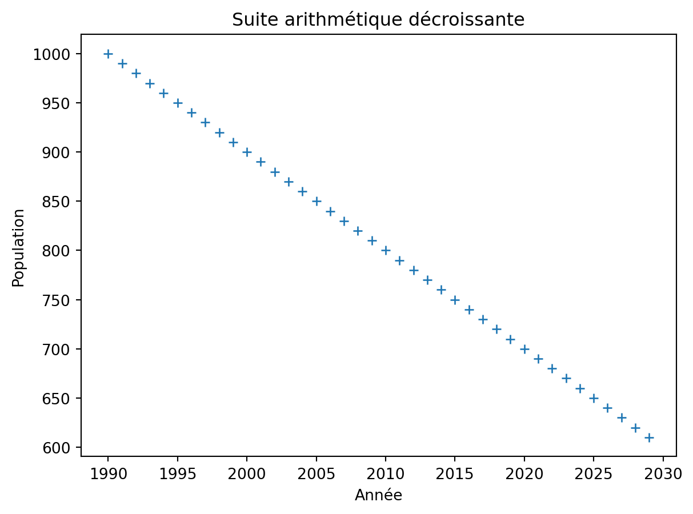
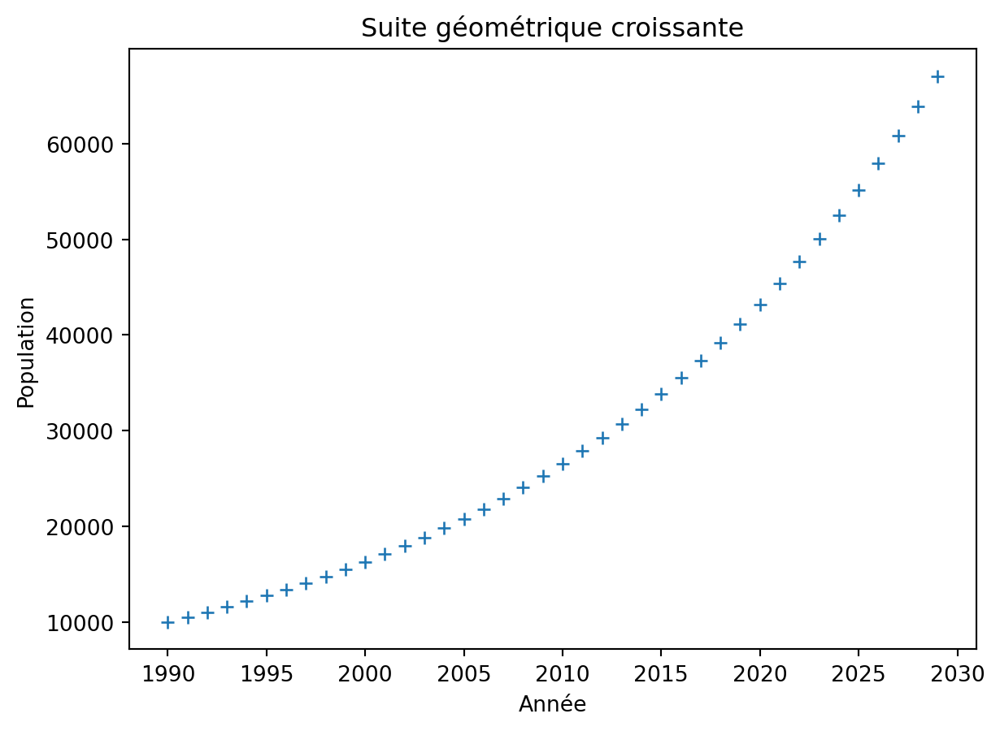

Programme Officiel

<table class="table table-bordered table-hover">
<thead class="table-warning">
<tr class="header">
<th><strong>Savoirs</strong></th>
<th><strong>Savoir-faire</strong></th>
</tr>
</thead>
<tbody>
<tr class="odd">
<td>
Un modèle mathématique simple est le modèle linéaire.

Une grandeur discrète <math xmlns="http://www.w3.org/1998/Math/MathML"><semantics><mrow><mi>u</mi></mrow><annotation encoding="application/x-tex">u</annotation></semantics></math>u
varie de manière linéaire en fonction d’un palier entier <math xmlns="http://www.w3.org/1998/Math/MathML"><semantics><mrow><mi>n</mi></mrow><annotation encoding="application/x-tex">n</annotation></semantics></math>n
si sa variation absolue <math xmlns="http://www.w3.org/1998/Math/MathML"><semantics><mrow><mi>u</mi><mo stretchy="false">(</mo><mi>n</mi><mo>+</mo><mn>1</mn><mo stretchy="false">)</mo><mo>−</mo><mi>u</mi><mo stretchy="false">(</mo><mi>n</mi><mo stretchy="false">)</mo></mrow><annotation encoding="application/x-tex">u(n+1)-u(n)</annotation></semantics></math>u(n+1)−u(n)
est constante. Dans ce cas, les points <math xmlns="http://www.w3.org/1998/Math/MathML"><semantics><mrow><mo stretchy="false">(</mo><mi>n</mi><mo separator="true">,</mo><mi>u</mi><mo stretchy="false">(</mo><mi>n</mi><mo stretchy="false">)</mo><mo stretchy="false">)</mo></mrow><annotation encoding="application/x-tex">(n, u(n))</annotation></semantics></math>(n,u(n))
sont situés sur une droite. La suite de terme général <math xmlns="http://www.w3.org/1998/Math/MathML"><semantics><mrow><mi>u</mi><mo stretchy="false">(</mo><mi>n</mi><mo stretchy="false">)</mo></mrow><annotation encoding="application/x-tex">u(n)</annotation></semantics></math>u(n)
est arithmétique.

Dans la réalité, pour une population dont la variation absolue est presque constante d’un palier à l’autre, on peut ajuster le nuage de points qui la représente par une droite (modèle linéaire).
</td>
<td>
Exprimer u(n) en fonction de u(0) et n.

Produire et interpréter des graphiques statistiques traduisant l’évolution d’effectif d’une population ou de ressources, notamment sous forme de nuages de points.

À l’aide d’une calculatrice ou d’un tableur, ajuster un nuage de points par une droite et utiliser ce modèle linéaire pour effectuer des prévisions.
</td>
</tr>
<tr class="even">
<td>
Le modèle linéaire est inadapté pour représenter l’évolution d’une grandeur dont la variation absolue change fortement d’un palier à l’autre.

Une grandeur discrète <math xmlns="http://www.w3.org/1998/Math/MathML"><semantics><mrow><mi>u</mi></mrow><annotation encoding="application/x-tex">u</annotation></semantics></math>u
varie de manière exponentielle en fonction du palier entier n si sa variation absolue <math xmlns="http://www.w3.org/1998/Math/MathML"><semantics><mrow><mi>u</mi><mo stretchy="false">(</mo><mi>n</mi><mo>+</mo><mn>1</mn><mo stretchy="false">)</mo><mo>−</mo><mi>u</mi><mo stretchy="false">(</mo><mi>n</mi><mo stretchy="false">)</mo></mrow><annotation encoding="application/x-tex">u(n+1) - u(n)</annotation></semantics></math>u(n+1)−u(n)
est proportionnelle à sa valeur courante <math xmlns="http://www.w3.org/1998/Math/MathML"><semantics><mrow><mi>u</mi><mo stretchy="false">(</mo><mi>n</mi><mo stretchy="false">)</mo></mrow><annotation encoding="application/x-tex">u(n)</annotation></semantics></math>u(n)
. Dans ce cas, sa variation relative (ou taux de variation) est constante et la suite de terme général <math xmlns="http://www.w3.org/1998/Math/MathML"><semantics><mrow><mi>u</mi><mo stretchy="false">(</mo><mi>n</mi><mo stretchy="false">)</mo></mrow><annotation encoding="application/x-tex">u(n)</annotation></semantics></math>u(n)
est géométrique.
</td>
<td>
Exprimer u(n) en fonction de u(0) et de n.

À partir de données démographiques, calculer le taux de variation d’une population entre deux dates.

Calculer l’effectif final d’une population à partir de son effectif initial, de son taux de natalité et de son taux de mortalité. Dans la réalité, pour une population dont le taux de variation est presque constant d’un palier à l’autre, on peut ajuster le nuage de points par un modèle exponentiel.
</td>
</tr>
<tr class="odd">
<td>
Le modèle démographique de Malthus est un modèle exponentiel d’évolution de l’effectif de la population. Il prévoit que l’effectif de la population décroît vers 0 si le taux de mortalité est supérieur au taux de natalité et croît vers l’infini si le taux de natalité est supérieur au taux de mortalité.

Si les prédictions du modèle de Malthus peuvent se révéler correctes sur un temps court, elles sont irréalistes sur un temps long, notamment en raison de l’insuffisance des ressources disponibles.

Des modèles plus élaborés prévoient que la population mondiale atteindra environ 10 milliards d’humains en 2050. modèle de Malthus, prédire l’effectif d’une population au bout de n années.
</td>
<td>
À l’aide d’un tableur, d’une calculatrice ou d’une représentation graphique, calculer le temps de doublement d’une population sous l’hypothèse de croissance exponentielle.

À partir de documents fournis, proposer un modèle de croissance de ressources alimentaires (par exemple la production mondiale de blé ou de riz) et la comparer à une croissance exponentielle.

Comparer les valeurs fournies par un modèle à des données réelles afin de tester sa validité.
</td>
</tr>
</tbody>
</table>
<a class="lien-programme" href="../programme/">Lien vers le programme complet</a>

Dans le cadre de l’étude de l’évolution des populations, il est important de prédire leur effectif futur, mais aussi la manière dont vont évoluer les ressources qui leur sont nécessaires. Pour prédire l’évolution d’un système quelconque, les scientifiques utilisent des modèles mathématiques. La présentation de l’exemple historique de Malthus permet de mettre en œuvre cette démarche mathématique dans le cas discret (correspondant à une variation par paliers).

<h2 id="évolution-de-la-population" class="anchored">Évolution de la population</h2>

<wc-wikimage title="World_population_(UN)_fr.svg" caption="Evolutions et prédictions des populations du monde."></wc-wikimage>

Si on <em>néglige les migrations</em>, la variation de la taille de la population entre l’année <math xmlns="http://www.w3.org/1998/Math/MathML"><semantics><mrow><mi>n</mi></mrow><annotation encoding="application/x-tex">n</annotation></semantics></math>n
et l’année <math xmlns="http://www.w3.org/1998/Math/MathML"><semantics><mrow><mi>n</mi><mo>+</mo><mn>1</mn></mrow><annotation encoding="application/x-tex">n+1</annotation></semantics></math>n+1
est:

<math xmlns="http://www.w3.org/1998/Math/MathML" display="block"><semantics><mrow><mi>p</mi><mi>o</mi><mi>p</mi><mo stretchy="false">(</mo><mi>n</mi><mo>+</mo><mn>1</mn><mo stretchy="false">)</mo><mo>−</mo><mi>p</mi><mi>o</mi><mi>p</mi><mo stretchy="false">(</mo><mi>n</mi><mo stretchy="false">)</mo><mo>=</mo><mi>N</mi><mi>a</mi><mi>i</mi><mi>s</mi><mi>s</mi><mi>a</mi><mi>n</mi><mi>c</mi><mi>e</mi><mo stretchy="false">(</mo><mi>n</mi><mo stretchy="false">)</mo><mo>−</mo><mi>M</mi><mi>o</mi><mi>r</mi><mi>t</mi><mi>s</mi><mo stretchy="false">(</mo><mi>n</mi><mo stretchy="false">)</mo></mrow><annotation encoding="application/x-tex">
pop(n+1) - pop(n) = Naissance(n)  - Morts(n)
</annotation></semantics></math>pop(n+1)−pop(n)=Naissance(n)−Morts(n)

<dl>
<dt>
Suite
</dt>
<dd>

En mathématique, une <em>suite</em> est un ensemble de valeurs indexé par les entiers strictement positifs. On note ces valeurs <math xmlns="http://www.w3.org/1998/Math/MathML"><semantics><mrow><mi>u</mi><mo stretchy="false">(</mo><mi>n</mi><mo stretchy="false">)</mo></mrow><annotation encoding="application/x-tex">u(n)</annotation></semantics></math>u(n)
.

</dd>
</dl>
<!-- Pour prédire la population future, il faut faire des hypothèses sur les facteurs qui conditionnent
la natalité et la mortalité des populations comme:

- leur alimentation(ressources, qualité, quantité...)
- leur santé(qualité des soins, accès aux soins...)
- leur bonheur
- ... -->

<wc-wikimage title="Popu_mondiale_1800-2100_UNrev2013.jpg" caption="Population mondiale : 3 scénarios d'évolution possible de la population mondiale. sources : Nations unies, Projections de population 2013 ; 1800-1950 : estimations US Census Bureau"></wc-wikimage>

<h2 id="modèle-linéaire-suite-arithmétique" class="anchored">Modèle linéaire: suite arithmétique</h2>

Une suite est <strong>arithmétique</strong> si sa variation absolue <math xmlns="http://www.w3.org/1998/Math/MathML"><semantics><mrow><mi>u</mi><mo stretchy="false">(</mo><mi>n</mi><mo>+</mo><mn>1</mn><mo stretchy="false">)</mo><mo>−</mo><mi>u</mi><mo stretchy="false">(</mo><mi>n</mi><mo stretchy="false">)</mo></mrow><annotation encoding="application/x-tex">u(n+1) - u(n)</annotation></semantics></math>u(n+1)−u(n)
est constante.

<math xmlns="http://www.w3.org/1998/Math/MathML" display="block"><semantics><mrow><mi>u</mi><mo stretchy="false">(</mo><mi>n</mi><mo>+</mo><mn>1</mn><mo stretchy="false">)</mo><mo>−</mo><mi>u</mi><mo stretchy="false">(</mo><mi>n</mi><mo stretchy="false">)</mo><mo>=</mo><mi>r</mi></mrow><annotation encoding="application/x-tex">
u(n+1)-u(n)=r
</annotation></semantics></math>u(n+1)−u(n)=r

Soit:

<math xmlns="http://www.w3.org/1998/Math/MathML" display="block"><semantics><mrow><mi>u</mi><mo stretchy="false">(</mo><mi>n</mi><mo>+</mo><mn>1</mn><mo stretchy="false">)</mo><mo>=</mo><mi>u</mi><mo stretchy="false">(</mo><mi>n</mi><mo stretchy="false">)</mo><mo>+</mo><mi>r</mi></mrow><annotation encoding="application/x-tex">
u(n+1)=u(n)+r
</annotation></semantics></math>u(n+1)=u(n)+r

La constante <math xmlns="http://www.w3.org/1998/Math/MathML"><semantics><mrow><mi>r</mi></mrow><annotation encoding="application/x-tex">r</annotation></semantics></math>r
est appelée <em>raison</em> de la suite.

Dans ce cas, les points <math xmlns="http://www.w3.org/1998/Math/MathML"><semantics><mrow><mo stretchy="false">(</mo><mi>n</mi><mo separator="true">,</mo><mi>u</mi><mo stretchy="false">(</mo><mi>n</mi><mo stretchy="false">)</mo><mo stretchy="false">)</mo></mrow><annotation encoding="application/x-tex">(n, u(n))</annotation></semantics></math>(n,u(n))
sont situés sur une droite. La suite de terme général <math xmlns="http://www.w3.org/1998/Math/MathML"><semantics><mrow><mi>u</mi><mo stretchy="false">(</mo><mi>n</mi><mo stretchy="false">)</mo></mrow><annotation encoding="application/x-tex">u(n)</annotation></semantics></math>u(n)
est:

<math xmlns="http://www.w3.org/1998/Math/MathML" display="block"><semantics><mrow><mi>u</mi><mo stretchy="false">(</mo><mi>n</mi><mo stretchy="false">)</mo><mo>=</mo><mi>u</mi><mo stretchy="false">(</mo><mn>0</mn><mo stretchy="false">)</mo><mo>+</mo><mi>n</mi><mo>×</mo><mi>r</mi></mrow><annotation encoding="application/x-tex">
u(n)=u(0)+n\times r
</annotation></semantics></math>u(n)=u(0)+n×r

&nbsp;

Un village avait une population de 1000 habitants en l’an 1990, sa population diminue de 10 habitants par an. La représentation de la population en fonction des années est représentée ci-dessus.

<ol type="1">
<li>Exprimer <math xmlns="http://www.w3.org/1998/Math/MathML"><semantics><mrow><mi>u</mi><mo stretchy="false">(</mo><mi>n</mi><mo>+</mo><mn>1</mn><mo stretchy="false">)</mo></mrow><annotation encoding="application/x-tex">u(n+1)</annotation></semantics></math>u(n+1)
en fonction de <math xmlns="http://www.w3.org/1998/Math/MathML"><semantics><mrow><mi>u</mi><mo stretchy="false">(</mo><mi>n</mi><mo stretchy="false">)</mo></mrow><annotation encoding="application/x-tex">u(n)</annotation></semantics></math>u(n)
.</li>
<li>Exprimer <math xmlns="http://www.w3.org/1998/Math/MathML"><semantics><mrow><mi>u</mi><mo stretchy="false">(</mo><mi>n</mi><mo stretchy="false">)</mo></mrow><annotation encoding="application/x-tex">u(n)</annotation></semantics></math>u(n)
en fonction de <math xmlns="http://www.w3.org/1998/Math/MathML"><semantics><mrow><mi>u</mi><mo stretchy="false">(</mo><mn>0</mn><mo stretchy="false">)</mo></mrow><annotation encoding="application/x-tex">u(0)</annotation></semantics></math>u(0)
et <math xmlns="http://www.w3.org/1998/Math/MathML"><semantics><mrow><mi>n</mi></mrow><annotation encoding="application/x-tex">n</annotation></semantics></math>n
. <math xmlns="http://www.w3.org/1998/Math/MathML"><semantics><mrow><mi>u</mi><mo stretchy="false">(</mo><mn>0</mn><mo stretchy="false">)</mo></mrow><annotation encoding="application/x-tex">u(0)</annotation></semantics></math>u(0)
étant la population en 1990.</li>
<li>En quelle année la population serait divisée par 2 d’après ce modèle?</li>
<li>Prédire la population de ce village en 2200. Commenter.</li>
</ol>

<h2 id="modèle-exponentiel-suite-géométrique" class="anchored">Modèle exponentiel: Suite géométrique</h2>

Une suite est <strong>géométrique</strong> si sa variation absolue <math xmlns="http://www.w3.org/1998/Math/MathML"><semantics><mrow><mi>u</mi><mo stretchy="false">(</mo><mi>n</mi><mo>+</mo><mn>1</mn><mo stretchy="false">)</mo><mo>−</mo><mi>u</mi><mo stretchy="false">(</mo><mi>n</mi><mo stretchy="false">)</mo></mrow><annotation encoding="application/x-tex">u(n+1) - u(n)</annotation></semantics></math>u(n+1)−u(n)
est proportionnelle à sa valeur courante <math xmlns="http://www.w3.org/1998/Math/MathML"><semantics><mrow><mi>u</mi><mo stretchy="false">(</mo><mi>n</mi><mo stretchy="false">)</mo></mrow><annotation encoding="application/x-tex">u(n)</annotation></semantics></math>u(n)
.

<math xmlns="http://www.w3.org/1998/Math/MathML" display="block"><semantics><mrow><mi>u</mi><mo stretchy="false">(</mo><mi>n</mi><mo>+</mo><mn>1</mn><mo stretchy="false">)</mo><mo>−</mo><mi>u</mi><mo stretchy="false">(</mo><mi>n</mi><mo stretchy="false">)</mo><mo>=</mo><mi>k</mi><mo>×</mo><mi>u</mi><mo stretchy="false">(</mo><mi>n</mi><mo stretchy="false">)</mo></mrow><annotation encoding="application/x-tex">
u(n+1)-u(n)=k\times u(n)
</annotation></semantics></math>u(n+1)−u(n)=k×u(n)

Soit

<math xmlns="http://www.w3.org/1998/Math/MathML" display="block"><semantics><mrow><mi>u</mi><mo stretchy="false">(</mo><mi>n</mi><mo>+</mo><mn>1</mn><mo stretchy="false">)</mo><mo>=</mo><mi>q</mi><mo>×</mo><mi>u</mi><mo stretchy="false">(</mo><mi>n</mi><mo stretchy="false">)</mo></mrow><annotation encoding="application/x-tex">
u(n+1)=q\times u(n)
</annotation></semantics></math>u(n+1)=q×u(n)

Avec <math xmlns="http://www.w3.org/1998/Math/MathML"><semantics><mrow><mi>q</mi><mo>=</mo><mn>1</mn><mo>+</mo><mi>k</mi></mrow><annotation encoding="application/x-tex">q=1+k</annotation></semantics></math>q=1+k
le facteur constant appelé <em>raison</em> de la suite.

Dans ce cas, les points <math xmlns="http://www.w3.org/1998/Math/MathML"><semantics><mrow><mo stretchy="false">(</mo><mi>n</mi><mo separator="true">,</mo><mi>u</mi><mo stretchy="false">(</mo><mi>n</mi><mo stretchy="false">)</mo><mo stretchy="false">)</mo></mrow><annotation encoding="application/x-tex">(n, u(n))</annotation></semantics></math>(n,u(n))
sont situés sur une courbe <em>exponentielle</em>. La suite de terme général <math xmlns="http://www.w3.org/1998/Math/MathML"><semantics><mrow><mi>u</mi><mo stretchy="false">(</mo><mi>n</mi><mo stretchy="false">)</mo></mrow><annotation encoding="application/x-tex">u(n)</annotation></semantics></math>u(n)
est:

<math xmlns="http://www.w3.org/1998/Math/MathML" display="block"><semantics><mrow><mi>u</mi><mo stretchy="false">(</mo><mi>n</mi><mo stretchy="false">)</mo><mo>=</mo><mi>u</mi><mo stretchy="false">(</mo><mn>0</mn><mo stretchy="false">)</mo><mo>×</mo><msup><mi>q</mi><mi>n</mi></msup></mrow><annotation encoding="application/x-tex">
u(n)=u(0)\times q^n
</annotation></semantics></math>u(n)=u(0)×qn

En fonction du taux de variation <math xmlns="http://www.w3.org/1998/Math/MathML"><semantics><mrow><mi>t</mi></mrow><annotation encoding="application/x-tex">t</annotation></semantics></math>t
de la population, on obtient le modèle de Malthus:

<math xmlns="http://www.w3.org/1998/Math/MathML" display="block"><semantics><mrow><mi>u</mi><mo stretchy="false">(</mo><mi>n</mi><mo stretchy="false">)</mo><mo>=</mo><mi>u</mi><mo stretchy="false">(</mo><mn>0</mn><mo stretchy="false">)</mo><mo>×</mo><mo stretchy="false">(</mo><mn>1</mn><mo>+</mo><mi>t</mi><msup><mo stretchy="false">)</mo><mi>n</mi></msup></mrow><annotation encoding="application/x-tex">
u(n)=u(0)\times (1+t)^n
</annotation></semantics></math>u(n)=u(0)×(1+t)n

&nbsp;

Une petite ville avait une population de 10 000 habitants en l’an 1990, sa population augmente de 5% par an. La représentation de la population en fonction des années est représentée ci-dessus.

<ol type="1">
<li>Exprimer <math xmlns="http://www.w3.org/1998/Math/MathML"><semantics><mrow><mi>u</mi><mo stretchy="false">(</mo><mi>n</mi><mo>+</mo><mn>1</mn><mo stretchy="false">)</mo></mrow><annotation encoding="application/x-tex">u(n+1)</annotation></semantics></math>u(n+1)
en fonction de <math xmlns="http://www.w3.org/1998/Math/MathML"><semantics><mrow><mi>u</mi><mo stretchy="false">(</mo><mi>n</mi><mo stretchy="false">)</mo></mrow><annotation encoding="application/x-tex">u(n)</annotation></semantics></math>u(n)
.</li>
<li>Exprimer <math xmlns="http://www.w3.org/1998/Math/MathML"><semantics><mrow><mi>u</mi><mo stretchy="false">(</mo><mi>n</mi><mo stretchy="false">)</mo></mrow><annotation encoding="application/x-tex">u(n)</annotation></semantics></math>u(n)
en fonction de <math xmlns="http://www.w3.org/1998/Math/MathML"><semantics><mrow><mi>u</mi><mo stretchy="false">(</mo><mn>0</mn><mo stretchy="false">)</mo></mrow><annotation encoding="application/x-tex">u(0)</annotation></semantics></math>u(0)
et <math xmlns="http://www.w3.org/1998/Math/MathML"><semantics><mrow><mi>n</mi></mrow><annotation encoding="application/x-tex">n</annotation></semantics></math>n
. <math xmlns="http://www.w3.org/1998/Math/MathML"><semantics><mrow><mi>u</mi><mo stretchy="false">(</mo><mn>0</mn><mo stretchy="false">)</mo></mrow><annotation encoding="application/x-tex">u(0)</annotation></semantics></math>u(0)
étant la population en 1990.</li>
<li>En quelle année la population serait doublée d’après ce modèle?</li>
<li>Prédire la population de cette petite ville en 2200. Commenter.</li>
</ol>

