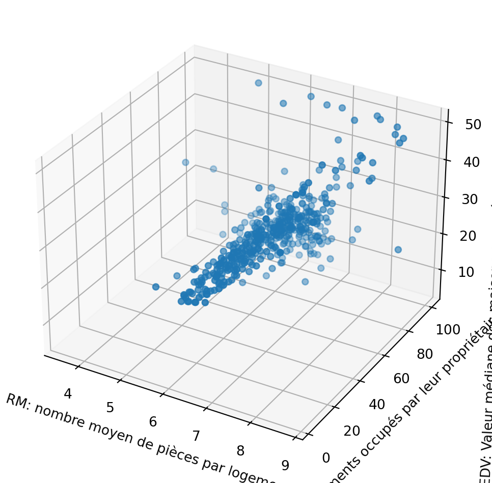
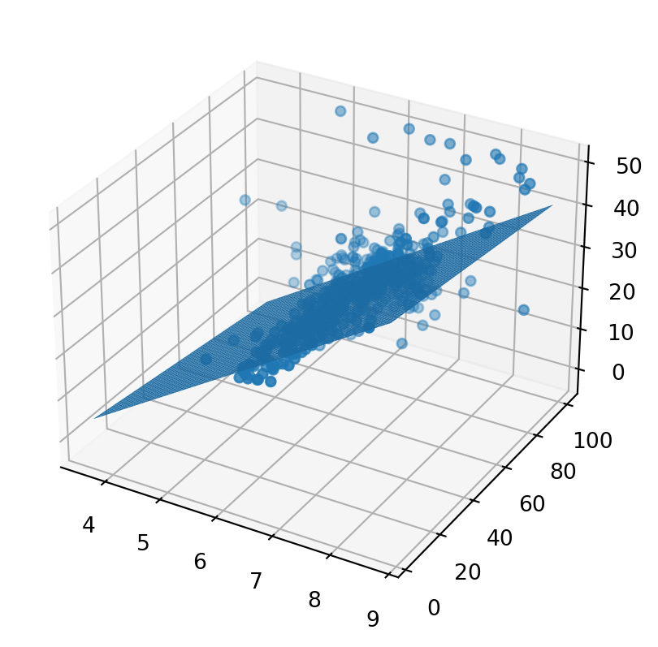

<h2 id="classification-dimages" class="anchored">Classification d’images</h2>
<blockquote class="blockquote">

Nous abordons ici un problème de <strong>classification</strong>: «Comment reconnaitre une race de chien?». On utilise des données d’apprentissage de <a href="http://vision.stanford.edu/aditya86/ImageNetDogs/">stanford</a>.

</blockquote>
<ul>
<li>Trouver une image de chien dont vous connaissez la race et l’enregistrer sur votre ordinateur.</li>
<li>Ouvrir la page <a href="https://teachablemachine.withgoogle.com/train/image" class="uri">https://teachablemachine.withgoogle.com/train/image</a>.</li>
<li>Importer à partir du dossier du TP des images de cette race de chien et renommer <code>Class 1</code> avec le nom de la race(Chihuahua par exemple).</li>
<li>Recommencer avec deux autres races de chiens dans <code>Class 2</code> et <code>Class 3</code>.</li>
<li>Entrainer le modèle et <em>attendre</em>…</li>
<li>Une fois le modèle entraîné, sélectionnez votre image de chien à reconnaitre dans <code>Aperçu</code> et vérifier que votre modèle sait la reconnaitre.</li>
<li>Trouver d’autres images sur Wikipédia pour vérifier qu’«il sait» les reconnaitre(Peut-on vraiment dire qu’un algorithme sait?). Commenter les résultats obtenus.</li>
</ul>

<strong>Informations sur les données</strong>

Source des données d’entraînement du modèle: <a href="http://vision.stanford.edu/aditya86/ImageNetDogs/" class="uri">http://vision.stanford.edu/aditya86/ImageNetDogs/</a>

Il y a 120 races de chiens dont voici les traductions(par AI) et le nombre de photo.

<table class="table table-bordered table-hover">
<thead class="table-warning">
<tr class="header">
<th>Dossier</th>
<th>Race</th>
<th>Nombre de photos</th>
</tr>
</thead>
<tbody>
<tr class="odd">
<td>French_bulldog</td>
<td>Bulldog français</td>
<td>159</td>
</tr>
<tr class="even">
<td>Shetland_sheepdog</td>
<td>Berger des Shetland</td>
<td>157</td>
</tr>
<tr class="odd">
<td>curly-coated_retriever</td>
<td>retriever à poil bouclé</td>
<td>151</td>
</tr>
<tr class="even">
<td>basenji</td>
<td>basenji</td>
<td>209</td>
</tr>
<tr class="odd">
<td>flat-coated_retriever</td>
<td>retriever à poil plat</td>
<td>152</td>
</tr>
<tr class="even">
<td>beagle</td>
<td>beagle</td>
<td>195</td>
</tr>
<tr class="odd">
<td>Rhodesian_ridgeback</td>
<td>Rhodesian Ridgeback</td>
<td>172</td>
</tr>
<tr class="even">
<td>giant_schnauzer</td>
<td>schnauzer géant</td>
<td>157</td>
</tr>
<tr class="odd">
<td>otterhound</td>
<td>lévrier</td>
<td>151</td>
</tr>
<tr class="even">
<td>pug</td>
<td>carlin</td>
<td>200</td>
</tr>
<tr class="odd">
<td>Pekinese</td>
<td>pékinois</td>
<td>149</td>
</tr>
<tr class="even">
<td>Brabancon_griffon</td>
<td>Griffon Brabançon</td>
<td>153</td>
</tr>
<tr class="odd">
<td>Irish_terrier</td>
<td>Terrier irlandais</td>
<td>169</td>
</tr>
<tr class="even">
<td>Irish_wolfhound</td>
<td>Lévrier irlandais</td>
<td>218</td>
</tr>
<tr class="odd">
<td>bull_mastiff</td>
<td>dogue de taureau</td>
<td>156</td>
</tr>
<tr class="even">
<td>schipperke</td>
<td>schipperke</td>
<td>154</td>
</tr>
<tr class="odd">
<td>Labrador_retriever</td>
<td>Labrador retriever</td>
<td>171</td>
</tr>
<tr class="even">
<td>Gordon_setter</td>
<td>Passeur Gordon</td>
<td>153</td>
</tr>
<tr class="odd">
<td>kelpie</td>
<td>varech</td>
<td>153</td>
</tr>
<tr class="even">
<td>Scotch_terrier</td>
<td>Terrier écossais</td>
<td>158</td>
</tr>
<tr class="odd">
<td>Sussex_spaniel</td>
<td>Épagneul du Sussex</td>
<td>151</td>
</tr>
<tr class="even">
<td>Lakeland_terrier</td>
<td>Terrier des lacs</td>
<td>197</td>
</tr>
<tr class="odd">
<td>wire-haired_fox_terrier</td>
<td>fox-terrier à poil dur</td>
<td>157</td>
</tr>
<tr class="even">
<td>Norfolk_terrier</td>
<td>Terrier de Norfolk</td>
<td>172</td>
</tr>
<tr class="odd">
<td>Great_Pyrenees</td>
<td>Grandes Pyrénées</td>
<td>213</td>
</tr>
<tr class="even">
<td>Walker_hound</td>
<td>Chien marcheur</td>
<td>153</td>
</tr>
<tr class="odd">
<td>Bedlington_terrier</td>
<td>Terrier de Bedlington</td>
<td>182</td>
</tr>
<tr class="even">
<td>English_springer</td>
<td>springer anglais</td>
<td>159</td>
</tr>
<tr class="odd">
<td>whippet</td>
<td>fouetter</td>
<td>187</td>
</tr>
<tr class="even">
<td>Eskimo_dog</td>
<td>Chien esquimau</td>
<td>150</td>
</tr>
<tr class="odd">
<td>Dandie_Dinmont</td>
<td>Dandie Dinmont</td>
<td>180</td>
</tr>
<tr class="even">
<td>malinois</td>
<td>malinois</td>
<td>150</td>
</tr>
<tr class="odd">
<td>Shih-Tzu</td>
<td>Shih Tzu</td>
<td>214</td>
</tr>
<tr class="even">
<td>German_short-haired_pointer</td>
<td>Braque allemand à poil court</td>
<td>152</td>
</tr>
<tr class="odd">
<td>vizsla</td>
<td>à savoir</td>
<td>154</td>
</tr>
<tr class="even">
<td>EntleBucher</td>
<td>EntleBucher</td>
<td>202</td>
</tr>
<tr class="odd">
<td>toy_terrier</td>
<td>terrier jouet</td>
<td>172</td>
</tr>
<tr class="even">
<td>Airedale</td>
<td>airedale</td>
<td>202</td>
</tr>
<tr class="odd">
<td>Boston_bull</td>
<td>Taureau de Boston</td>
<td>182</td>
</tr>
<tr class="even">
<td>golden_retriever</td>
<td>Golden retriever</td>
<td>150</td>
</tr>
<tr class="odd">
<td>Chihuahua</td>
<td>Chihuahua</td>
<td>152</td>
</tr>
<tr class="even">
<td>West_Highland_white_terrier</td>
<td>Terrier blanc des West Highlands</td>
<td>169</td>
</tr>
<tr class="odd">
<td>Pembroke</td>
<td>Pembroke</td>
<td>181</td>
</tr>
<tr class="even">
<td>Japanese_spaniel</td>
<td>Épagneul japonais</td>
<td>185</td>
</tr>
<tr class="odd">
<td>miniature_schnauzer</td>
<td>schnauzer nain</td>
<td>154</td>
</tr>
<tr class="even">
<td>soft-coated_wheaten_terrier</td>
<td>terrier de froment à poil doux</td>
<td>156</td>
</tr>
<tr class="odd">
<td>silky_terrier</td>
<td>terrier soyeux</td>
<td>183</td>
</tr>
<tr class="even">
<td>Blenheim_spaniel</td>
<td>Épagneul de Blenheim</td>
<td>188</td>
</tr>
<tr class="odd">
<td>Greater_Swiss_Mountain_dog</td>
<td>Grand Bouvier Suisse</td>
<td>168</td>
</tr>
<tr class="even">
<td>Newfoundland</td>
<td>Terre-Neuve</td>
<td>195</td>
</tr>
<tr class="odd">
<td>basset</td>
<td>basset</td>
<td>175</td>
</tr>
<tr class="even">
<td>Saluki</td>
<td>Sloughi</td>
<td>200</td>
</tr>
<tr class="odd">
<td>Australian_terrier</td>
<td>Terrier australien</td>
<td>196</td>
</tr>
<tr class="even">
<td>English_setter</td>
<td>Setter anglais</td>
<td>161</td>
</tr>
<tr class="odd">
<td>Tibetan_terrier</td>
<td>Terrier tibétain</td>
<td>206</td>
</tr>
<tr class="even">
<td>Old_English_sheepdog</td>
<td>Vieux chien de berger anglais</td>
<td>169</td>
</tr>
<tr class="odd">
<td>Leonberg</td>
<td>Léonberg</td>
<td>210</td>
</tr>
<tr class="even">
<td>cairn</td>
<td>cairn</td>
<td>197</td>
</tr>
<tr class="odd">
<td>Lhasa</td>
<td>Lhassa</td>
<td>186</td>
</tr>
<tr class="even">
<td>Great_Dane</td>
<td>Grand danois</td>
<td>156</td>
</tr>
<tr class="odd">
<td>collie</td>
<td>colley</td>
<td>153</td>
</tr>
<tr class="even">
<td>Saint_Bernard</td>
<td>Saint-Bernard</td>
<td>170</td>
</tr>
<tr class="odd">
<td>Cardigan</td>
<td>Cardigan</td>
<td>155</td>
</tr>
<tr class="even">
<td>Maltese_dog</td>
<td>chien maltais</td>
<td>252</td>
</tr>
<tr class="odd">
<td>standard_poodle</td>
<td>caniche royal</td>
<td>159</td>
</tr>
<tr class="even">
<td>briard</td>
<td>Briard</td>
<td>152</td>
</tr>
<tr class="odd">
<td>Sealyham_terrier</td>
<td>Terrier de Sealyham</td>
<td>202</td>
</tr>
<tr class="even">
<td>dhole</td>
<td>dhole</td>
<td>150</td>
</tr>
<tr class="odd">
<td>Weimaraner</td>
<td>Braque de Weimar</td>
<td>160</td>
</tr>
<tr class="even">
<td>Italian_greyhound</td>
<td>Lévrier italien</td>
<td>182</td>
</tr>
<tr class="odd">
<td>cocker_spaniel</td>
<td>Cocker</td>
<td>159</td>
</tr>
<tr class="even">
<td>Doberman</td>
<td>Dobermann</td>
<td>150</td>
</tr>
<tr class="odd">
<td>borzoi</td>
<td>barzoï</td>
<td>151</td>
</tr>
<tr class="even">
<td>English_foxhound</td>
<td>Foxhound anglais</td>
<td>157</td>
</tr>
<tr class="odd">
<td>Brittany_spaniel</td>
<td>Épagneul breton</td>
<td>152</td>
</tr>
<tr class="even">
<td>miniature_pinscher</td>
<td>pinscher nain</td>
<td>184</td>
</tr>
<tr class="odd">
<td>Ibizan_hound</td>
<td>Chien d’Ibiza</td>
<td>188</td>
</tr>
<tr class="even">
<td>Chesapeake_Bay_retriever</td>
<td>Retriever de la baie de Chesapeake</td>
<td>167</td>
</tr>
<tr class="odd">
<td>bluetick</td>
<td>tique bleue</td>
<td>171</td>
</tr>
<tr class="even">
<td>Yorkshire_terrier</td>
<td>Yorkshire Terrier</td>
<td>164</td>
</tr>
<tr class="odd">
<td>toy_poodle</td>
<td>caniche jouet</td>
<td>151</td>
</tr>
<tr class="even">
<td>malamute</td>
<td>malamute</td>
<td>178</td>
</tr>
<tr class="odd">
<td>American_Staffordshire_terrier</td>
<td>Terrier américain du Staffordshire</td>
<td>164</td>
</tr>
<tr class="even">
<td>Bouvier_des_Flandres</td>
<td>Bouvier des Flandres</td>
<td>150</td>
</tr>
<tr class="odd">
<td>papillon</td>
<td>papillon</td>
<td>196</td>
</tr>
<tr class="even">
<td>affenpinscher</td>
<td>affenpinscher</td>
<td>150</td>
</tr>
<tr class="odd">
<td>Border_terrier</td>
<td>Terrier frontalier</td>
<td>172</td>
</tr>
<tr class="even">
<td>Irish_setter</td>
<td>Setter irlandais</td>
<td>155</td>
</tr>
<tr class="odd">
<td>black-and-tan_coonhound</td>
<td>coonhound noir et feu</td>
<td>159</td>
</tr>
<tr class="even">
<td>German_shepherd</td>
<td>Berger allemand</td>
<td>152</td>
</tr>
<tr class="odd">
<td>clumber</td>
<td>clumber</td>
<td>150</td>
</tr>
<tr class="even">
<td>komondor</td>
<td>komondor</td>
<td>154</td>
</tr>
<tr class="odd">
<td>groenendael</td>
<td>groenendael</td>
<td>150</td>
</tr>
<tr class="even">
<td>African_hunting_dog</td>
<td>chien de chasse africain</td>
<td>169</td>
</tr>
<tr class="odd">
<td>miniature_poodle</td>
<td>caniche miniature</td>
<td>155</td>
</tr>
<tr class="even">
<td>dingo</td>
<td>dingo</td>
<td>156</td>
</tr>
<tr class="odd">
<td>Siberian_husky</td>
<td>Husky sibérien</td>
<td>192</td>
</tr>
<tr class="even">
<td>keeshond</td>
<td>keeshond</td>
<td>158</td>
</tr>
<tr class="odd">
<td>Border_collie</td>
<td>Border collie</td>
<td>150</td>
</tr>
<tr class="even">
<td>Norwegian_elkhound</td>
<td>Lévrier norvégien</td>
<td>196</td>
</tr>
<tr class="odd">
<td>Norwich_terrier</td>
<td>Terrier de Norwich</td>
<td>185</td>
</tr>
<tr class="even">
<td>Scottish_deerhound</td>
<td>lévrier écossais</td>
<td>232</td>
</tr>
<tr class="odd">
<td>kuvasz</td>
<td>kuvasz</td>
<td>150</td>
</tr>
<tr class="even">
<td>chow</td>
<td>bouffe</td>
<td>196</td>
</tr>
<tr class="odd">
<td>redbone</td>
<td>redbone</td>
<td>148</td>
</tr>
<tr class="even">
<td>Tibetan_mastiff</td>
<td>Dogue tibétain</td>
<td>152</td>
</tr>
<tr class="odd">
<td>Pomeranian</td>
<td>poméranien</td>
<td>219</td>
</tr>
<tr class="even">
<td>Irish_water_spaniel</td>
<td>Épagneul d’eau irlandais</td>
<td>150</td>
</tr>
<tr class="odd">
<td>standard_schnauzer</td>
<td>schnauzer standard</td>
<td>155</td>
</tr>
<tr class="even">
<td>Afghan_hound</td>
<td>Lévrier afghan</td>
<td>239</td>
</tr>
<tr class="odd">
<td>Mexican_hairless</td>
<td>Mexicain sans poils</td>
<td>155</td>
</tr>
<tr class="even">
<td>Welsh_springer_spaniel</td>
<td>Épagneul springer gallois</td>
<td>150</td>
</tr>
<tr class="odd">
<td>boxer</td>
<td>boxeur</td>
<td>151</td>
</tr>
<tr class="even">
<td>Staffordshire_bullterrier</td>
<td>Bullterrier du Staffordshire</td>
<td>155</td>
</tr>
<tr class="odd">
<td>Samoyed</td>
<td>Samoyède</td>
<td>218</td>
</tr>
<tr class="even">
<td>Bernese_mountain_dog</td>
<td>chien de montagne bernois</td>
<td>218</td>
</tr>
<tr class="odd">
<td>Appenzeller</td>
<td>Appenzellois</td>
<td>151</td>
</tr>
<tr class="even">
<td>Rottweiler</td>
<td>Rottweiler</td>
<td>152</td>
</tr>
<tr class="odd">
<td>bloodhound</td>
<td>limier</td>
<td>187</td>
</tr>
<tr class="even">
<td>Kerry_blue_terrier</td>
<td>Terrier bleu Kerry</td>
<td>179</td>
</tr>
</tbody>
</table>
<h2 id="prévoir-le-prix-dun-appartement-en-fonction-de-ses-caractéristiques" class="anchored">Prévoir le prix d’un appartement en fonction de ses caractéristiques</h2>
<blockquote class="blockquote">

Nous abordons ici un problème de <strong>régression</strong>: «Comment prévoir le prix d’un appartement en fonction de ses caractéristiques?».

</blockquote>

<i class="callout-icon"></i>

Astuce

Les élèves de NSI ou volontaires pourront effectuer les étapes suivantes en Python.

<h3 id="entrainement" class="anchored">Entrainement</h3>
<ul>
<li>
Ouvrir le fichier <a href="../../images/train.csv"><code>train.csv</code></a> dans le tableur LibreOffice Calc.
</li>
<li>
Tracer un diagramme XY du prix <code>MEDV</code> en fonction du nombre de pièces <code>RM</code>.
</li>
<li>
Ajouter une courbe de tendance et vérifier la concordance approximative avec la vignette 2.
</li>
<li>
En utilisant le modèle prédire le prix d’un 5 pièces à Boston.
</li>
</ul>
<h3 id="test-de-validation-du-modèle" class="anchored">Test de validation du modèle</h3>
<ul>
<li>Ouvrir le fichier <a href="../../images/test.csv"><code>test.csv</code></a> dans le tableur LibreOffice Calc.</li>
<li>Tracer un diagramme XY du prix <code>MEDV</code> en fonction du nombre de pièces <code>RM</code>.</li>
<li>Ajouter une nouvelle colonne Erreur qui calcule la distance entre la droite et les points.</li>
<li>Calculer l’erreur moyenne de votre modèle.</li>
</ul>
<h3 id="utilisation-de-plusieurs-paramètres" class="anchored">Utilisation de plusieurs paramètres</h3>

<i class="callout-icon"></i>

Avertissement

Cette dernière partie ne peut-être traitée qu’avec Python, mais pas avec le tableur. Les résultats attendus sont présentés.

<ul>
<li>
Importer les données d’entraînement <code>train.csv</code> grâce à la librairie <a href="https://pandas.pydata.org/pandas-docs/stable/reference/api/pandas.read_csv.html">pandas</a>.

<table class="table table-bordered table-hover table-sm table-striped" data-border="1">
<thead class="table-warning">
<tr class="header" style="text-align: right;">
<th></th>
<th>CRIM</th>
<th>ZN</th>
<th>INDUS</th>
<th>CHAS</th>
<th>NOX</th>
<th>RM</th>
<th>AGE</th>
<th>DIS</th>
<th>RAD</th>
<th>TAX</th>
<th>PTRATIO</th>
<th>B</th>
<th>LSTAT</th>
<th>MEDV</th>
</tr>
</thead>
<tbody>
<tr class="odd">
<th>0</th>
<td>0.61154</td>
<td>20.0</td>
<td>3.97</td>
<td>0</td>
<td>0.6470</td>
<td>8.704</td>
<td>86.9</td>
<td>1.8010</td>
<td>5</td>
<td>264</td>
<td>13.0</td>
<td>389.70</td>
<td>5.12</td>
<td>50.0</td>
</tr>
<tr class="even">
<th>1</th>
<td>0.03466</td>
<td>35.0</td>
<td>6.06</td>
<td>0</td>
<td>0.4379</td>
<td>6.031</td>
<td>23.3</td>
<td>6.6407</td>
<td>1</td>
<td>304</td>
<td>16.9</td>
<td>362.25</td>
<td>7.83</td>
<td>19.4</td>
</tr>
<tr class="odd">
<th>2</th>
<td>10.06230</td>
<td>0.0</td>
<td>18.10</td>
<td>0</td>
<td>0.5840</td>
<td>6.833</td>
<td>94.3</td>
<td>2.0882</td>
<td>24</td>
<td>666</td>
<td>20.2</td>
<td>81.33</td>
<td>19.69</td>
<td>14.1</td>
</tr>
<tr class="even">
<th>3</th>
<td>0.13960</td>
<td>0.0</td>
<td>8.56</td>
<td>0</td>
<td>0.5200</td>
<td>6.167</td>
<td>90.0</td>
<td>2.4210</td>
<td>5</td>
<td>384</td>
<td>20.9</td>
<td>392.69</td>
<td>12.33</td>
<td>20.1</td>
</tr>
<tr class="odd">
<th>4</th>
<td>8.79212</td>
<td>0.0</td>
<td>18.10</td>
<td>0</td>
<td>0.5840</td>
<td>5.565</td>
<td>70.6</td>
<td>2.0635</td>
<td>24</td>
<td>666</td>
<td>20.2</td>
<td>3.65</td>
<td>17.16</td>
<td>11.7</td>
</tr>
<tr class="even">
<th>...</th>
<td>...</td>
<td>...</td>
<td>...</td>
<td>...</td>
<td>...</td>
<td>...</td>
<td>...</td>
<td>...</td>
<td>...</td>
<td>...</td>
<td>...</td>
<td>...</td>
<td>...</td>
<td>...</td>
</tr>
<tr class="odd">
<th>450</th>
<td>9.51363</td>
<td>0.0</td>
<td>18.10</td>
<td>0</td>
<td>0.7130</td>
<td>6.728</td>
<td>94.1</td>
<td>2.4961</td>
<td>24</td>
<td>666</td>
<td>20.2</td>
<td>6.68</td>
<td>18.71</td>
<td>14.9</td>
</tr>
<tr class="even">
<th>451</th>
<td>0.52014</td>
<td>20.0</td>
<td>3.97</td>
<td>0</td>
<td>0.6470</td>
<td>8.398</td>
<td>91.5</td>
<td>2.2885</td>
<td>5</td>
<td>264</td>
<td>13.0</td>
<td>386.86</td>
<td>5.91</td>
<td>48.8</td>
</tr>
<tr class="odd">
<th>452</th>
<td>0.79041</td>
<td>0.0</td>
<td>9.90</td>
<td>0</td>
<td>0.5440</td>
<td>6.122</td>
<td>52.8</td>
<td>2.6403</td>
<td>4</td>
<td>304</td>
<td>18.4</td>
<td>396.90</td>
<td>5.98</td>
<td>22.1</td>
</tr>
<tr class="even">
<th>453</th>
<td>0.11132</td>
<td>0.0</td>
<td>27.74</td>
<td>0</td>
<td>0.6090</td>
<td>5.983</td>
<td>83.5</td>
<td>2.1099</td>
<td>4</td>
<td>711</td>
<td>20.1</td>
<td>396.90</td>
<td>13.35</td>
<td>20.1</td>
</tr>
<tr class="odd">
<th>454</th>
<td>0.25199</td>
<td>0.0</td>
<td>10.59</td>
<td>0</td>
<td>0.4890</td>
<td>5.783</td>
<td>72.7</td>
<td>4.3549</td>
<td>4</td>
<td>277</td>
<td>18.6</td>
<td>389.43</td>
<td>18.06</td>
<td>22.5</td>
</tr>
</tbody>
</table>

455 rows × 14 columns

</li>
<li>
Tracer le graphique en nuage de points(<code>scatter</code>) de la vignette 5 grâce à la librairie <a href="https://matplotlib.org/stable/gallery/mplot3d/scatter3d.html">matplotlib</a>.

</li>
<li>
Réaliser la régression linéaire à deux paramètres grâce à la bibliothèque <a href="https://scikit-learn.org/stable/modules/generated/sklearn.linear_model.LinearRegression.html"><code>sklearn</code></a>.

</li>
<li>
En utilisant le modèle prédire le prix d’un 6 pièces avec 40% de logements occupés par leur propriétaire construits avant 1940 à Boston.

<pre>'Le prix prévu est: 22.13660592849347'
</pre>

Dans les données de test on trouve deux biens qui se rapprochent de ces caractéristiques avec des prix relativement proches de la prévision.

<table class="table table-bordered table-hover">
<thead class="table-warning">
<tr class="header">
<th>RM</th>
<th>AGE</th>
<th>MEDV</th>
</tr>
</thead>
<tbody>
<tr class="odd">
<td>6,162</td>
<td>38,4</td>
<td>24,1</td>
</tr>
<tr class="even">
<td>6,009</td>
<td>42,3</td>
<td>21,7</td>
</tr>
</tbody>
</table></li>
</ul>

<strong>Informations sur les données</strong>

Le jeu de données possède un problème <a href="https://scikit-learn.org/1.1/modules/generated/sklearn.datasets.load_boston.html">éthique</a>, mais nous travaillerons que sur des colonnes qui ne posent pas ce genre de problème:

<ul>
<li>RM : nombre moyen de pièces par logement 
</li>
<li>AGE : proportion de logements occupés par leur propriétaire construits avant 1940 
</li>
<li>MEDV: Valeur médiane des maisons occupées par leur propriétaire en milliers de dollars</li>
</ul>

Le tableau de données contient les données concernant 506 quartiers et 14 attributs dont le dernier <code>MEDV</code> indique le prix moyen du logement dans le quartier:

<table class="table table-bordered table-hover">
<thead class="table-warning">
<tr class="header">
<th>Attribut</th>
<th>Explication</th>
</tr>
</thead>
<tbody>
<tr class="odd">
<td>CRIM</td>
<td>taux de criminalité par habitant par ville</td>
</tr>
<tr class="even">
<td>ZN</td>
<td>proportion des terrains résidentiels zonés pour les terrains de plus de 25 000 pi.ca.</td>
</tr>
<tr class="odd">
<td>INDUS</td>
<td>proportion d’acres d’entreprises non commerciales par ville</td>
</tr>
<tr class="even">
<td>CHAS</td>
<td>Variable fictive Charles River (= 1 si le secteur délimite la rivière ; 0 sinon)</td>
</tr>
<tr class="odd">
<td>NOX</td>
<td>concentration d’oxydes nitriques (parties par 10 millions)</td>
</tr>
<tr class="even">
<td>RM</td>
<td>nombre moyen de pièces par logement</td>
</tr>
<tr class="odd">
<td>AGE</td>
<td>proportion de logements occupés par leur propriétaire construits avant 1940</td>
</tr>
<tr class="even">
<td>DIS</td>
<td>distances pondérées à cinq centres d’emploi de Boston</td>
</tr>
<tr class="odd">
<td>RAD</td>
<td>indice d’accessibilité aux autoroutes radiales</td>
</tr>
<tr class="even">
<td>TAX</td>
<td>taux d’imposition foncière sur la valeur totale par tranche de 10 000 $</td>
</tr>
<tr class="odd">
<td>PTRATIO</td>
<td>ratio élèves-enseignant par ville</td>
</tr>
<tr class="even">
<td>B</td>
<td>1000(Bk - 0.63)^2 où Bk est la proportion de noirs par ville</td>
</tr>
<tr class="odd">
<td>LSTAT</td>
<td>% de statut inférieur de la population</td>
</tr>
<tr class="even">
<td>MEDV</td>
<td>Valeur médiane des maisons occupées par leur propriétaire en milliers de dollars</td>
</tr>
</tbody>
</table>

